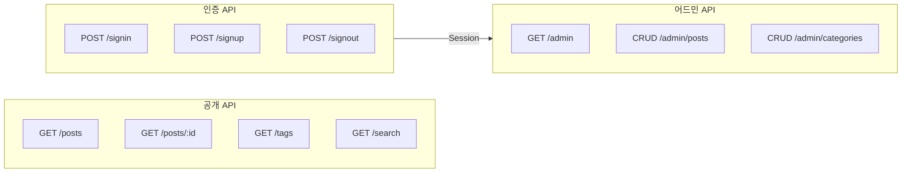
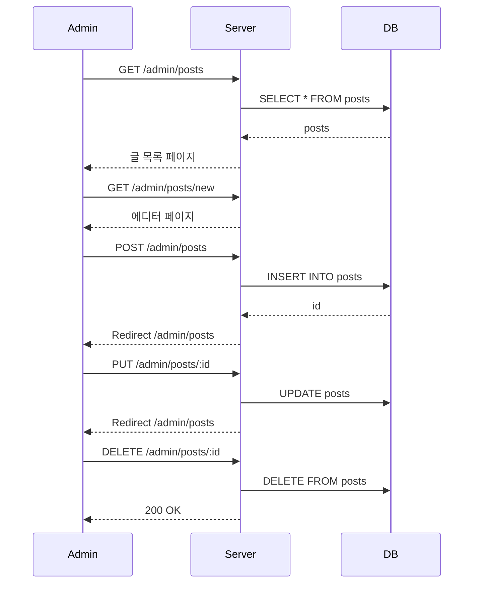
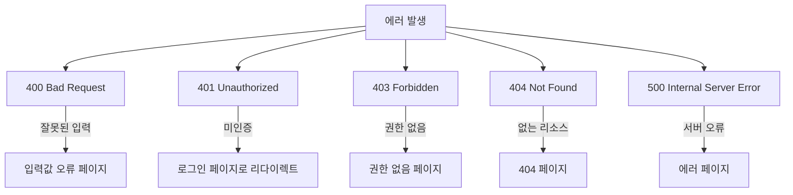

# API 설계

## API 흐름 개요



---

## 공개 API

### 글 목록
```
GET /posts?page=1&size=10&sort=latest
```

**Response:**
```json
{
  "posts": [
    {
      "id": 1,
      "title": "제목",
      "slug": "title-slug",
      "summary": "요약...",
      "thumbnail": "/images/thumb.jpg",
      "tags": ["kotlin", "ktor"],
      "category": { "id": 1, "name": "개발" },
      "createdAt": "2024-11-26T10:00:00",
      "viewCount": 123
    }
  ],
  "pagination": {
    "page": 1,
    "size": 10,
    "total": 50,
    "totalPages": 5
  }
}
```

### 글 상세
```
GET /posts/:id
GET /posts/:id/:slug  (SEO용)
```

### 검색
```
GET /search?q=keyword&page=1
```

### 태그별 글
```
GET /tags/:slug?page=1
```

### 카테고리별 글
```
GET /categories/:slug?page=1
```

---

## 인증 API

### 로그인
```
POST /signin
Content-Type: application/x-www-form-urlencoded

email=user@example.com&password=****
```

### 회원가입
```
POST /signup
Content-Type: application/x-www-form-urlencoded

email=user@example.com&username=nickname&password=****
```

### 로그아웃
```
POST /signout
```

---

## 어드민 API

### 글 관리



### 글 CRUD

| Method | Path | 설명 |
|--------|------|------|
| GET | /admin/posts | 글 목록 |
| GET | /admin/posts/new | 작성 폼 |
| POST | /admin/posts | 글 생성 |
| GET | /admin/posts/:id/edit | 수정 폼 |
| PUT | /admin/posts/:id | 글 수정 |
| DELETE | /admin/posts/:id | 글 삭제 |
| POST | /admin/posts/:id/publish | 공개 |
| POST | /admin/posts/:id/unpublish | 비공개 |

### 카테고리 CRUD

| Method | Path | 설명 |
|--------|------|------|
| GET | /admin/categories | 목록 |
| POST | /admin/categories | 생성 |
| PUT | /admin/categories/:id | 수정 |
| DELETE | /admin/categories/:id | 삭제 |

---

## SEO 엔드포인트

| Path | Content-Type | 설명 |
|------|--------------|------|
| /sitemap.xml | application/xml | 사이트맵 |
| /rss | application/rss+xml | RSS 피드 |
| /robots.txt | text/plain | 크롤러 가이드 |

---

## 에러 응답



### 에러 형식 (API)
```json
{
  "error": {
    "code": "INVALID_INPUT",
    "message": "이메일 형식이 올바르지 않습니다.",
    "field": "email"
  }
}
```