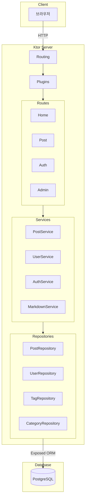
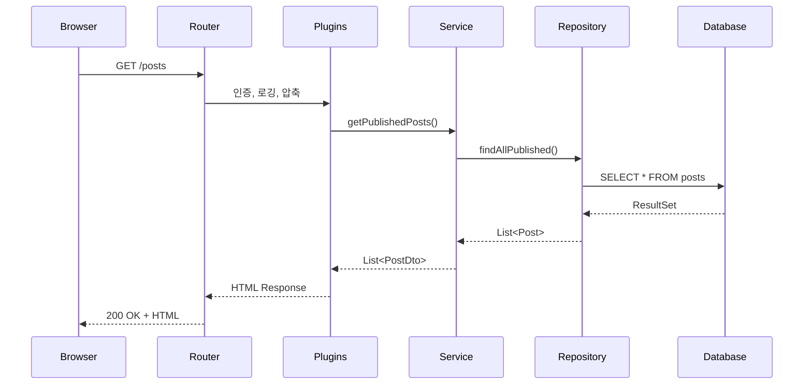
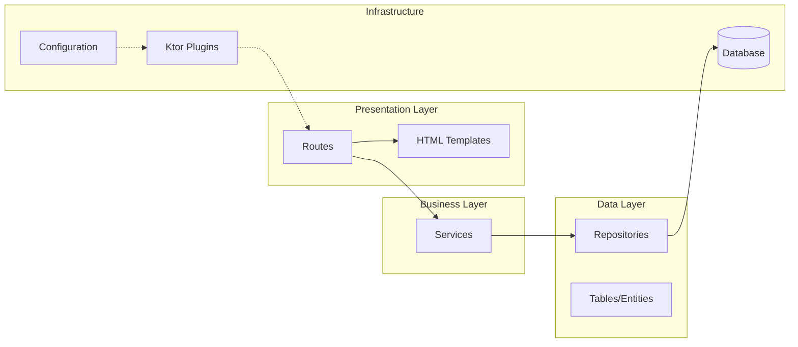
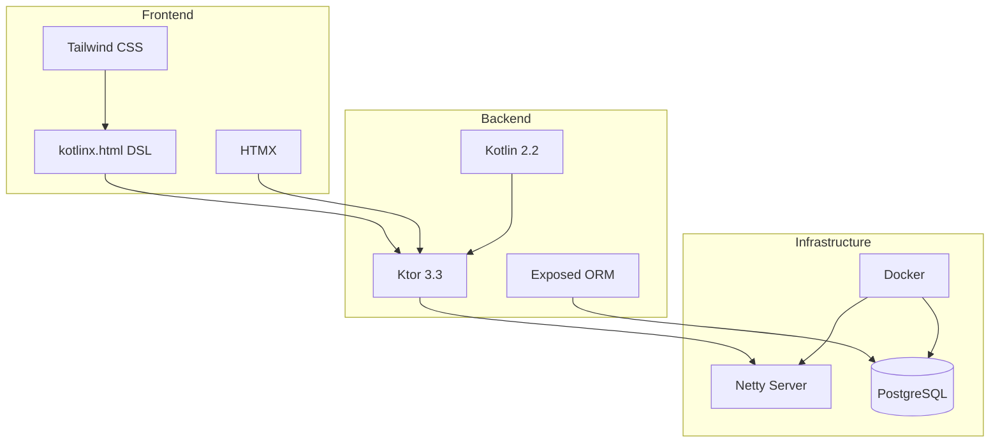

# 시스템 아키텍처

## 전체 구조



---

## 요청 흐름



---

## 레이어 구조



---

## 디렉토리 구조 (목표)

```
src/main/kotlin/net/gnajournal/blog/
├── Application.kt          # 진입점
├── plugins/                 # Ktor 플러그인 설정
│   ├── Routing.kt
│   ├── Security.kt
│   ├── Serialization.kt
│   ├── HTTP.kt
│   └── Database.kt
├── routes/                  # HTTP 라우트
│   ├── HomeRoutes.kt
│   ├── PostRoutes.kt
│   ├── AuthRoutes.kt
│   └── AdminRoutes.kt
├── services/                # 비즈니스 로직
│   ├── PostService.kt
│   ├── UserService.kt
│   ├── AuthService.kt
│   └── MarkdownService.kt
├── repositories/            # 데이터 접근
│   ├── PostRepository.kt
│   ├── UserRepository.kt
│   ├── TagRepository.kt
│   └── CategoryRepository.kt
├── models/                  # 테이블 정의
│   ├── Posts.kt
│   ├── Users.kt
│   ├── Tags.kt
│   └── Categories.kt
├── dto/                     # Data Transfer Objects
│   ├── PostDto.kt
│   ├── UserDto.kt
│   └── ...
├── templates/               # HTML DSL 템플릿
│   ├── Layout.kt
│   ├── pages/
│   └── components/
└── utils/                   # 유틸리티
    ├── PasswordUtil.kt
    └── SlugUtil.kt
```

---

## 기술 스택

