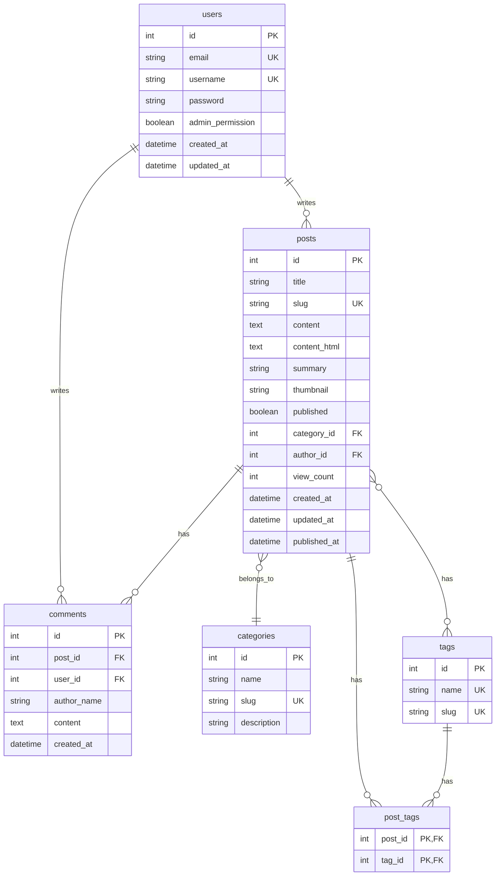

# ERD (Entity Relationship Diagram)

## 데이터베이스 설계



---

## 테이블 상세

### users

| 컬럼 | 타입 | 제약조건 | 설명 |
|------|------|---------|------|
| id | INT | PK, AUTO_INCREMENT | |
| email | VARCHAR(255) | UNIQUE, NOT NULL | 로그인 ID |
| username | VARCHAR(50) | UNIQUE, NOT NULL | 표시 이름 |
| password | VARCHAR(255) | NOT NULL | BCrypt 해시 |
| admin_permission | BOOLEAN | DEFAULT false | 관리자 여부 |
| created_at | TIMESTAMP | NOT NULL | |
| updated_at | TIMESTAMP | NOT NULL | |

### posts

| 컬럼 | 타입 | 제약조건 | 설명 |
|------|------|---------|------|
| id | INT | PK, AUTO_INCREMENT | |
| title | VARCHAR(200) | NOT NULL | 글 제목 |
| slug | VARCHAR(250) | UNIQUE, NOT NULL | URL용 슬러그 |
| content | TEXT | NOT NULL | 마크다운 원본 |
| content_html | TEXT | NOT NULL | 렌더링된 HTML |
| summary | VARCHAR(500) | | 요약 (목록용) |
| thumbnail | VARCHAR(500) | | 썸네일 URL |
| published | BOOLEAN | DEFAULT false | 공개 여부 |
| category_id | INT | FK → categories | |
| author_id | INT | FK → users, NOT NULL | |
| view_count | INT | DEFAULT 0 | 조회수 |
| created_at | TIMESTAMP | NOT NULL | |
| updated_at | TIMESTAMP | NOT NULL | |
| published_at | TIMESTAMP | | 공개일시 |

### categories

| 컬럼 | 타입 | 제약조건 | 설명 |
|------|------|---------|------|
| id | INT | PK, AUTO_INCREMENT | |
| name | VARCHAR(50) | NOT NULL | 카테고리명 |
| slug | VARCHAR(60) | UNIQUE, NOT NULL | URL용 |
| description | VARCHAR(200) | | 설명 |

### tags

| 컬럼 | 타입 | 제약조건 | 설명 |
|------|------|---------|------|
| id | INT | PK, AUTO_INCREMENT | |
| name | VARCHAR(50) | UNIQUE, NOT NULL | 태그명 |
| slug | VARCHAR(60) | UNIQUE, NOT NULL | URL용 |

### post_tags (N:M 관계)

| 컬럼 | 타입 | 제약조건 | 설명 |
|------|------|---------|------|
| post_id | INT | PK, FK → posts | |
| tag_id | INT | PK, FK → tags | |

### comments (선택)

| 컬럼 | 타입 | 제약조건 | 설명 |
|------|------|---------|------|
| id | INT | PK, AUTO_INCREMENT | |
| post_id | INT | FK → posts, NOT NULL | |
| user_id | INT | FK → users | 로그인 사용자 |
| author_name | VARCHAR(50) | | 익명 댓글용 |
| content | TEXT | NOT NULL | |
| created_at | TIMESTAMP | NOT NULL | |

---

## 인덱스

```sql
-- 자주 조회되는 컬럼
CREATE INDEX idx_posts_published ON posts(published, published_at DESC);
CREATE INDEX idx_posts_category ON posts(category_id);
CREATE INDEX idx_posts_author ON posts(author_id);
CREATE INDEX idx_post_tags_tag ON post_tags(tag_id);

-- 검색용
CREATE INDEX idx_posts_title ON posts USING gin(to_tsvector('simple', title));
```

---

## 관계 요약

| 관계 | 설명 |
|------|------|
| users → posts | 1:N (작성자) |
| categories → posts | 1:N (카테고리) |
| posts ↔ tags | N:M (post_tags 중간 테이블) |
| posts → comments | 1:N |
| users → comments | 1:N (선택적) |