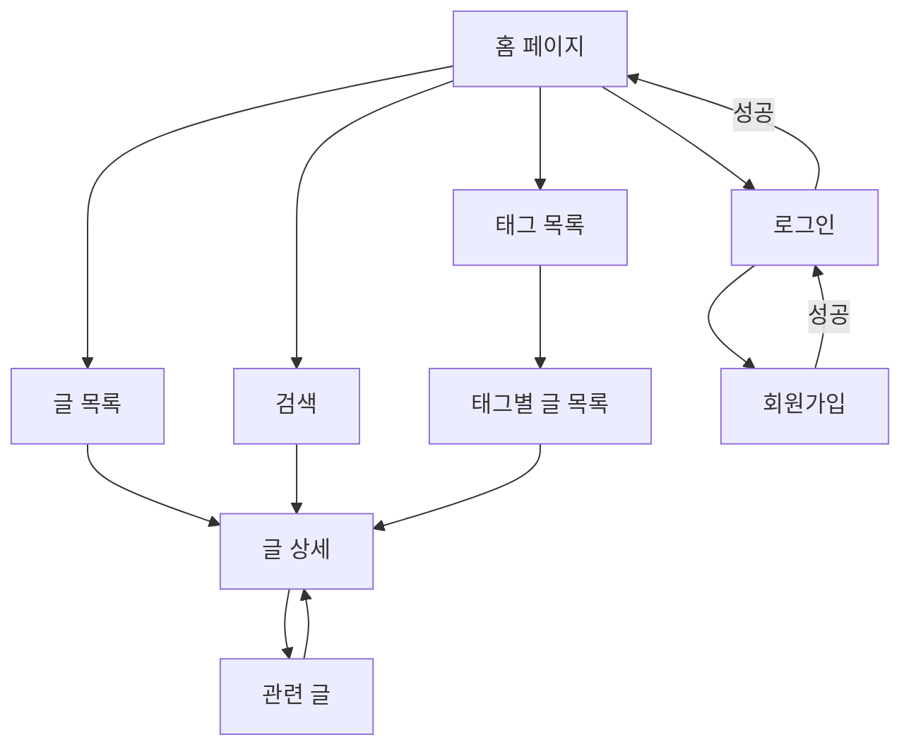
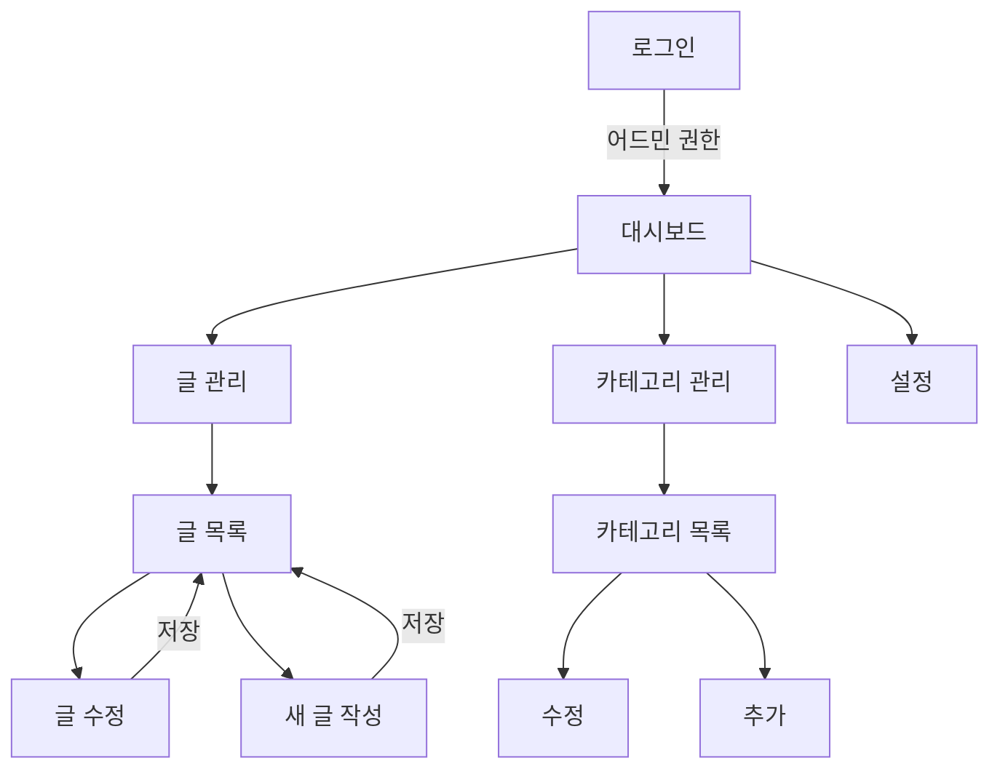
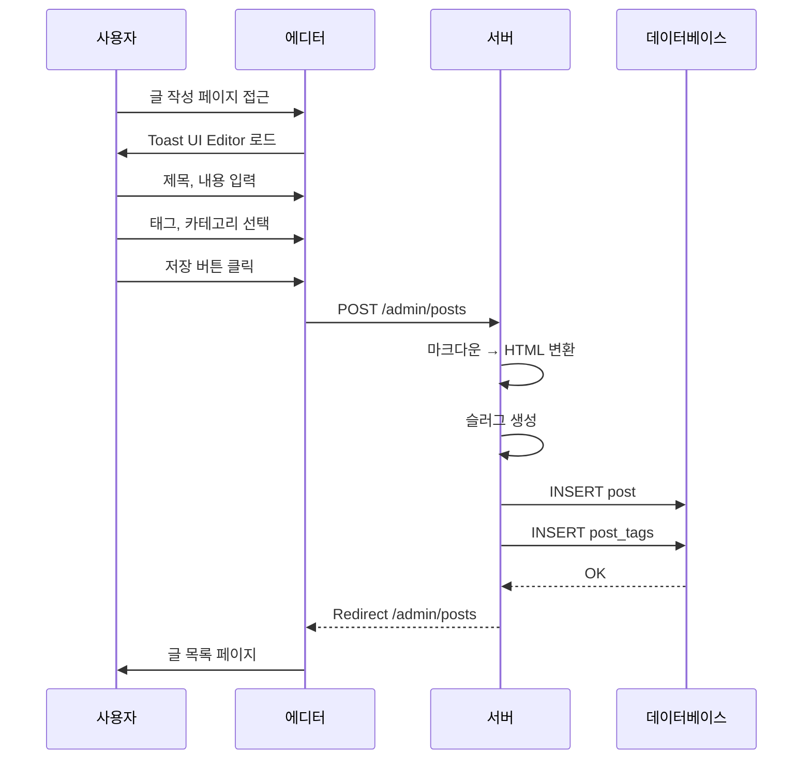
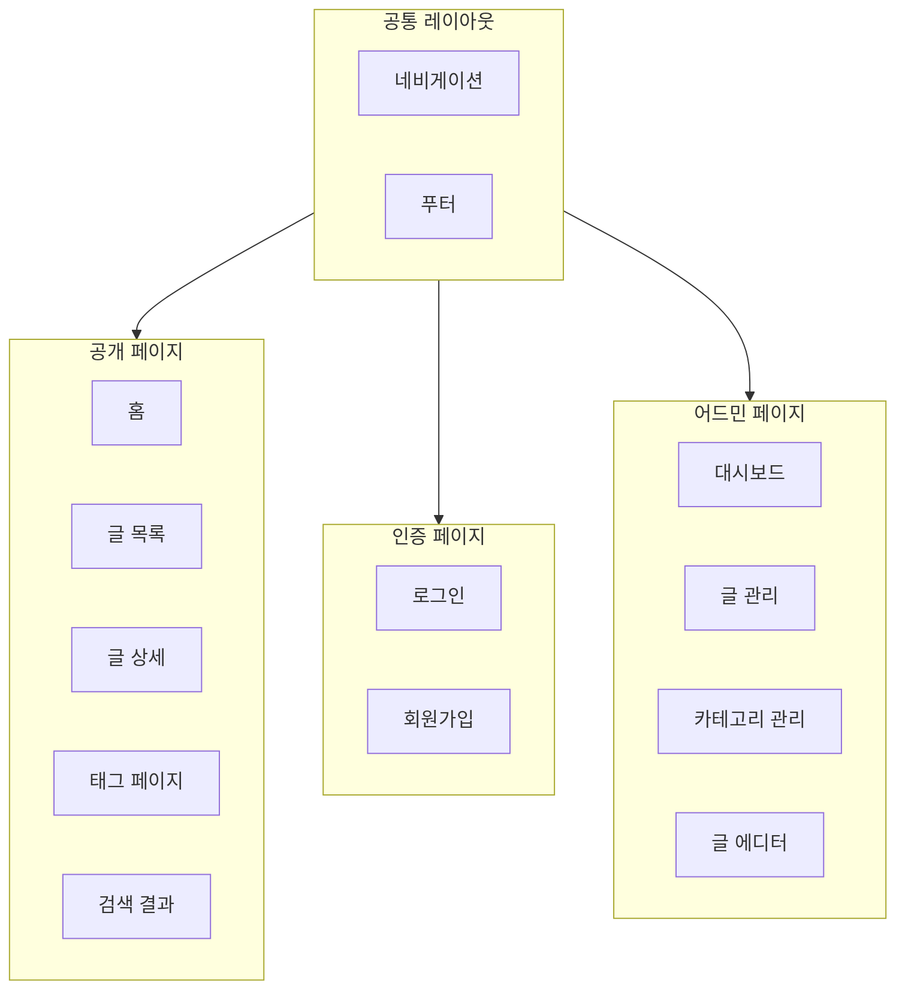
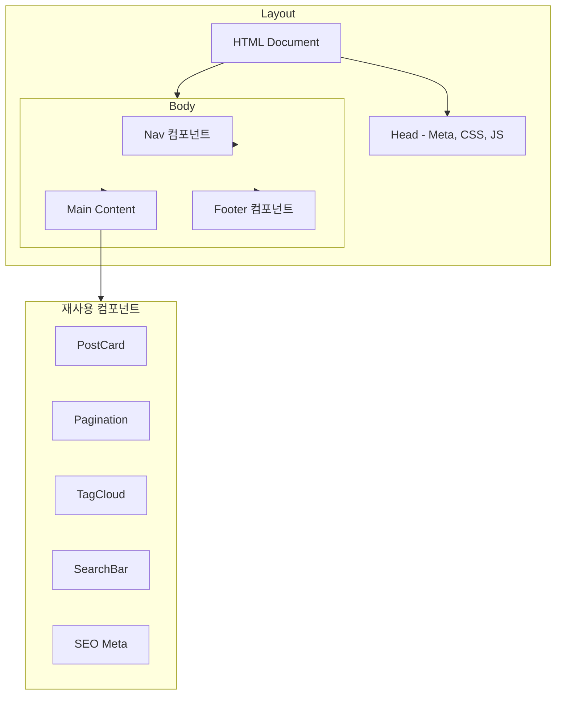
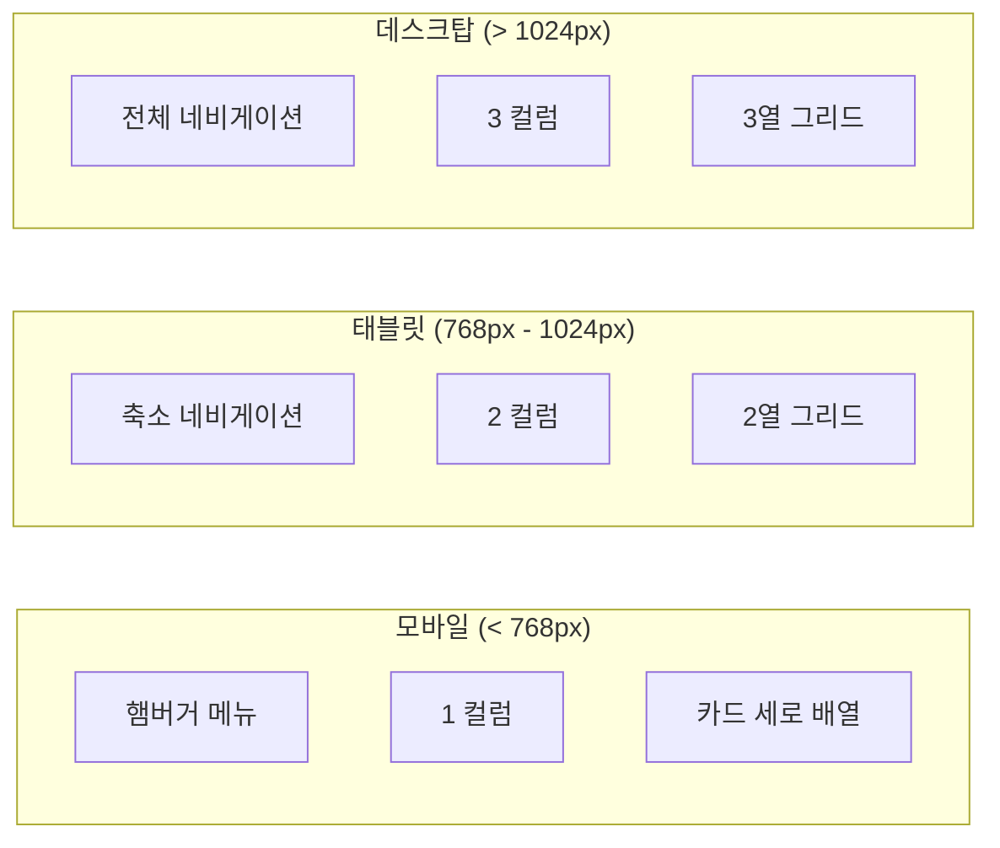

# 화면 흐름도

## 사용자 흐름

```mermaid
graph TD
    Home[홈 페이지] --> PostList[글 목록]
    Home --> Search[검색]
    Home --> Tags[태그 목록]

    PostList --> PostDetail[글 상세]
    Search --> PostDetail
    Tags --> TagPosts[태그별 글 목록]
    TagPosts --> PostDetail

    PostDetail --> RelatedPosts[관련 글]
    RelatedPosts --> PostDetail

    Home --> Signin[로그인]
    Signin --> |성공| Home
    Signin --> Signup[회원가입]
    Signup --> |성공| Signin
```

---

## 어드민 흐름

```mermaid
graph TD
    Signin[로그인] --> |어드민 권한| Dashboard[대시보드]

    Dashboard --> PostManage[글 관리]
    Dashboard --> CategoryManage[카테고리 관리]
    Dashboard --> Settings[설정]

    PostManage --> PostList[글 목록]
    PostList --> PostEdit[글 수정]
    PostList --> PostNew[새 글 작성]
    PostNew --> |저장| PostList
    PostEdit --> |저장| PostList

    CategoryManage --> CategoryList[카테고리 목록]
    CategoryList --> CategoryEdit[수정]
    CategoryList --> CategoryNew[추가]
```

---

## 글 작성 흐름

```mermaid
sequenceDiagram
    participant User as 사용자
    participant Editor as 에디터
    participant Server as 서버
    participant DB as 데이터베이스

    User->>Editor: 글 작성 페이지 접근
    Editor->>User: Toast UI Editor 로드

    User->>Editor: 제목, 내용 입력
    User->>Editor: 태그, 카테고리 선택
    User->>Editor: 저장 버튼 클릭

    Editor->>Server: POST /admin/posts
    Server->>Server: 마크다운 → HTML 변환
    Server->>Server: 슬러그 생성
    Server->>DB: INSERT post
    Server->>DB: INSERT post_tags
    DB-->>Server: OK
    Server-->>Editor: Redirect /admin/posts
    Editor->>User: 글 목록 페이지
```

---

## 페이지 구조

```mermaid
graph TB
    subgraph Layout["공통 레이아웃"]
        Nav[네비게이션]
        Footer[푸터]
    end

    subgraph Public["공개 페이지"]
        Home[홈]
        Posts[글 목록]
        Post[글 상세]
        TagPage[태그 페이지]
        SearchPage[검색 결과]
    end

    subgraph Auth["인증 페이지"]
        Signin[로그인]
        Signup[회원가입]
    end

    subgraph Admin["어드민 페이지"]
        Dashboard[대시보드]
        AdminPosts[글 관리]
        AdminCategories[카테고리 관리]
        PostEditor[글 에디터]
    end

    Layout --> Public
    Layout --> Auth
    Layout --> Admin
```

---

## 컴포넌트 구조

```mermaid
graph TB
    subgraph Layout
        HTML[HTML Document]
        Head[Head - Meta, CSS, JS]
        Body[Body]
    end

    subgraph Body
        NavComponent[Nav 컴포넌트]
        MainContent[Main Content]
        FooterComponent[Footer 컴포넌트]
    end

    subgraph Components["재사용 컴포넌트"]
        PostCard[PostCard]
        Pagination[Pagination]
        TagCloud[TagCloud]
        SearchBar[SearchBar]
        SEO[SEO Meta]
    end

    HTML --> Head
    HTML --> Body
    Body --> NavComponent
    Body --> MainContent
    Body --> FooterComponent
    MainContent --> Components
```

---

## 반응형 레이아웃

```mermaid
graph LR
    subgraph Mobile["모바일 (< 768px)"]
        M_Nav[햄버거 메뉴]
        M_Content[1 컬럼]
        M_Cards[카드 세로 배열]
    end

    subgraph Tablet["태블릿 (768px - 1024px)"]
        T_Nav[축소 네비게이션]
        T_Content[2 컬럼]
        T_Cards[2열 그리드]
    end

    subgraph Desktop["데스크탑 (> 1024px)"]
        D_Nav[전체 네비게이션]
        D_Content[3 컬럼]
        D_Cards[3열 그리드]
    end
```