# 화면 흐름도

## 전체 사이트맵

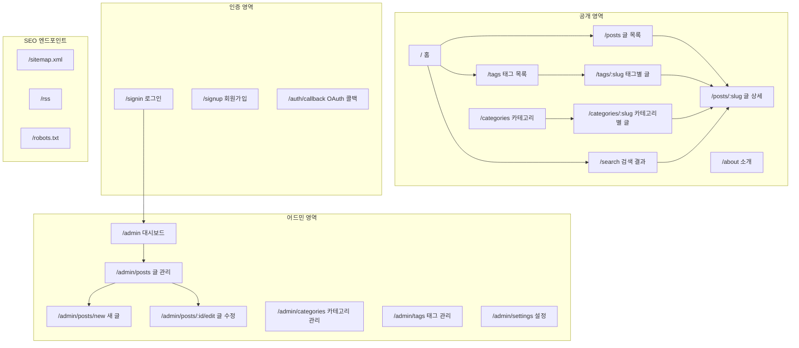

---

## 사용자 흐름 상세

### 메인 네비게이션

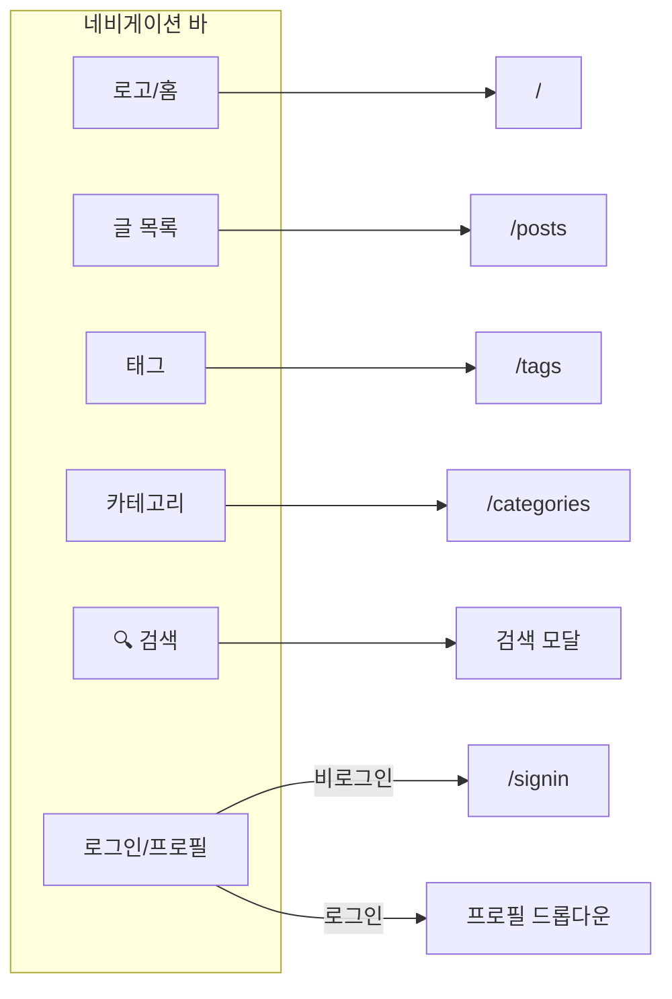

### 홈페이지 → 글 상세

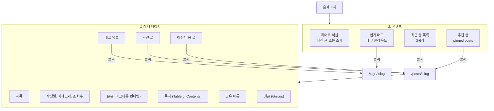

### 검색 흐름

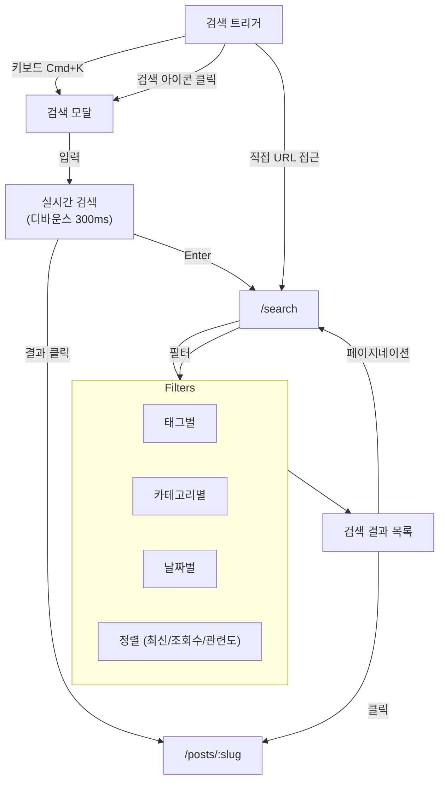

### 태그/카테고리 탐색

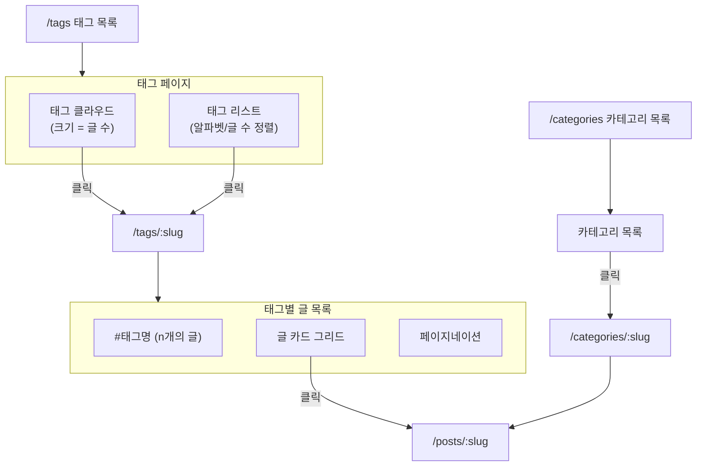

---

## 인증 흐름 상세

### 로그인 흐름

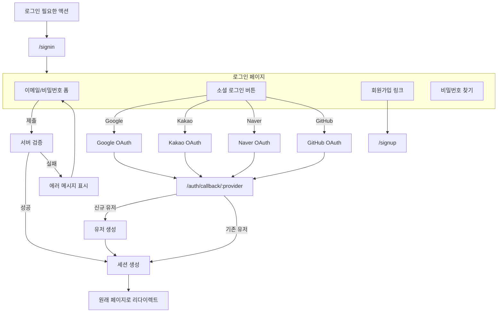

### 회원가입 흐름

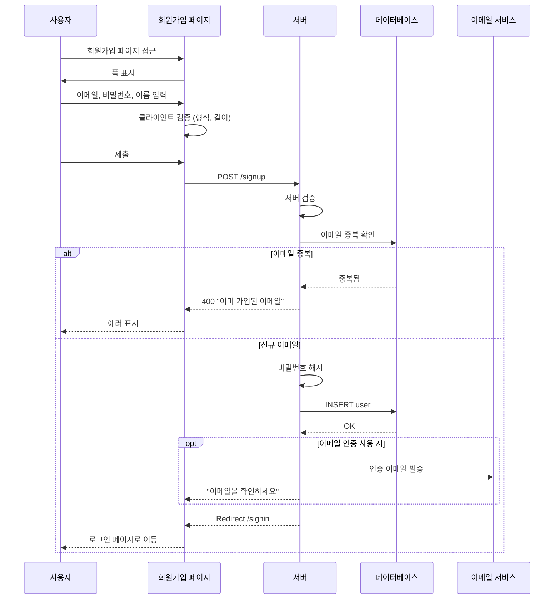

---

## 어드민 흐름 상세

### 어드민 접근 제어

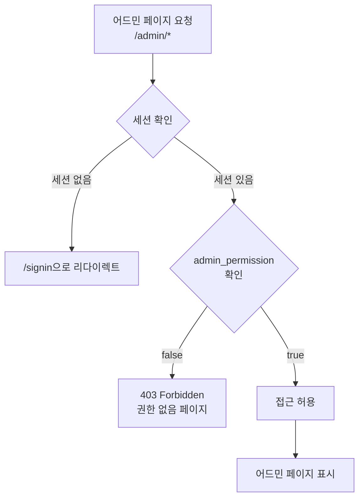

### 대시보드

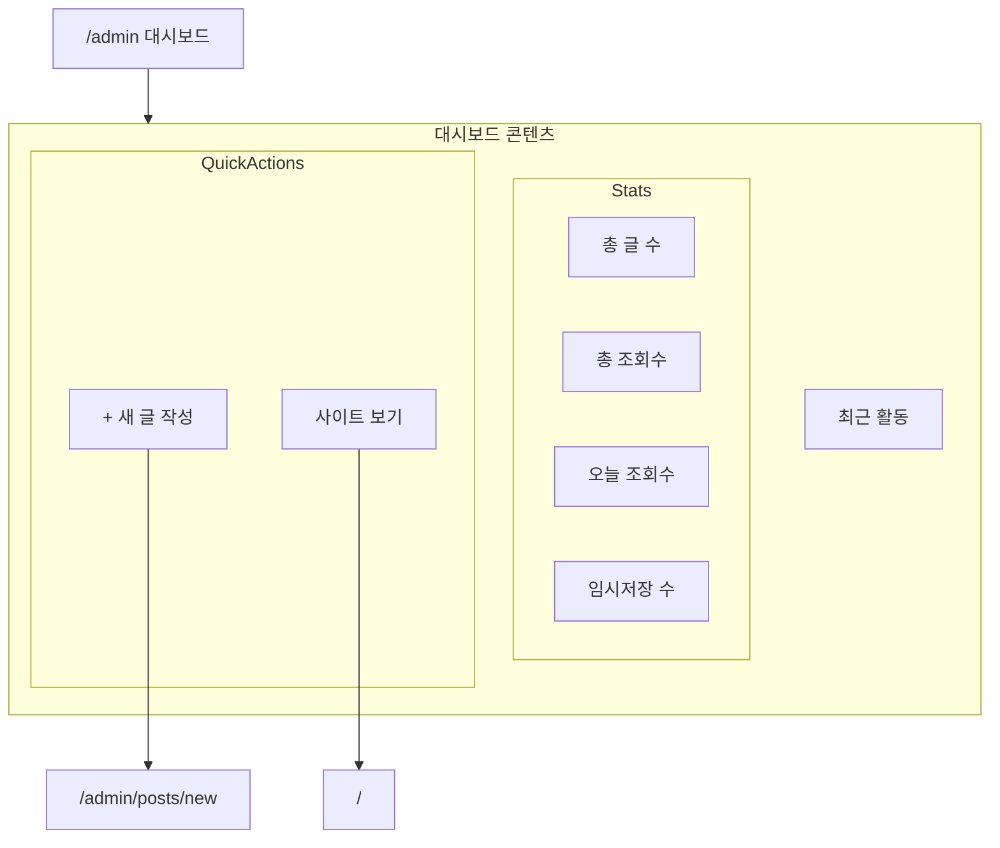

### 글 관리 CRUD

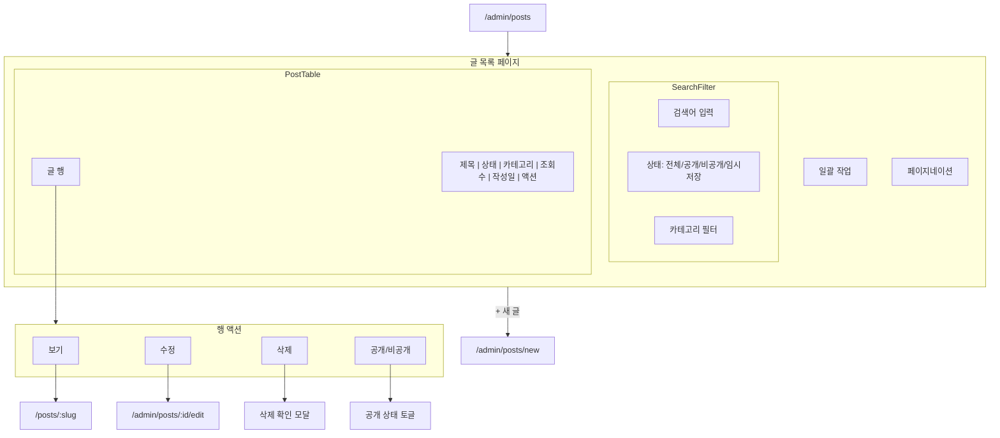

### 글 작성/수정 에디터

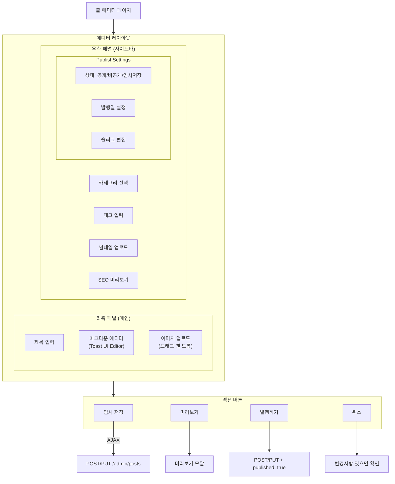

### 이미지 업로드 흐름

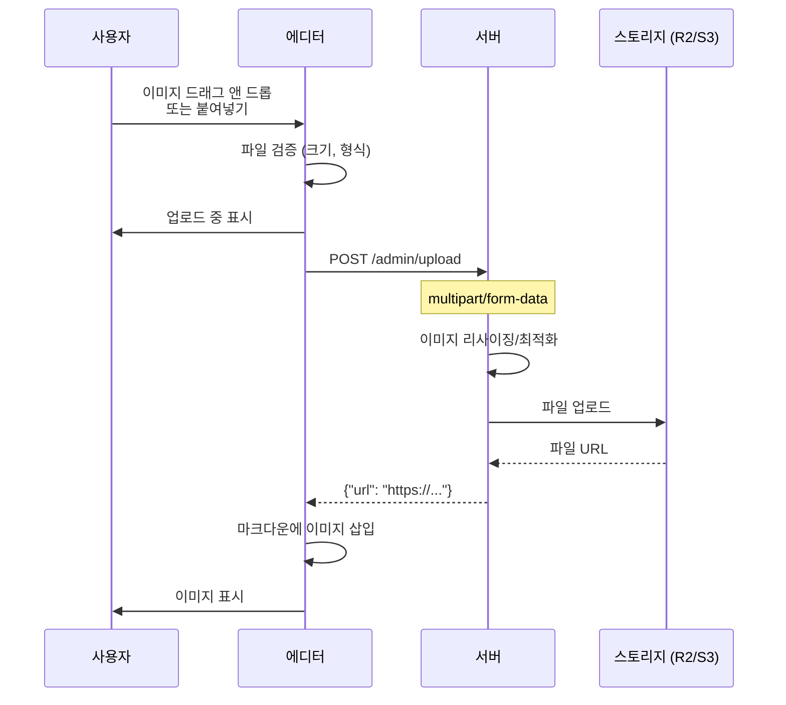

---

## 글 상세 페이지 상세

### 페이지 구성

```mermaid
flowchart TB
    subgraph PostPage["글 상세 페이지 /posts/:slug"]
        subgraph Header["헤더 영역"]
            Category["카테고리 뱃지"]
            Title["글 제목"]
            Meta["작성자 · 작성일 · 조회수 · 읽는 시간"]
            Thumbnail["썸네일 이미지"]
        end

        subgraph MainContent["본문 영역"]
            TOC["목차 (사이드바 또는 상단)"]
            Article["마크다운 렌더링된 본문"]
            CodeBlock["코드 하이라이팅"]
            Images["이미지 (lazy loading)"]
        end

        subgraph Footer["푸터 영역"]
            Tags["태그 목록"]
            Share["공유 버튼 (Twitter, Facebook, Link)"]
            LikeBtn["좋아요 버튼"]
        end

        subgraph Navigation["네비게이션"]
            PrevPost["← 이전 글"]
            NextPost["다음 글 →"]
        end

        subgraph Related["관련 콘텐츠"]
            RelatedPosts["관련 글 추천<br/>(같은 태그/카테고리)"]
        end

        subgraph Comments["댓글 영역"]
            Giscus["Giscus 댓글"]
        end
    end

    Header --> MainContent
    MainContent --> Footer
    Footer --> Navigation
    Navigation --> Related
    Related --> Comments
```

### 목차 (TOC) 상호작용

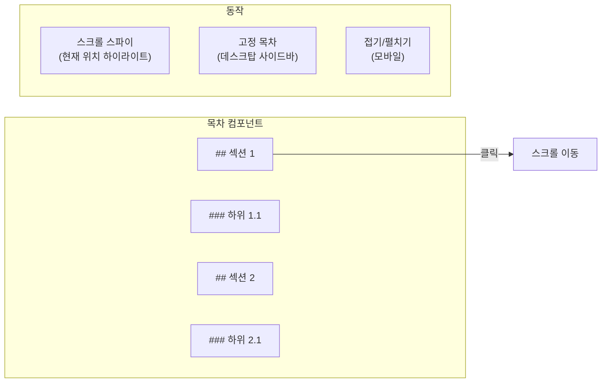

---

## 에러 페이지

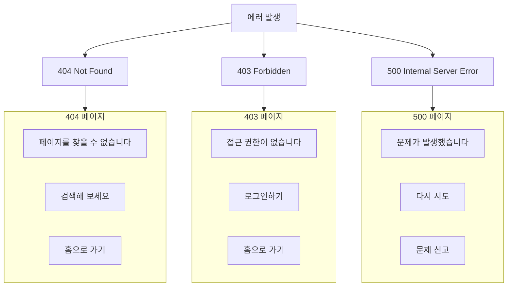

---

## 반응형 레이아웃 상세

### 브레이크포인트

```mermaid
flowchart LR
    subgraph Mobile["📱 모바일<br/>< 640px"]
        M_Nav["햄버거 메뉴"]
        M_Layout["1컬럼"]
        M_Cards["세로 스택"]
        M_TOC["상단 드롭다운 목차"]
        M_Sidebar["하단으로 이동"]
    end

    subgraph Tablet["📱 태블릿<br/>640px - 1024px"]
        T_Nav["축소 네비게이션"]
        T_Layout["2컬럼"]
        T_Cards["2열 그리드"]
        T_TOC["상단 고정"]
        T_Sidebar["우측 축소"]
    end

    subgraph Desktop["🖥️ 데스크탑<br/>> 1024px"]
        D_Nav["전체 네비게이션"]
        D_Layout["3컬럼 (사이드바 포함)"]
        D_Cards["3열 그리드"]
        D_TOC["우측 사이드바 고정"]
        D_Sidebar["우측 사이드바"]
    end

    Mobile --> Tablet --> Desktop
```

### 글 목록 레이아웃

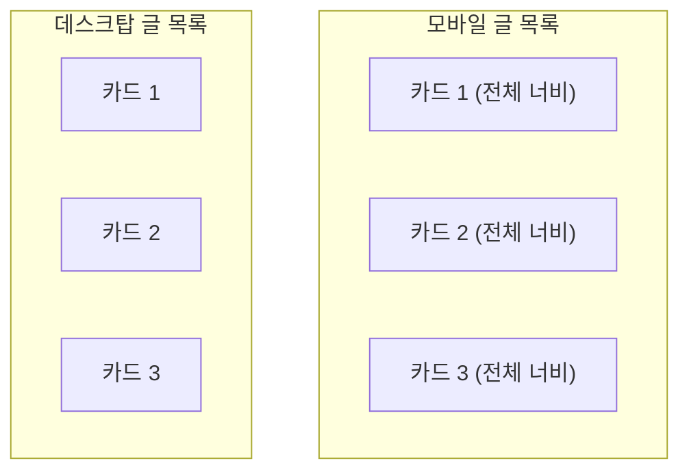

---

## 페이지별 SEO 메타

| 페이지 | title | description | og:image |
|--------|-------|-------------|----------|
| 홈 | 블로그명 | 블로그 소개 | 기본 OG 이미지 |
| 글 상세 | 글 제목 \| 블로그명 | 글 요약 | 글 썸네일 |
| 태그 | #태그명 \| 블로그명 | 태그 설명 | 기본 이미지 |
| 검색 | 검색: 키워드 \| 블로그명 | 검색 결과 | 기본 이미지 |
| 어드민 | (noindex) | - | - |