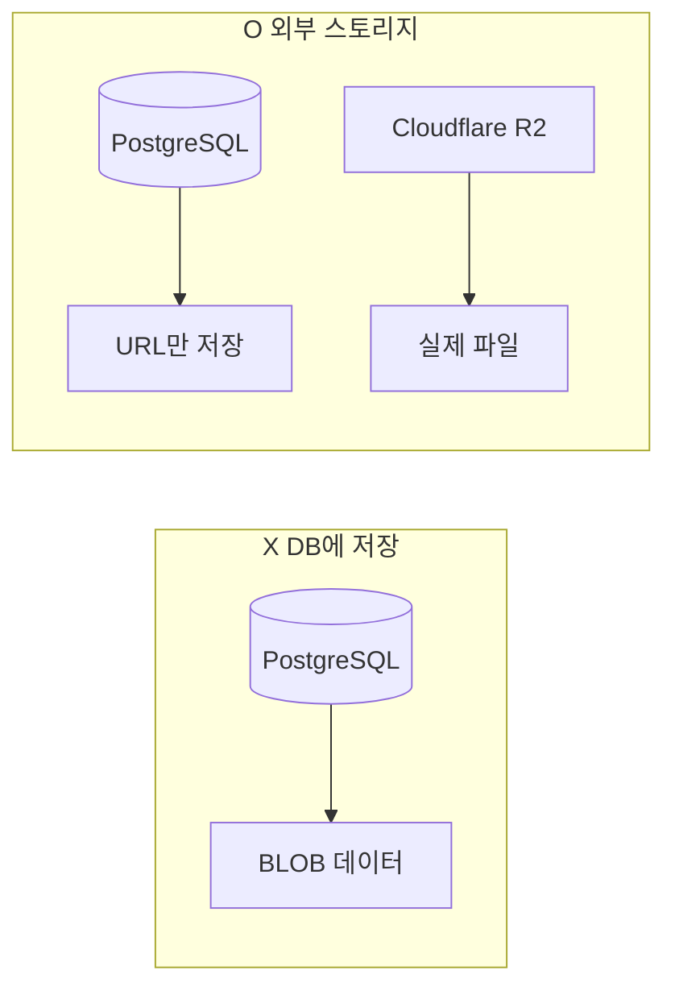
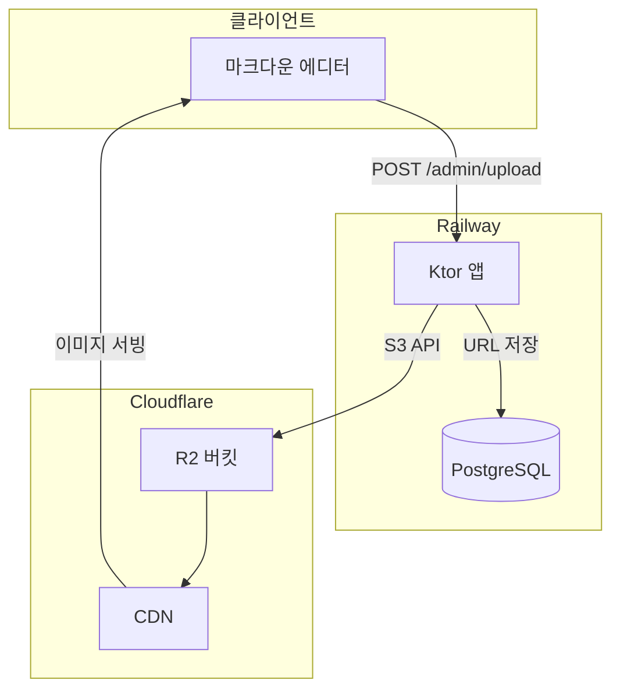
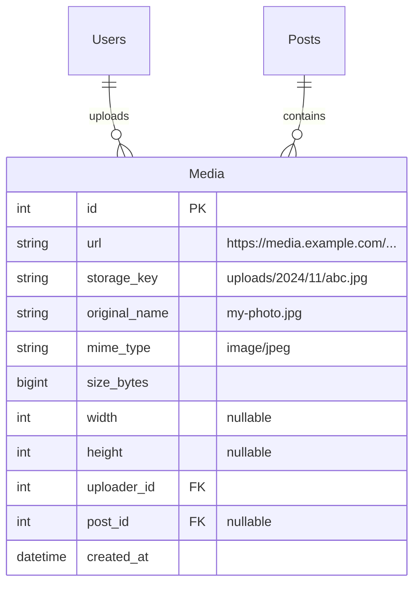

# 미디어 스토리지 구성 (Cloudflare R2)

## 왜 외부 스토리지인가?



| 방식 | 장점 | 단점 |
|------|------|------|
| DB BLOB | 단순 | DB 비대화, 백업 느림, 비용 폭발 |
| **외부 스토리지** | CDN, 저렴, 무제한 | 초기 설정 필요 |

---

## Cloudflare R2 선택 이유

| 항목 | R2 | AWS S3 |
|------|-----|--------|
| 저장 비용 | $0.015/GB | $0.023/GB |
| **Egress (전송)** | **무료** | $0.09/GB |
| 무료 한도 | 10GB | 5GB (12개월) |
| API | S3 호환 | 원본 |
| CDN | 포함 | CloudFront 별도 |

**개인 블로그는 R2가 압도적으로 유리**

---

## 아키텍처



---

## ERD



---

## R2 설정 절차

### 1. Cloudflare 계정 생성
- [cloudflare.com](https://cloudflare.com) 가입 (무료)

### 2. R2 버킷 생성
```
Dashboard → R2 → Create bucket
- Bucket name: blog-media
- Location: Automatic
```

### 3. API 토큰 발급
```
R2 → Manage R2 API Tokens → Create API Token
- Permissions: Object Read & Write
- Bucket: blog-media
```

발급되는 값:
- `Access Key ID`
- `Secret Access Key`
- `Endpoint`: `https://<account_id>.r2.cloudflarestorage.com`

### 4. 커스텀 도메인 연결 (선택)
```
R2 → blog-media → Settings → Custom Domains
- media.gnajournal.com 추가
```

---

## Ktor 구현

### 의존성

```kotlin
// build.gradle.kts
implementation("aws.sdk.kotlin:s3:1.0.0")
```

### 환경 변수

```bash
# .env
R2_ACCESS_KEY=your_access_key
R2_SECRET_KEY=your_secret_key
R2_ACCOUNT_ID=your_account_id
R2_BUCKET=blog-media
R2_PUBLIC_URL=https://media.gnajournal.com
```

### MediaService

```kotlin
class MediaService(
    private val accessKey: String,
    private val secretKey: String,
    private val accountId: String,
    private val bucket: String,
    private val publicUrl: String
) {
    private val s3 = S3Client {
        region = "auto"
        endpointUrl = Url.parse("https://$accountId.r2.cloudflarestorage.com")
        credentialsProvider = StaticCredentialsProvider {
            accessKeyId = accessKey
            secretAccessKey = secretKey
        }
    }

    suspend fun upload(
        bytes: ByteArray,
        originalName: String,
        mimeType: String
    ): MediaUploadResult {
        val extension = originalName.substringAfterLast(".", "")
        val key = "uploads/${LocalDate.now()}/${UUID.randomUUID()}.$extension"

        s3.putObject {
            this.bucket = this@MediaService.bucket
            this.key = key
            body = ByteStream.fromBytes(bytes)
            contentType = mimeType
        }

        return MediaUploadResult(
            url = "$publicUrl/$key",
            storageKey = key,
            sizeBytes = bytes.size.toLong()
        )
    }

    suspend fun delete(storageKey: String) {
        s3.deleteObject {
            bucket = this@MediaService.bucket
            key = storageKey
        }
    }
}

data class MediaUploadResult(
    val url: String,
    val storageKey: String,
    val sizeBytes: Long
)
```

### 업로드 라우트

```kotlin
fun Route.mediaRoutes(mediaService: MediaService) {
    authenticate {
        post("/admin/upload") {
            val multipart = call.receiveMultipart()
            var result: MediaUploadResult? = null
            var originalName = ""
            var mimeType = ""

            multipart.forEachPart { part ->
                when (part) {
                    is PartData.FileItem -> {
                        originalName = part.originalFileName ?: "unknown"
                        mimeType = part.contentType?.toString() ?: "application/octet-stream"

                        // 파일 검증
                        if (!mimeType.startsWith("image/") && !mimeType.startsWith("video/")) {
                            throw BadRequestException("이미지 또는 영상만 업로드 가능합니다")
                        }

                        val bytes = part.streamProvider().readBytes()

                        // 크기 제한 (10MB)
                        if (bytes.size > 10 * 1024 * 1024) {
                            throw BadRequestException("파일 크기는 10MB 이하여야 합니다")
                        }

                        result = mediaService.upload(bytes, originalName, mimeType)
                    }
                    else -> {}
                }
                part.dispose()
            }

            result?.let {
                call.respond(HttpStatusCode.Created, mapOf(
                    "url" to it.url,
                    "name" to originalName
                ))
            } ?: call.respond(HttpStatusCode.BadRequest, "파일이 없습니다")
        }
    }
}
```

---

## 에디터 연동

### Milkdown 이미지 업로드

```typescript
import { upload } from '@milkdown/plugin-upload';

const uploadPlugin = upload.configure(upload, {
  uploader: async (files: File[]) => {
    const file = files[0];
    const formData = new FormData();
    formData.append('file', file);

    const response = await fetch('/admin/upload', {
      method: 'POST',
      body: formData,
      credentials: 'include',
    });

    if (!response.ok) throw new Error('업로드 실패');

    const { url } = await response.json();
    return url;
  },
});
```

---

## 비용 계산

| 사용량 | 월 비용 |
|--------|--------|
| 저장 10GB | 무료 |
| 저장 50GB | $0.60 |
| 전송 (egress) | **무료** |
| Class A 작업 100만 | 무료 |

**개인 블로그: 거의 $0**

---

## 참고

- [Cloudflare R2 문서](https://developers.cloudflare.com/r2/)
- [AWS SDK for Kotlin](https://aws.amazon.com/sdk-for-kotlin/)
- [R2 가격](https://developers.cloudflare.com/r2/pricing/)