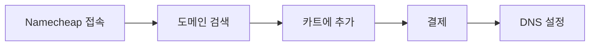

# Namecheap 도메인 구매 가이드

## 구매 절차



---

## 1단계: 도메인 검색

1. [namecheap.com](https://www.namecheap.com) 접속
2. 검색창에 원하는 도메인 입력 (예: `gnajournal.com`)
3. 사용 가능 여부 확인
4. `.com`, `.dev`, `.io` 등 TLD별 가격 비교

### 가격 참고 (2024년 기준)
| TLD | 첫해 가격 | 갱신 가격 |
|-----|----------|----------|
| .com | ~$10 | ~$15 |
| .dev | ~$12 | ~$17 |
| .io | ~$30 | ~$40 |

---

## 2단계: 옵션 선택

### 필수
- **WhoisGuard**: 무료 (개인정보 보호, 반드시 활성화)
- **Auto-Renew**: 권장 (만료 방지)

### 불필요 (선택 해제)
- PremiumDNS (무료 DNS로 충분)
- SSL Certificate (Cloudflare/Railway에서 무료 제공)
- Web Hosting (Railway 사용 예정)

---

## 3단계: 결제

- 신용카드, PayPal, 비트코인 지원
- 계정 생성 필요 (이메일 인증)

---

## 4단계: DNS 설정 (Railway 연결)

### Namecheap DNS 설정 화면
1. Dashboard → Domain List → Manage
2. Advanced DNS 탭 선택

### Railway용 DNS 레코드

```
Type    Host    Value                   TTL
------  ------  ----------------------  --------
CNAME   www     your-app.railway.app    Auto
A       @       Railway IP 주소          Auto
```

> Railway에서 정확한 값 확인: Project Settings → Domains

---

## 5단계: SSL 확인

Railway는 자동으로 Let's Encrypt SSL 발급
- 도메인 연결 후 몇 분 대기
- `https://gnajournal.com` 접속 확인

---

## 체크리스트

- [ ] Namecheap 계정 생성
- [ ] 도메인 검색 및 구매
- [ ] WhoisGuard 활성화 확인
- [ ] Railway 프로젝트에 도메인 추가
- [ ] Namecheap에서 DNS 레코드 설정
- [ ] SSL 인증서 발급 확인
- [ ] https로 접속 테스트

---

## 문제 해결

### DNS 전파 지연
- 최대 48시간 소요 가능 (보통 몇 분~몇 시간)
- [dnschecker.org](https://dnschecker.org)에서 전파 상태 확인

### SSL 오류
- DNS가 완전히 전파된 후 SSL 발급됨
- Railway 대시보드에서 인증서 상태 확인

---

## 참고

- [Namecheap 공식 가이드](https://www.namecheap.com/support/knowledgebase/)
- [Railway Custom Domains](https://docs.railway.app/guides/public-networking#custom-domains)