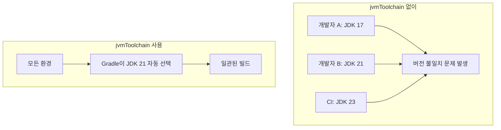
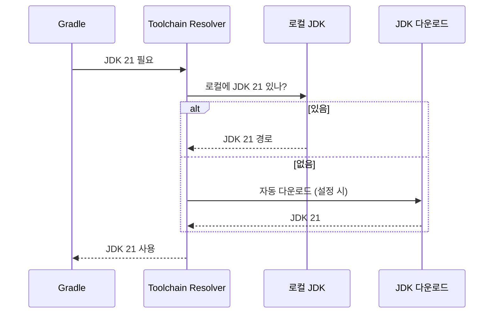
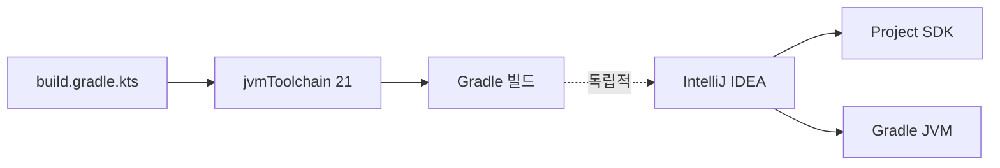

# jvmToolchain 설정

## jvmToolchain이란?

Gradle에서 **프로젝트가 사용할 JDK 버전을 명시적으로 지정**하는 기능.

---

## 왜 필요한가?



### 문제 상황
1. **개발자마다 다른 JDK 버전** 사용
2. **CI/CD 환경**과 로컬 환경 차이
3. **Class file version 에러** 발생 가능

### 해결
`jvmToolchain`을 명시하면 Gradle이 **해당 버전의 JDK를 자동으로 찾아서 사용**.

---

## 설정 방법

### build.gradle.kts

```kotlin
kotlin {
    jvmToolchain(21)  // JDK 21 사용
}
```

또는 Java 프로젝트:

```kotlin
java {
    toolchain {
        languageVersion.set(JavaLanguageVersion.of(21))
    }
}
```

---

## 동작 방식



### 우선순위
1. **JAVA_HOME** 환경변수
2. **jenv, sdkman** 등으로 설치된 JDK
3. **시스템에 설치된 JDK** 검색
4. **자동 다운로드** (설정 시)

---

## 자동 다운로드 설정

### settings.gradle.kts

```kotlin
plugins {
    id("org.gradle.toolchains.foojay-resolver-convention") version "0.8.0"
}
```

이 플러그인을 추가하면, 로컬에 JDK가 없을 때 **자동으로 다운로드**.

---

## 장점

| 항목 | 설명 |
|-----|------|
| 일관성 | 모든 환경에서 동일한 JDK 버전 |
| 명시성 | 빌드 파일에 버전이 명확히 기록됨 |
| 자동화 | JDK 없어도 자동 다운로드 가능 |
| CI 친화적 | CI에서 별도 JDK 설치 불필요 |

---

## IDE와의 관계



### 주의사항
- **IntelliJ Project SDK**와 **Gradle JVM**은 별개
- `jvmToolchain`은 **Gradle 빌드에만 영향**
- IDE 설정도 맞춰주는 것이 좋음 (혼란 방지)

---

## 확인 방법

```bash
# Gradle이 사용하는 JDK 확인
./gradlew -q javaToolchains

# 출력 예시:
#  + JDK 21
#     | Vendor:       Amazon Corretto
#     | Location:     /Users/xxx/.jdks/corretto-21
#     | Is JDK:       true
```

---

## 이 프로젝트의 설정

```kotlin
// build.gradle.kts
kotlin {
    jvmToolchain(21)  // Corretto 21 사용
}
```

**이유:**
- Kotlin 2.x, Ktor 3.x가 JDK 21+ 권장
- Virtual Threads 등 최신 기능 활용 가능
- 팀원 간 일관된 환경 보장

---

## 참고

- [Gradle Toolchains](https://docs.gradle.org/current/userguide/toolchains.html)
- [Kotlin JVM Toolchain](https://kotlinlang.org/docs/gradle-configure-project.html#gradle-java-toolchains-support)