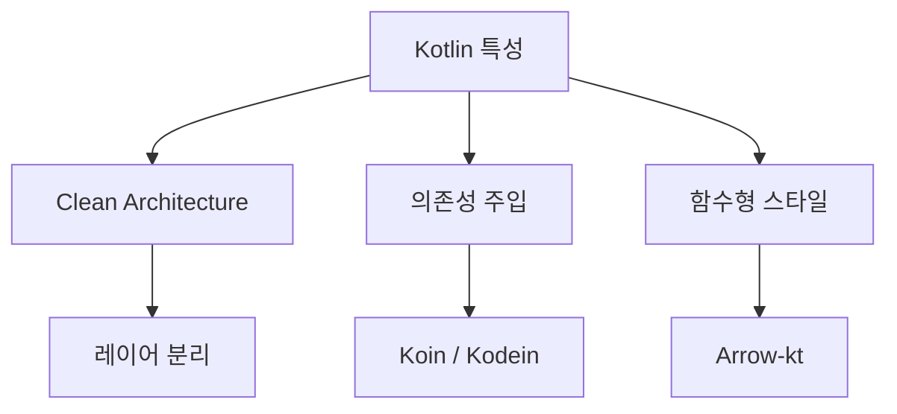
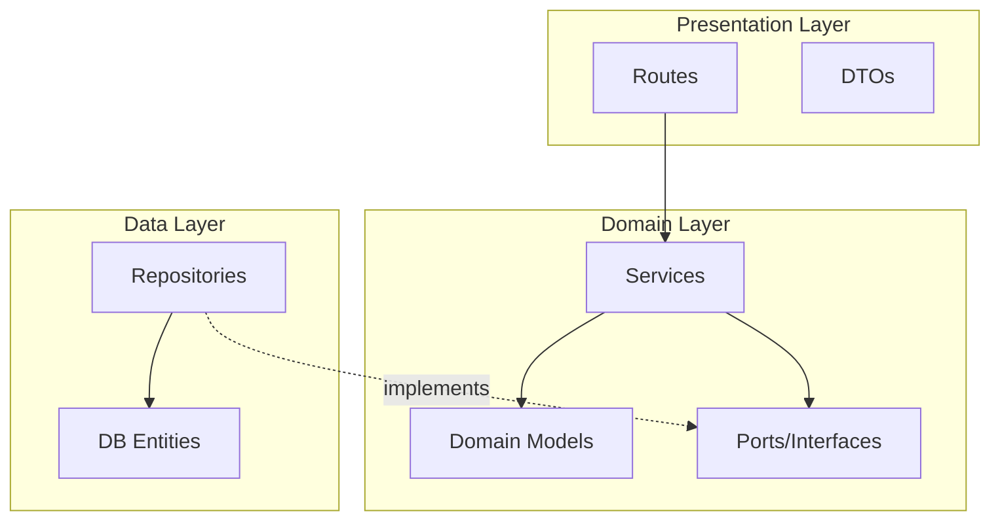
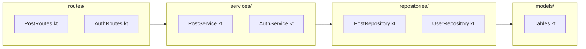
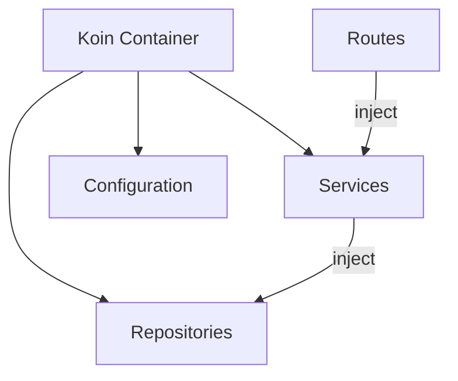
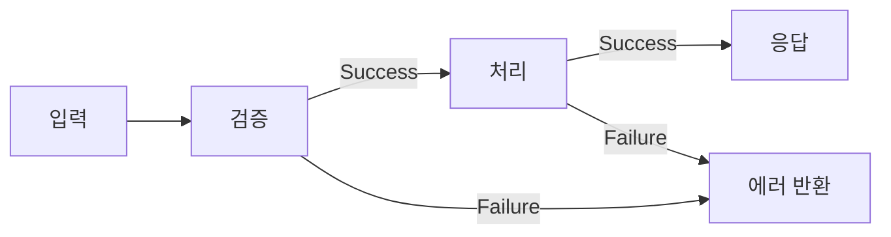
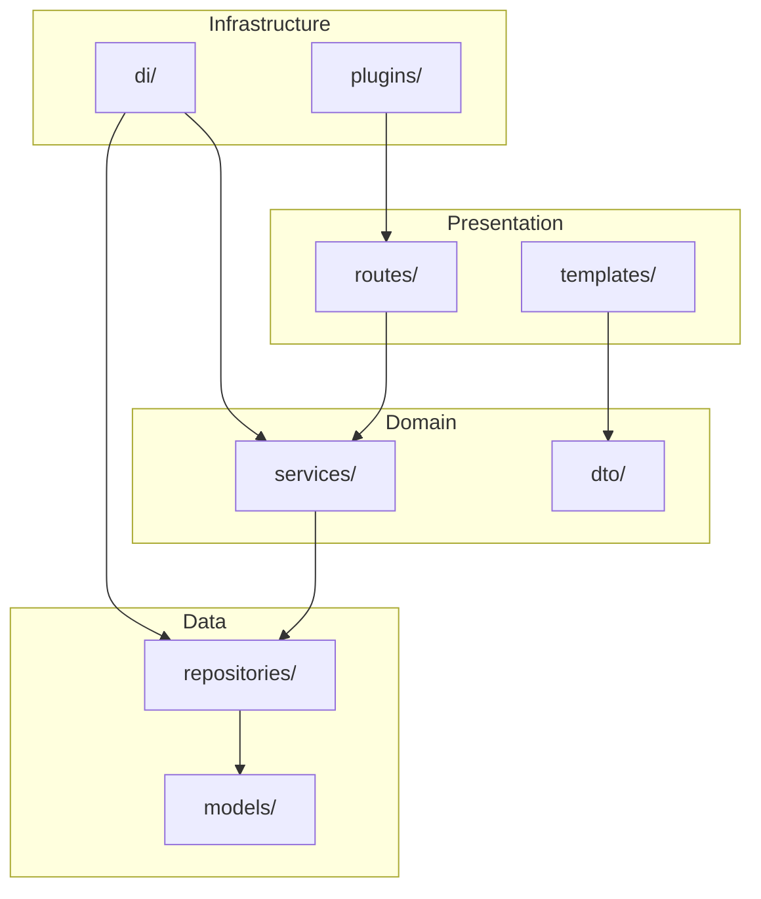

# Kotlin 아키텍처 패턴

## Kotlin에 유리한 아키텍처



---

## 1. Clean Architecture (권장)



### Kotlin의 장점

```kotlin
// 1. data class로 간결한 모델
data class Post(
    val id: Int,
    val title: String,
    val content: String
)

// 2. interface + 확장 함수
interface PostRepository {
    fun findById(id: Int): Post?
    fun findAll(): List<Post>
}

// 3. sealed class로 결과 표현
sealed class Result<out T> {
    data class Success<T>(val data: T) : Result<T>()
    data class Error(val message: String) : Result<Nothing>()
}
```

---

## 2. 레이어 구조



### 디렉토리 구조

```
src/main/kotlin/net/gnajournal/blog/
├── routes/           # HTTP 라우트 (Presentation)
├── services/         # 비즈니스 로직 (Domain)
├── repositories/     # 데이터 접근 (Data)
├── models/           # DB 테이블 정의
├── dto/              # 데이터 전송 객체
└── plugins/          # Ktor 플러그인
```

---

## 3. 의존성 주입 with Koin



### 설정

```kotlin
// di/AppModule.kt
val appModule = module {
    // Repositories
    single<PostRepository> { PostRepositoryImpl() }
    single<UserRepository> { UserRepositoryImpl() }

    // Services
    single { PostService(get()) }
    single { UserService(get()) }
}

// Application.kt
fun Application.module() {
    install(Koin) {
        modules(appModule)
    }
}

// Routes에서 사용
fun Route.postRoutes() {
    val postService by inject<PostService>()

    get("/posts") {
        call.respond(postService.findAll())
    }
}
```

---

## 4. 함수형 에러 처리



### Result 패턴

```kotlin
sealed class Result<out T> {
    data class Success<T>(val data: T) : Result<T>()
    data class Failure(val error: AppError) : Result<Nothing>()
}

sealed class AppError {
    data class NotFound(val message: String) : AppError()
    data class Validation(val field: String, val message: String) : AppError()
    data class Unauthorized(val message: String) : AppError()
}

// Service에서 사용
class PostService(private val repo: PostRepository) {
    fun findById(id: Int): Result<Post> {
        return repo.findById(id)
            ?.let { Result.Success(it) }
            ?: Result.Failure(AppError.NotFound("Post not found: $id"))
    }
}

// Route에서 처리
get("/posts/{id}") {
    val id = call.parameters["id"]?.toIntOrNull()
        ?: return@get call.respond(HttpStatusCode.BadRequest)

    when (val result = postService.findById(id)) {
        is Result.Success -> call.respond(result.data)
        is Result.Failure -> when (result.error) {
            is AppError.NotFound -> call.respond(HttpStatusCode.NotFound)
            else -> call.respond(HttpStatusCode.InternalServerError)
        }
    }
}
```

---

## 5. 확장 함수 활용

```kotlin
// Call 확장
suspend fun ApplicationCall.respondResult(result: Result<*>) {
    when (result) {
        is Result.Success -> respond(result.data!!)
        is Result.Failure -> respondError(result.error)
    }
}

suspend fun ApplicationCall.respondError(error: AppError) {
    when (error) {
        is AppError.NotFound -> respond(HttpStatusCode.NotFound, error.message)
        is AppError.Validation -> respond(HttpStatusCode.BadRequest, error)
        is AppError.Unauthorized -> respond(HttpStatusCode.Unauthorized, error.message)
    }
}

// 사용
get("/posts/{id}") {
    val result = postService.findById(id)
    call.respondResult(result)
}
```

---

## 6. 이 프로젝트 구조



---

## 권장 사항

| 패턴 | 권장 여부 | 이유 |
|------|---------|------|
| Clean Architecture | ✅ | 테스트 용이, 유지보수 좋음 |
| Koin DI | ✅ | Kotlin 친화적, 간결함 |
| Result 패턴 | ✅ | 명시적 에러 처리 |
| 확장 함수 | ✅ | 보일러플레이트 감소 |
| Repository 패턴 | ✅ | DB 교체 용이 |

---

## 참고

- [Ktor Best Practices](https://ktor.io/docs/structuring.html)
- [Koin 공식](https://insert-koin.io/)
- [Clean Architecture](https://blog.cleancoder.com/uncle-bob/2012/08/13/the-clean-architecture.html)