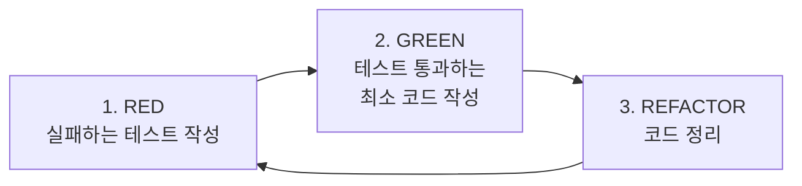
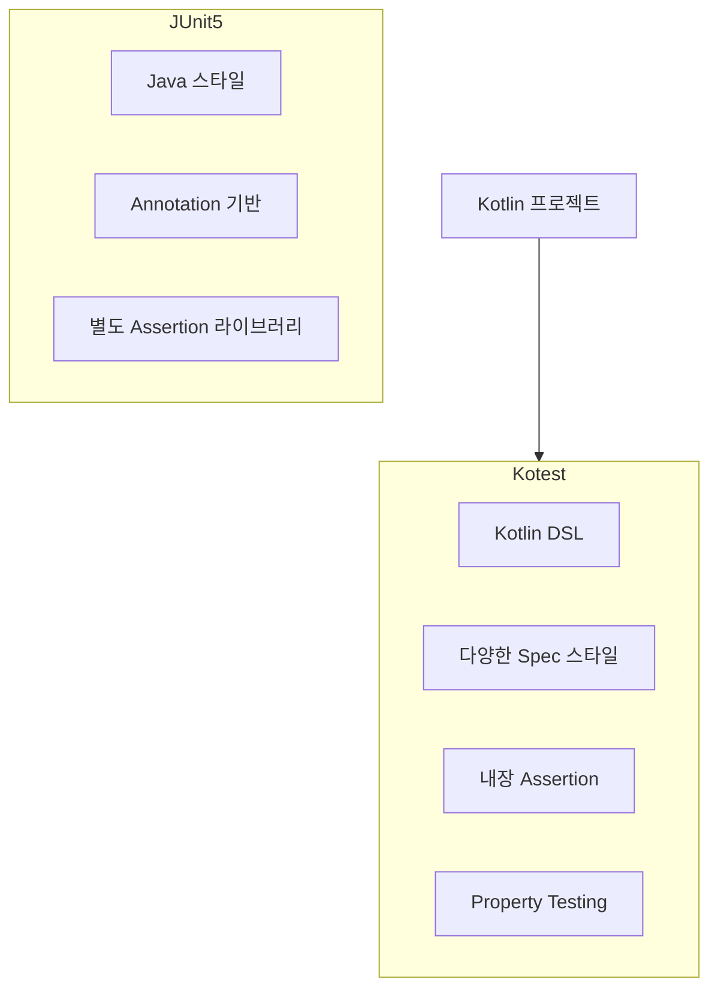
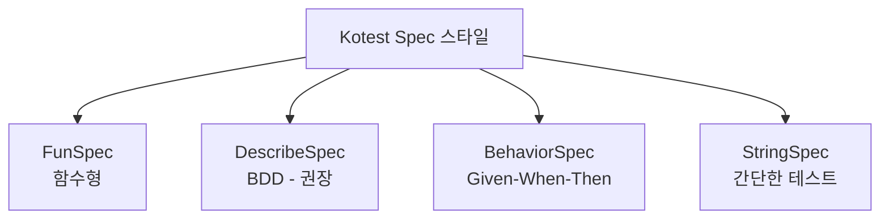
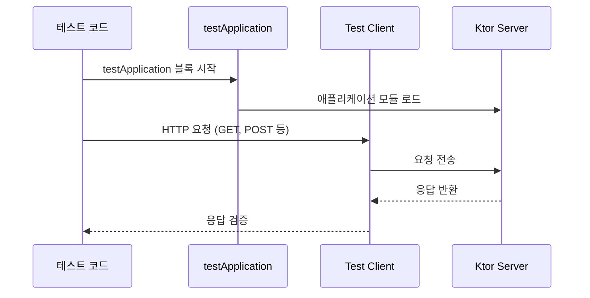
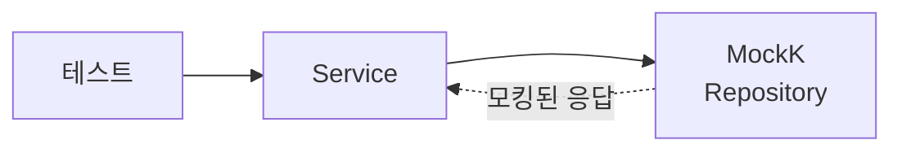
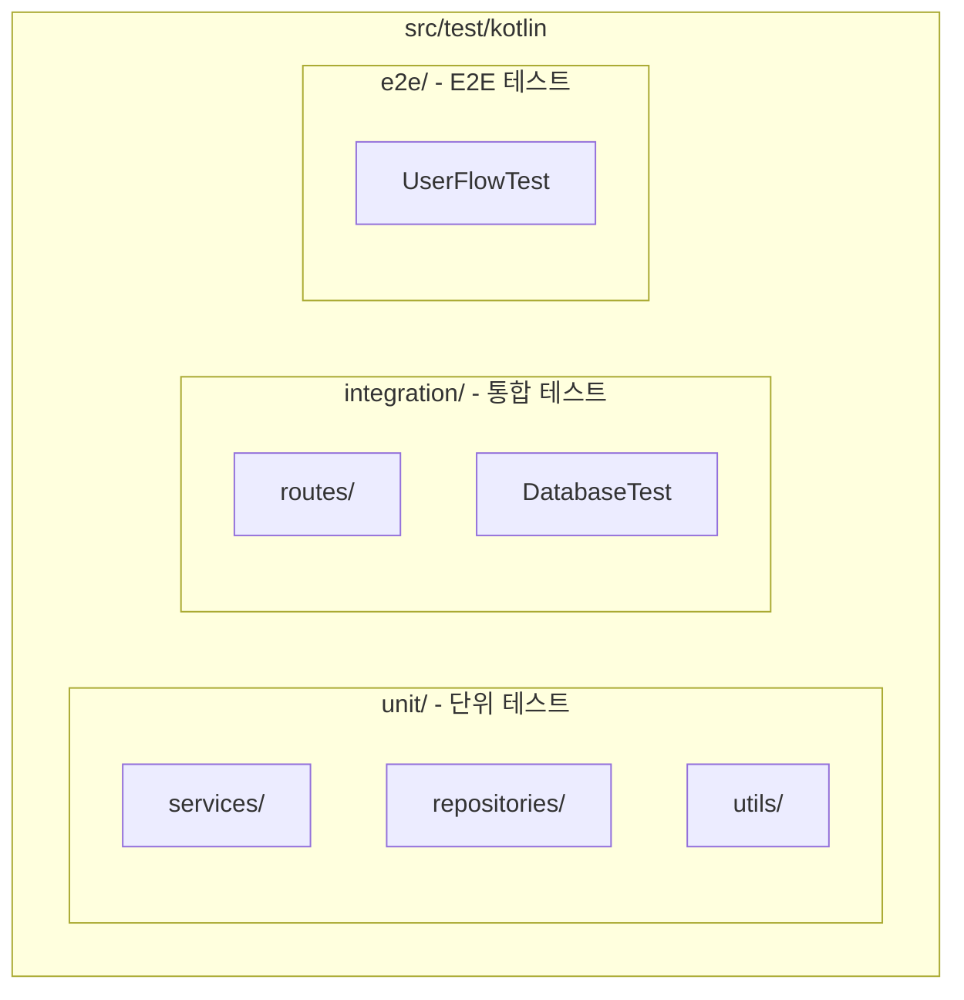
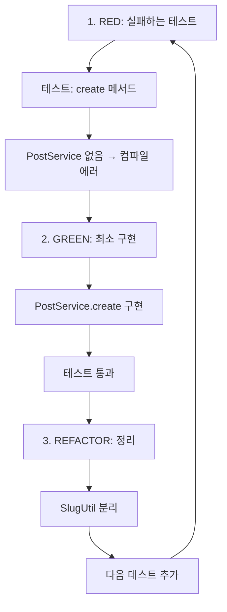

# TDD with Kotest

## TDD란?

**Test-Driven Development** (테스트 주도 개발)

코드를 작성하기 전에 테스트를 먼저 작성하는 개발 방법론.

### Red-Green-Refactor 사이클



1. **RED**: 실패하는 테스트 작성
2. **GREEN**: 테스트를 통과하는 최소한의 코드 작성
3. **REFACTOR**: 코드 정리 (테스트는 계속 통과해야 함)

---

## Kotest 선택 이유



| 항목 | JUnit5 | Kotest |
|------|--------|--------|
| DSL 스타일 | ❌ | ✅ 코틀린스러움 |
| BDD 지원 | 제한적 | ✅ 다양한 스펙 |
| Assertion | 별도 라이브러리 필요 | ✅ 내장 |
| Property Testing | ❌ | ✅ 내장 |
| 확장성 | 보통 | ✅ 풍부한 extensions |

---

## Kotest 테스트 스타일



### 1. FunSpec (함수형)

```kotlin
class PostServiceTest : FunSpec({
    test("should create post with valid data") {
        val post = PostService.create("Title", "Content")
        post.title shouldBe "Title"
    }
})
```

### 2. DescribeSpec (BDD - 권장)

```kotlin
class PostServiceTest : DescribeSpec({
    describe("PostService") {
        describe("create") {
            it("should create post with valid data") {
                val post = PostService.create("Title", "Content")
                post.title shouldBe "Title"
            }

            it("should generate slug from title") {
                val post = PostService.create("Hello World", "Content")
                post.slug shouldBe "hello-world"
            }
        }
    }
})
```

### 3. BehaviorSpec (Given-When-Then)

```kotlin
class PostServiceTest : BehaviorSpec({
    given("a post service") {
        `when`("creating a new post") {
            then("it should have the correct title") {
                val post = PostService.create("Title", "Content")
                post.title shouldBe "Title"
            }
        }
    }
})
```

### 4. StringSpec (간단한 테스트)

```kotlin
class SlugUtilTest : StringSpec({
    "should convert spaces to hyphens" {
        SlugUtil.generate("hello world") shouldBe "hello-world"
    }

    "should lowercase all characters" {
        SlugUtil.generate("Hello World") shouldBe "hello-world"
    }
})
```

---

## Kotest Assertions

```kotlin
// 기본
value shouldBe expected
value shouldNotBe unexpected

// 컬렉션
list shouldContain element
list shouldHaveSize 3
list.shouldBeEmpty()
list.shouldContainAll(a, b, c)

// 문자열
str shouldStartWith "prefix"
str shouldEndWith "suffix"
str shouldContain "substring"
str.shouldBeBlank()

// 숫자
num shouldBeGreaterThan 5
num shouldBeInRange 1..10

// Null
value.shouldBeNull()
value.shouldNotBeNull()

// 예외
shouldThrow<IllegalArgumentException> {
    service.validate(invalidData)
}

// 타입
obj.shouldBeInstanceOf<Post>()
```

---

## Ktor 테스트 흐름



### 기본 구조

```kotlin
class PostRoutesTest : DescribeSpec({
    describe("GET /posts") {
        it("should return list of posts") {
            testApplication {
                application {
                    module()
                }

                val response = client.get("/posts")

                response.status shouldBe HttpStatusCode.OK
            }
        }
    }
})
```

---

## MockK로 의존성 모킹



```kotlin
class PostServiceTest : DescribeSpec({
    val mockRepository = mockk<PostRepository>()
    val service = PostService(mockRepository)

    beforeTest {
        clearMocks(mockRepository)
    }

    describe("findById") {
        it("should return post when exists") {
            // Given
            val post = Post(1, "Title", "Content")
            every { mockRepository.findById(1) } returns post

            // When
            val result = service.findById(1)

            // Then
            result shouldBe post
            verify(exactly = 1) { mockRepository.findById(1) }
        }
    }
})
```

---

## 테스트 구조 (프로젝트)



```
src/test/kotlin/net/gnajournal/blog/
├── unit/                    # 단위 테스트
│   ├── services/
│   │   ├── PostServiceTest.kt
│   │   └── UserServiceTest.kt
│   ├── repositories/
│   │   └── PostRepositoryTest.kt
│   └── utils/
│       └── SlugUtilTest.kt
├── integration/             # 통합 테스트
│   ├── routes/
│   │   ├── PostRoutesTest.kt
│   │   └── AuthRoutesTest.kt
│   └── DatabaseTest.kt
└── e2e/                     # E2E 테스트
    └── UserFlowTest.kt
```

---

## TDD 실전 예시: PostService



### Step 1: RED - 실패하는 테스트

```kotlin
class PostServiceTest : DescribeSpec({
    describe("create") {
        it("should create post with slug") {
            val service = PostService()

            val post = service.create(
                title = "Hello World",
                content = "This is content"
            )

            post.title shouldBe "Hello World"
            post.slug shouldBe "hello-world"
        }
    }
})
```

### Step 2: GREEN - 최소 구현

```kotlin
class PostService {
    fun create(title: String, content: String): Post {
        return Post(
            title = title,
            slug = title.lowercase().replace(" ", "-"),
            content = content
        )
    }
}
```

### Step 3: REFACTOR - 정리

```kotlin
class PostService(
    private val slugUtil: SlugUtil = SlugUtil()
) {
    fun create(title: String, content: String): Post {
        return Post(
            title = title,
            slug = slugUtil.generate(title),
            content = content
        )
    }
}
```

---

## 참고

- [Kotest 공식 문서](https://kotest.io/)
- [MockK 공식 문서](https://mockk.io/)
- [Ktor Testing 문서](https://ktor.io/docs/testing.html)