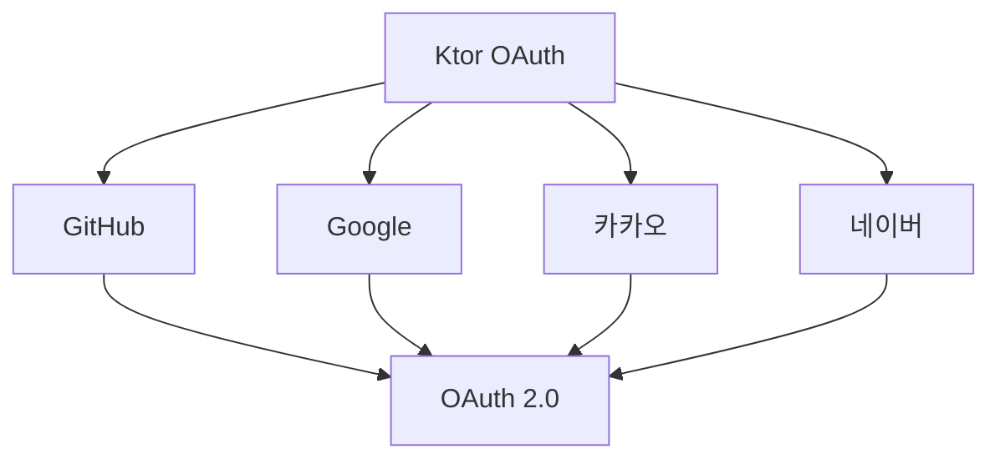
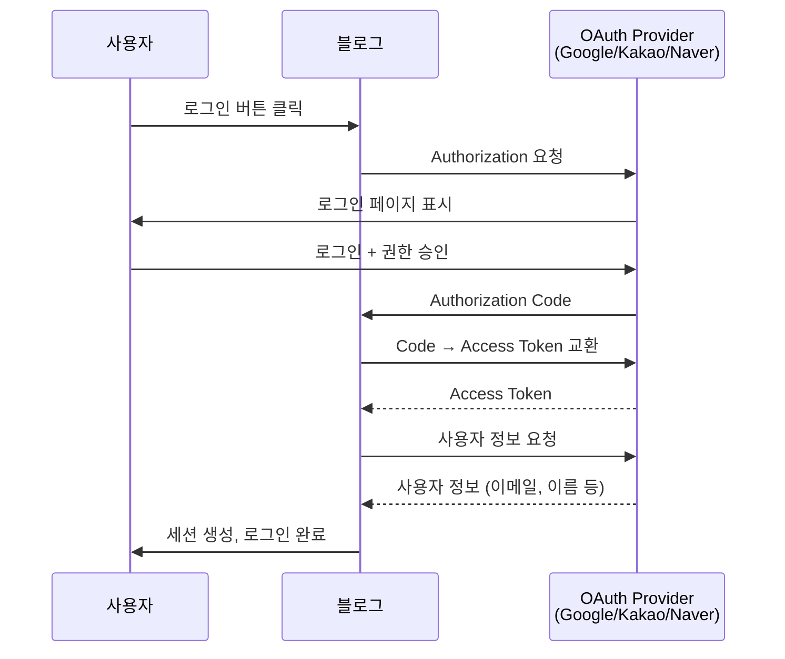
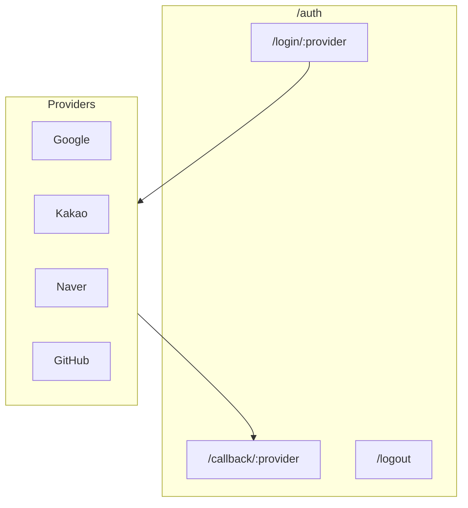

# Ktor OAuth 소셜 로그인 가이드

## 지원 가능한 소셜 로그인



---

## OAuth 2.0 흐름



---

## Ktor 설정

### 의존성 추가

```kotlin
// build.gradle.kts
implementation("io.ktor:ktor-server-auth")
implementation("io.ktor:ktor-server-auth-jwt")  // JWT 사용 시
implementation("io.ktor:ktor-client-core")
implementation("io.ktor:ktor-client-cio")
implementation("io.ktor:ktor-client-content-negotiation")
implementation("io.ktor:ktor-serialization-kotlinx-json")
```

---

## 1. Google OAuth

### 설정값 (Google Cloud Console)
- Console: https://console.cloud.google.com
- OAuth 2.0 클라이언트 ID 생성

```kotlin
install(Authentication) {
    oauth("google") {
        urlProvider = { "http://localhost:8080/auth/callback/google" }
        providerLookup = {
            OAuthServerSettings.OAuth2ServerSettings(
                name = "google",
                authorizeUrl = "https://accounts.google.com/o/oauth2/v2/auth",
                accessTokenUrl = "https://oauth2.googleapis.com/token",
                requestMethod = HttpMethod.Post,
                clientId = System.getenv("GOOGLE_CLIENT_ID"),
                clientSecret = System.getenv("GOOGLE_CLIENT_SECRET"),
                defaultScopes = listOf(
                    "https://www.googleapis.com/auth/userinfo.profile",
                    "https://www.googleapis.com/auth/userinfo.email"
                )
            )
        }
        client = HttpClient(CIO)
    }
}
```

### 사용자 정보 조회

```kotlin
routing {
    authenticate("google") {
        get("/auth/login/google") {
            // 자동으로 Google 로그인 페이지로 리다이렉트
        }

        get("/auth/callback/google") {
            val principal = call.principal<OAuthAccessTokenResponse.OAuth2>()
            val accessToken = principal?.accessToken

            // Google API로 사용자 정보 조회
            val userInfo = httpClient.get("https://www.googleapis.com/oauth2/v2/userinfo") {
                header("Authorization", "Bearer $accessToken")
            }.body<GoogleUserInfo>()

            // 세션 생성 또는 사용자 등록
            call.sessions.set(UserSession(userInfo.email, userInfo.name))
            call.respondRedirect("/")
        }
    }
}

@Serializable
data class GoogleUserInfo(
    val id: String,
    val email: String,
    val name: String,
    val picture: String? = null
)
```

---

## 2. 카카오 OAuth

### 설정값 (Kakao Developers)
- Console: https://developers.kakao.com
- 앱 생성 → 카카오 로그인 활성화

```kotlin
install(Authentication) {
    oauth("kakao") {
        urlProvider = { "http://localhost:8080/auth/callback/kakao" }
        providerLookup = {
            OAuthServerSettings.OAuth2ServerSettings(
                name = "kakao",
                authorizeUrl = "https://kauth.kakao.com/oauth/authorize",
                accessTokenUrl = "https://kauth.kakao.com/oauth/token",
                requestMethod = HttpMethod.Post,
                clientId = System.getenv("KAKAO_CLIENT_ID"),
                clientSecret = System.getenv("KAKAO_CLIENT_SECRET"),
                defaultScopes = listOf("profile_nickname", "account_email")
            )
        }
        client = HttpClient(CIO)
    }
}
```

### 사용자 정보 조회

```kotlin
get("/auth/callback/kakao") {
    val principal = call.principal<OAuthAccessTokenResponse.OAuth2>()
    val accessToken = principal?.accessToken

    val userInfo = httpClient.get("https://kapi.kakao.com/v2/user/me") {
        header("Authorization", "Bearer $accessToken")
    }.body<KakaoUserResponse>()

    val email = userInfo.kakaoAccount?.email
    val nickname = userInfo.kakaoAccount?.profile?.nickname

    // 세션 생성
    call.sessions.set(UserSession(email ?: "", nickname ?: ""))
    call.respondRedirect("/")
}

@Serializable
data class KakaoUserResponse(
    val id: Long,
    @SerialName("kakao_account")
    val kakaoAccount: KakaoAccount? = null
)

@Serializable
data class KakaoAccount(
    val email: String? = null,
    val profile: KakaoProfile? = null
)

@Serializable
data class KakaoProfile(
    val nickname: String? = null
)
```

---

## 3. 네이버 OAuth

### 설정값 (Naver Developers)
- Console: https://developers.naver.com
- 애플리케이션 등록

```kotlin
install(Authentication) {
    oauth("naver") {
        urlProvider = { "http://localhost:8080/auth/callback/naver" }
        providerLookup = {
            OAuthServerSettings.OAuth2ServerSettings(
                name = "naver",
                authorizeUrl = "https://nid.naver.com/oauth2.0/authorize",
                accessTokenUrl = "https://nid.naver.com/oauth2.0/token",
                requestMethod = HttpMethod.Post,
                clientId = System.getenv("NAVER_CLIENT_ID"),
                clientSecret = System.getenv("NAVER_CLIENT_SECRET")
            )
        }
        client = HttpClient(CIO)
    }
}
```

### 사용자 정보 조회

```kotlin
get("/auth/callback/naver") {
    val principal = call.principal<OAuthAccessTokenResponse.OAuth2>()
    val accessToken = principal?.accessToken

    val response = httpClient.get("https://openapi.naver.com/v1/nid/me") {
        header("Authorization", "Bearer $accessToken")
    }.body<NaverUserResponse>()

    val userInfo = response.response
    call.sessions.set(UserSession(userInfo.email, userInfo.name))
    call.respondRedirect("/")
}

@Serializable
data class NaverUserResponse(
    val response: NaverUserInfo
)

@Serializable
data class NaverUserInfo(
    val id: String,
    val email: String,
    val name: String,
    val nickname: String? = null
)
```

---

## 4. GitHub OAuth

```kotlin
install(Authentication) {
    oauth("github") {
        urlProvider = { "http://localhost:8080/auth/callback/github" }
        providerLookup = {
            OAuthServerSettings.OAuth2ServerSettings(
                name = "github",
                authorizeUrl = "https://github.com/login/oauth/authorize",
                accessTokenUrl = "https://github.com/login/oauth/access_token",
                requestMethod = HttpMethod.Post,
                clientId = System.getenv("GITHUB_CLIENT_ID"),
                clientSecret = System.getenv("GITHUB_CLIENT_SECRET"),
                defaultScopes = listOf("user:email")
            )
        }
        client = HttpClient(CIO)
    }
}
```

---

## 통합 라우팅 구조



### 환경 변수

```bash
# .env
GOOGLE_CLIENT_ID=xxx
GOOGLE_CLIENT_SECRET=xxx
KAKAO_CLIENT_ID=xxx
KAKAO_CLIENT_SECRET=xxx
NAVER_CLIENT_ID=xxx
NAVER_CLIENT_SECRET=xxx
GITHUB_CLIENT_ID=xxx
GITHUB_CLIENT_SECRET=xxx
```

---

## 사용자 테이블 설계

```kotlin
object Users : IntIdTable() {
    val email = varchar("email", 255).uniqueIndex()
    val username = varchar("username", 50)
    val provider = varchar("provider", 20)  // google, kakao, naver, github
    val providerId = varchar("provider_id", 255)
    val profileImage = varchar("profile_image", 500).nullable()
    val adminPermission = bool("admin_permission").default(false)
    val createdAt = datetime("created_at").defaultExpression(CurrentDateTime)
}
```

---

## 참고

- [Ktor OAuth 공식 문서](https://ktor.io/docs/oauth.html)
- [Google OAuth](https://developers.google.com/identity/protocols/oauth2)
- [Kakao Login](https://developers.kakao.com/docs/latest/ko/kakaologin/common)
- [Naver Login](https://developers.naver.com/docs/login/overview/overview.md)
