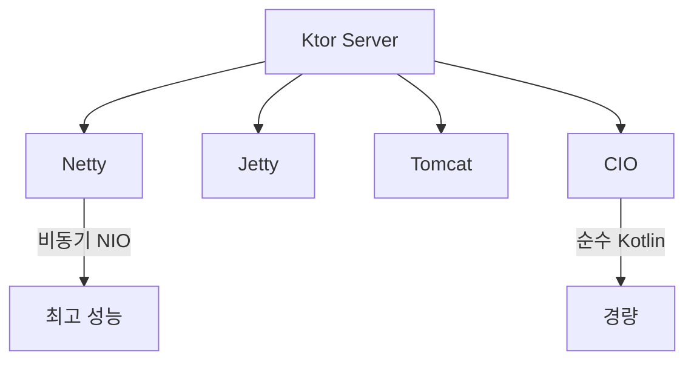
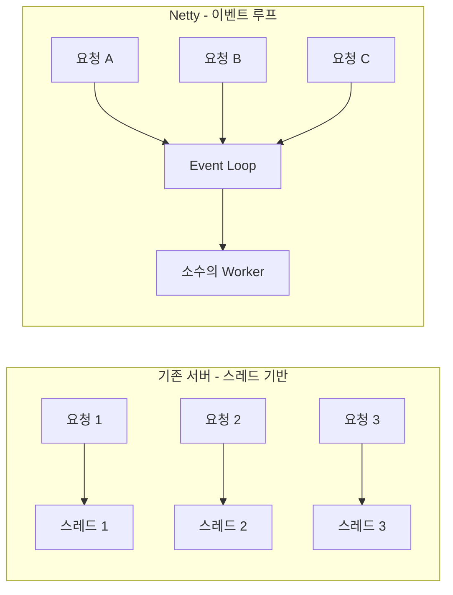
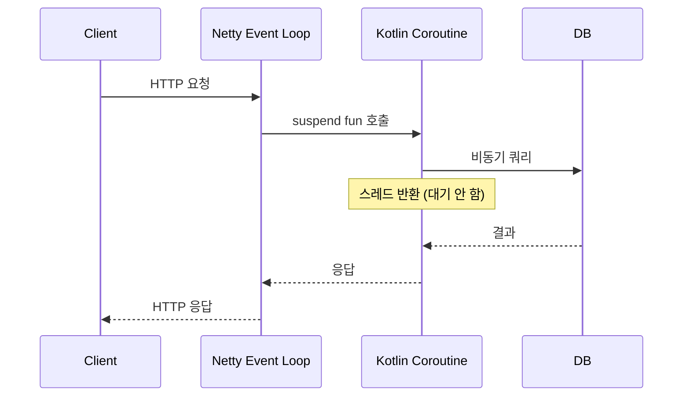
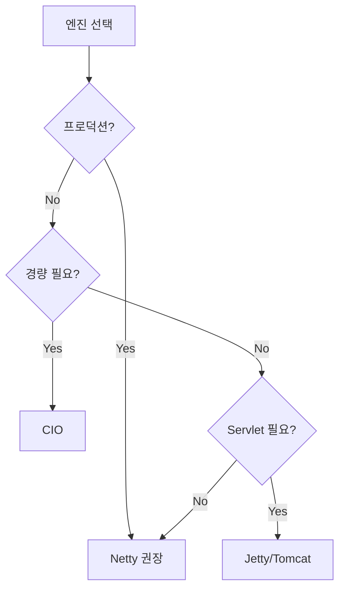
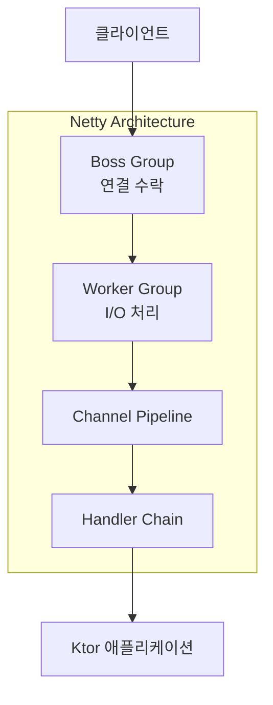

# Ktor 서버 엔진 비교

## Ktor 엔진 종류



---

## 왜 Netty가 기본인가?

### 1. 비동기 + 논블로킹 아키텍처



- **Netty**: 소수의 스레드로 수천 개의 동시 연결 처리
- **Kotlin Coroutines**와 완벽하게 호환

### 2. 성능 비교

| 엔진 | 동시 연결 | 메모리 | 시작 시간 |
|------|---------|--------|----------|
| Netty | 수만 개 | 낮음 | 빠름 |
| Jetty | 수천 개 | 중간 | 중간 |
| Tomcat | 수천 개 | 높음 | 느림 |
| CIO | 수천 개 | 매우 낮음 | 매우 빠름 |

### 3. Kotlin Coroutines 최적화



---

## 각 엔진 특징

### Netty (권장)
```kotlin
implementation("io.ktor:ktor-server-netty")
```
- **장점**: 최고 성능, WebSocket 지원, HTTP/2
- **단점**: 의존성 크기
- **적합**: 대부분의 프로덕션 환경

### CIO (Coroutine I/O)
```kotlin
implementation("io.ktor:ktor-server-cio")
```
- **장점**: 순수 Kotlin, 가벼움, 빠른 시작
- **단점**: 일부 기능 제한
- **적합**: 마이크로서비스, 서버리스

### Jetty
```kotlin
implementation("io.ktor:ktor-server-jetty")
```
- **장점**: 성숙한 생태계, Servlet 호환
- **단점**: 무거움
- **적합**: 기존 Jetty 인프라 활용 시

### Tomcat
```kotlin
implementation("io.ktor:ktor-server-tomcat")
```
- **장점**: 익숙함, Servlet 호환
- **단점**: 무겁고 느림
- **적합**: 기존 Tomcat 인프라 활용 시

---

## 선택 가이드



---

## Netty 내부 구조



### Boss Group
- 새로운 연결을 수락
- 보통 1개 스레드

### Worker Group
- 실제 I/O 처리
- CPU 코어 수 × 2 스레드

### Channel Pipeline
- 요청/응답 처리 체인
- 코덱, 암호화 등

---

## 이 프로젝트의 선택

```kotlin
// build.gradle.kts
implementation("io.ktor:ktor-server-netty")
```

**이유:**
- 블로그는 다수의 동시 접속 가능
- WebSocket (실시간 기능) 확장 가능
- 프로덕션 검증된 안정성
- Kotlin Coroutines와 최적 호환

---

## 참고

- [Ktor Engines](https://ktor.io/docs/engines.html)
- [Netty Project](https://netty.io/)
- [Ktor Performance](https://ktor.io/docs/performance.html)