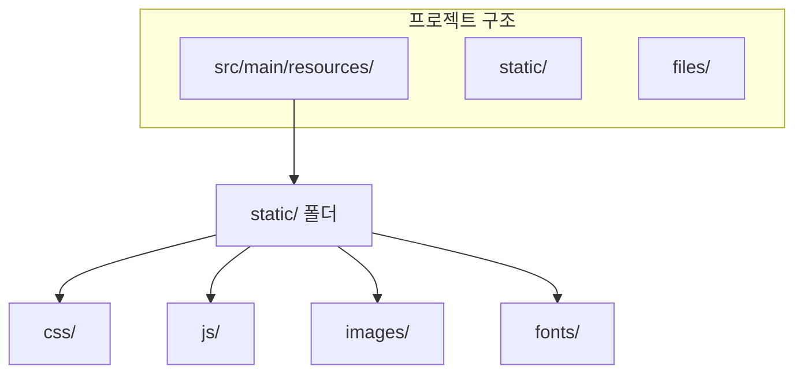

# Ktor 정적 파일 구성

## 정적 파일 위치



### 기본 구조

```
src/main/resources/
├── application.yaml      # Ktor 설정
├── logback.xml           # 로깅 설정
└── static/               # 정적 파일 (빌드에 포함됨)
    ├── css/
    │   └── style.css
    ├── js/
    │   └── main.js
    ├── images/
    │   └── logo.png
    └── favicon.ico
```

---

## Ktor 설정

### 방법 1: staticResources (권장)

```kotlin
fun Application.configureRouting() {
    routing {
        // resources/static 폴더를 /static 경로로 제공
        staticResources("/static", "static")

        // 파비콘
        staticResources("/favicon.ico", "static") {
            default("favicon.ico")
        }
    }
}
```

### 방법 2: staticFiles (외부 폴더)

```kotlin
routing {
    // 파일 시스템의 폴더를 제공 (업로드된 파일 등)
    staticFiles("/uploads", File("/var/www/uploads"))
}
```

### 방법 3: resources (단일 파일)

```kotlin
routing {
    get("/robots.txt") {
        call.respondText(
            this::class.java.classLoader
                .getResource("static/robots.txt")!!
                .readText(),
            ContentType.Text.Plain
        )
    }
}
```

---

## HTML에서 정적 파일 참조

```kotlin
fun HTML.layout(content: MAIN.() -> Unit) {
    head {
        // CSS
        link(rel = "stylesheet", href = "/static/css/style.css")

        // Tailwind CDN (또는 빌드된 파일)
        link(rel = "stylesheet", href = "/static/css/tailwind.css")

        // Favicon
        link(rel = "icon", href = "/favicon.ico")
    }
    body {
        main {
            content()
        }

        // JavaScript
        script(src = "/static/js/main.js") {}
        script(src = "/static/js/htmx.min.js") {}
    }
}
```

---

## 캐싱 설정


### CachingHeaders 플러그인

```kotlin
install(CachingHeaders) {
    options { call, content ->
        when (content.contentType?.withoutParameters()) {
            // CSS, JS: 1일 캐시
            ContentType.Text.CSS,
            ContentType.Application.JavaScript -> {
                CachingOptions(CacheControl.MaxAge(maxAgeSeconds = 86400))
            }
            // 이미지: 7일 캐시
            ContentType.Image.PNG,
            ContentType.Image.JPEG,
            ContentType.Image.SVG -> {
                CachingOptions(CacheControl.MaxAge(maxAgeSeconds = 604800))
            }
            else -> null
        }
    }
}
```

---

## Tailwind CSS 빌드

### package.json

```json
{
  "scripts": {
    "build:css": "npx tailwindcss -i ./src/input.css -o ./src/main/resources/static/css/tailwind.css --minify",
    "watch:css": "npx tailwindcss -i ./src/input.css -o ./src/main/resources/static/css/tailwind.css --watch"
  },
  "devDependencies": {
    "tailwindcss": "^3.4.0"
  }
}
```

### tailwind.config.js

```javascript
module.exports = {
  content: [
    "./src/main/kotlin/**/*.kt"  // kotlinx.html 템플릿
  ],
  theme: {
    extend: {}
  },
  plugins: []
}
```

### Gradle Task 연동

```kotlin
// build.gradle.kts
tasks.register<Exec>("buildCss") {
    commandLine("npm", "run", "build:css")
}

tasks.named("processResources") {
    dependsOn("buildCss")
}
```

---

## 이미지 업로드 처리

```mermaid
graph TD
    Upload[이미지 업로드] --> Store{저장 위치}
    Store --> Local[로컬 파일]
    Store --> S3[AWS S3]
    Store --> CDN[CDN]

    Local --> Serve[/uploads 경로로 제공]
```

### 로컬 저장 예시

```kotlin
post("/admin/upload") {
    val multipart = call.receiveMultipart()

    multipart.forEachPart { part ->
        if (part is PartData.FileItem) {
            val fileName = "${UUID.randomUUID()}_${part.originalFileName}"
            val file = File("/var/www/uploads/$fileName")
            part.streamProvider().use { input ->
                file.outputStream().buffered().use { output ->
                    input.copyTo(output)
                }
            }
            call.respond(mapOf("url" to "/uploads/$fileName"))
        }
        part.dispose()
    }
}

// uploads 폴더 제공
staticFiles("/uploads", File("/var/www/uploads"))
```

---

## 빌드 시 포함 확인

```bash
# JAR 내용 확인
jar tf build/libs/your-app.jar | grep static
# static/css/style.css
# static/js/main.js
# ...
```

---

## 참고

- [Ktor Static Content](https://ktor.io/docs/serving-static-content.html)
- [Ktor Caching Headers](https://ktor.io/docs/caching-headers.html)