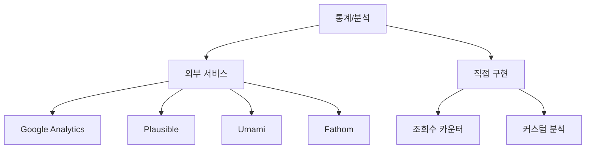
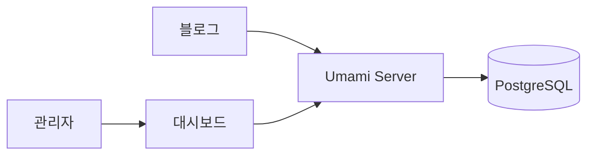
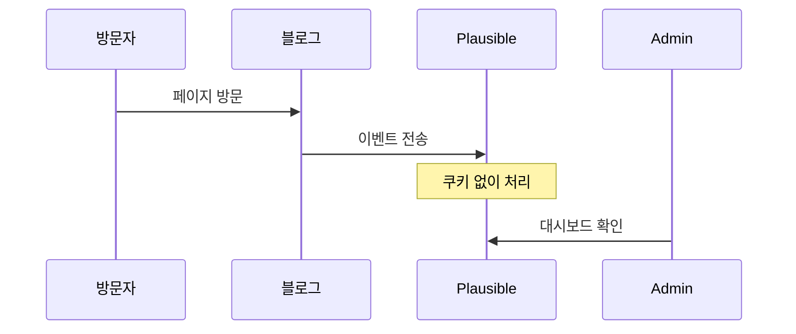
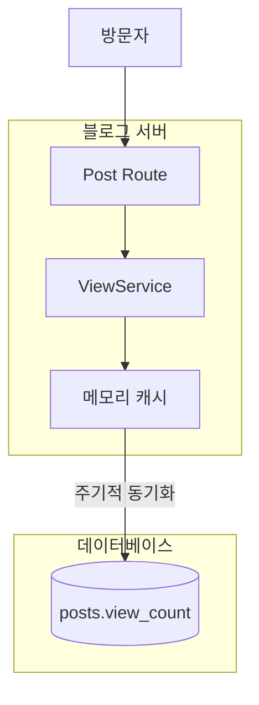
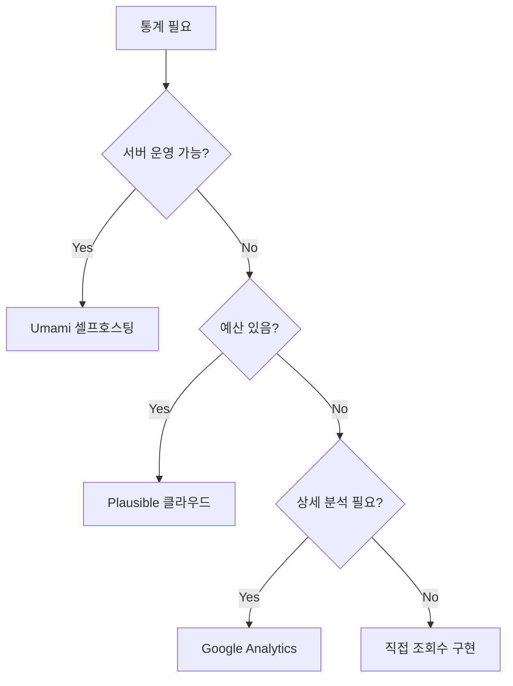

# 블로그 통계/분석 도구 비교

## 선택지 개요



---

## 무료 분석 도구 비교

| 항목 | Google Analytics | Plausible | Umami | 직접 구현 |
|------|-----------------|-----------|-------|----------|
| 비용 | 무료 | 유료 ($9/월) | 셀프호스팅 무료 | 무료 |
| 프라이버시 | ❌ 쿠키 사용 | ✅ 쿠키 없음 | ✅ 쿠키 없음 | ✅ |
| 복잡도 | 복잡함 | 간단함 | 간단함 | 자유도 높음 |
| GDPR | 배너 필요 | 준수 | 준수 | 준수 가능 |
| 실시간 | ✅ | ✅ | ✅ | 구현 필요 |

---

## 1. Umami (추천 - 셀프호스팅)



### 특징
- **완전 무료** (셀프호스팅)
- 오픈소스
- 쿠키 없음, GDPR 준수
- 가벼운 스크립트 (~2KB)
- Docker로 쉬운 배포

### Docker 설정

```yaml
# docker-compose.yml
services:
  umami:
    image: ghcr.io/umami-software/umami:postgresql-latest
    ports:
      - "3000:3000"
    environment:
      DATABASE_URL: postgresql://umami:umami@db:5432/umami
      DATABASE_TYPE: postgresql
      APP_SECRET: your-secret-key
    depends_on:
      - db

  db:
    image: postgres:15-alpine
    environment:
      POSTGRES_DB: umami
      POSTGRES_USER: umami
      POSTGRES_PASSWORD: umami
    volumes:
      - umami-db:/var/lib/postgresql/data

volumes:
  umami-db:
```

### 블로그에 스크립트 추가

```html
<script async src="https://your-umami.com/script.js"
        data-website-id="your-website-id"></script>
```

---

## 2. Plausible (유료지만 우수)



### 특징
- EU 서버 (GDPR 완전 준수)
- 매우 가벼움 (~1KB)
- 깔끔한 UI
- 월 $9부터 (또는 셀프호스팅)

---

## 3. Google Analytics 4

### 장점
- 무료
- 강력한 기능

### 단점
- 복잡함
- 쿠키 배너 필요
- 프라이버시 이슈

---

## 4. 직접 구현 (조회수만)



### 간단한 조회수 구현

```kotlin
// 조회수 증가 (캐시 활용)
class ViewCountService(
    private val cache: MutableMap<Int, Int> = ConcurrentHashMap()
) {
    fun incrementView(postId: Int) {
        cache.merge(postId, 1, Int::plus)
    }

    // 5분마다 DB에 동기화
    suspend fun syncToDatabase() {
        cache.forEach { (postId, count) ->
            Posts.update({ Posts.id eq postId }) {
                it[viewCount] = viewCount + count
            }
        }
        cache.clear()
    }
}
```

### 고려사항
- IP/세션 기반 중복 방지
- 봇 필터링
- 캐시로 DB 부하 감소

---

## 권장 선택



**이 블로그의 경우**:
- Docker 사용 예정이므로 **Umami 셀프호스팅** 추천
- 간단하게 시작하려면 **조회수만 직접 구현**

---

## 참고

- [Umami 공식](https://umami.is/)
- [Plausible 공식](https://plausible.io/)
- [Umami Docker 설치](https://umami.is/docs/install)