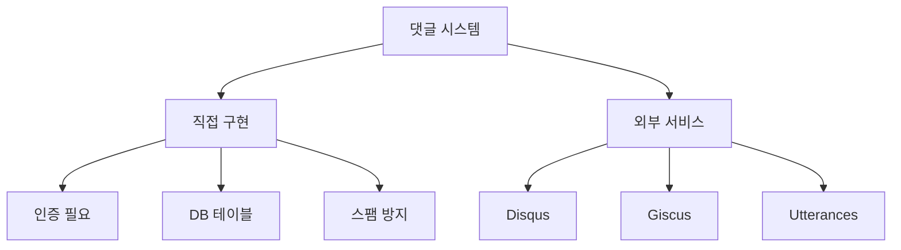
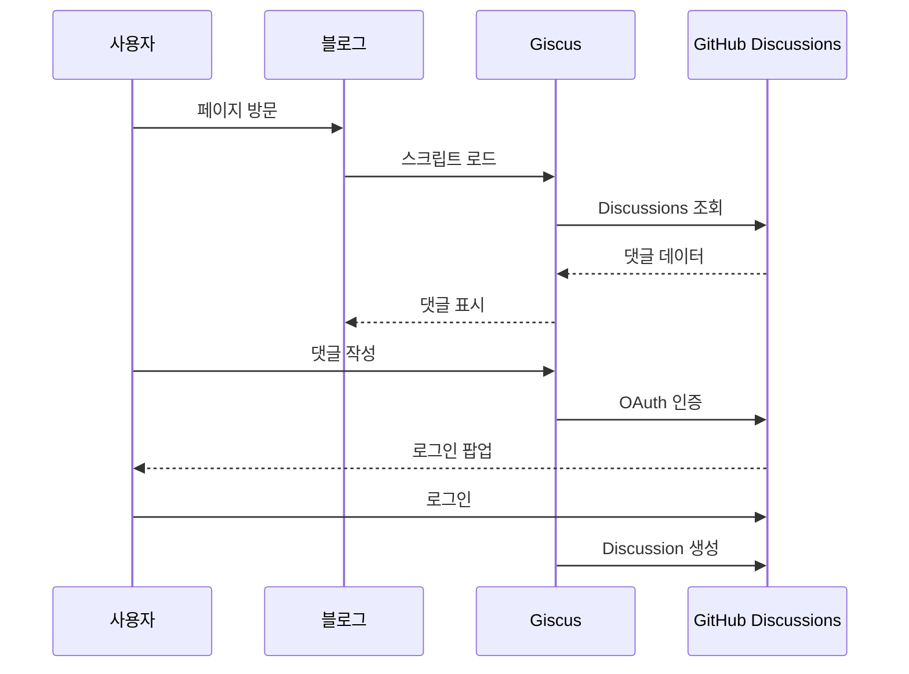
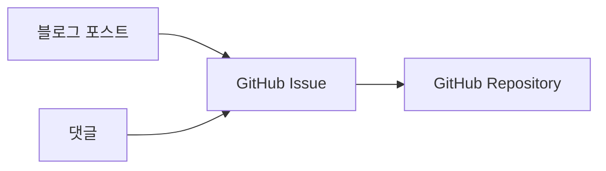
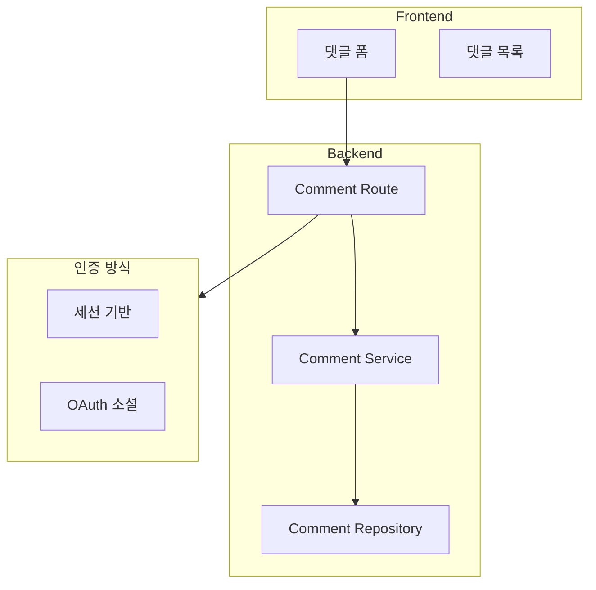
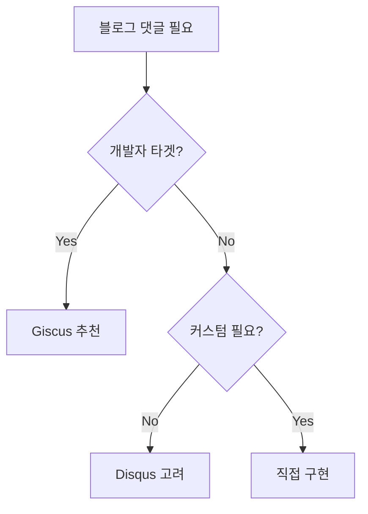

# 댓글 시스템 구현 방식 비교

## 선택지 개요



---

## 외부 서비스 비교

| 항목 | Disqus | Giscus | Utterances |
|------|--------|--------|------------|
| 비용 | 무료/유료 | 무료 | 무료 |
| 로그인 | 자체/소셜 | GitHub | GitHub |
| 데이터 저장 | Disqus 서버 | GitHub Discussions | GitHub Issues |
| 광고 | 무료는 광고 있음 | 없음 | 없음 |
| 커스터마이징 | 제한적 | 높음 | 보통 |
| 속도 | 무거움 | 가벼움 | 가벼움 |

---

## 1. Giscus (추천)



### 장점
- 무료, 광고 없음
- GitHub Discussions 활용 (Issues보다 적합)
- 리액션 지원
- 다크모드 지원
- 가벼움

### 설정

```html
<script src="https://giscus.app/client.js"
        data-repo="your-username/your-repo"
        data-repo-id="R_xxx"
        data-category="Announcements"
        data-category-id="DIC_xxx"
        data-mapping="pathname"
        data-strict="0"
        data-reactions-enabled="1"
        data-emit-metadata="0"
        data-input-position="bottom"
        data-theme="light"
        data-lang="ko"
        crossorigin="anonymous"
        async>
</script>
```

---

## 2. Utterances



### 장점
- 설정 간단
- GitHub Issues 기반

### 단점
- Issues가 댓글로 오염됨
- Giscus보다 기능 적음

---

## 3. 직접 구현



### 필요 작업
1. comments 테이블 설계
2. 인증 시스템 구현
3. 스팸 방지 (reCAPTCHA 등)
4. 알림 시스템
5. 신고/관리 기능

### 추천 상황
- 커스터마이징이 많이 필요할 때
- GitHub 외 로그인을 원할 때
- 데이터 완전 소유가 필요할 때

---

## 소셜 로그인 (직접 구현 시)

### Ktor OAuth 설정

```kotlin
install(Authentication) {
    oauth("github") {
        urlProvider = { "http://localhost:8080/callback" }
        providerLookup = {
            OAuthServerSettings.OAuth2ServerSettings(
                name = "github",
                authorizeUrl = "https://github.com/login/oauth/authorize",
                accessTokenUrl = "https://github.com/login/oauth/access_token",
                requestMethod = HttpMethod.Post,
                clientId = System.getenv("GITHUB_CLIENT_ID"),
                clientSecret = System.getenv("GITHUB_CLIENT_SECRET"),
                defaultScopes = listOf("user:email")
            )
        }
        client = HttpClient(Apache)
    }
}
```

---

## 권장 선택



**이 블로그의 경우**: 개발 블로그이므로 **Giscus 추천**
- GitHub 로그인은 개발자에게 자연스러움
- 무료, 광고 없음
- 설정이 간단함
- 데이터가 GitHub에 저장됨

---

## 참고

- [Giscus 공식](https://giscus.app/ko)
- [Utterances 공식](https://utteranc.es/)
- [Ktor OAuth](https://ktor.io/docs/oauth.html)
