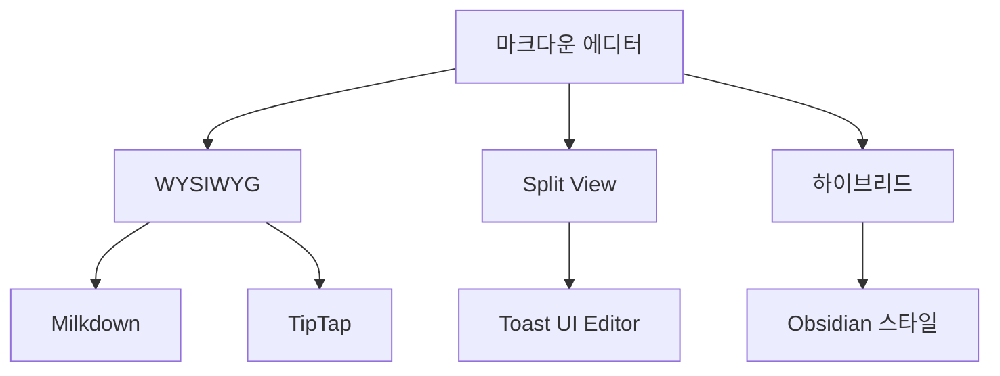

# 마크다운 에디터 선택 가이드

## 요구사항

- Notion/Obsidian 스타일 단축키 지원
- WYSIWYG 또는 하이브리드 편집
- 이미지 드래그 앤 드롭
- 마크다운 내보내기

---

## 에디터 비교



| 에디터 | 스타일 | 단축키 커스텀 | 무료 | 추천 |
|--------|--------|--------------|------|------|
| **Milkdown** | Notion-like | O (프리셋 지원) | O | ⭐⭐⭐ |
| **TipTap** | WYSIWYG | O | O (오픈소스) | ⭐⭐ |
| Toast UI Editor | Split | △ | O | ⭐ |
| Editor.js | Block-based | O | O | ⭐⭐ |

---

## 추천: Milkdown

### 특징
- **Notion 스타일** 블록 에디터
- ProseMirror 기반 (안정적)
- 플러그인으로 기능 확장
- 마크다운 ↔ WYSIWYG 전환
- 키바인딩 커스터마이즈 가능

### 설치

```bash
npm install @milkdown/core @milkdown/preset-commonmark @milkdown/theme-nord
```

### 기본 사용

```typescript
import { Editor } from '@milkdown/core';
import { commonmark } from '@milkdown/preset-commonmark';
import { nord } from '@milkdown/theme-nord';

const editor = await Editor
  .make()
  .use(commonmark)
  .use(nord)
  .create();
```

### 단축키 설정 (Notion 스타일)

```typescript
import { keymap } from '@milkdown/plugin-keymap';

// 기본 제공 단축키
// Ctrl+B: Bold
// Ctrl+I: Italic
// Ctrl+Shift+S: Strikethrough
// Ctrl+`: Code
// Ctrl+Shift+H: Heading

// 커스텀 키맵
const customKeymap = keymap({
  'Mod-Alt-1': () => /* heading 1 */,
  'Mod-Alt-2': () => /* heading 2 */,
  'Mod-/': () => /* slash command */,
});

Editor.make()
  .use(commonmark)
  .use(customKeymap)
  .create();
```

### Slash Command (Notion 스타일 `/` 메뉴)

```typescript
import { slash } from '@milkdown/plugin-slash';

const slashPlugin = slash.configure(slash, {
  config: () => ({
    placeholder: {
      empty: "'/' 를 입력하여 명령어 사용",
      slpiash: '명령어 검색...',
    },
  }),
});
```

---

## Obsidian 스타일 원하면

Obsidian은 **라이브 프리뷰** 방식 (마크다운 문법이 보이면서 동시에 렌더링)

### CodeMirror 6 + 커스텀 플러그인

```typescript
import { EditorView, keymap } from '@codemirror/view';
import { markdown } from '@codemirror/lang-markdown';

// Obsidian처럼 마크다운 문법 숨기기
const hideMarkdownSyntax = /* custom plugin */;

const view = new EditorView({
  extensions: [
    markdown(),
    keymap.of([
      { key: 'Mod-b', run: toggleBold },
      { key: 'Mod-i', run: toggleItalic },
    ]),
  ],
});
```

---

## 구현 방식 비교

### A. Notion 스타일 (Milkdown)
```
사용자 입력: # Hello
화면 표시: [H1 블록] Hello (마크다운 문법 숨김)
```

### B. Obsidian 스타일 (CodeMirror)
```
사용자 입력: # Hello
화면 표시: # Hello (문법 보이면서 스타일 적용)
커서 벗어나면: [큰 글씨] Hello
```

---

## 설정 페이지 구현

사용자가 스타일 선택할 수 있게:

```typescript
// 어드민 설정
interface EditorPreference {
  style: 'notion' | 'obsidian';
  theme: 'light' | 'dark';
}

// 저장된 설정에 따라 에디터 초기화
function initEditor(pref: EditorPreference) {
  if (pref.style === 'notion') {
    return initMilkdown();
  } else {
    return initCodeMirror();
  }
}
```

```html
<!-- 설정 UI -->
<div class="editor-style-selector">
  <label>
    <input type="radio" name="editor" value="notion" checked>
    Notion 스타일 (블록 에디터)
  </label>
  <label>
    <input type="radio" name="editor" value="obsidian">
    Obsidian 스타일 (라이브 프리뷰)
  </label>
</div>
```

---

## 이미지 업로드 연동

```typescript
// Milkdown 이미지 업로드
import { upload } from '@milkdown/plugin-upload';

const uploadPlugin = upload.configure(upload, {
  uploader: async (files: File[]) => {
    const formData = new FormData();
    formData.append('file', files[0]);

    const response = await fetch('/admin/upload', {
      method: 'POST',
      body: formData,
    });

    const { url } = await response.json();
    return url;
  },
});
```

---

## 참고

- [Milkdown 공식](https://milkdown.dev/)
- [TipTap](https://tiptap.dev/)
- [CodeMirror 6](https://codemirror.net/)
- [ProseMirror](https://prosemirror.net/)