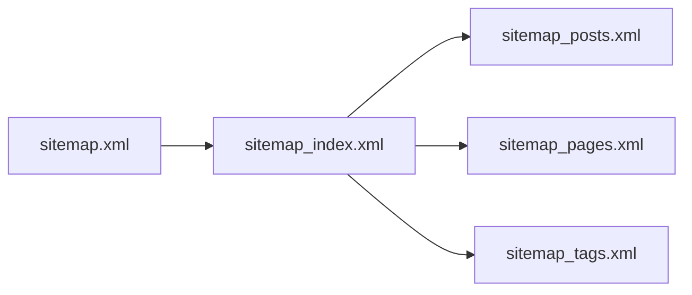
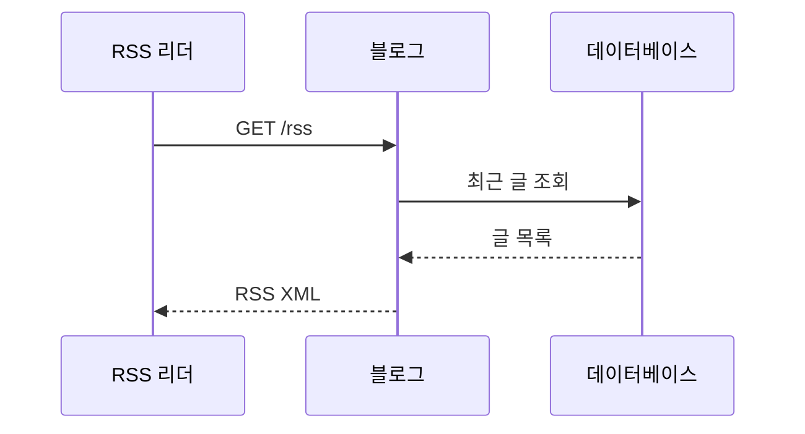
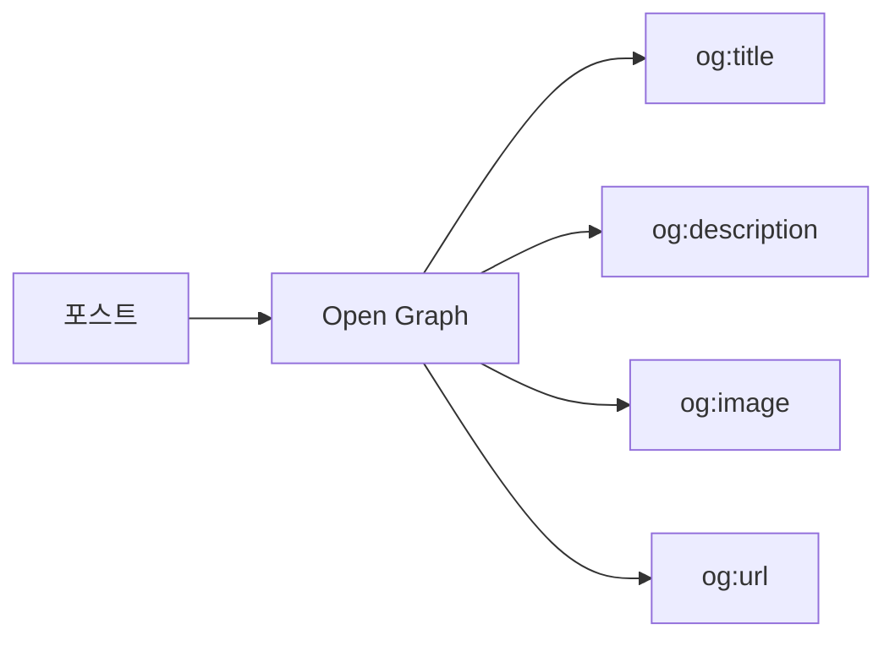
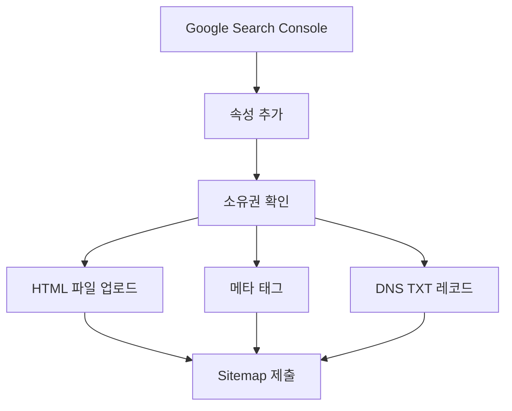

# Sitemap 및 SEO 구성 가이드

## SEO를 위한 필수 엔드포인트

```mermaid
graph TB
    SEO[SEO 엔드포인트] --> Sitemap[/sitemap.xml]
    SEO --> Robots[/robots.txt]
    SEO --> RSS[/rss 또는 /feed]
    SEO --> OG[Open Graph Meta]
```

---

## Sitemap 구조



### 기본 Sitemap 형식

```xml
<?xml version="1.0" encoding="UTF-8"?>
<urlset xmlns="http://www.sitemaps.org/schemas/sitemap/0.9">
    <url>
        <loc>https://blog.example.com/</loc>
        <lastmod>2024-11-26</lastmod>
        <changefreq>daily</changefreq>
        <priority>1.0</priority>
    </url>
    <url>
        <loc>https://blog.example.com/posts/my-first-post</loc>
        <lastmod>2024-11-25</lastmod>
        <changefreq>weekly</changefreq>
        <priority>0.8</priority>
    </url>
</urlset>
```

---

## Ktor에서 Sitemap 구현

```kotlin
fun Route.seoRoutes() {
    get("/sitemap.xml") {
        val posts = postService.findAllPublished()

        val sitemap = buildString {
            appendLine("""<?xml version="1.0" encoding="UTF-8"?>""")
            appendLine("""<urlset xmlns="http://www.sitemaps.org/schemas/sitemap/0.9">""")

            // 홈페이지
            appendLine("""
                <url>
                    <loc>https://blog.example.com/</loc>
                    <changefreq>daily</changefreq>
                    <priority>1.0</priority>
                </url>
            """.trimIndent())

            // 포스트들
            posts.forEach { post ->
                appendLine("""
                    <url>
                        <loc>https://blog.example.com/posts/${post.slug}</loc>
                        <lastmod>${post.updatedAt.format(DateTimeFormatter.ISO_DATE)}</lastmod>
                        <changefreq>weekly</changefreq>
                        <priority>0.8</priority>
                    </url>
                """.trimIndent())
            }

            appendLine("</urlset>")
        }

        call.respondText(sitemap, ContentType.Application.Xml)
    }
}
```

---

## robots.txt

```kotlin
get("/robots.txt") {
    val robots = """
        User-agent: *
        Allow: /

        Sitemap: https://blog.example.com/sitemap.xml
    """.trimIndent()

    call.respondText(robots, ContentType.Text.Plain)
}
```

---

## RSS Feed



### RSS 구현

```kotlin
get("/rss") {
    val posts = postService.findAllPublished(limit = 20)

    val rss = buildString {
        appendLine("""<?xml version="1.0" encoding="UTF-8"?>""")
        appendLine("""<rss version="2.0">""")
        appendLine("<channel>")
        appendLine("<title>My Blog</title>")
        appendLine("<link>https://blog.example.com</link>")
        appendLine("<description>개발 블로그</description>")
        appendLine("<language>ko-KR</language>")

        posts.forEach { post ->
            appendLine("""
                <item>
                    <title>${post.title.escapeXml()}</title>
                    <link>https://blog.example.com/posts/${post.slug}</link>
                    <description>${post.summary?.escapeXml() ?: ""}</description>
                    <pubDate>${post.publishedAt?.toRfc822()}</pubDate>
                    <guid>https://blog.example.com/posts/${post.slug}</guid>
                </item>
            """.trimIndent())
        }

        appendLine("</channel>")
        appendLine("</rss>")
    }

    call.respondText(rss, ContentType.Application.Rss)
}

fun String.escapeXml(): String =
    replace("&", "&amp;")
        .replace("<", "&lt;")
        .replace(">", "&gt;")
```

---

## Open Graph Meta Tags



### HTML에 메타 태그 추가

```kotlin
fun HTML.postPage(post: PostDto) {
    head {
        title { +post.title }

        // 기본 메타
        meta(name = "description", content = post.summary ?: "")

        // Open Graph
        meta(property = "og:title", content = post.title)
        meta(property = "og:description", content = post.summary ?: "")
        meta(property = "og:type", content = "article")
        meta(property = "og:url", content = "https://blog.example.com/posts/${post.slug}")
        post.thumbnail?.let {
            meta(property = "og:image", content = it)
        }

        // Twitter Card
        meta(name = "twitter:card", content = "summary_large_image")
        meta(name = "twitter:title", content = post.title)
        meta(name = "twitter:description", content = post.summary ?: "")
    }
    body {
        // 본문
    }
}

fun HEAD.meta(property: String, content: String) {
    meta {
        attributes["property"] = property
        attributes["content"] = content
    }
}
```

---

## changefreq / priority 가이드

| 페이지 유형 | changefreq | priority |
|------------|-----------|----------|
| 홈페이지 | daily | 1.0 |
| 블로그 목록 | daily | 0.9 |
| 포스트 상세 | weekly | 0.8 |
| 태그 페이지 | weekly | 0.6 |
| 카테고리 페이지 | weekly | 0.6 |
| 정적 페이지 (소개 등) | monthly | 0.5 |

---

## Google Search Console 등록



### 소유권 확인용 메타 태그

```kotlin
head {
    meta(name = "google-site-verification", content = "your-verification-code")
}
```

---

## 참고

- [Google Sitemap 가이드](https://developers.google.com/search/docs/crawling-indexing/sitemaps/build-sitemap)
- [Open Graph Protocol](https://ogp.me/)
- [RSS 2.0 Specification](https://www.rssboard.org/rss-specification)