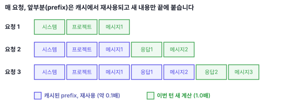
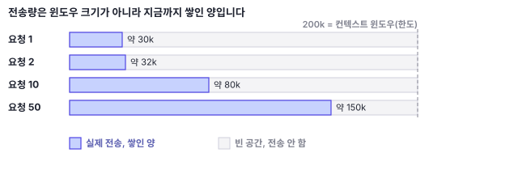
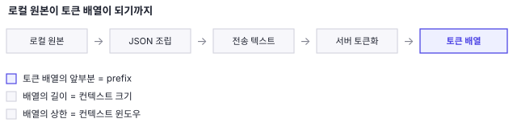
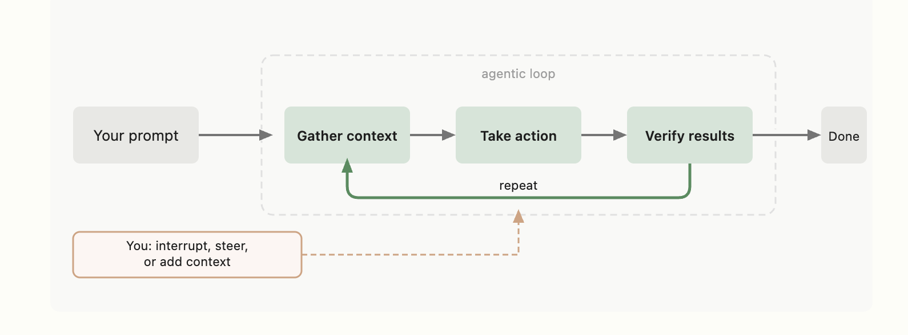
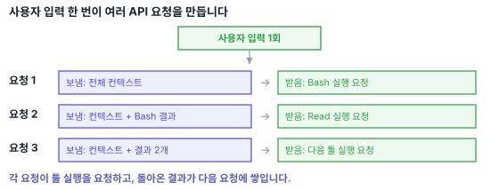
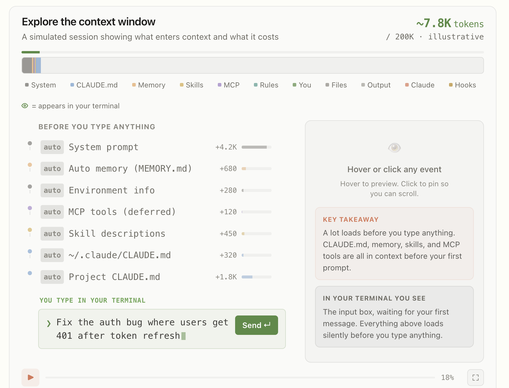
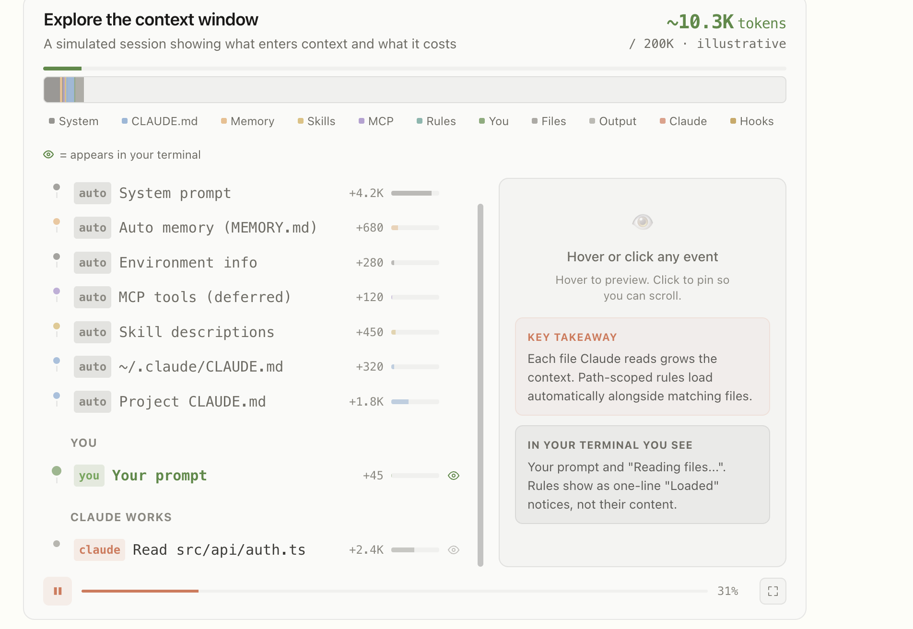

같은 작업인데 세션마다 한도 소진 속도가 다릅니다. 대화 길이도 읽은 파일 수도 비슷한데 차이가 납니다. 원인을 따라가 보면 프롬프트 캐싱이 있습니다. 그리고 그 캐시가 언제 무효화되는지에 대한 몇 가지 오해가 있습니다. 이 글은 그 구조를 공식 문서를 근거로 정리합니다.

> 2026년 7월 기준입니다. Claude Code는 자주 업데이트됩니다. 이 글과 현재 문서가 다르면 문서가 맞습니다.

## 요약

- Claude Code는 매 요청마다 그때까지 쌓인 컨텍스트를 전부 다시 전송합니다. 일부만 보내는 최적화는 없습니다.
- 사용자 입력 한 번이 요청 한 번이 아닙니다. 툴을 쓸 때마다 새 요청이 나가고, 요청은 세션이 길어질수록 커집니다.
- 서버는 요청의 앞부분(prefix)이 직전 요청과 정확히 일치하면 그 부분의 재계산을 생략합니다. 캐시에서 읽은 토큰은 표준 입력가의 약 10%로 청구됩니다.
- prefix가 한 바이트라도 달라지면 그 뒤 전부가 다시 계산됩니다. 캐시 미스 한 번은 캐시 적중 열 번에 해당합니다.
- 캐싱이 낮추는 것은 토큰 단가입니다. 토큰 개수와 컨텍스트 윈도우 점유는 줄지 않습니다.

## 컨텍스트는 요청에서 어떻게 활용될까?

**컨텍스트**는 모델에게 한 번에 넘기는 입력 전체입니다. 시스템 프롬프트, 프로젝트 설정(CLAUDE.md 등), 그때까지 쌓인 모든 메시지와 툴 결과, 방금 입력한 메시지가 전부 여기에 들어갑니다. **컨텍스트 윈도우**는 이 입력을 담을 수 있는 최대 크기입니다.

모델은 요청과 요청 사이에 아무것도 기억하지 않습니다. 그래서 Claude Code는 매 요청마다, 컨텍스트 윈도우 한도 안에서 그때까지 쌓인 컨텍스트를 통째로 다시 전송합니다. 새 내용은 끝에 덧붙습니다. 따라서 각 요청의 대부분은 직전 요청과 동일합니다.



일부만 전송하는 최적화는 없습니다. 다만 전부라는 것은 윈도우 전체가 아니라 쌓인 양입니다. 200k 윈도우에 30k만 차 있으면 30k를 전송합니다. 빈 공간은 전송하지 않습니다. 따라서 전송량은 매 요청 증가합니다.



세션 후반의 요청이 초반보다 훨씬 비싼 이유가 이것입니다. 참고로 컨텍스트 윈도우 크기는 모델과 플랜에 따라 다릅니다. 유료 플랜에서 최신 모델은 최대 1M을 지원하고 나머지는 500K나 200K입니다. 윈도우의 일부는 항상 응답용으로 예약되므로, 실제로 담을 수 있는 대화는 윈도우 전체보다 조금 작습니다.

### 컨텍스트의 원본은 로컬에 있음

컨텍스트가 서버 어딘가에 저장되어 있고 요청이 거기 접속한다고 생각하기 쉽습니다. 그렇지 않습니다. 원본은 로컬에 있습니다. 대화의 모든 메시지와 툴 결과는 `~/.claude/projects/` 아래 JSONL 파일(한 줄에 JSON 하나씩 쌓는 텍스트 파일)로 저장되고, CLAUDE.md와 output style은 세션 시작 시 메모리에 올라옵니다. Claude Code는 매 요청마다 이 로컬 원본을 다시 조립해 보냅니다.

컨텍스트에 무엇이 있는지는 로컬에서 무엇을 읽고 실행했는지로 정해집니다. 저장소에 파일이 있어도 Read 하기 전에는 컨텍스트에 없습니다. 호출하지 않은 스킬의 본문, 이전 세션의 대화, 실행한 스크립트의 코드도 들어가지 않습니다. 스크립트는 출력만 들어갑니다.

서버에 남는 것은 KV 캐시뿐입니다. 이건 연산 결과일 뿐 컨텍스트의 원본이 아닙니다. TTL이 지나 만료되어도 대화는 사라지지 않습니다. 다음 요청이 로컬 원본에서 전체를 다시 보내기 때문입니다. 만료의 대가는 데이터 손실이 아니라 재계산입니다.

- **KV 캐시**: 모델이 입력을 처리하며 만들어 둔 중간 계산 결과입니다. 프롬프트 캐싱이 실제로 저장하는 대상입니다.
- **TTL**(Time To Live): 캐시 항목이 만료되기까지 유효한 시간입니다.

### 응답도 다음 요청의 입력이 됨

컨텍스트에는 Claude 자신의 응답도 들어갑니다. 요청 N의 출력이 요청 N+1부터는 입력입니다. 캐싱 문서의 그림에서 두 번째 요청에 첫 응답이, 세 번째 요청에 두 번째 응답이 포함되어 있는 것이 이 구조입니다.

비용 관점에서 답변 하나에는 비용이 두 번 붙습니다. 첫째, 생성될 때 출력 토큰으로 청구됩니다. 출력 토큰은 입력보다 토큰당 몇 배 비쌉니다. 둘째, 그 답변은 이후 모든 요청에 입력으로 다시 들어가 매번 입력 토큰으로 청구됩니다. 이 재전송분은 캐시가 유효하면 API 기준 0.1배로 줄지만, 컨텍스트 윈도우에서 차지하는 토큰은 그대로입니다. 긴 답변 하나가 세션 전체에 걸쳐 비용을 남기는 셈입니다.



캐싱은 네트워크 전송 단계가 아니라 서버의 연산 단계에서 일어납니다. 요청은 전부 전송되고, 서버가 앞부분을 대조해 이전에 계산한 것과 같으면 그 부분의 계산을 생략합니다. 어느 인프라에 저장되는지는 인증 방식에 따라 다릅니다. API 키나 Claude 구독이면 Anthropic 인프라입니다. Bedrock이나 Google Cloud의 Agent Platform이면 각 클라우드 제공자의 인프라입니다.

## 입력 한 번 = 요청 한 번?

모델은 툴을 직접 실행하지 못합니다. 여기서 툴은 Read, Edit, Bash, Grep 같은 Claude Code 내장 기능과 MCP 서버가 제공하는 기능을 말합니다. 모델이 툴을 쓰겠다는 응답을 돌려주면 Claude Code가 실행합니다. 그리고 그 결과를 붙여 새 요청을 보냅니다. 이 왕복이 툴 호출마다 반복됩니다.

How Claude Code works 문서의 예시가 이 구조를 보여줍니다. "실패하는 테스트를 고쳐줘"라고 입력하면 Claude는 다음 단계를 밟습니다. 테스트 실행, 에러 출력 읽기, 관련 소스 파일 검색, 그 파일들 읽기, 파일 수정, 테스트 재실행. 각 툴 사용이 다음 결정에 필요한 정보를 돌려주고 그것이 루프로 되먹임됩니다.



> 에이전트 루프. 한 번의 프롬프트가 컨텍스트 수집, 실행, 검증을 반복합니다. 출처: [Claude Code 공식 문서, How Claude Code works](https://code.claude.com/docs/en/how-claude-code-works)



입력은 한 번인데 요청은 여러 번입니다. 짧은 프롬프트 하나가 세션 한도의 상당 부분을 소진하는 현상이 여기서 나옵니다. 에이전트이기 때문입니다.

같은 이유로 캐싱이 중요해집니다. 요청이 이만큼 자주 나가는데 매번 전체를 재계산하면 감당하기 어렵습니다. 그래서 서버는 매 요청에서 직전 요청과 똑같은 앞부분을 찾아, 그 부분은 다시 계산하지 않고 재사용합니다. 캐싱의 기준이 되는 이 앞부분을 prefix라고 부릅니다.

## prefix란?

이 prefix가 정확히 무엇의 앞부분인지가 캐싱의 거의 전부를 좌우합니다.

prefix는 파일의 앞부분이 아닙니다. 메시지의 앞부분도 아닙니다. **요청 하나를 토큰 배열로 펼쳤을 때, 그 배열의 앞부분**입니다.

API는 각 요청의 시작 부분을 최근에 처리한 내용과 대조해 캐싱합니다. 여기서 앞부분은 전체의 10%나 50%처럼 정해진 비율이 아닙니다. 직전 요청과 똑같은 부분 전체입니다. 새 메시지 하나만 덧붙인 일반적인 요청이라면 직전 요청 전체가 그대로 prefix가 되고, 방금 덧붙인 것만 새 내용입니다. 세션이 길수록 prefix는 요청의 거의 전부를 차지하게 됩니다.

매칭은 정확히 일치해야 합니다. prefix 안에서 하나라도 바뀌면 그 뒤가 전부 재계산됩니다. 그리고 파일 단위나 세그먼트 단위 캐싱은 없습니다.

파일 단위 캐싱이 없는 이유는 캐시가 저장하는 대상에 있습니다. 저장되는 것은 텍스트도 해시도 아닙니다. KV 캐시, 즉 모델이 토큰을 처리하며 만든 중간 계산 결과입니다. N번 토큰의 계산 결과는 0번부터 N-1번까지를 모두 참조한 결과입니다. 앞이 바뀌면 뒤의 값이 달라집니다. 중간에 있는 파일 하나만 골라 재사용하는 것이 원리상 불가능합니다.

캐시 키가 "이 파일의 해시"가 아니라 "요청 시작부터 여기까지의 누적 해시"라고 보면 됩니다.

> Spring 테스트의 컨텍스트 캐시 키(`MergedContextConfiguration`)가 인라인 property 한 글자만 달라도 다른 키가 되는 것과 같은 구조입니다. 캐시 키를 구성하는 요소를 모르면, 무해해 보이는 변경 하나가 캐시 전체를 무효화합니다.

## 요청은 어떻게 구성되나?

prefix가 요청의 앞부분이라면, 그 요청 자체는 무엇으로 채워질까요. 프롬프트 캐싱은 프롬프트 전체를 참조하고, 그 순서는 `tools`, `system`, `messages`입니다. 각 필드에 들어가는 내용은 다음과 같습니다.

| 필드 | 내용 |
| --- | --- |
| `tools` | 내장 툴 정의(Read, Edit, Bash, Grep 등)와 연결된 MCP 서버의 툴. 각 툴 정의는 이름, 설명, 입력 형식(input_schema)으로 구성된다 |
| `system` | 동작, 툴 사용, 응답 형식에 대한 핵심 지시. output style. `--append-system-prompt`로 넣은 텍스트. 설치된 모든 스킬의 name과 description. 환경 정보(작업 디렉토리, 플랫폼, 셸, OS 버전, auto-memory 경로, git 상태 스냅샷) |
| `messages` | 대화 기록. tool_use와 tool_result 블록. 호출된 스킬의 본문. 특정 경로에만 적용되는 규칙과 하위 디렉토리의 CLAUDE.md는 해당 파일을 읽는 시점에 여기 들어간다 |

공식 문서의 컨텍스트 윈도우 시뮬레이션은 대표값으로 시스템 프롬프트를 약 4,200토큰, auto memory(MEMORY.md)를 약 680토큰으로 표시합니다.



> 입력하기 전에 이미 약 7.8K가 쌓여 있습니다. 라벨의 auto는 세션 시작 시 자동으로 로드되는 항목, you는 사용자 입력, claude는 Claude가 작업하며 만든 항목입니다. 출처: [Claude Code 공식 문서, Explore the context window](https://code.claude.com/docs/en/context-window)



> 그 뒤 Claude가 파일을 읽고 작업할수록 컨텍스트가 커집니다. 이 화면에서는 약 10.3K입니다. 출처: [Claude Code 공식 문서, Explore the context window](https://code.claude.com/docs/en/context-window)

### 스킬은 요청에 어떻게 반영되나?

스킬은 한 곳에 들어가지 않습니다. 공식 문서가 progressive disclosure라고 부르는 방식으로, 단계마다 다른 필드에 다른 시점에 로드됩니다.

| 단계 | 내용 | 필드 | 시점 |
| --- | --- | --- | --- |
| 1 | YAML frontmatter의 name과 description | `system` | 세션 시작 |
| 2 | SKILL.md 본문 | `messages` | 호출 시점 |
| 3 | 번들된 참조 파일 | `messages` | Claude가 그 참조 파일을 읽을 때 |

설치된 모든 스킬의 name과 description은 시작 시 시스템 프롬프트로 미리 로드됩니다. 스킬 작성 가이드가 description을 3인칭으로 쓰라고 권하는 이유도 여기에 있습니다. description은 시스템 프롬프트에 다른 스킬 설명들과 함께 목록으로 주입되고, Claude는 이 목록을 읽어 언제 어떤 스킬을 쓸지 판단합니다. 이때 "저는 ~해드립니다"처럼 1인칭으로 쓰면 그 "저"가 Claude인지 스킬인지 모호하고, "당신은 ~할 수 있습니다"처럼 2인칭이면 대상이 헷갈립니다. "이 스킬은 ~할 때 쓴다"처럼 3인칭으로 쓰면 Claude가 참고하는 라우팅 정보로 분명하게 읽힙니다.

본문은 다릅니다. Claude Code 문서는 스킬을 호출하면 렌더링된 SKILL.md 내용이 단일 메시지로 대화에 들어가 세션 내내 남는다고 설명합니다. 따라서 스킬을 많이 설치해도 설명 분량만 매 요청 부담합니다. 본문은 호출된 것만 들어옵니다.

번들 스크립트는 실행하면 코드가 컨텍스트에 들어가지 않습니다. 출력만 들어옵니다.

### 플러그인은 배포 패키지

플러그인은 특정 필드에 들어가는 대상이 아닙니다. 여러 확장을 묶어 배포하는 포맷입니다. 번들된 구성요소가 각자의 자리로 갑니다.

| 번들된 구성요소 | 들어가는 곳 |
| --- | --- |
| MCP 서버 설정 | `tools` |
| 스킬 | 설명은 `system`, 본문은 `messages` |
| 슬래시 커맨드 | 호출 시점에 `messages` |
| 서브에이전트 | 별도 컨텍스트. 부모 요청에는 호출과 결과만 덧붙는다 |
| 훅 | 프롬프트가 아니라 하네스에서 실행된다 |

## 바뀌지 않는 것이 앞에 오도록 설계됨

prefix 매칭을 활용하기 위해, Claude Code는 거의 바뀌지 않는 내용이 앞에 오도록 요청을 배치합니다. 공식 문서가 정리한 계층입니다.

| 계층 | 내용 | 바뀌는 시점 |
| --- | --- | --- |
| 시스템 프롬프트(System prompt) | 핵심 지시, 툴 정의, output style | 로드된 툴 정의 집합의 변경, Claude Code 업그레이드 |
| 프로젝트 컨텍스트(Project context) | CLAUDE.md, auto memory, 규칙 | 세션 시작, `/clear`, `/compact` 이후 |
| 대화(Conversation) | 메시지, 응답, 툴 결과 | 매 요청 |

이 표는 API 필드와 1:1로 대응하지 않습니다. 표의 System prompt 계층에 툴 정의가 있지만, 툴 정의는 실제로는 `tools` 필드입니다. 이 표는 변경 빈도로 묶은 분류이고, 앞 절의 tools, system, messages는 요청 JSON이 실제로 조립되는 순서입니다.

대화 계층이 바뀌면 앞의 두 계층은 캐시가 유지됩니다. 시스템 프롬프트가 바뀌면 전부 무효화됩니다. 뒤의 모든 내용이 다른 prefix 뒤에 놓이기 때문입니다.

계층 표에 없지만 캐시 키에 포함되는 것이 둘 있습니다. 모델과 effort level입니다. effort level은 모델이 응답을 만들 때 추론에 들이는 노력의 정도로, `/effort`로 조절합니다. 내용이 동일해도 모델이나 effort를 바꾸면 다음 요청이 전체를 캐시 적중 없이 다시 계산합니다.

## 비용은 읽기, 재계산, 쓰기의 합임

요청 하나의 비용은 크게 세 부분으로 나뉩니다.

```
요청 비용 ≈ (캐시에서 읽은 토큰 × 0.1)
        + (새로 계산한 토큰 × 1.0)
        + (캐시에 쓴 토큰 × write 배수)
```

캐시에서 읽힌 토큰은 표준 입력가의 약 10%로 청구됩니다. write 배수는 TTL에 따라 다릅니다. 5분 TTL은 표준 입력가의 1.25배, 1시간 TTL은 2배입니다.

### 캐시 적중률이 비용을 가름

캐시가 무효화되면 그 요청의 prefix 전체가 1.0배로 다시 계산됩니다. 읽기가 0.1배이므로, 캐시 미스 한 번은 캐시 적중 열 번에 해당합니다. 게다가 캐시 미스는 prefix를 다시 계산하는 데서 끝나지 않고 그 결과를 캐시에 새로 저장해야 하는데, 이 쓰기(write)는 표준 입력가보다 비싼 배수로 청구됩니다. 차이는 여기서 더 벌어집니다.

### prefix 크기가 비용을 가름

적중률이 100%여도 prefix가 크면 비쌉니다. 컨텍스트가 그만큼 쌓인 시점의 요청 하나를 비교하면 이렇습니다.

- prefix 200k, 적중률 100%: 그 요청은 `200k × 0.1` = 20k 상당
- prefix 50k, 적중률 100%: 그 요청은 `50k × 0.1` = 5k 상당

적중률이 같은데 네 배 차이입니다. 그리고 앞 절에서 본 것처럼 prefix는 요청마다 커지고, 사용자 입력 한 번이 요청 여러 번을 만듭니다. 두 가지가 곱해지므로 누적이 빠릅니다. 캐싱은 prefix를 싸게 만들지만 작게 만들지는 않습니다.

### 캐싱은 단가만 낮추고 개수는 못 줄임

| 항목 | 캐싱의 효과 |
| --- | --- |
| 토큰 개수 | 동일 |
| 토큰 단가 | 표준 입력가의 약 10%로 |
| 응답 속도 | 빨라짐 |
| 컨텍스트 윈도우 점유 | 동일 |

캐시된 토큰도 컨텍스트 윈도우를 같은 크기로 차지합니다. 적중률이 95%인 세션도 컨텍스트는 같은 속도로 찹니다. 그래서 "캐싱이 잘 되니 컨텍스트는 신경 쓰지 않아도 된다"는 성립하지 않습니다. 캐싱은 비용과 속도의 문제를, `/clear`는 컨텍스트의 문제를 다룹니다.

`/clear`가 효과적인 것도 같은 맥락입니다. 대화를 비우면 다음 요청의 크기가 다시 작아집니다. 캐시는 버려지지만, 앞으로 보낼 모든 요청이 작아지는 쪽이 대개 이득입니다.

컨텍스트를 작게 관리해야 하는 이유가 하나 더 있습니다. 적중률 100%는 캐시가 유지되는 동안만의 이야기입니다. 뒤에서 볼 무효화가 한 번 일어나면 그 시점의 prefix 전체를 다시 계산하므로, 컨텍스트가 클수록 그 한 번의 대가도 커집니다.

## 비용이란?

지금까지 "비용"이라고 쓴 것은 두 가지를 뭉뚱그린 말입니다. 앞 절의 0.1배, 1.0배 같은 값은 토큰당 요금을 내는 API 키 기준입니다. 구독(Pro, Max)은 토큰당 청구가 없어서, 같은 것이 요금이 아니라 사용 한도 소진으로 나타납니다. 결제 방식에 따라 "비용"의 뜻이 갈리는 셈입니다.

| | 구독(Pro, Max) | API 키 |
| --- | --- | --- |
| 과금 | 토큰당 청구 없음, 플랜에 포함 | 토큰당 청구 |
| 실질 제약 | 5시간 세션 한도와 주간 한도 | 요금과 rate limit |
| 확인 | `/usage`, `/status` | `/cost` |

### 청구 대상과 한도 소진 대상

| 토큰 | API 키 | 구독(Pro, Max) |
| --- | --- | --- |
| 새로 계산한 입력(캐시 미스) | 표준 입력가로 청구. rate limit에 반영 | 사용 한도를 소진 |
| 캐시 적중 입력 | 표준가의 약 10%로 청구. rate limit에 반영 안 됨 | 사용 한도를 소진 |
| 캐시에 쓴 토큰(write) | write 배수로 청구. rate limit에 반영 | 사용 한도를 소진 |
| 출력(Claude 답변) | 출력가로 청구. 입력보다 비쌈 | 사용 한도를 소진 |

API에서는 토큰이 곧 요금입니다. 구독에서는 같은 토큰이 5시간 세션 한도와 주간 한도를 소진합니다.

구독에서 캐싱의 효과는 속도와 한도 소진으로 나눠서 봐야 합니다.

**속도**: 재계산을 생략하므로 응답이 빨라집니다. 이 부분은 인증 방식과 무관합니다.

**한도 소진**: 공식 지원 문서는 프로젝트에 업로드한 문서에 대해, 그 내용을 참조할 때마다 새로운 부분, 즉 캐시되지 않은 부분만 한도에 반영된다고 설명합니다. 같은 내용을 반복해 쓸수록 캐싱의 이득이 커진다고도 안내합니다. 다만 이 문장은 claude.ai 프로젝트에 대한 것입니다. Claude Code에 대해 같은 문장은 문서에 없습니다. 두 제품이 같은 사용량 풀을 쓰고 같은 캐싱 메커니즘을 쓴다는 점만 확인됩니다. 그래서 구독에서도 한도를 덜 쓸 가능성이 높지만, Claude Code에 대해 단정할 공식 근거는 아직 없습니다.

**API 쪽**: rate limit 문서는 대부분의 모델에서 캐시된 입력 토큰이 rate limit에 반영되지 않으며 기본 입력가의 10%로 청구된다고 설명합니다. 이는 분당 입력 토큰 한도(ITPM)에 대한 것으로, 구독 한도와는 다른 이야기입니다.

한 가지 덧붙이면, 셸에 `ANTHROPIC_API_KEY`가 설정되어 있으면 승인을 거쳐 구독 대신 그 키가 우선합니다. 구독을 쓴다고 생각했는데 API 요금이 청구되는 경우가 여기서 발생합니다.

플랜별 정확한 토큰 한도는 Anthropic이 공개하지 않습니다. 검색하면 구체적인 숫자가 나오지만 서로 일치하지 않습니다. 확인할 수 있는 곳은 `/usage`뿐입니다.

## 캐시를 무효화하는 조건

공식 문서는 여덟 가지 무효화 행동을 나열합니다. 비용이 큰 다섯을 순서대로 보고, 나머지 셋은 끝에 묶습니다.

### 업그레이드 후 긴 세션 재개

여기서 업그레이드는 Claude Code CLI 자체의 버전이 올라가는 것을 말합니다. 새 버전은 대개 시스템 프롬프트나 툴 정의를 바꾸므로, 업그레이드 후 첫 요청은 캐시를 처음부터 다시 만듭니다. 문제는 세션 재개입니다. 기존 대화가 다른 시스템 프롬프트 뒤에 놓이므로 캐시 적중 없이 전부 재처리됩니다. 비용은 대화 길이에 비례합니다. 공식 문서는 긴 대화로 복귀하는 첫 요청이 보낼 수 있는 가장 비싼 요청이 될 수 있다고 설명합니다.

자동 업데이트는 백그라운드로 내려받아 다음 실행 때 적용됩니다. 세션 도중에는 적용되지 않습니다. 적용 시점을 통제하려면 `DISABLE_AUTOUPDATER=1`을 씁니다.

### 모델 전환

모델이 캐시 키에 포함되므로, 캐시는 모델별로 따로 만들어집니다. `/model`로 바꾸면 내용이 동일해도 다음 요청이 전체 대화를 캐시 적중 없이 읽습니다.

여기에 눈에 띄지 않는 경로가 있습니다. `opusplan` 설정은 plan mode에서 Opus로, 실행에서 Sonnet으로 해석됩니다. 즉 plan mode를 토글할 때마다 그것이 모델 전환입니다. 매번 새 캐시를 만듭니다.

### MCP 서버 연결과 해제

툴 정의가 시스템 프롬프트 계층에 있습니다. 그래서 사용 가능한 MCP 툴 집합이 요청 사이에 바뀌면 캐시가 무효화됩니다. 이 일은 사용자가 아무것도 하지 않아도 일어납니다. stdio 서버의 프로세스가 종료되는 경우, HTTP 세션이 만료되는 경우, 일시적 실패 후 서버가 자동 재연결되는 경우, 연결된 서버가 툴 목록을 바꾸는 동적 업데이트를 보내는 경우입니다.

단, 이 무효화는 툴 정의가 prefix에 로드되어 있을 때의 일입니다. tool search로 지연 로딩되는 툴은 prefix에 없으므로, 그 변화는 이미 캐시된 부분을 건드리지 않습니다.

MCP 설정 파일을 편집하는 것 자체는 캐시에 영향이 없습니다. 새 설정은 재시작 후에만 적용됩니다. 연결과 해제가 일어나는 시점이 그때입니다.

### 툴 전체 deny

권한 룰도 캐시에 영향을 줄 수 있습니다. 기준은 하나입니다. 그 룰이 Claude가 보는 툴 목록을 바꾸는가입니다. 툴 정의는 prefix의 앞쪽(시스템 프롬프트 계층)에 있어서, 목록이 바뀌면 prefix가 달라지고 캐시가 무효화됩니다. 목록이 그대로면 prefix가 유지되어 캐시도 유지됩니다.

`Bash`나 `WebFetch`처럼 툴 이름만 deny에 넣으면 그 툴 정의가 통째로 빠집니다. 목록이 바뀌므로 캐시가 무효화됩니다. 반대로 `Bash(rm *)`처럼 범위를 지정한 deny는 목록을 건드리지 않습니다. Bash는 그대로 보이고, 그 규칙은 호출할 때만 검사됩니다. 그래서 캐시가 유지됩니다.

```jsonc
// 캐시 무효화. 툴 정의가 통째로 빠져 prefix가 바뀐다
"deny": ["Bash"]

// 캐시 유지. 툴 목록은 그대로이고 호출 시점에만 검사한다
"deny": ["Bash(rm *)"]
```

범위를 지정한 룰과 모든 allow, ask 룰도 툴 목록을 바꾸지 않으므로 prefix를 유지합니다.

### 대화 압축

`/compact`는 대화 기록을 요약으로 대체합니다. 설계상 대화 계층이 무효화됩니다.

여기에는 오해가 있습니다. "요약을 만드느라 전체를 다시 처리하므로 느리다"는 사실과 다릅니다. 캐싱 문서에 따르면 요약 생성 요청은 기존 대화와 같은 시스템 프롬프트, 툴, 대화 기록에 요약 지시만 마지막 유저 메시지로 덧붙여 전송합니다. prefix를 공유하므로 기존 캐시를 읽습니다. compaction 시간의 대부분은 캐시 미스가 아니라 요약 생성에 소요됩니다. 그리고 그 다음 요청은 짧아진 요약만 캐싱하므로 느린 구간이 아닙니다.

### 나머지 셋: effort, fast mode, 플러그인

캐시 키에는 모델처럼 effort level도 포함됩니다. `/effort`로 바꾸면 다음 요청이 전체 대화를 캐시 적중 없이 읽습니다. fast mode를 켜는 것도 무효화 행동입니다.

플러그인을 켜고 끄는 것은 조건부입니다. 스킬, 커맨드, 훅, LSP 서버 같은 구성요소는 대화 끝에 덧붙는 방식이라 캐시를 유지합니다. MCP 서버를 포함한 플러그인만 MCP 연결과 해제와 같은 규칙을 따릅니다. `/reload-plugins`로 세션 중에 플러그인과 스킬을 다시 로드할 때도 같은 기준이 적용됩니다. 스킬만 다시 로드하는 `/reload-skills`도 있지만, 이 글을 쓰는 시점에는 공식 문서에 없는 커맨드입니다. 덧붙이는 방식이라는 원칙대로면 캐시가 유지되겠지만, 문서화 전이라 단정하지 않습니다.

## 캐시가 유지되는 동작

다음은 대화 끝에 덧붙거나 요청 자체를 변경하지 않습니다.

| 동작 | 이유 |
| --- | --- |
| 저장소 파일 수정 | 파일은 Claude가 읽을 때만 컨텍스트에 들어오고, 읽기는 뒤에 덧붙는다. 이미 읽은 파일을 수정해도 과거 기록이 소급 변경되지 않고 파일이 변경되었다는 `<system-reminder>`만 추가된다 |
| 권한 모드 전환 | 시스템 프롬프트와 툴 정의를 변경하지 않는다. 예외는 `opusplan`의 plan mode |
| 스킬과 커맨드 호출 | 지시를 유저 메시지로 주입한다. 앞의 대화가 변경되지 않는다 |
| `/recap` | `/compact`와 달리 대화 기록을 대체하지 않고 커맨드 출력으로 덧붙인다 |

스킬 재호출에는 동작이 하나 더 있습니다. 이미 컨텍스트에 있는 것과 렌더링 결과가 동일하면, Claude Code는 내용을 다시 넣지 않고 이미 로드되었다는 짧은 노트만 추가합니다. 인자가 바뀌었거나 동적 컨텍스트 명령의 출력이 달라져 렌더링 결과가 다르면 전체 내용을 다시 덧붙입니다. 어느 쪽이든 덧붙이는 동작이므로 prefix는 유지됩니다.

예외로, 스킬을 미리 로드한 서브에이전트는 전체 스킬 내용이 시작 시점에 주입되고, `disable-model-invocation: true`를 설정하면 설명 자체를 컨텍스트 밖에 둘 수 있습니다.

여기서 실질적으로 유용한 것이 `/rewind`입니다. 대화를 이전 요청으로 잘라내면 남은 기록은 그 시점에 캐시를 만든 내용과 같습니다. 따라서 다음 요청이 예전 캐시 항목에 적중합니다. 그 이후의 모든 요청이 그 prefix를 거쳐 읽었기 때문에, 원래 요청이 TTL보다 오래전이어도 항목이 만료되지 않은 상태입니다.

정리하면, 진행 방향을 되돌릴 때는 `/compact`가 아니라 `/rewind`입니다. rewind는 이미 캐시된 prefix로 돌아가고, compact는 새 prefix를 만듭니다.

### 세션 내에서 CLAUDE.md를 변경하면?

프로젝트 루트와 유저 레벨의 CLAUDE.md는 세션 시작 시 한 번 읽어 메모리에 보관됩니다. 세션 도중에 편집하면 캐시는 무효화되지 않습니다. 그러나 그 편집이 적용되지도 않습니다. Claude는 세션 시작 시점에 로드된 버전으로 계속 작업합니다. 새 내용은 다음 `/clear`, `/compact`, 또는 재시작 때 로드됩니다.

output style도 같습니다. 시스템 프롬프트의 일부이고 세션 시작 시 한 번 읽습니다. 세션 중 변경은 캐시를 무효화하지도 않고 적용되지도 않습니다.

CLAUDE.md에 적었는데 지켜지지 않는 경우의 원인이 여기 있습니다. 다만 하위 디렉토리의 중첩 CLAUDE.md와 `paths:` frontmatter 규칙은 Claude가 매칭되는 파일을 처음 읽을 때 로드됩니다. 로드되기 전의 편집은 반영됩니다.

## prefix 크기를 줄이는 방법

비용을 가르는 건 캐시 적중률과 prefix 크기, 둘이었습니다. 적중률은 앞의 무효화 조건을 피하는 것으로 지킬 수 있습니다. 남은 것이 prefix 크기입니다. 적중률이 100%여도 prefix 자체가 크면 계속 큰 비용을 치릅니다. 큰 prefix를 매 요청 0.1배로 읽는 값이 쌓이기 때문입니다. 아래는 매 요청에 전송되는 prefix를 작게 만드는 방법입니다.

**MCP 툴 정의**를 tool search로 지연 로딩해야 합니다. 툴 정의는 모델에게 그 툴이 무엇을 하고 어떤 입력을 받는지 알려주는 명세입니다. 이름, 설명, 입력 형식으로 구성되고, 매 요청 prefix의 시스템 프롬프트 계층에 포함됩니다. MCP 서버를 여럿 연결하면 이 명세들이 prefix에서 가장 큰 부분이 되는 경우가 많습니다. MCP tool search는 이 명세 전체를 매 요청에 전송하는 대신, 이름 정도만 남긴 최소한의 정의(스텁)를 두고 모델이 필요할 때 검색해 전체를 로드하는 기능입니다. 별도로 설치하는 도구가 아니라 Claude Code에 내장된 동작이고, `/context`에서 MCP tools 항목이 deferred로 표시되면 적용 중인 상태입니다. `/mcp`로는 서버별 컨텍스트 비용을 확인할 수 있습니다. 다만 사용할 수 있는 툴의 목록이 요청 사이에 바뀌면 캐시가 무효화된다는 규칙은 그대로입니다.

**CLAUDE.md**를 짧게 유지해야 합니다. 이유는 요금이 아니라 컨텍스트 윈도우입니다. 프롬프트 캐싱 덕분에 첫 요청 이후 CLAUDE.md는 싼 cache-read 단가로 청구되어, 요금 부담은 길이가 주는 인상보다 작습니다. 그러나 요금이 싸든 아니든 CLAUDE.md는 매 요청 컨텍스트 윈도우의 토큰을 그대로 차지합니다. 요금은 줄어도 차지하는 토큰은 줄지 않는다는 뜻입니다. 그래서 공식 가이드는 두 가지 습관을 권합니다. 같은 사항으로 Claude를 두 번 교정했을 때만 항목을 추가할 것. 그리고 약 200줄 이하를 유지하되, 새로 넣을 것이 있는데 자리가 없으면 오래된 것을 뺄 것.

**툴 출력**은 필요한 부분만 잘라서 컨텍스트에 들여야 합니다. 매 요청 전송되는 것 중 가장 빠르게 커지는 부분이 대화 기록이고, 대화 기록을 불리는 주된 원인이 툴 출력이기 때문입니다. 공식 지원 문서가 예로 든 것이 20개 파일을 읽고 15개 diff를 만든 긴 디버깅 세션입니다. 그 전부가 이후의 모든 메시지에 포함됩니다. 비용과 컨텍스트 한계가 여기서 발생합니다. 로그와 스택트레이스는 관련된 20~30줄로 잘라 붙이는 편이 낫습니다. lockfile이나 빌드 로그처럼 큰 것은 디스크에 두고 경로로 참조합니다. 붙여넣은 로그는 통째로 유저 메시지가 되어 이후 모든 요청에 다시 전송되지만, 경로만 주면 Claude가 필요한 부분만 골라 읽습니다. `@` 프리픽스는 파일 전체와 CLAUDE.md 트리까지 주입하므로, 토큰을 줄이려면 경로만 씁니다.

**서브에이전트**에 무거운 탐색을 맡겨야 합니다. 서브에이전트는 자기 컨텍스트를 가지며 메인 대화와 분리되고, 작업이 끝나면 요약만 반환합니다. 부모 입장에서는 호출과 결과가 대화에 덧붙을 뿐이므로 부모의 prefix가 유지됩니다. 다만 서브에이전트는 자기 시스템 프롬프트와 툴셋으로 별도 대화를 시작해 자기 캐시를 만듭니다. 구독이어도 5분 TTL을 씁니다. 1시간 TTL 자동 적용은 메인 대화에만 해당합니다.

## 캐시의 한계

TTL(Time To Live)은 캐시 항목이 만료되기까지의 시간입니다. 캐시된 prefix는 일정 시간 요청이 없으면 만료됩니다. 캐시에 적중하는 요청마다 타이머가 다시 시작됩니다. 계속 작업하는 한 캐시가 유지됩니다. 자리를 오래 비웠다가 돌아오면 첫 요청이 느린 것도 이 때문입니다.

| 인증 방식 | TTL |
| --- | --- |
| Claude 구독 | 1시간 자동. 토큰당 청구가 없어서 긴 TTL을 써도 추가 요금이 발생하지 않기 때문 |
| 구독에서 usage credit 사용 시 | 5분으로 자동 하락. credit 사용분은 청구되기 때문 |
| API 키, Bedrock, Google Cloud | 5분 기본. `ENABLE_PROMPT_CACHING_1H=1`로 1시간 선택 |
| 강제 | `FORCE_PROMPT_CACHING_5M=1` |

출처: [How Claude Code uses prompt caching](https://code.claude.com/docs/en/prompt-caching)

캐시가 미치는 범위도 함께 봐야 합니다. Claude Code에서 캐시는 사실상 머신 한 대와 디렉토리 하나 단위입니다. 시스템 프롬프트에 작업 디렉토리, 플랫폼, 셸, OS 버전, auto-memory 경로가 포함되어 있어서입니다. 여기서 작업 디렉토리는 `claude`를 실행한 위치라서, 같은 저장소라도 루트에서 켜는 것과 하위 폴더에서 켜는 것이 다릅니다. 다른 디렉토리의 두 세션은 다른 prefix를 만들고 서로의 캐시를 쓰지 못합니다.

같은 저장소의 worktree들도 여기 포함됩니다. worktree는 하나의 git 저장소를 여러 디렉토리에 동시에 체크아웃하는 기능입니다. 각 worktree가 자기 작업 디렉토리를 가지므로 캐시도 각각 만들어집니다.

같은 디렉토리에서 병렬로 실행하는 세션은 prefix가 일치해 서로의 캐시를 읽습니다. 순차 세션은 시작 시점의 git 상태 스냅샷이 일치할 때만 공유합니다.

## 캐시 상태를 확인하는 법

API가 응답마다 두 개의 토큰 카운트를 보고합니다.

| 필드 | 의미 |
| --- | --- |
| `cache_creation_input_tokens` | 이번 요청에 캐시에 쓴 토큰. cache write 단가 |
| `cache_read_input_tokens` | 이번 요청에 캐시에서 읽은 토큰. 표준 입력가의 약 10% |

읽기 대 쓰기 비율이 높으면 캐싱이 유효한 상태입니다. 쓰기가 요청마다 계속 높으면 prefix에서 무언가가 변경되고 있습니다.

`input_tokens` 필드는 전체 입력이 아닙니다. 캐시된 구간이 끝나는 지점(breakpoint) 이후의 토큰만 나타냅니다. 전체를 구하려면 세 값을 더합니다.

```
total_input_tokens = cache_read_input_tokens
                   + cache_creation_input_tokens
                   + input_tokens
```

앞에서 본 토큰 배열이 이 세 조각으로 보고되는 것입니다. 캐싱이 유효할수록 `input_tokens`는 작아지고 대부분이 `cache_read_input_tokens`로 이동합니다.

실시간으로 보려면 `current_usage` 객체를 읽는 statusline 스크립트를 쓰면 됩니다. 조직 단위 가시성이 필요하면 OpenTelemetry exporter가 유저별, 세션별로 두 카운트를 보고합니다. 같은 값이 로컬의 대화 JSONL에도 기록되므로, ccusage 같은 사용량 모니터링 도구는 API를 거치지 않고 이 파일을 읽습니다. `/cost`와 `/usage`는 합계 수준이라 이 두 필드를 따로 보여주지 않습니다. 요청 단위로 보려면 statusline이나 JSONL 쪽입니다.

토큰 절감을 표방하는 서드파티 도구들이 이 캐시 구조와 어떻게 충돌하는지는 분량이 있어 별도 글로 다룹니다: [Claude Code 토큰 절감 도구가 오히려 비용을 늘리는 경우](/blog/claude-code-token-saving-tools/)

## 정리

원인을 한 줄로 이으면 이렇습니다.

> 매 요청 전체 컨텍스트 재전송 → 서버가 prefix를 대조 → 정확히 일치하면 재계산 생략(0.1배) → 앞이 한 바이트라도 다르면 그 뒤 전부 재계산(1.0배)

실전 지침으로 줄이면 넷입니다.

- 모델과 effort를 세션 중에 자주 바꾸지 않습니다. `opusplan`의 plan 토글도 모델 전환입니다.
- 진행 방향을 되돌릴 때는 `/compact`가 아니라 `/rewind`를 씁니다.
- CLAUDE.md와 output style은 세션 시작 전에 수정합니다. 세션 중 편집은 적용되지 않습니다.
- 적중률이 높아도 prefix가 크면 비쌉니다. tool search, 서브에이전트, 경로 참조, `/clear`로 작게 유지합니다.

## 부록: 컨텍스트가 많으면 정확도가 떨어지나

이 글은 컨텍스트 크기가 비용과 한도에 미치는 영향을 다뤘습니다. 품질은 또 다른 문제입니다. 컨텍스트가 커질수록 정확도가 떨어지는 경향이 있습니다.

이유는 캐싱과 무관합니다. 모델은 매 요청에서 컨텍스트 전체를 함께 봅니다. 토큰이 많아질수록 지금 필요한 정보가 나머지 사이에 묻히기 쉽습니다. 여러 모델에서 공통적으로, 컨텍스트의 앞과 끝에 있는 정보가 가운데 있는 정보보다 잘 활용되는 경향이 관찰됩니다. 정확한 정도는 모델과 작업에 따라 다르므로 단정하기는 어렵습니다.

여기서 캐싱은 도움이 되지 않습니다. 단가를 낮출 뿐 토큰을 줄이지는 않기 때문입니다. 품질 저하를 막는 것은 컨텍스트를 줄이는 쪽입니다.

그래서 비용을 줄이는 습관이 품질에도 같이 작용합니다. `/clear`로 대화를 비우고, 무거운 탐색은 서브에이전트에 맡기고, 큰 로그는 붙여넣는 대신 경로로 참조하는 것입니다. 요청을 작게 유지하면 요금과 한도만이 아니라 답변의 초점도 함께 지켜집니다.

## 용어 정리

| 용어 | 뜻 |
| --- | --- |
| 토큰 | 모델이 다루는 최소 단위. 서버가 텍스트를 잘게 쪼갠 조각 하나 |
| 컨텍스트 | 모델에게 한 번에 넘기는 입력 전체 |
| 컨텍스트 윈도우 | 컨텍스트가 커질 수 있는 최댓값 |
| prefix | 요청을 토큰 배열로 펼쳤을 때 그 배열의 앞부분. 직전 요청과 똑같은 부분 전체 |
| KV 캐시 | 모델이 토큰을 처리하며 만든 중간 계산 결과. 프롬프트 캐싱이 실제로 저장하는 대상 |
| 캐시 적중(hit) | 서버가 이전에 계산해 둔 prefix를 찾아 재계산을 생략하는 것 |
| 캐시 미스(miss) | 일치하는 prefix가 없어 전부 다시 계산하는 것 |
| 캐시 쓰기(write) | 새로 계산한 결과를 캐시에 저장하는 것. 표준 입력가보다 비싼 배수로 청구 |
| TTL(Time To Live) | 캐시 항목이 만료되기까지의 시간 |
| compaction | 대화 기록을 요약으로 대체하는 동작. `/compact` |
| worktree | 하나의 git 저장소를 여러 디렉토리에 동시에 체크아웃하는 git 기능 |

## 참고 문헌

- [How Claude Code uses prompt caching](https://code.claude.com/docs/en/prompt-caching): 이 글의 뼈대. 세 계층 구조, 무효화와 유지 조건의 전체 목록, TTL, 캐시 스코프, cache read가 표준 입력가의 약 10%라는 수치, `cache_creation_input_tokens`와 `cache_read_input_tokens`의 의미, 게이트웨이 경유 시 캐싱 여부가 게이트웨이에 달려 있다는 서술.
- [Prompt caching (API 레퍼런스)](https://platform.claude.com/docs/en/build-with-claude/prompt-caching): prefix가 tools, system, messages 순서로 프롬프트 전체를 참조한다는 점. `tool_use` content block의 키 순서 불안정이 캐시를 무효화한다는 디버깅 항목. 이미지 유무 변화와 `tool_choice` 변경이 메시지 계층의 캐시를 무효화한다는 설명. `input_tokens`가 마지막 캐시 breakpoint 이후의 토큰만 나타낸다는 점.
- [Prompt caching, Pricing](https://platform.claude.com/docs/en/build-with-claude/prompt-caching#pricing): 모델별 기본 단가와 cache write 배수(5분 1.25배, 1시간 2배), cache read 단가(0.1배).
- [Rate limits](https://platform.claude.com/docs/en/api/rate-limits): 대부분의 모델에서 캐시된 입력 토큰이 rate limit에 반영되지 않으며 기본 입력가의 10%로 청구된다는 설명. API 한정.
- [Explore the context window](https://code.claude.com/docs/en/context-window): 세션 시작 시 로드되는 항목과 대표 토큰 수. output style과 `--append-system-prompt`가 시스템 프롬프트로 들어간다는 점. 경로 스코프 규칙과 중첩 CLAUDE.md가 메시지 기록에 로드된다는 점.
- [How Claude Code works](https://code.claude.com/docs/en/how-claude-code-works): 컨텍스트 윈도우에 로드되는 항목. 대화의 모든 메시지, 툴 사용, 결과가 `~/.claude/projects/` 아래 JSONL 파일로 저장된다는 점. 서브에이전트가 별도 컨텍스트를 가지고 요약만 반환한다는 점. `/context`와 `/mcp`.
- [Models, usage, and limits in Claude Code](https://support.claude.com/en/articles/14552983-models-usage-and-limits-in-claude-code): CLAUDE.md가 캐싱으로 싸게 청구되지만 컨텍스트 윈도우의 토큰은 매 메시지 차지한다는 설명. 두 번 교정 후 추가와 200줄 규칙. 툴 출력이 가장 빠르게 증가한다는 점. 계획과 재작업의 비용 비교. `@` 프리픽스가 파일 전체와 CLAUDE.md 트리를 주입한다는 점.
- [Usage limit best practices](https://support.claude.com/en/articles/9797557-usage-limit-best-practices): 프로젝트에 업로드한 문서를 참조할 때 캐시되지 않은 부분만 한도에 반영된다는 설명. 구독 한도와 캐싱의 관계를 확인할 수 있는 공식 서술.
- [How do usage and length limits work?](https://support.claude.com/en/articles/11647753-how-do-usage-and-length-limits-work): 사용량이 대화 길이, 복잡도, 기능, 모델, effort에 영향받는다는 점. claude.ai와 Claude Code와 Claude Desktop이 같은 사용량 풀을 공유한다는 점. 유료 플랜에서 최신 모델이 최대 1M, 나머지가 500K나 200K 컨텍스트 윈도우를 지원한다는 점. 윈도우의 일부가 응답용으로 예약된다는 점.
- [Extend Claude with skills](https://code.claude.com/docs/en/skills): 호출된 스킬의 렌더링 내용이 단일 메시지로 대화에 들어가 세션 내내 남는다는 점. 재호출 시 렌더링 결과가 동일하면 노트만 추가하고 다르면 전체를 다시 덧붙인다는 점. 서브에이전트 프리로드 시 전체 내용이 시작 시점에 주입된다는 점. `.claude/commands/`와 스킬이 동일하게 동작한다는 점.
- [Skill authoring best practices](https://platform.claude.com/docs/en/agents-and-tools/agent-skills/best-practices): 시작 시 모든 스킬의 name과 description이 시스템 프롬프트로 로드된다는 점. description을 3인칭으로 쓰는 이유. 스크립트 실행 시 코드가 아니라 출력만 컨텍스트를 차지한다는 점.
- [Choose a permission mode](https://code.claude.com/docs/en/permission-modes): `Shift+Tab` 사이클과 plan mode. `opusplan`이 모델 전환을 유발하는 경로의 배경.
- [Lost in the Middle: How Language Models Use Long Contexts (Liu et al., 2023)](https://arxiv.org/abs/2307.03172): 부록의 근거. 관련 정보가 컨텍스트의 앞이나 끝에 있을 때 성능이 높고 가운데에 있으면 낮아지는 경향이 여러 모델에서 관찰된다는 연구.
- [Lessons from building Claude Code: Prompt caching is everything](https://claude.com/blog/lessons-from-building-claude-code-prompt-caching-is-everything): plan mode, 툴 지연 로딩, compaction의 설계 근거.
