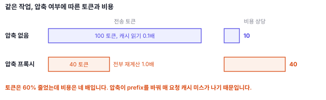

[전편](/blog/claude-code-prompt-caching/)에서 Claude Code의 프롬프트 캐싱 구조를 정리했습니다. 이 글은 그 구조 위에서, 토큰 절감을 표방하는 서드파티 도구를 고르는 판별 기준을 다룹니다.

전제 세 가지만 되짚습니다.

- Claude Code는 매 요청마다 그때까지 쌓인 컨텍스트를 전부 다시 전송합니다.
- 서버는 요청의 앞부분(prefix)이 직전 요청과 정확히 일치하면 재계산을 생략하고, 캐시에서 읽은 토큰은 표준 입력가의 약 10%로 청구됩니다.
- prefix가 한 바이트라도 달라지면 그 뒤 전부를 다시 계산합니다. 캐시 미스 한 번은 캐시 적중 열 번에 해당합니다.

> 2026년 7월 기준입니다. Claude Code와 각 도구는 자주 업데이트됩니다. 이 글과 현재 공식 문서가 다르면 공식 문서 쪽이 맞습니다.

토큰 절감을 표방하는 오픈소스 도구가 여럿 있습니다. 효과가 있는 것도 있고, 캐시를 무효화해 손해인 것도 있습니다. 아래는 도구 순위가 아니라 판별 기준입니다. 마지막 열은 그 도구가 prefix를 바꿔 이미 만들어진 캐시를 못 쓰게 만들 위험입니다. 등급의 근거는 동작 위치입니다. 대화 끝에 덧붙기만 하면 낮음, 요청에 아예 손대지 않으면 없음, 이미 들어간 기록이나 시스템 프롬프트 쪽을 바꾸면 높음입니다.

> 언급하는 도구는 Anthropic 공식이 아닙니다. 각 프로젝트가 주장하는 절감 수치를 이 글에서 검증하지 않았습니다. 생태계가 빠르게 바뀌므로 설치 전에 저장소의 최근 커밋과 이슈를 확인하는 편이 낫습니다.

| 분류 | 예 | 동작 위치 | 캐시를 깨뜨릴 위험 |
| --- | --- | --- | --- |
| 훅 기반 출력 압축 | RTK, context-mode | 툴 출력이 컨텍스트에 들어가기 전 | 낮음 |
| 출력 억제 스킬 | Caveman | 스킬 지시문 주입 | 낮음 |
| 사용량 모니터링 | ccusage, ccstatusline | 로컬 JSONL 읽기 | 없음 |
| 모델 라우팅 | Claude Code Router | 요청을 다른 모델로 전달 | 중간 |
| API 프록시 압축 | Headroom, ClaudeSlim, pxpipe | 요청 body 재작성 | 높음 |
| MCP 지식그래프, 메모리 | Codebase Memory MCP 계열 | 시스템 프롬프트에 툴 추가 | 높음 |

## 압축으로 얻은 이득이 캐시 미스로 상쇄됨

전제에서 본 대로 읽기는 0.1배, 미스는 1.0배입니다. 프록시가 대화 기록을 매 요청 다시 압축한다고 가정합니다. 압축 결과가 조금이라도 달라지면 prefix가 매번 바뀝니다. 캐시는 전부 미스합니다.

토큰을 60% 줄이고도 비용이 네 배가 됩니다. 토큰 절감은 사실일 수 있지만 비용 절감은 아닙니다.

기준은 무엇을 압축하는가입니다. 새로 들어올 툴 출력을 압축하는 것은 안전합니다. `git status` 출력을 컨텍스트에 들어가기 전에 줄이면, 그것은 짧은 툴 결과가 뒤에 덧붙은 것입니다. 파일 내용은 Claude가 읽을 때만 컨텍스트에 들어오고 읽기는 뒤에 덧붙는다는 원칙 그대로입니다. 과거를 변경하지 않으므로 prefix가 유지됩니다. RTK 같은 훅 기반 도구가 안전한 이유입니다.

반대로 이미 대화에 들어간 내용을 사후 압축하는 것은 정의상 prefix 변경입니다. 정확히 일치해야 하는 매칭에서 prefix가 바뀌면 그 뒤가 전부 재계산됩니다.

이 문제를 인지하고 설계한 프록시도 있습니다. pxpipe는 static prefix를 보존해 프롬프트 캐싱이 계속 동작하는 cache-friendly splice를 설계 목표로 명시합니다. 뒤집으면, README에 캐시에 대한 언급이 없는 압축 도구는 이 문제를 고려하지 않았을 가능성이 있습니다.

## 게이트웨이를 경유하면 캐싱 여부는 게이트웨이에 달림

캐싱 문서는 커스텀 `ANTHROPIC_BASE_URL`이나 LLM 게이트웨이를 쓰면 캐시가 요청이 전달되는 곳에 저장되며, 캐싱이 동작하는지 여부는 그 게이트웨이에 달려 있다고 명시합니다. 프록시를 경유하는 순간 캐싱 여부는 Anthropic의 보장이 아니라 그 프록시 구현의 문제가 됩니다.

## JSON 키 순서로 캐시가 무효화됨

프록시는 요청 body를 읽어 다시 JSON으로 조립합니다. API 문서의 캐시 디버깅 가이드에는 `tool_use` content block의 키 순서가 안정적인지 확인하라는 항목이 있습니다. 일부 언어는 JSON 변환 시 키 순서를 무작위화하며, 그것만으로 캐시가 무효화됩니다. 내용이 동일해도 바이트가 다르면 prefix가 일치하지 않아 전액 재계산됩니다. 압축을 하지 않았는데도 비용이 열 배가 될 수 있습니다.

같은 문서는 프롬프트 어디든 이미지의 유무가 바뀌거나 `tool_choice`가 바뀌면 메시지 계층의 캐시가 무효화된다고도 설명합니다. 세션이 길수록 캐시의 대부분이 메시지이므로 타격은 큽니다. 텍스트를 이미지로 변환해 전송하는 도구는 이 지점을 확인해야 합니다.

## 모델 라우팅은 캐시를 모델 수만큼 분할함

모델 라우팅은 요청을 조건에 따라 다른 모델로 자동으로 보내는 것입니다. Claude Code에 내장된 `opusplan`(plan mode는 Opus, 실행은 Sonnet)도 같은 원리인데, 전환이 plan 토글 때만 일어납니다. Claude Code Router 같은 서드파티 도구는 작업 종류를 조건으로 단순 작업을 더 가벼운 모델이나 타사 모델로 전달하고, 설정에 따라 요청 단위로도 갈라집니다. 비싼 모델의 비중을 낮추는 방향 자체는 타당합니다. 다만 캐시는 모델별로 따로 만들어지므로 라우팅이 잦으면 모델 수만큼 캐시를 각각 만들어야 합니다. 요청마다 모델이 바뀌는 설정에서는 캐싱의 효과가 거의 없습니다. 작업 단위로 라우팅해야 이득이 남습니다.

## MCP 문제를 MCP로 해결하면 부담이 늘어남

절감 도구들이 자주 내세우는 지적은 MCP 서버의 툴 정의가 컨텍스트를 크게 차지한다는 것입니다. 방향은 타당합니다. 툴 정의는 시스템 프롬프트 계층이므로 매 요청 prefix에 포함됩니다.

그런데 그 해결책으로 또 다른 MCP 서버를 설치하라는 도구가 있습니다. 코드베이스를 지식그래프로 인덱싱하는 codebase-memory-mcp는 99% 토큰 절감을, 시맨틱 코드 검색 서버인 claude-context는 약 40% 절감을 내겁니다. 둘 다 각 프로젝트가 주장하는 수치입니다. 어느 쪽이든 설치하면 그 서버의 툴 정의가 매 요청 prefix에 포함됩니다. 그리고 그 서버가 재연결되면 캐시가 무효화됩니다. 절감액이 이 두 부담을 넘어야 순이득입니다. 수십 개의 툴을 추가하는 도구는 특히 무겁습니다.

## 절감 수치는 검증하기 어려움

서드파티가 토큰을 정확히 셀 방법이 없습니다. Claude 토크나이저는 공개되지 않았습니다. 많은 도구가 tiktoken으로 추정하는데 그것은 OpenAI의 토크나이저입니다. Anthropic이 배포한 스킬 문서는 tiktoken이 일반 텍스트에서 Claude 토큰을 15~20% 과소 계산하며, 코드나 비영어 입력에서는 그보다 더 크게 틀린다고 설명합니다. 한국어 프로젝트라면 이 오차가 커집니다.

공식 token counting 문서에 따르면 Claude Opus 4.7부터의 새 모델들은 새 토크나이저를 사용합니다. 같은 텍스트가 이전 모델 대비 약 30% 더 많은 토큰이 되고, 정확한 증가폭은 콘텐츠에 따라 다릅니다. 그 이전에 측정된 벤치마크는 그대로 적용되지 않습니다. 확인 가능한 것은 API 응답의 `usage` 필드와, 과금되지 않는 `count_tokens` 엔드포인트입니다.

## 지운 정보는 다시 읽게 됨

서드파티 도구로 압축하며 제거된 정보가 필요해지면 Claude가 다시 읽게 됩니다. 그러면 압축된 출력에 더해 다시 읽은 원본, 왕복 레이턴시, 그 사이의 추론 토큰이 추가됩니다. 압축하지 않은 것보다 비싸집니다. 지원 문서가 계획 세우기에 대해 말하는 것과 같은 구조입니다. 플랜은 몇백 토큰입니다. 그러나 되돌리고 다시 만드는 잘못된 400줄 diff는 수천 토큰을 두 번 쓰고, 무엇이 잘못됐는지 설명하는 요청이 더해집니다.

## 도구의 효과는 설치 전후 측정으로 판별함

어떤 절감 도구가 실제로 도움이 되는지, 오히려 캐시를 깨고 있는지는 두 카운터로 확인할 수 있습니다. API가 응답마다 보고하는 `cache_read_input_tokens`(캐시에서 읽은 토큰)와 `cache_creation_input_tokens`(캐시에 새로 쓴 토큰)이고, 같은 값이 로컬 대화 JSONL에도 기록됩니다.

1. 도구 설치 전에 기준값을 측정한다. cache creation과 cache read를 분리해서 본다
2. 도구를 설치한다
3. 같은 종류의 작업을 같은 길이만큼 수행한다
4. 두 카운트의 비율을 비교한다

읽기 대 쓰기 비율이 높으면 캐싱이 유효한 상태이고, 쓰기가 계속 높으면 prefix가 바뀌고 있는 것입니다. 도구를 설치하기 전에 그랬다면 사용 습관의 문제입니다. 설치한 후에 그렇다면 원인은 그 도구입니다.

기준값 없이 설치하면 도구의 효과와 복잡도 증가를 구분할 방법이 없습니다.

## 서드파티 설치 전에 공식 기능부터 확인해야 함

서드파티 도구를 설치하기 전에 이미 제공되는 것이 있습니다. 이쪽은 캐시와 충돌하지 않도록 설계되어 있습니다.

| 목적 | 공식 기능 | 동작 |
| --- | --- | --- |
| MCP 툴 정의 줄이기 | MCP tool search | 툴 정의 전체 대신 최소한의 정의(스텁)만 prefix에 포함하고, 필요할 때 검색해 로드한다 |
| 무거운 탐색을 컨텍스트 밖으로 | 서브에이전트 | 별도 컨텍스트에서 파일을 읽고 요약만 반환한다. 부모의 prefix가 유지된다 |
| 파일 전체를 읽지 않고 조회 | LSP(code intelligence 플러그인) | 정의, 참조, 타입만 조회하고 편집 직후 진단을 받는다. 툴 출력이 작아진다 |
| 진행 방향 되돌리기 | `/rewind` | 이미 캐시된 예전 prefix로 돌아간다. `/compact`처럼 새 prefix를 만들지 않는다 |
| 모델 비용 낮추기 | `/model`, `opusplan` | 작업 단위로 저렴한 모델을 쓴다. 전환 자체는 무효화이므로 잦은 토글은 피한다 |
| 큰 로그 다루기 | 경로 참조 | 파일을 디스크에 두면 Claude가 필요한 부분만 읽는다. 붙여넣으면 전체가 매 요청 다시 전송된다 |
| 컨텍스트 리셋 | `/clear` | 대화를 비워 다음 요청부터 크기를 줄인다. 캐시는 버리지만 대개 이득이다 |

이것들을 사용하고도 부족할 때, 위험이 낮은 분류부터 하나씩 추가하며 매번 측정하는 순서가 안전합니다.

## 정리

- 판별 기준은 무엇을 압축하는가입니다. 컨텍스트에 새로 들어올 툴 출력을 줄이는 것은 prefix를 유지하고, 이미 들어간 기록을 재작성하는 것은 prefix를 바꿉니다.
- 도구의 효과는 설치 전후의 `cache_read_input_tokens` 대 `cache_creation_input_tokens` 비율로 판별합니다. 설치 후 쓰기가 늘었다면 그 도구가 prefix를 바꾸고 있는 것입니다.
- 서드파티를 설치하기 전에 공식 기능(tool search, 서브에이전트, `/rewind`, `/clear`, 경로 참조)부터 확인해야 합니다.

## 참고 문헌

- [How Claude Code uses prompt caching](https://code.claude.com/docs/en/prompt-caching): 게이트웨이 경유 시 캐싱 여부가 게이트웨이에 달려 있다는 서술. cache read가 표준 입력가의 약 10%라는 수치.
- [Prompt caching (API 레퍼런스)](https://platform.claude.com/docs/en/build-with-claude/prompt-caching): `tool_use` content block의 키 순서 불안정이 캐시를 무효화한다는 디버깅 항목. 이미지 유무 변화와 `tool_choice` 변경이 메시지 계층의 캐시를 무효화한다는 설명.
- [Token counting](https://platform.claude.com/docs/en/build-with-claude/token-counting): `count_tokens` 엔드포인트가 과금되지 않으며 값을 추정치로 봐야 한다는 점. Claude Opus 4.7 이후 모델의 토크나이저가 같은 텍스트를 약 30% 더 많은 토큰으로 만든다는 서술.
- [anthropics/skills, token counting](https://github.com/anthropics/skills/blob/main/skills/claude-api/shared/token-counting.md): tiktoken이 Claude 토큰을 15~20% 과소 계산하며 코드와 비영어에서 더 크게 틀린다는 설명.
- [Models, usage, and limits in Claude Code](https://support.claude.com/en/articles/14552983-models-usage-and-limits-in-claude-code): 계획과 재작업의 비용 비교.
