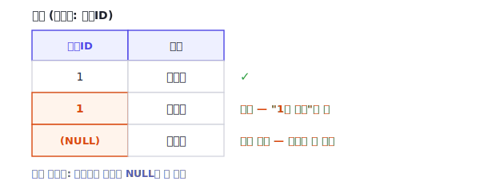
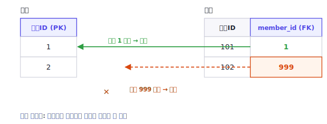
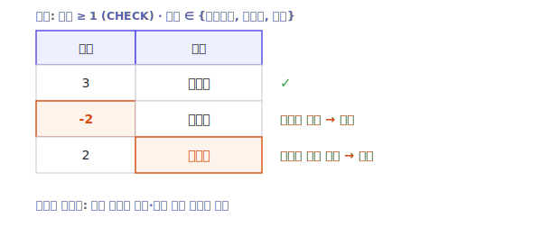
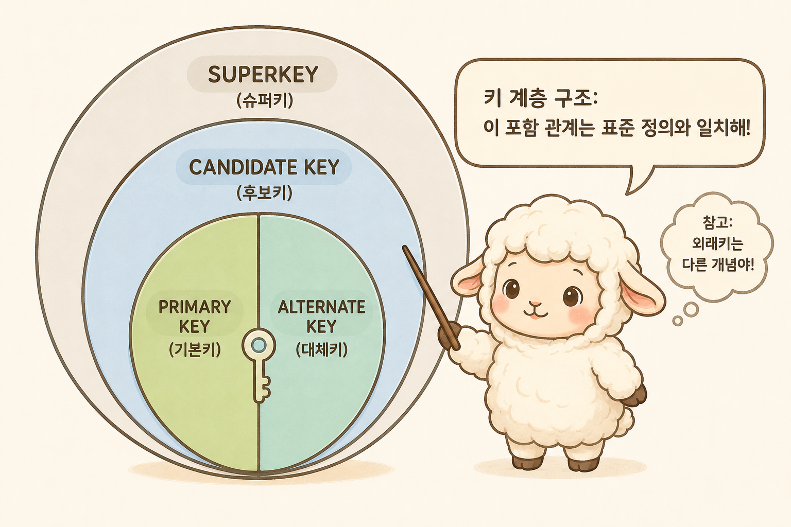

정규화(Normalization)는 데이터베이스 설계에서 자주 언급됩니다. 하지만 "왜 하는가"를 따라가다 보면, 그 아래에 깔린 더 기본적인 개념들과 마주치게 됩니다. 바로 **데이터 무결성**과 **키(key)**, 두 가지입니다. 정규화는 결국 이상현상을 막아 데이터 무결성을 지키기 위한 작업입니다. 이상현상(anomaly)이란 데이터를 추가·수정·삭제할 때 의도하지 않은 문제가 생기는 현상을 말합니다. 자세한 내용은 2편에서 다룹니다. 이 이상현상은 결국 **무엇이 무엇을 식별하는지**가 뒤섞여, 한 테이블에 여러 사실이 함께 저장되고 그 값이 중복될 때 생깁니다. 어떤 속성이 키이고 어떤 속성이 그 키에 딸린 정보인지가 분명해야 비로소 중복을 가려내고 테이블을 바르게 나눌 수 있습니다. 그래서 정규화의 출발점은 결국 키를 정의하는 일입니다.

이 글은 정규화 시리즈의 첫 편으로, 정규형 이론에 들어가기 전에 토대가 되는 두 개념을 정리합니다.

- 데이터 무결성이란 무엇이고 어떤 종류가 있는가
- 키에는 어떤 계층이 있고, 키가 어떻게 제약조건으로 동작하는가

> **시리즈 구성**
> 1. **데이터 무결성과 키** (이번 글)
> 2. [이상현상과 함수적 종속성](/blog/db-normalization-2-anomalies/)
> 3. [제1정규형 (1NF)](/blog/db-normalization-3-1nf/)
> 4. [제2정규형 (2NF)](/blog/db-normalization-4-2nf/)
> 5. [제3정규형 (3NF)](/blog/db-normalization-5-3nf/)
> 6. [보이스-코드 정규형 (BCNF)](/blog/db-normalization-6-bcnf/)
> 7. 자연키와 대리키 — 키 설계
> 8. 제4·제5정규형 개요와 그 너머
> 9. 정규화 절차와 역정규화

## 데이터 무결성이란

**데이터 무결성(data integrity)** 은 데이터베이스에 저장된 데이터가 정확하고 일관된 상태를 유지하는 성질을 말합니다. 예를 들어 존재하지 않는 회원이 주문의 주인으로 기록되어 있거나, 같은 회원의 이메일이 테이블마다 다르게 저장되어 있다면 무결성이 깨진 상태입니다.

무결성은 보통 다음 몇 가지로 구분합니다.

### 개체 무결성 (Entity Integrity)

각 행(row)을 유일하게 식별할 수 있어야 한다는 규칙입니다. 이를 위해 테이블에는 기본키(Primary Key)가 있고, 기본키는 **중복될 수 없고 `NULL`일 수 없습니다.** 식별자가 비어 있거나 겹치면 특정 행을 가리킬 수 없게 되기 때문입니다.

예를 들어 회원 테이블의 기본키가 `회원ID`라고 합시다. 두 회원이 똑같이 `회원ID = 1`을 가지면, "1번 회원"이라고 했을 때 누구를 가리키는지 알 수 없습니다. 또 어떤 회원의 `회원ID`가 비어 있으면(`NULL`), 그 행은 가리킬 방법 자체가 없습니다. 그래서 기본키에는 중복과 `NULL`을 허용하지 않습니다.



### 참조 무결성 (Referential Integrity)

한 테이블이 다른 테이블을 참조할 때, 참조 대상이 실제로 존재해야 한다는 규칙입니다. 외래키(Foreign Key)로 표현하며, 예를 들어 주문 테이블의 `member_id`가 `NULL`이 아니라면 회원 테이블에 존재하는 값을 가지도록 강제합니다. (외래키 컬럼이 nullable이면 `NULL`은 허용되며, 이는 "참조 대상이 아직 없음"을 뜻합니다.) 이 제약이 있으면 "존재하지 않는 회원을 가리키는 주문"과 같은 상태를 데이터베이스가 차단합니다.



### 도메인 무결성 (Domain Integrity)

각 컬럼의 값이 정의된 범위와 형식을 따라야 한다는 규칙입니다. 데이터 타입, `NOT NULL`, `CHECK` 제약 등으로 강제합니다. 예를 들어 주문 수량은 음수가 될 수 없고(`CHECK`), 상태 컬럼은 정해진 값 중 하나여야 합니다. (참고로 `DEFAULT`는 값이 생략됐을 때 기본값을 채워줄 뿐, 허용 범위를 제한하지는 않으므로 무결성을 강제하는 제약과는 구분됩니다.)



이 외에 업무 규칙에서 비롯된 제약을 **사용자 정의 무결성(user-defined integrity)** 으로 따로 부르기도 합니다.

여기서 한 가지 짚어둘 점은, 무결성을 **애플리케이션 코드에만 의존해 지키는 것과 데이터베이스 제약조건으로 강제하는 것은 다르다**는 것입니다. 코드 검증은 우회되거나 누락될 수 있지만, 데이터베이스 제약조건은 어떤 경로로 들어오는 데이터든 동일하게 적용됩니다. **키 설계와 데이터베이스 제약조건이 무결성을 강제하는 토대**라면, 뒤에서 다룰 **정규화는 데이터 중복을 줄여 무결성이 훼손될 가능성 자체를 낮추는 설계 과정**입니다. 둘은 역할이 다르며 서로를 보완합니다.

## 키의 계층

키(key)는 행을 식별하기 위한 속성 또는 속성의 조합입니다. 종류가 여러 가지라 혼동하기 쉬운데, 두 개의 다른 관점으로 나누어 보면 명확해집니다.

먼저 **유일성과 선택**의 관점입니다. 이것이 흔히 말하는 키의 계층입니다.



슈퍼키 안에 후보키가, 후보키 안에 기본키와 대체키가 들어갑니다. 즉 모든 후보키는 슈퍼키이며, 후보키는 기본키 하나와 나머지 대체키로 나뉩니다.

### 슈퍼키 (Super Key)

행을 유일하게 식별할 수 있는 속성의 조합입니다. 불필요한 속성이 포함되어 있어도 유일성만 만족하면 슈퍼키입니다. 예를 들어 `{회원ID}`로 회원을 식별할 수 있다면, `{회원ID, 이름}`도 (불필요한 `이름`이 붙었지만) 여전히 슈퍼키입니다.

### 후보키 (Candidate Key)

슈퍼키 중에서 **최소한의 조합**을 후보키라고 합니다. 속성을 하나라도 빼면 유일성이 깨지는, 더 줄일 수 없는 상태입니다. 위 예에서 `{회원ID, 이름}`은 `이름`을 빼도 식별이 되므로 후보키가 아니고, `{회원ID}`가 후보키입니다.

### 기본키와 대체키

한 테이블에 후보키가 여러 개일 수 있습니다. 예를 들어 회원 테이블에서 `회원ID`와 `이메일`이 각각 유일하다면 둘 다 후보키입니다. 이 중 대표로 하나를 선택해 **기본키(Primary Key)** 로 삼고, 선택되지 않은 나머지 후보키를 **대체키(Alternate Key)** 라고 합니다. 대체키도 유일성을 가지므로 보통 유일 제약(UK)으로 보호합니다.

### 또 다른 관점 — 자연키와 대리키

자연키와 대리키는 위의 계층과는 **다른 축**입니다. 키가 어디에서 오는지, 즉 **생성 근거**를 구분하는 관점입니다.

- **자연키(Natural Key)** 는 비즈니스적으로 의미가 있는 키입니다. 예를 들어 수강신청을 `{학번, 과목코드}`로 식별하는 경우, 이 조합은 "어떤 학생이 어떤 과목을 신청했다"는 업무 의미를 그대로 담고 있습니다.
- **대리키(Surrogate Key)** 는 비즈니스 의미 없이 시스템이 자동으로 부여하는 키입니다. auto-increment `id`나 UUID가 대표적입니다.

두 관점은 직교합니다. 예를 들어 자연키를 기본키로 선택할 수도 있고, 대리키를 기본키로 두면서 자연키는 대체키(유일 제약)로 보호할 수도 있습니다.

많은 프로젝트가 대리키(`id`)를 기본키로 사용합니다. 조인과 참조가 단순해지고, 자연키가 바뀌어도 참조가 깨지지 않는다는 장점이 있기 때문입니다. 다만 대리키를 기본키로 쓰더라도 **자연키에 해당하는 조합은 별도로 유일 제약(UK)으로 보호하는 것이 안전합니다.** 그렇지 않으면 같은 학생이 같은 과목을 두 번 신청한, 의미상 중복인 행이 서로 다른 `id`를 가진 채 함께 저장될 수 있습니다.

자연키와 대리키의 선택은 그 자체로 긴 논의가 필요한 주제라, 다음 편 이후에서 다시 다룹니다. 이번 글에서는 "기본키로 무엇을 쓰든, 자연키가 무엇인지는 별도로 파악해 두어야 한다"는 점만 기억하면 충분합니다.

## 키와 무결성 제약조건

데이터베이스는 다음과 같은 제약조건으로 무결성을 강제합니다. 이 가운데 `PRIMARY KEY`·`UNIQUE`·`FOREIGN KEY`는 앞서 본 키 개념을 직접 구현하는 제약이고, `NOT NULL`·`CHECK`는 키와는 별개로 도메인 무결성을 담당하는 제약입니다.

| 제약조건 | 역할 | 관련 무결성 |
|----------|------|------------|
| `PRIMARY KEY` | 행을 유일하게 식별 (중복·`NULL` 불가) | 개체 무결성 (기본키) |
| `UNIQUE` | 특정 컬럼 조합의 값이 유일하도록 강제 | 대체키·자연키 보호 |
| `FOREIGN KEY` | 참조 대상이 실제로 존재하도록 강제 | 참조 무결성 |
| `NOT NULL` | 값이 비어 있지 않도록 강제 | 도메인 무결성 |
| `CHECK` | 값이 정의된 조건을 만족하도록 강제 | 도메인 무결성 |

### MariaDB로 보는 예시

이 제약조건들은 테이블을 만들 때 DDL로 선언합니다. 앞에서 다룬 회원·주문 테이블을 MariaDB 기준으로 작성하면 다음과 같습니다.

```sql
-- 회원: 개체 무결성(PK) + 자연키(이메일) 보호(UNIQUE)
CREATE TABLE member (
  id     BIGINT       NOT NULL AUTO_INCREMENT,  -- 대리키
  email  VARCHAR(255) NOT NULL,
  name   VARCHAR(50)  NOT NULL,
  PRIMARY KEY (id),                             -- 중복·NULL 불가
  UNIQUE KEY uq_member_email (email)            -- 자연키를 유일 제약으로 보호
) ENGINE=InnoDB;

-- 주문: 참조 무결성(FK) + 도메인 무결성(NOT NULL·CHECK)
CREATE TABLE orders (
  id         BIGINT      NOT NULL AUTO_INCREMENT,
  member_id  BIGINT      NOT NULL,
  quantity   INT         NOT NULL,
  status     VARCHAR(20) NOT NULL DEFAULT '결제대기',
  PRIMARY KEY (id),
  CONSTRAINT fk_orders_member
    FOREIGN KEY (member_id) REFERENCES member (id),  -- 존재하는 회원만 참조
  CONSTRAINT chk_orders_qty    CHECK (quantity >= 1),
  CONSTRAINT chk_orders_status CHECK (status IN ('결제대기', '배송중', '완료'))
) ENGINE=InnoDB;
```

각 제약이 앞의 무결성과 그대로 대응합니다. `PRIMARY KEY`가 개체 무결성을, `FOREIGN KEY ... REFERENCES`가 참조 무결성을, `NOT NULL`과 `CHECK`가 도메인 무결성을 맡습니다. `UNIQUE`는 대리키를 기본키로 쓰면서 자연키인 이메일의 중복을 막습니다.

MariaDB에서 몇 가지 짚어둘 점이 있습니다.

- 외래키 제약은 `InnoDB` 같은 스토리지 엔진에서 동작합니다. `MyISAM`은 외래키 구문을 받아들이되 강제하지 않습니다.
- `CHECK` 제약은 MariaDB 10.2.1부터 실제로 검사됩니다. 그 이전 버전은 구문만 허용하고 검사하지 않았습니다.
- 외래키에는 `ON DELETE`·`ON UPDATE` 옵션으로 참조 대상이 삭제·변경될 때의 동작(`RESTRICT`, `CASCADE`, `SET NULL` 등)을 지정할 수 있습니다.

정리하면, **키를 정의한다는 것은 곧 어떤 식별·참조 무결성을 데이터베이스에 맡길지 결정하는 일**이고, 여기에 도메인 제약(`NOT NULL`·`CHECK`)이 더해져 데이터의 정확성을 받칩니다. 정규화는 이 키와 함수적 종속성을 근거로 테이블 구조를 점검하는 과정이므로, 키 개념이 분명해야 정규화도 흔들리지 않습니다.

> **참고:** `UNIQUE` 제약과 `NULL`의 동작은 데이터베이스마다 다릅니다. 예를 들어 MySQL·MariaDB는 유일 인덱스에서 여러 개의 `NULL`을 허용합니다. 자연키 컬럼이 `NULL`을 가질 수 있는 설계라면, 유일 제약만으로는 중복이 완전히 막히지 않을 수 있어 주의가 필요합니다. 이 부분은 시리즈 후반의 정규화 절차 편에서 다시 다룹니다.

## 정리

- **데이터 무결성**은 데이터가 정확하고 일관된 상태를 유지하는 성질이며, 개체·참조·도메인 무결성 등으로 구분된다
- 무결성은 애플리케이션 코드뿐 아니라 **데이터베이스 제약조건으로 강제**할 때 더 견고하다
- **키의 계층**은 슈퍼키 ⊃ 후보키이며, 후보키 중 선택된 것이 기본키, 나머지가 대체키다
- **자연키·대리키**는 이 계층과 다른 축으로, 키의 생성 근거(비즈니스 의미 유무)를 구분한다
- 기본키로 대리키를 쓰더라도, **자연키에 해당하는 조합은 별도로 유일 제약으로 보호**하는 것이 안전하다
- 키를 정의하는 일은 곧 어떤 식별·참조 무결성을 데이터베이스에 맡길지 정하는 일이며, 정규화의 토대가 된다

다음 편에서는 이 토대 위에서 **[이상현상(anomaly)과 함수적 종속성](/blog/db-normalization-2-anomalies/)** 을 다루며, 정규화가 구체적으로 어떤 문제를 해결하는지 살펴보겠습니다.

## 참고 문헌

- J.D. Ullman, *Database Systems* 강의자료(Stanford) — 키의 정의(유일 식별 + 최소성).
- Oracle, *Database Concepts — Data Integrity* — 기본키와 유일 제약의 차이.
- *Surrogate key* (Wikipedia) — 대리키가 자연키를 대체할 때 자연키를 유일 제약으로 보존해야 하는 이유.
- [MariaDB Documentation — CHECK Constraint](https://mariadb.com/kb/en/constraint/#check-constraint) — MariaDB 10.2.1부터 `CHECK` 제약이 적용된다는 점.
- [MariaDB Documentation — Foreign Keys](https://mariadb.com/kb/en/foreign-keys/) — 외래키가 InnoDB에서 동작하는 방식과 `ON DELETE`·`ON UPDATE` 옵션.
