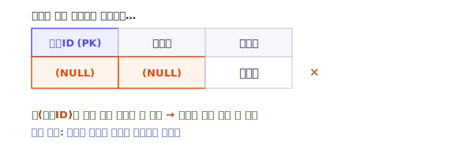
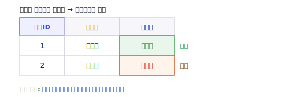
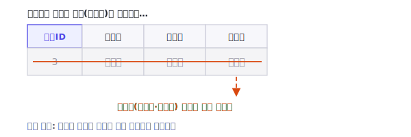

[1편](/blog/db-normalization-1-integrity-and-keys/)에서는 정규화의 토대가 되는 데이터 무결성과 키를 정리했습니다. 이번 편에서는 한 걸음 더 들어가, **정규화가 구체적으로 어떤 문제를 해결하는지**를 봅니다. 그 문제가 바로 **이상현상(anomaly)** 이고, 그 뿌리에는 **함수적 종속성(functional dependency)** 이 있습니다. 더 정확히 말하면, 함수적 종속성 자체가 문제는 아닙니다. 서로 다른 함수적 종속성이 한 테이블에 섞여 저장되면서 같은 데이터가 중복되는 구조가 이상현상을 만듭니다.

> **시리즈 구성**
> 1. [데이터 무결성과 키](/blog/db-normalization-1-integrity-and-keys/)
> 2. **이상현상과 함수적 종속성** (이번 글)
> 3. [제1정규형 (1NF)](/blog/db-normalization-3-1nf/)
> 4. [제2정규형 (2NF)](/blog/db-normalization-4-2nf/)
> 5. [제3정규형 (3NF)](/blog/db-normalization-5-3nf/)
> 6. [보이스-코드 정규형 (BCNF)](/blog/db-normalization-6-bcnf/)
> 7. 자연키와 대리키 — 키 설계
> 8. 제4·제5정규형 개요와 그 너머
> 9. 정규화 절차와 역정규화

## 한 테이블에 다 몰아넣으면

직원과 그 직원이 속한 부서 정보를 하나의 테이블에 함께 저장했다고 해봅시다.

| 직원ID | 직원명 | 부서ID | 부서명 | 부서장 |
|--------|--------|--------|--------|--------|
| 1 | 김민준 | 10 | 영업부 | 박부장 |
| 2 | 이서연 | 10 | 영업부 | 박부장 |
| 3 | 박지호 | 20 | 개발부 | 정부장 |

문제없어 보이지만, 이 구조에는 **부서 정보(부서명, 부서장)가 직원 수만큼 중복**되어 있습니다. 영업부에 직원이 100명이면 "영업부 / 박부장"이 100번 반복됩니다. 이 중복이 다음과 같은 이상현상을 만듭니다. 아래에서 이 표를 그대로 가지고 세 가지 이상현상을 하나씩 보겠습니다.

## 세 가지 이상현상

정규화 이론을 정립한 E.F. Codd는 1971년 논문 *Further Normalization of the Data Base Relational Model*(IBM Research Report RJ909)에서, 더 높은 정규형으로 나아가는 첫 번째 목적을 다음과 같이 밝혔습니다.

> "To free the collection of relations from undesirable insertion, update and deletion dependencies."
> (관계들의 집합을 바람직하지 않은 삽입·갱신·삭제 종속성으로부터 자유롭게 하는 것)
>
> — E.F. Codd, 1971

여기서 말하는 "바람직하지 않은 삽입·갱신·삭제 종속성"이, 오늘날 교재에서 **삽입 이상·삭제 이상·수정(갱신) 이상**으로 분류하는 이상현상입니다. 하나씩 보겠습니다.

### 삽입 이상 (Insertion Anomaly)

새로 만들어진, 아직 직원이 한 명도 없는 인사부(부서ID 30, 부서장 한부장)를 등록하려고 합니다. 그런데 위 테이블은 행의 식별이 직원을 중심으로 이루어지므로, **직원 없이는 부서만 따로 삽입할 수 없습니다.** 존재하지도 않는 가짜 직원을 넣거나, 직원 관련 컬럼을 `NULL`로 비워야 하는 상황이 됩니다.

| 직원ID | 직원명 | 부서ID | 부서명 | 부서장 |
|--------|--------|--------|--------|--------|
| 1 | 김민준 | 10 | 영업부 | 박부장 |
| 2 | 이서연 | 10 | 영업부 | 박부장 |
| 3 | 박지호 | 20 | 개발부 | 정부장 |
| `NULL` | `NULL` | 30 | 인사부 | 한부장 |

마지막 행처럼, 부서 하나를 넣자고 직원 컬럼을 비워야 합니다. 직원ID는 행을 식별하는 키인데 그 값이 비어 버리는 셈입니다. 이렇게 원하지 않는 데이터까지 끼워 넣어야만 삽입이 가능한 현상이 삽입 이상입니다.

### 갱신(수정) 이상 (Update / Modification Anomaly)

영업부의 부서장이 박부장에서 최부장으로 교체되었습니다. 그러면 **영업부에 속한 모든 직원 행의 '부서장' 값을 빠짐없이 바꿔야** 합니다. 그런데 1번 행만 고치고 2번 행을 놓치면 아래처럼 됩니다.

| 직원ID | 직원명 | 부서ID | 부서명 | 부서장 |
|--------|--------|--------|--------|--------|
| 1 | 김민준 | 10 | 영업부 | 최부장 |
| 2 | 이서연 | 10 | 영업부 | 박부장 |
| 3 | 박지호 | 20 | 개발부 | 정부장 |

같은 영업부(부서ID 10)인데 부서장이 최부장과 박부장으로 갈리는 모순된 상태입니다. 직원이 100명이면 100개 행을 하나도 빠짐없이 고쳐야 하고, 하나라도 놓치면 이런 모순이 생깁니다. Codd는 같은 논문에서 이 현상을 공급자-도시 예시로 설명하며, "공급자가 근거지를 옮기면 둘 이상의 튜플을 갱신해야 하고, 갱신할 튜플 수는 시간에 따라 변한다"고 지적했습니다.

### 삭제 이상 (Deletion Anomaly)

개발부에는 직원이 박지호(직원ID 3) 한 명뿐입니다. 그 직원이 퇴사하여 3번 행을 삭제한다고 해봅시다.

| 직원ID | 직원명 | 부서ID | 부서명 | 부서장 |
|--------|--------|--------|--------|--------|
| 1 | 김민준 | 10 | 영업부 | 박부장 |
| 2 | 이서연 | 10 | 영업부 | 박부장 |
| ~~3~~ | ~~박지호~~ | ~~20~~ | ~~개발부~~ | ~~정부장~~ |

직원 정보만 지우려던 것인데, **개발부의 존재 자체(부서명 개발부, 부서장 정부장)도 함께 사라집니다.** 이제 어디에도 개발부 20이라는 부서가 있었다는 사실이 남지 않습니다. 의도하지 않은 정보까지 소실되는 이 현상이 삭제 이상입니다. 교재 *Fundamentals of Database Systems*(Elmasri·Navathe)는 이를 "특정 부서의 마지막 직원 튜플을 삭제하면 그 부서 정보가 데이터베이스에서 사라진다"고 설명합니다.

## 근본 원인 — 함수적 종속성

이 예시에서 세 이상현상이 발생하는 원인은, **부서에 관한 함수적 종속성이 직원 테이블에 함께 저장되어 부서 정보가 직원 행마다 반복되기 때문**입니다.

### 함수적 종속성이란

**함수적 종속성(functional dependency, FD)** 은 어떤 속성 A의 값이 정해지면 속성 B의 값도 항상 하나로 정해지는 관계입니다. `A → B`로 표기하고 "B는 A에 함수적으로 종속된다"고 읽습니다. 이때 A를 **결정자(determinant)**, B를 **종속자(dependent)** 라고 부릅니다.

여기서 핵심은, 함수적 종속성이 **지금 저장된 데이터가 아니라 업무 규칙에서 나온다**는 점입니다. 예를 들어 `회원ID → 이름`은 "하나의 회원ID에는 하나의 이름이 대응한다"는 규칙입니다. 반면 지금 우연히 모든 회원의 전화번호가 서로 달라 `전화번호 → 이름`처럼 보이더라도, "전화번호가 같으면 이름도 반드시 같다"는 규칙이 없다면 함수적 종속이 아닙니다. 데이터의 한순간이 아니라, 규칙으로서 항상 성립해야 합니다.

종속자가 결정자에 이미 포함된 `{학번, 이름} → 이름` 같은 종속을 **자명한 함수적 종속(trivial FD)** 이라 하고, 그렇지 않은 의미 있는 종속을 **비자명한 함수적 종속(non-trivial FD)** 이라 합니다. 정규화에서 다루는 것은 비자명한 함수적 종속입니다.

### 한 테이블에 섞인 여러 종속성

위 직원 테이블에는 성격이 다른 함수적 종속성이 한데 섞여 있습니다.

- `직원ID → 직원명, 부서ID` : 직원에 대한 사실
- `부서ID → 부서명, 부서장` : 부서에 대한 사실

여기서 `직원ID → 부서ID`이고 `부서ID → 부서명, 부서장`이므로, 결과적으로 `직원ID → 부서명, 부서장`이 성립합니다. 즉 `부서명`·`부서장`은 키(`직원ID`)에 직접 종속되는 것이 아니라 **`부서ID`를 거쳐** 종속되는 **이행적 함수적 종속(transitive functional dependency)** 입니다. 키가 아닌 속성(`부서ID`)을 거쳐 결정되는 속성이 한 테이블에 함께 있으면, 그 값이 직원 행마다 중복되어 앞서 본 이상현상으로 이어집니다.

> 이 이행적 함수적 종속을 제거할 것을 요구하는 것이 뒤에서 다룰 **제3정규형(3NF)** 입니다. Codd는 같은 1971년 논문에서 이를 형식화했는데, 비주요 속성(어떤 후보키에도 포함되지 않는 일반 속성)이 후보키에 **완전히 종속**될 것을 요구하는 것이 제2정규형(2NF), **이행적으로 종속되지 않을 것**을 요구하는 것이 제3정규형(3NF)입니다. 여기서는 직관만 소개합니다. 후보키가 여러 개이거나 주요 속성(어떤 후보키든 그것을 이루는 속성)이 얽힌 예외, 그리고 단계별 정의는 이어지는 3NF·BCNF 편에서 자세히 다룹니다.

## 정규화 = 종속성을 근거로 테이블을 나누는 일

해결책은 단순합니다. **서로 다른 종속성을 별도의 테이블로 분리**하는 것입니다.

- **직원** 테이블: `직원ID(PK)`, `직원명`, `부서ID(FK)`
- **부서** 테이블: `부서ID(PK)`, `부서명`, `부서장`

이제 부서 정보는 부서 테이블에 **한 행으로만** 존재합니다. 부서장이 바뀌면 한 곳만 고치면 되고(갱신 이상 해소), 직원 없는 부서도 부서 테이블에 독립적으로 넣을 수 있으며(삽입 이상 해소), 마지막 직원이 퇴사해도 부서 정보는 남습니다(삭제 이상 해소). 그리고 1편에서 다룬 것처럼, 직원 테이블의 `부서ID`는 외래키(FK)로 부서 테이블을 참조하여 참조 무결성을 보장합니다.

이것이 정규화의 본질입니다. 정규화는 임의로 테이블을 쪼개는 것이 아니라, **함수적 종속성을 근거로 "어떤 사실이 어디에 속하는지"를 정리해 이상현상을 제거하는 과정**입니다. 다만 분해는 아무렇게나 하면 안 되고, **분해한 테이블들을 다시 조인하면 원래 데이터가 손실 없이 복원되어야**(무손실 조인, lossless join) 합니다. 위 예에서는 분해의 공통 속성인 `부서ID`가 부서 테이블의 키이므로, 두 테이블을 조인하면 원래 데이터가 손실 없이 복원됩니다. 외래키 제약은 여기에 더해, 나뉜 두 테이블이 서로 어긋나지 않도록 참조 무결성을 지켜 줍니다.

## 정규화가 만능은 아니다

다만 정규화가 항상 더 많이 할수록 좋은 것은 아닙니다. 정규화 수준이 높아질수록 테이블이 더 잘게 나뉘고, 그만큼 **조회할 때 필요한 조인이 늘어나 쿼리와 운영 복잡도가 증가**할 수 있습니다. 그래서 교재들도 성능을 위해 의도적으로 정규화 원칙을 완화하는 **역정규화(denormalization)** 가 정당화되는 경우가 있다고 설명합니다.

즉 정규화는 "무조건 끝까지"가 아니라, **이상현상을 제거하는 선까지를 기본으로 하고, 성능 등 분명한 이유가 있을 때 통제된 범위에서 역정규화**하는 균형의 문제입니다. 역정규화는 9편에서 따로 다룹니다.

## 정리

- 한 테이블에 서로 다른 종류의 사실을 몰아넣으면 데이터가 중복되고, 그 중복이 **삽입·갱신·삭제 이상현상**을 만든다
- 이 분류는 Codd가 1971년 논문에서 밝힌 "바람직하지 않은 삽입·갱신·삭제 종속성을 제거한다"는 정규화의 목적과 직접 이어진다
- 이 예시에서 이상현상의 원인은 **키가 아닌 속성을 거쳐 결정되는 종속성(이행적 함수적 종속)** 이 한 테이블에 섞여 있는 것이다
- 정규화는 함수적 종속성을 근거로, **무손실 조인이 가능하도록** 테이블을 분리해 이상현상을 제거하는 작업이다
- 단, 정규화 수준이 높아지면 조인·복잡도가 늘 수 있어, 역정규화는 통제된 범위에서 정당화된다

다음 편부터는 이 직관을 형식화한 **정규형**을 단계별로 정의하고, 각 단계가 어떤 종속성을 제거하는지 살펴봅니다. 먼저 [제1정규형(1NF)](/blog/db-normalization-3-1nf/)부터 시작합니다.

## 참고 문헌

- E.F. Codd, *Further Normalization of the Data Base Relational Model*, IBM Research Report RJ909, 1971. (2NF·3NF 정의, 정규화의 4대 목적)
- R. Elmasri, S.B. Navathe, *Fundamentals of Database Systems*. (이상현상의 삽입·삭제·수정 분류)
