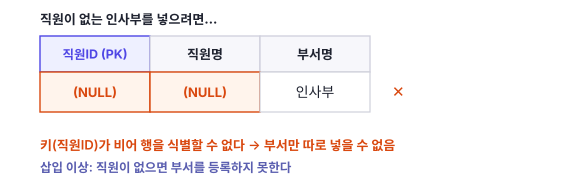
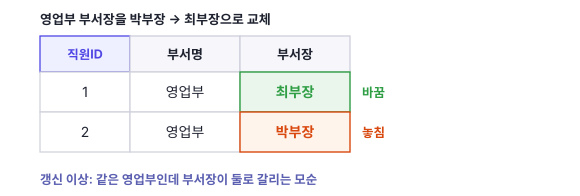
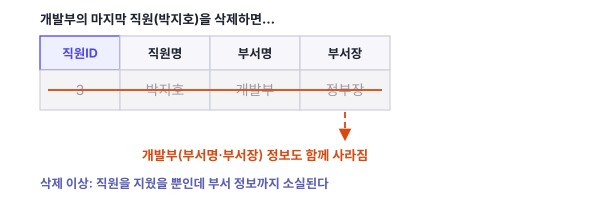

[1편](/blog/db-normalization-1-integrity-and-keys/)에서는 정규화의 토대가 되는 데이터 무결성과 키를 정리했습니다. 이번 편에서는 한 걸음 더 들어가, **정규화가 구체적으로 어떤 문제를 해결하는지**를 봅니다. 그 문제가 바로 **이상현상(anomaly)** 이고, 그 뿌리에는 **함수적 종속성(functional dependency)** 이 있습니다. 더 정확히 말하면, 함수적 종속성 자체가 문제는 아닙니다. 서로 다른 함수적 종속성이 한 테이블에 섞여 저장되면서 같은 데이터가 중복되는 구조가 이상현상을 만듭니다.

> **시리즈 구성**
> 1. [데이터 무결성과 키](/blog/db-normalization-1-integrity-and-keys/)
> 2. **이상현상과 함수적 종속성** (이번 글)
> 3. [제1정규형 (1NF)](/blog/db-normalization-3-1nf/)
> 4. [제2정규형 (2NF)](/blog/db-normalization-4-2nf/)
> 5. [제3정규형 (3NF)](/blog/db-normalization-5-3nf/)
> 6. [보이스-코드 정규형 (BCNF)](/blog/db-normalization-6-bcnf/)
> 7. 자연키와 대리키: 키 설계
> 8. 제4, 제5정규형 개요와 그 너머
> 9. 정규화 절차와 역정규화

## 한 테이블에 다 몰아넣으면

직원과 그 직원이 속한 부서 정보를 하나의 테이블에 함께 저장했다고 해봅시다.

| 직원ID | 직원명 | 부서ID | 부서명 | 부서장 |
|--------|--------|--------|--------|--------|
| 1 | 김민준 | 10 | 영업부 | 박부장 |
| 2 | 이서연 | 10 | 영업부 | 박부장 |
| 3 | 박지호 | 20 | 개발부 | 정부장 |

문제없어 보이지만, 이 구조에는 **부서 정보(부서명, 부서장)가 직원 수만큼 중복**되어 있습니다. 영업부에 직원이 100명이면 "영업부 / 박부장"이 100번 반복됩니다. 이 중복이 다음과 같은 이상현상을 만듭니다. 아래에서 이 표를 그대로 가지고 세 가지 이상현상을 하나씩 보겠습니다.

## 세 가지 이상현상

정규화 이론을 정립한 E.F. Codd는 1971년 논문 *Further Normalization of the Data Base Relational Model*(IBM Research Report RJ909)에서, 더 높은 정규형으로 나아가는 첫 번째 목적을 다음과 같이 밝혔습니다.

> "To free the collection of relations from undesirable insertion, update and deletion dependencies."
> (관계들의 집합을 바람직하지 않은 삽입, 갱신, 삭제 종속성으로부터 자유롭게 하는 것)
>
> (E.F. Codd, 1971)

여기서 말하는 "바람직하지 않은 삽입, 갱신, 삭제 종속성"이, 오늘날 교재에서 **삽입 이상, 삭제 이상, 수정(갱신) 이상**으로 분류하는 이상현상입니다. 하나씩 보겠습니다.

### 삽입 이상 (Insertion Anomaly)

새로 만들어진, 아직 직원이 한 명도 없는 인사부(부서ID 30, 부서장 한부장)를 등록하려고 합니다. 그런데 위 테이블은 행의 식별이 직원을 중심으로 이루어지므로, **직원 없이는 부서만 따로 삽입할 수 없습니다**. 존재하지도 않는 가짜 직원을 넣거나, 직원 관련 컬럼을 `NULL`로 비워야 하는 상황이 됩니다.

| 직원ID | 직원명 | 부서ID | 부서명 | 부서장 |
|--------|--------|--------|--------|--------|
| 1 | 김민준 | 10 | 영업부 | 박부장 |
| 2 | 이서연 | 10 | 영업부 | 박부장 |
| 3 | 박지호 | 20 | 개발부 | 정부장 |
| `NULL` | `NULL` | 30 | 인사부 | 한부장 |



마지막 행처럼, 부서 하나를 넣자고 직원 컬럼을 비워야 합니다. 직원ID는 행을 식별하는 키인데 그 값이 비어 버리는 셈입니다. 이렇게 원하지 않는 데이터까지 끼워 넣어야만 삽입이 가능한 현상이 삽입 이상입니다.

### 갱신(수정) 이상 (Update / Modification Anomaly)

영업부의 부서장이 박부장에서 최부장으로 교체되었습니다. 그러면 **영업부에 속한 모든 직원 행의 '부서장' 값을 빠짐없이 바꿔야** 합니다. 그런데 1번 행만 고치고 2번 행을 놓치면 아래처럼 됩니다.

| 직원ID | 직원명 | 부서ID | 부서명 | 부서장 |
|--------|--------|--------|--------|--------|
| 1 | 김민준 | 10 | 영업부 | 최부장 |
| 2 | 이서연 | 10 | 영업부 | 박부장 |
| 3 | 박지호 | 20 | 개발부 | 정부장 |



같은 영업부(부서ID 10)인데 부서장이 최부장과 박부장으로 갈리는 모순된 상태입니다. 직원이 100명이면 100개 행을 하나도 빠짐없이 고쳐야 하고, 하나라도 놓치면 이런 모순이 생깁니다.

### 삭제 이상 (Deletion Anomaly)

개발부에는 직원이 박지호(직원ID 3) 한 명뿐입니다. 그 직원이 퇴사하여 3번 행을 삭제한다고 해봅시다.

| 직원ID | 직원명 | 부서ID | 부서명 | 부서장 |
|--------|--------|--------|--------|--------|
| 1 | 김민준 | 10 | 영업부 | 박부장 |
| 2 | 이서연 | 10 | 영업부 | 박부장 |
| ~~3~~ | ~~박지호~~ | ~~20~~ | ~~개발부~~ | ~~정부장~~ |



직원 정보만 지우려던 것인데, **개발부의 존재 자체(부서명 개발부, 부서장 정부장)도 함께 사라집니다**. 이제 어디에도 개발부 20이라는 부서가 있었다는 사실이 남지 않습니다. 의도하지 않은 정보까지 소실되는 이 현상이 삭제 이상입니다.

## 세 이상현상을 MariaDB에서 돌려보면

여기까지는 표로 설명했습니다. 실제 데이터베이스에서도 같은 일이 벌어지는지 확인해 봤습니다. MariaDB 11.4.2에서 위 표와 같은 테이블을 만들고 세 가지 시나리오를 그대로 실행했습니다.

결론부터 적으면, **세 이상현상 중 데이터베이스가 실행을 막아준 것은 삽입 이상 하나뿐**이었습니다. 나머지 둘은 아무 경고 없이 통과했고 데이터만 조용히 망가졌습니다.

테이블은 위 표를 그대로 옮겼습니다.

```sql
CREATE TABLE 직원 (
  직원ID INT NOT NULL,
  직원명 VARCHAR(20) NOT NULL,
  부서ID INT NOT NULL,
  부서명 VARCHAR(20) NOT NULL,
  부서장 VARCHAR(20) NOT NULL,
  PRIMARY KEY (직원ID)
);

INSERT INTO 직원 VALUES
  (1, '김민준', 10, '영업부', '박부장'),
  (2, '이서연', 10, '영업부', '박부장'),
  (3, '박지호', 20, '개발부', '정부장');
```

### 삽입 이상은 키 제약에 걸린다

직원 없는 인사부를 넣으려면 직원 컬럼을 비워야 합니다. 실행하면 이렇게 됩니다.

```sql
INSERT INTO 직원 VALUES (NULL, NULL, 30, '인사부', '한부장');
```

```
ERROR 1048 (23000): Column '직원ID' cannot be null
```

기본키는 NULL을 허용하지 않으므로 실행 자체가 거부됩니다. 부서 하나를 등록하려던 작업이 키 제약에 걸려 실패합니다. 이 경우는 데이터베이스가 잘못된 상태를 만들지 못하게 막아준 셈입니다.

### 갱신 이상은 에러 없이 지나간다

영업부 부서장을 바꾸면서 1번 행만 고쳐 봤습니다.

```sql
UPDATE 직원 SET 부서장 = '최부장' WHERE 직원ID = 1;
```

```
영향받은행: 1
```

에러가 없습니다. 정상 처리로 끝납니다. 그 결과를 부서 단위로 모아 보면 이렇습니다.

```sql
SELECT 부서ID, 부서명,
       COUNT(DISTINCT 부서장) AS 부서장가짓수,
       GROUP_CONCAT(DISTINCT 부서장) AS 값들
FROM 직원 GROUP BY 부서ID, 부서명;
```

```
+--------+--------+--------------+-----------------+
| 부서ID | 부서명 | 부서장가짓수 | 값들            |
+--------+--------+--------------+-----------------+
|     10 | 영업부 |            2 | 박부장,최부장   |
|     20 | 개발부 |            1 | 정부장          |
+--------+--------+--------------+-----------------+
```

같은 영업부인데 부서장이 두 가지입니다. 데이터베이스는 이 상태를 문제로 보지 않습니다. "한 부서의 부서장은 하나"라는 규칙이 스키마 어디에도 적혀 있지 않기 때문입니다.

### 삭제 이상도 에러 없이 지나간다

개발부의 유일한 직원을 지워 봤습니다.

```sql
DELETE FROM 직원 WHERE 직원ID = 3;
SELECT COUNT(*) AS 개발부_흔적 FROM 직원 WHERE 부서ID = 20;
```

```
삭제된행: 1
개발부_흔적: 0
```

역시 에러가 없습니다. 직원 한 명을 지웠을 뿐인데 개발부라는 부서가 있었다는 사실이 테이블에서 사라졌습니다. 남은 데이터를 부서 기준으로 뽑으면 영업부만 나옵니다.

### 테이블을 나누면 세 이상현상이 모두 사라진다

직원과 부서를 분리하고 외래키로 연결한 뒤, 앞의 세 시나리오를 그대로 다시 돌렸습니다.

```sql
CREATE TABLE 부서 (
  부서ID INT NOT NULL,
  부서명 VARCHAR(20) NOT NULL,
  부서장 VARCHAR(20) NOT NULL,
  PRIMARY KEY (부서ID)
);

CREATE TABLE 직원2 (
  직원ID INT NOT NULL,
  직원명 VARCHAR(20) NOT NULL,
  부서ID INT NOT NULL,
  PRIMARY KEY (직원ID),
  FOREIGN KEY (부서ID) REFERENCES 부서(부서ID)
);
```

결과가 셋 다 달라졌습니다.

```
INSERT INTO 부서 VALUES (30, '인사부', '한부장');
  삽입된행: 1                       (직원 없이 부서만 등록됨)

UPDATE 부서 SET 부서장 = '최부장' WHERE 부서ID = 10;
  영향받은행: 1                     (부서장은 한 행에만 있음)
  부서ID 10의 부서장가짓수: 1       (갈릴 수 있는 구조가 아님)

DELETE FROM 직원2 WHERE 직원ID = 3;
  삭제된행: 1
  SELECT * FROM 부서 WHERE 부서ID = 20;
  → 20 | 개발부 | 정부장            (부서 정보는 남음)
```

갱신 이상 쪽이 특히 분명합니다. 정규화 전에는 부서장을 여러 행에 나누어 적었기 때문에 값이 갈릴 수 있었습니다. 나눈 뒤에는 부서장이 부서 테이블에 한 번만 존재하므로 값이 갈리는 상태를 만들려고 해도 만들 수가 없습니다.

### 에러 없이 지나가는 이상현상이 더 위험하다

| 이상현상 | 정규화 전 | 정규화 후 |
|---|---|---|
| 삽입 | `ERROR 1048` 로 거부됨 | 부서만 단독 등록됨 |
| 갱신 | 에러 없이 통과, 부서장이 두 값으로 갈림 | 한 행만 고치면 끝 |
| 삭제 | 에러 없이 통과, 부서 정보 소실 | 부서 정보 유지 |

여기서 짚어 둘 것은 **막아주는 것과 막아주지 않는 것의 차이**입니다. 삽입 이상은 키 제약에 걸려 실행이 실패하므로 문제를 바로 알아차립니다. 반면 갱신 이상과 삭제 이상은 정상 종료되고 영향받은 행 수까지 정상으로 나옵니다. 애플리케이션 로그에도 흔적이 남지 않습니다.

데이터가 이미 망가진 뒤에야 조회 결과가 이상하다는 신고를 받고서 알게 됩니다. 정규화가 필요한 이유는 여기에 있습니다. 제약으로 잡히지 않는 오류를 애초에 구조에서 없애는 일입니다.

> 재현 환경은 MariaDB 11.4.2입니다. 위 출력은 실제 실행 결과를 옮긴 것입니다.

## 근본 원인: 함수적 종속성

이 예시에서 세 이상현상이 발생하는 원인은, **부서에 관한 함수적 종속성이 직원 테이블에 함께 저장되어 부서 정보가 직원 행마다 반복되기 때문**입니다.

### 함수적 종속성이란

**함수적 종속성(functional dependency, FD)** 은 어떤 속성 A의 값이 정해지면 속성 B의 값도 항상 하나로 정해지는 관계입니다. `A → B`로 표기하고 "B는 A에 함수적으로 종속된다"고 읽습니다. 이때 A를 **결정자(determinant)**, B를 **종속자(dependent)** 라고 부릅니다.

여기서 핵심은, 함수적 종속성이 **지금 저장된 데이터가 아니라 업무 규칙에서 나온다**는 점입니다. 예를 들어 `회원ID → 이름`은 "하나의 회원ID에는 하나의 이름이 대응한다"는 규칙입니다. 반면 지금 우연히 모든 회원의 전화번호가 서로 달라 `전화번호 → 이름`처럼 보이더라도, "전화번호가 같으면 이름도 반드시 같다"는 규칙이 없다면 함수적 종속이 아닙니다. 데이터의 한순간이 아니라, 규칙으로서 항상 성립해야 합니다.

종속자가 결정자에 이미 포함된 `{학번, 이름} → 이름` 같은 종속을 **자명한 함수적 종속(trivial FD)** 이라 하고, 그렇지 않은 의미 있는 종속을 **비자명한 함수적 종속(non-trivial FD)** 이라 합니다. 정규화에서 다루는 것은 비자명한 함수적 종속입니다.

### 한 테이블에 섞인 여러 종속성

위 직원 테이블에는 성격이 다른 함수적 종속성이 한데 섞여 있습니다.

- `직원ID → 직원명, 부서ID` : 직원에 대한 사실
- `부서ID → 부서명, 부서장` : 부서에 대한 사실

여기서 `직원ID → 부서ID`이고 `부서ID → 부서명, 부서장`이므로, 결과적으로 `직원ID → 부서명, 부서장`이 성립합니다. 즉 `부서명`, `부서장`은 키(`직원ID`)에 직접 종속되는 것이 아니라 **`부서ID`를 거쳐** 종속되는 **이행적 함수적 종속(transitive functional dependency)** 입니다. 키가 아닌 속성(`부서ID`)을 거쳐 결정되는 속성이 한 테이블에 함께 있으면, 그 값이 직원 행마다 중복되어 앞서 본 이상현상으로 이어집니다.

> 이 이행적 함수적 종속을 제거할 것을 요구하는 것이 뒤에서 다룰 **제3정규형(3NF)** 입니다. Codd는 같은 1971년 논문에서 이를 형식화했는데, 비주요 속성(어떤 후보키에도 포함되지 않는 일반 속성)이 후보키에 **완전히 종속**될 것을 요구하는 것이 제2정규형(2NF), **이행적으로 종속되지 않을 것**을 요구하는 것이 제3정규형(3NF)입니다. 여기서는 직관만 소개합니다. 후보키가 여러 개이거나 주요 속성(어떤 후보키든 그것을 이루는 속성)이 얽힌 예외, 그리고 단계별 정의는 이어지는 3NF, BCNF 편에서 자세히 다룹니다.

## 정규화 = 종속성을 근거로 테이블을 나누는 일

해결책은 단순합니다. **서로 다른 종속성을 별도의 테이블로 분리**하는 것입니다.

- **직원** 테이블: `직원ID(PK)`, `직원명`, `부서ID(FK)`
- **부서** 테이블: `부서ID(PK)`, `부서명`, `부서장`

이제 부서 정보는 부서 테이블에 **한 행으로만** 존재합니다. 부서장이 바뀌면 한 곳만 고치면 되고(갱신 이상 해소), 직원 없는 부서도 부서 테이블에 독립적으로 넣을 수 있으며(삽입 이상 해소), 마지막 직원이 퇴사해도 부서 정보는 남습니다(삭제 이상 해소). 그리고 1편에서 다룬 것처럼, 직원 테이블의 `부서ID`는 외래키(FK)로 부서 테이블을 참조하여 참조 무결성을 보장합니다.

이것이 정규화의 본질입니다. 정규화는 임의로 테이블을 쪼개는 것이 아니라, **함수적 종속성을 근거로 "어떤 사실이 어디에 속하는지"를 정리해 이상현상을 제거하는 과정**입니다. 다만 분해는 아무렇게나 하면 안 되고, **분해한 테이블들을 다시 조인하면 원래 데이터가 손실 없이 복원되어야**(무손실 조인, lossless join) 합니다. 위 예에서는 분해의 공통 속성인 `부서ID`가 부서 테이블의 키이므로, 두 테이블을 조인하면 원래 데이터가 손실 없이 복원됩니다. 외래키 제약은 여기에 더해, 나뉜 두 테이블이 서로 어긋나지 않도록 참조 무결성을 지켜 줍니다.

## 실무에서 만난 같은 구조

여기까지는 직원과 부서로 만든 예시였습니다. 실제로 같은 모양을 본 적이 있습니다. 국내 폐기물 수거 플랫폼의 계약 테이블입니다.

### 세 단계 분류를 컬럼 세 개에 나눠 저장하고 있었다

폐기물 종류는 대분류, 중분류, 소분류 세 단계로 나뉩니다. 계약 테이블은 이 셋을 각각 독립된 컬럼으로 두고 세 값을 모두 저장했습니다.

여기서 중요한 것은 이 코드가 **접두사 계층**이라는 점입니다.

```
대분류   51
중분류   51-38
소분류   51-38-01
```

소분류 값 하나만 있으면 앞의 두 단계는 잘라내기만 하면 나옵니다. 즉 `소분류 → 중분류 → 대분류`가 성립합니다. 앞에서 본 `부서ID → 부서명`과 같은 함수적 종속이고, 여기서는 두 단계를 거칩니다.

그런데 세 값을 다 저장하고 있었으므로, **소분류만 있으면 알 수 있는 사실을 컬럼 세 개에 나눠 적어 둔 상태**였습니다.

용어도 어긋나 있었습니다. 엔티티 주석이 `wasteType`을 "소분류"라고 부르고 `wasteTypeDetail`을 "종류"라고 부르는 식이어서, 같은 층위를 사람마다 다르게 지칭했습니다. 어떤 값이 어떤 단계인지가 코드에서 흐릿하면 검증 코드를 짜기도 어려워집니다.

### 갱신계약이 어긋난 값을 해마다 복제했다

먼저 분명히 해 둘 것이 있습니다. **이 구조 때문에 장애나 손실로 기록된 사고는 없었습니다**. 문의 로그와 이슈 트래커 어디에도 해당 건이 없습니다.

다만 위험만 있었던 것도 아닙니다. 어긋난 데이터가 실제로 쌓여 있었습니다.

운영 데이터를 동기화한 사본에서 재 보니, 폐기물 종류가 지정된 계약 3만여 건 가운데 **100여 건(약 0.3%)** 이 세 단계가 서로 맞지 않았습니다. 대분류와 중분류가 서로 다른 계열을 가리키거나, 소분류는 있는데 중분류가 비어 있고 그마저 대분류와 어긋나는 식이었습니다.

> 운영 데이터베이스를 직접 잰 값이 아니라 동기화 사본을 잰 값입니다. 그리고 처음 돌린 쿼리는 2만 5천여 건이 어긋난다고 답했는데, 확인해 보니 오탐이었습니다. 생활폐기물 계열은 접두사 규칙이 다른데 한 규칙으로 전부 판정한 탓이었습니다. 숫자가 너무 크면 구조를 의심하기 전에 측정 방법을 먼저 의심하는 편이 낫습니다.

**더 눈여겨볼 것은 어떻게 늘어났는가입니다**.

처음 유입은 2023년의 일괄 등록이었습니다. 레거시 이관으로 보입니다. 서버에는 처음부터 접두사 정합성을 확인하는 검증이 있었습니다. 그런데도 어긋난 행은 2024년에도, 2025년에도, 2026년에도 새로 생겼습니다.

경로는 갱신계약이었습니다. 계약이 만료되면 다음 계약을 자동으로 만드는 기능이 있는데, 그 기능이 **기존 계약의 필드를 재검증 없이 그대로 복사**했습니다. 2023년에 들어온 어긋난 값 하나가 해마다 새 계약으로 복제된 것입니다.

앞에서 본 갱신 이상이 그대로 재현된 셈입니다. 예시에서는 사람이 일부 행만 고쳐서 값이 갈렸지만, 여기서는 자동 생성이 어긋난 값을 실어 날랐습니다. **중복이 있으면 그 중복을 건드리는 경로마다 어긋날 기회가 생긴다**는 점은 같습니다.

파생 필드까지 걸려 있었습니다. 과세 여부가 대분류에 연동돼 있어서, 대분류가 어긋나면 과세 판단도 함께 어긋날 수 있었습니다. 이 위험은 당시 기획 문서에도 적혀 있었습니다.

### 정규화 대신 애플리케이션에서 막았고, 한 경로가 남았다

대응은 분류 테이블을 분리하는 정규화가 아니었습니다. 애플리케이션에서 세 겹으로 막는 쪽이었습니다.

1. **코드 체계 자체에 계층을 심었습니다**. 접두사 구조라 하위 값만으로 상위를 되돌릴 수 있습니다. 별도 매핑 테이블이 필요 없습니다.
2. **서버에서 저장을 거부했습니다**. 생성과 수정 시 접두사가 맞지 않으면 막습니다. 다만 일부 계약 유형에만 걸려 있었습니다.
3. **화면에서 상위를 자동으로 채웠습니다**. 원래는 위에서 아래로만 채워지는 흐름이라, 소분류를 먼저 아는 실무와 맞지 않았습니다. 소분류나 중분류를 고르면 상위가 따라 채워지도록 바꿨고, 대분류가 바뀔 때 과세 여부까지 함께 반영하게 했습니다.

세 겹을 두르고도 구멍이 남았습니다. **갱신계약 복사 경로는 여전히 재검증을 타지 않습니다**. 그래서 2026년에도 어긋난 행이 새로 생겼습니다.

여기서 얻은 것은 해피엔딩이 아니라 조건입니다. 중복을 구조에서 없애지 않고 애플리케이션으로 막기로 했다면, **쓰기 경로를 하나도 빠짐없이 막아야 합니다**. 하나라도 새면 그 경로로 계속 샙니다. 제약조건과 달리 애플리케이션 검증은 우회할 길이 생기면 그냥 우회됩니다.

이 사례에서 소분류가 중분류를, 중분류가 대분류를 결정하는 연쇄에는 이름이 있습니다. 이행적 함수적 종속이라고 부르며, 이것을 제거하는 정규형은 5편에서 다룹니다.

## 정규화가 만능은 아니다

다만 정규화가 항상 더 많이 할수록 좋은 것은 아닙니다. 정규화 수준이 높아질수록 테이블이 더 잘게 나뉘고, 그만큼 **조회할 때 필요한 조인이 늘어나 쿼리와 운영 복잡도가 증가**할 수 있습니다. 그래서 교재들도 성능을 위해 의도적으로 정규화 원칙을 완화하는 **역정규화(denormalization)** 가 정당화되는 경우가 있다고 설명합니다.

즉 정규화는 "무조건 끝까지"가 아니라, **이상현상을 제거하는 선까지를 기본으로 하고, 성능 등 분명한 이유가 있을 때 통제된 범위에서 역정규화**하는 균형의 문제입니다. 역정규화는 9편에서 따로 다룹니다.

## 정리

- 한 테이블에 서로 다른 종류의 사실을 몰아넣으면 데이터가 중복되고, 그 중복이 **삽입, 갱신, 삭제 이상현상**을 만든다
- 이 분류는 Codd가 1971년 논문에서 밝힌 "바람직하지 않은 삽입, 갱신, 삭제 종속성을 제거한다"는 정규화의 목적과 직접 이어진다
- 이 예시에서 이상현상의 원인은 **키가 아닌 속성을 거쳐 결정되는 종속성(이행적 함수적 종속)** 이 한 테이블에 섞여 있는 것이다
- 정규화는 함수적 종속성을 근거로, **무손실 조인이 가능하도록** 테이블을 분리해 이상현상을 제거하는 작업이다
- 단, 정규화 수준이 높아지면 조인, 복잡도가 늘 수 있어, 역정규화는 통제된 범위에서 정당화된다

다음 편부터는 이 직관을 형식화한 **정규형**을 단계별로 정의하고, 각 단계가 어떤 종속성을 제거하는지 살펴봅니다. 먼저 [제1정규형(1NF)](/blog/db-normalization-3-1nf/)부터 시작합니다.

## 참고 문헌

- E.F. Codd, *Further Normalization of the Data Base Relational Model*, IBM Research Report RJ909, 1971. (2NF, 3NF 정의, 정규화의 4대 목적)
- R. Elmasri, S.B. Navathe, *Fundamentals of Database Systems*. (이상현상의 삽입, 삭제, 수정 분류)
