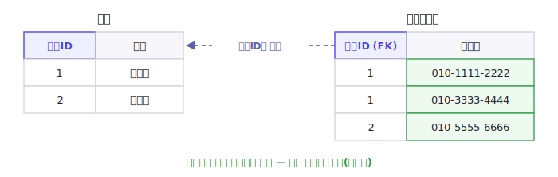
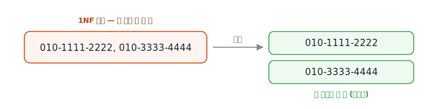

[2편](/blog/db-normalization-2-anomalies/)에서 이상현상의 원인이 "하나의 테이블에 여러 종류의 함수적 종속성이 섞여 있는 것"임을 보았습니다. 이번 편부터는 그 종속성을 단계별로 정리하는 기준인 **정규형(Normal Form)** 을 하나씩 살펴봅니다. 첫 단계는 모든 정규형의 출발점인 **제1정규형(1NF)** 입니다. 다만 1NF는 함수적 종속성을 직접 다루는 단계가 아닙니다. 그보다 먼저, **테이블의 각 칸에 담기는 값의 형태**부터 정리하는 단계입니다. 함수적 종속성을 본격적으로 따지는 것은 2NF부터이고, 1NF는 그 논의가 가능하도록 테이블을 평평한 형태로 만들어 두는 토대에 가깝습니다.

> **시리즈 구성**
> 1. [데이터 무결성과 키](/blog/db-normalization-1-integrity-and-keys/)
> 2. [이상현상과 함수적 종속성](/blog/db-normalization-2-anomalies/)
> 3. **제1정규형 (1NF)** (이번 글)
> 4. 제2정규형 (2NF)
> 5. [제3정규형 (3NF)](/blog/db-normalization-5-3nf/)
> 6. [보이스-코드 정규형 (BCNF)](/blog/db-normalization-6-bcnf/)
> 7. 자연키와 대리키 — 키 설계
> 8. 제4·제5정규형 개요와 그 너머
> 9. 정규화 절차와 역정규화

## 정규화와 정규형

먼저 자주 헷갈리는 두 용어를 구분하고 갑니다.

- **정규화(normalization)**: 데이터 중복과 이상현상이 줄어들도록 테이블 구조를 다듬는 **과정**입니다.
- **정규형(normal form)**: 그 과정이 도달한 **단계**입니다. 1NF·2NF·3NF·BCNF처럼 단계가 있고, 각 단계는 "이 테이블이 어떤 종속성까지 정리되었는가"를 나타냅니다.

즉 정규화는 작업이고, 정규형은 그 작업이 도달한 상태입니다. "테이블을 3NF로 정규화한다"는 말은 "3NF라는 단계에 이르도록 테이블을 다듬는다"는 뜻입니다. 이 시리즈의 3편부터 6편까지는 각 정규형을, 9편에서는 정규화를 실제로 수행하는 절차를 다룹니다.

한 가지 기억할 점은, **정규형은 누적적**이라는 것입니다. 더 높은 정규형은 항상 그 아래 단계의 정규형을 모두 만족합니다. 예를 들어 어떤 테이블이 3NF이면 자동으로 2NF와 1NF도 만족합니다. 그래서 정규화는 1NF → 2NF → 3NF처럼 한 단계씩 차례로 올라가며, 어떤 단계에 이르려면 그 이전 단계를 먼저 만족해야 합니다. 실제로 뒤에서 볼 2NF·3NF의 정의도 "이전 정규형을 만족하면서, 추가로 …"의 형태를 띱니다.

## 등장 배경

정규화 이론의 출발점은 E.F. Codd가 1970년에 발표한 논문 [「A Relational Model of Data for Large Shared Data Banks」](https://doi.org/10.1145/362384.362685)입니다(*Communications of the ACM* 13권 6호). Codd는 이 논문에서 관계형 데이터 모델 자체를 제안했고, 이는 오늘날 관계형 데이터베이스의 토대가 되었습니다.

1970년 시점에 존재한 정규형은 1NF 하나뿐이었습니다. 2NF와 3NF는 이듬해인 1971년 논문 「Further Normalization of the Data Base Relational Model」에서야 등장합니다. 국내 자료 중에는 2NF·3NF도 1970년에 나온 것처럼 적은 글이 있는데, 정확히는 1970년에는 1NF뿐이고 2NF·3NF는 1971년입니다.

| 연도 | 정규형 | 도입 | 다루는 종속성 |
|------|--------|------|----------------|
| 1970 | **1NF** | Codd | 원자값 (값의 형태) |

(시리즈가 진행되며 이 표에 2NF·3NF·BCNF 등이 한 행씩 더해집니다.)

또 한 가지, Codd는 1970년 논문에서 1NF를 "값이 원자적(atomic)이어야 한다"고 설명했지만, 정작 '원자값'이 무엇인지는 명확히 정의하지 않았습니다. 관계형 이론의 권위자 C.J. Date는 이 점이 1NF의 의미를 둘러싼 오랜 혼동을 낳았다고 지적합니다. 그래서 '원자값'의 기준은 이 글 후반에서 다시 짚어봅니다.

> **코드 박사 이야기**
>
> 관계형 모델을 제안한 Codd(1923–2003)는 처음부터 데이터베이스 연구자였던 것은 아닙니다. 영국 옥스퍼드에서 수학을 공부하다 제2차 세계대전 때 영국 공군(RAF) 비행정 조종사로 복무했고, 전후 미국으로 건너가 IBM에 수학자로 입사했습니다.
>
> 정작 IBM은 그의 관계형 모델에 처음에는 미온적이었습니다. 당시 IBM은 자사의 계층형 데이터베이스(IMS)를 주력으로 삼고 있어, Codd의 제안은 회사의 방향과 어긋나는 것으로 받아들여졌습니다. 그럼에도 Codd는 관계형 모델의 장점을 꾸준히 알렸고, 이 모델을 바탕으로 한 상용 제품을 IBM보다 먼저 내놓은 것은 Larry Ellison이 세운 회사(훗날 Oracle)였습니다. Codd는 관계형 모델을 정립한 공로로 1981년 튜링상을 받았습니다.

## 관계형 모델은 무엇이 달랐나

관계형 모델을 이해하려면, 그 이전에 무엇이 있었는지 보면 도움이 됩니다. 1970년 전후의 주류는 **계층형(hierarchical) 모델**과 **네트워크(network) 모델**이었습니다. 앞의 일화에 나온 IBM의 IMS가 대표적인 계층형 데이터베이스입니다.

계층형 모델은 데이터를 트리(tree) 구조로 저장합니다. 부모 레코드 아래에 자식 레코드들이 매달리고, 한 레코드가 자식 레코드들의 묶음을 품습니다. 이 묶음이 바로 반복 그룹(repeating group)입니다. 데이터를 꺼내려면 부모에서 자식으로 내려가는 경로를 따라가야 했습니다. 즉 응용 프로그램이 데이터의 물리적 구조와 접근 경로에 묶여 있었습니다.

관계형 모델은 이 구조를 평평하게 폅니다. 레코드 안에 레코드를 중첩하는 대신 데이터를 **표(table)** 로 표현하고, 표와 표 사이의 관계는 트리 경로가 아니라 **키(key)** 로 연결합니다. 그래서 접근 경로를 몰라도 값을 기준으로 원하는 데이터를 질의할 수 있습니다(이 질의를 다루는 언어가 훗날의 SQL입니다).

이 차이가 1NF와 곧바로 이어집니다. 1NF가 요구하는 "반복 그룹을 없애고 값을 원자 단위로 둔다"는 것은, 계층형의 중첩·반복 구조를 관계형의 평평한 표로 펴는 일과 같습니다. 그래서 '반복 그룹'이라는 용어도 본래 계층형 모델과 그 이전의 파일·레코드 구조에서 온 말입니다. 1NF는 관계형 모델이 성립하기 위한 출발 조건인 셈입니다.

## 1NF의 정의

**제1정규형(First Normal Form)의 정의는 다음 한 문장입니다. 모든 속성의 값이 원자값(atomic value)이어야 한다.**

여기서 원자값이란 더 이상 쪼개어 다루지 않는, 하나의 의미 단위를 가진 값을 말합니다. 즉 하나의 칸(컬럼과 행이 만나는 자리)에는 값이 정확히 하나만 들어가야 합니다. 다음 두 가지가 1NF 위반의 대표적인 형태입니다.

- **한 칸에 여러 값을 넣는 경우** — 예를 들어 `연락처` 칸에 `010-1111-2222, 010-3333-4444`처럼 값을 나열하는 형태
- **반복 그룹(repeating group)** — 같은 의미의 값을 `연락처1`, `연락처2`, `연락처3`처럼 여러 컬럼으로 나누어 두는 형태

1NF는 관계형 테이블이 성립하기 위한 가장 기본 조건입니다. 뒤에서 다룰 2NF·3NF·BCNF는 모두 1NF를 전제로 합니다.

## 한 칸에 여러 값을 넣으면 생기는 문제

먼저 한 칸에 여러 값을 넣은 경우를 봅시다. 아래 `연락처` 칸에는 값이 여러 개 들어 있습니다.

| 회원ID | 이름 | 연락처 |
|--------|------|--------|
| 1 | 김민준 | 010-1111-2222, 010-3333-4444 |
| 2 | 이서연 | 010-5555-6666 |

이렇게 저장하면 데이터를 다루기가 어려워집니다.

- **조회가 어렵다.** "010-3333-4444를 쓰는 회원"을 찾으려면 칸 안의 문자열 전체를 분해해서 비교해야 합니다. 값이 정확히 일치하는지로 찾을 수 없습니다.
- **수정·삭제가 번거롭다.** 번호 하나만 바꾸거나 지우려 해도, 칸 안의 문자열을 직접 가공해야 합니다.
- **제약을 걸 수 없다.** 각 번호에 형식 제약(`CHECK`)이나 유일 제약(`UNIQUE`)을 거는 일이 사실상 불가능합니다.

이를 1NF로 만들려면 값을 원자 단위로 분리합니다. 연락처를 별도 테이블로 옮기고, 값 하나당 한 행을 차지하도록 풉니다.

이제 번호 하나가 한 행에 대응합니다. 특정 번호로 조회하거나, 번호 하나만 추가·삭제하는 일이 단순해집니다. 각 번호에 제약을 거는 것도 가능해집니다.

## 반복 그룹(repeating group)도 1NF 위반이다

값을 칸 안에 나열하는 대신, 컬럼을 여러 개로 늘리는 방식도 있습니다.

| 회원ID | 이름 | 연락처1 | 연락처2 | 연락처3 |
|--------|------|---------|---------|---------|
| 1 | 김민준 | 010-1111-2222 | 010-3333-4444 | |
| 2 | 이서연 | 010-5555-6666 | | |

칸마다 값은 하나씩 들어 있지만, 이것도 1NF가 풀려는 문제를 그대로 안고 있습니다. 같은 의미의 속성을 여러 컬럼으로 나눈 **반복 그룹**입니다.

칸마다 값은 하나인데 왜 1NF 위반일까요? 핵심은 `연락처1`·`연락처2`·`연락처3`이 **서로 다른 속성이 아니라, '연락처'라는 하나의 속성을 여러 칸으로 쪼개 놓은 것**이라는 데 있습니다. 관계형 모델에서 각 컬럼은 서로 구별되는 하나의 속성이어야 하는데, 여기서는 같은 의미의 값이 단지 "몇 번째 칸이냐"로만 나뉘어 있습니다. `연락처2`의 번호가 `연락처1`의 번호와 본질적으로 다른 종류도 아니고, 어떤 번호를 몇 번 칸에 넣을지 정하는 기준도 없습니다. 즉 칸의 **위치**가 의미를 갖게 되는데, 관계형 모델은 컬럼의 순서나 위치에 의미를 두지 않습니다. 결국 이것은 여러 개의 값(번호들)을 하나의 속성에 담은 것으로, 한 칸에 쉼표로 나열한 경우와 같은 문제를 컬럼 방향으로 돌려놓은 것일 뿐입니다.

그 결과 실제로 다음과 같은 문제가 생깁니다.

- 번호를 네 개 가진 회원이 나타나면 컬럼을 또 추가해야 합니다. 즉 데이터가 스키마(테이블 구조)를 바꾸게 만듭니다.
- "010-3333-4444를 쓰는 회원"을 찾으려면 `연락처1`, `연락처2`, `연락처3`을 모두 비교해야 합니다.
- 값이 없는 칸이 `NULL`로 남아 빈 공간이 늘어납니다.

해결은 앞과 같습니다. 반복되는 컬럼을 별도 테이블의 행으로 풀어내면 위의 **회원연락처** 형태가 됩니다.

## 1NF로 만드는 과정

앞의 두 예시를 절차로 정리하면 다음과 같습니다.

1. 한 칸에 여러 값이 들어 있거나, 같은 의미의 컬럼이 반복(반복 그룹)되는 속성을 찾는다.
2. 그 값을 원자 단위로 나눈다. 값 하나가 한 행을 차지하도록 별도 테이블로 옮긴다.
3. 원래 테이블의 키를 분리한 테이블에 함께 두어, 두 테이블을 연결한다.

연락처를 회원 테이블에서 떼어 **회원연락처** 테이블로 옮기고, `회원ID`로 두 테이블을 잇는 것이 그 예입니다.

## 원자값이란 무엇인가

1NF의 정의에 나온 **원자값(atomic value)** 을 조금 더 짚고 갑니다. 한국의 데이터베이스 강의나 정보처리기사 자료에서는 보통 원자값을 **'더 이상 쪼갤 수 없는 단위의 값'** 으로 설명합니다. 한 칸에 값이 하나만 들어가야 한다는 뜻입니다. 이 글도 기본적으로 이 정의를 따릅니다.

다만 '쪼갤 수 없다'는 표현은 글자 그대로는 엄밀하지 않습니다. 거의 모든 값은 더 작게 쪼갤 수 있기 때문입니다(문자열은 글자로, 날짜는 년·월·일로). 그래서 실무에서 통하는 기준은 '쪼갤 수 있느냐'가 아니라 **'한 칸에 독립된 여러 값이 들어 있느냐'** 입니다. 이 미묘함은 뒤의 '원자값은 생각보다 모호하다' 절에서 다시 다룹니다.

예시부터 보겠습니다.

- 원자값으로 보는 경우: `100`(수량), `"김민준"`(이름)처럼 통째로 하나의 의미를 갖는 값
- 원자값이 아닌 경우: `"010-1111-2222, 010-3333-4444"`(번호 두 개), `"java,spring,db"`(태그 세 개)처럼 한 칸에 여러 개의 독립된 값이 들어 있는 경우

둘을 가르는 실용적인 기준은 이렇습니다. **그 값의 일부에 따로 접근하거나, 일부만 조건으로 걸거나, 일부만 바꿀 일이 있는가.** 그런 일이 필요하다면 그 값은 사실 여러 값이 뭉쳐 있는 것이므로 원자값이 아닙니다. 예를 들어 `"010-1111-2222, 010-3333-4444"`에서 두 번째 번호만 지우려면 문자열을 직접 가공해야 하는데, 이는 그 칸이 두 개의 값을 담고 있다는 신호입니다.

> **날짜는 원자값일까?**
>
> MySQL·MariaDB의 `DATE`나 `TIMESTAMP`처럼 년·월·일로 쪼갤 수 있는 타입도 원자값으로 봅니다. `DATE`는 '날짜'라는 하나의 타입이 가지는 값 하나이고, 년·월·일은 그 날짜를 이루는 구성요소일 뿐 따로 저장된 독립된 값이 아니기 때문입니다.
>
> `YEAR()`·`MONTH()` 함수로 일부를 꺼낼 수 있지만, 이는 하나의 값에 함수를 적용하는 것이지 한 칸에 여러 값이 들어 있다는 뜻이 아닙니다. 쉼표로 이어 붙인 전화번호를 `SUBSTRING`으로 잘라 분리하는 것과는 성격이 다릅니다. 앞의 기준대로, '쪼갤 수 있는가'가 아니라 '한 칸에 독립된 여러 값이 들어 있는가'로 판단하면 됩니다.

## "원자값"은 생각보다 모호하다

1NF에서 가장 자주 오해가 생기는 지점은 "어디까지가 원자값인가"입니다. 원자성은 절대적인 기준이 아니라, **그 값을 응용에서 어떻게 다루는지에 따라 달라집니다.**

예를 들어 주소 `"서울특별시 강남구 테헤란로 1"`를 한 칸에 통째로 저장했다고 합시다.

- 주소를 항상 하나의 문자열로만 쓴다면, 이 값은 그 응용에서 원자값으로 볼 수 있습니다.
- 그러나 시·구·도로명을 따로 조회·정렬·검증해야 한다면, 이를 별도 컬럼으로 분리하는 설계가 더 적합합니다. 이 경우 통짜 주소를 곧바로 1NF 위반이라고 단정하기보다는, 응용에서 개별 요소를 따로 다뤄야 하므로 분리하는 것으로 보는 편이 정확합니다.

즉 같은 데이터라도 **개별 요소에 따로 접근할 필요가 있는지**가 분리 기준이 됩니다. 반면 `010-1111-2222, 010-3333-4444`처럼 **의미상 명백히 다른 값**을 구분자로 이어 붙인 것은, 응용과 무관하게 1NF 위반으로 봅니다. 서로 다른 두 전화번호는 본래 별개의 값이기 때문입니다.

> 이 "원자성은 절대적이지 않다"는 관점은 관계형 이론가 C.J. Date가 분명히 했습니다. Date는 "원자성에는 절대적 기준이 없다(atomicity has no absolute meaning)"고 보며, 같은 값이라도 어떤 목적에서는 원자값이고 다른 목적에서는 더 작은 요소들의 묶음일 수 있다고 설명합니다. 다만 한국의 강의·자격증 자료를 비롯한 대부분의 입문 교재는 여전히 "더 이상 쪼갤 수 없는 단일 값"이라는 전통적 정의를 사용합니다. 실무에서는 위에서 본 "한 칸에 독립된 여러 값이 없는가"라는 기준으로 충분합니다. (이 논쟁의 출처는 아래 참고 문헌에서 확인할 수 있습니다.)

## 실무에서 자주 보이는 1NF 위반

실제 테이블에서 1NF 위반은 다음과 같은 형태로 자주 나타납니다.

- **CSV 문자열로 묶어 저장** — 게시글의 태그를 `tags` 컬럼 하나에 `"java,spring,db"`처럼 쉼표로 이어 저장하는 경우입니다. 한 칸에 여러 값을 넣은 형태라, 특정 태그로 검색하거나 태그 하나만 지우기가 까다로워집니다.
- **여러 ID를 한 컬럼에** — 주문 테이블의 `상품ID목록`에 `"101,102,103"`처럼 여러 상품을 한 칸에 저장하는 경우입니다. 주문과 상품을 잇는 별도 테이블(예: 주문상세)로 풀어야 합니다.
- **번호를 매긴 반복 컬럼** — 사용자 테이블의 `이메일1`·`이메일2`, 또는 설문 응답의 `보기1`·`보기2`·`보기3`처럼 같은 속성을 번호만 바꿔 늘린 경우입니다. 스프레드시트에서 옮겨 온 테이블에서 특히 자주 보입니다.
- **기간별로 펼친 컬럼** — `1월매출`·`2월매출` … `12월매출`처럼 같은 사실(매출)을 기간별 컬럼으로 나눈 경우입니다. 보고서 화면에는 이렇게 보여도, 저장은 `(기간, 매출)` 형태의 행으로 두는 편이 다루기 쉽습니다.

공통점은 **하나의 속성에 해당하는 값을 여러 칸에, 또는 한 칸 안 여러 값으로 욱여넣었다**는 것입니다. 이런 값을 별도 행으로 풀어내면 1NF를 만족하고, 조회·수정·제약이 모두 단순해집니다.

## 1NF가 아직 보장하지 않는 것

1NF를 만족했다고 데이터 중복이나 이상현상이 사라지는 것은 아닙니다. 1NF는 "값의 형태"만 다룰 뿐, 속성들 사이의 **함수적 종속성**은 건드리지 않기 때문입니다.

예를 들어 앞서 1NF로 만든 다음 테이블을 봅시다. (수강신청을 `{학번, 과목코드}`로 식별합니다.)

| 학번 | 과목코드 | 성적 | 과목명 |
|------|----------|------|--------|
| S1 | C1 | A | 데이터베이스 |
| S2 | C1 | B | 데이터베이스 |

모든 칸에 값이 하나씩 들어 있으므로 이 테이블은 1NF를 만족합니다. 그런데도 `과목명`(데이터베이스)이 과목마다 중복됩니다. 이는 `과목명`이 키의 일부인 `과목코드`에만 종속되기 때문인데, 이것이 다음 편에서 다룰 **부분 함수적 종속**의 문제입니다.

정리하면, 1NF는 정규화의 시작점일 뿐입니다. 값의 형태를 원자 단위로 맞춘 뒤, 그 위에서 종속성을 단계적으로 정리하는 것이 2NF부터의 과제입니다.

## 정리

- **1NF**는 모든 속성의 값이 원자값이어야 한다는 조건이다
- 한 칸에 여러 값을 넣는 것, 그리고 같은 의미의 컬럼을 반복하는 **반복 그룹** 모두 1NF 위반이다
- 위반은 값을 별도 테이블의 행으로 분리해 해결한다
- "원자값"의 기준은 절대적이지 않고, 개별 요소에 접근할 필요가 있는지에 따라 달라진다
- 1NF는 값의 형태만 다루므로, 종속성에서 비롯된 중복은 2NF 이후에서 해결한다

다음 편에서는 **[제2정규형(2NF)](/blog/db-normalization-4-2nf/)** 을 다루며, 복합키에서 생기는 부분 함수적 종속을 어떻게 제거하는지 살펴보겠습니다.

## 참고 문헌

**원전(영문)**

- [E.F. Codd, *A Relational Model of Data for Large Shared Data Banks*](https://doi.org/10.1145/362384.362685), Communications of the ACM, 13(6), 1970, pp. 377–387. (관계형 모델과 1NF의 원전)
- [E.F. Codd, *Further Normalization of the Data Base Relational Model*](https://dblp.org/rec/persons/Codd71a.html), IBM Research Report RJ909, 1971. (2NF·3NF의 원전이며, 1NF가 앞선 작업임을 전제로 함. 정식 출판은 Prentice-Hall, 1972)

**원자값의 정의 — 전통적 견해**

- R. Elmasri, S.B. Navathe, *Fundamentals of Database Systems*, 7th ed., Pearson, 2015. (원자값을 "단일·분해 불가능한 값"으로 보는 전통적 정의의 표준 교재)
- [데이터베이스 정규화 — 한국어 위키백과](https://ko.wikipedia.org/wiki/데이터베이스_정규화) (한국어로 읽을 수 있는 정규화 개요. 원자값을 "더 이상 쪼개질 수 없는 단위"로 설명)

**원자값의 정의 — 비판적 견해 (검증 가능)**

- C.J. Date, *What First Normal Form Really Means*, in *Date on Database: Writings 2000–2006*, Apress, 2007, ch. 8. ("원자성에는 절대적 기준이 없다"는 비판의 출처)
- [First normal form — Wikipedia, "Controversy about compound values"](https://en.wikipedia.org/wiki/First_normal_form) (위 Date의 견해와 인용을 무료로 확인할 수 있는 영문 출처)
- [C.J. Date, Codd의 초기 두 논문에 대한 논평 (PDF)](https://www.dcs.warwick.ac.uk/~hugh/TTM/CJD-on-EFC's-First-Two-Papers.pdf) — 1970년 논문이 '원자값(atomic value)'을 명확히 정의하지 않아 1NF에 대한 혼동이 이어졌다는 지적.
