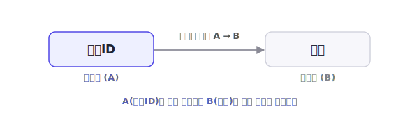
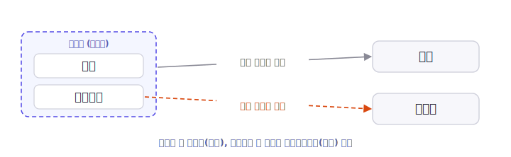

[3편](/blog/db-normalization-3-1nf/)에서는 값의 형태를 원자값으로 맞추는 **1NF**를 다뤘습니다. 1NF는 "한 칸에 하나의 값"이라는 형태의 문제만 다룰 뿐, 속성들 사이의 관계는 건드리지 않습니다. 이번 편의 **제2정규형(2NF)** 부터는 속성 사이의 **함수적 종속성**을 본격적으로 정리합니다. 그래서 2NF의 정의에 들어가기 전에, 그 토대가 되는 함수적 종속성부터 짚고 시작합니다.

> **시리즈 구성**
> 1. [데이터 무결성과 키](/blog/db-normalization-1-integrity-and-keys/)
> 2. [이상현상과 함수적 종속성](/blog/db-normalization-2-anomalies/)
> 3. [제1정규형 (1NF)](/blog/db-normalization-3-1nf/)
> 4. **제2정규형 (2NF)** (이번 글)
> 5. [제3정규형 (3NF)](/blog/db-normalization-5-3nf/)
> 6. [보이스-코드 정규형 (BCNF)](/blog/db-normalization-6-bcnf/)
> 7. 자연키와 대리키 — 키 설계
> 8. 제4·제5정규형 개요와 그 너머
> 9. 정규화 절차와 역정규화

## 등장 배경

2NF는 E.F. Codd가 1971년 논문 「Further Normalization of the Data Base Relational Model」(IBM Research Report RJ909)에서 3NF와 함께 처음 정의한 정규형입니다. [3편](/blog/db-normalization-3-1nf/)에서 보았듯 1970년 관계형 모델 논문에는 1NF만 있었고, 2NF와 3NF는 이듬해에 추가되었습니다.

Codd가 이 논문에서 밝힌 정규화의 첫 번째 목적은 "바람직하지 않은 삽입·갱신·삭제 종속성을 제거하는 것"이었습니다([2편](/blog/db-normalization-2-anomalies/)에서 인용). 2NF는 그 목적을 향한 첫 단계로, 복합키에서 생기는 한 종류의 종속성을 정리합니다.

| 연도 | 정규형 | 도입 | 다루는 종속성 |
|------|--------|------|----------------|
| 1970 | 1NF | Codd | 원자값 (값의 형태) |
| 1971 | **2NF** | Codd | 부분 함수적 종속 |

> **여담 — 'normalization'이라는 이름의 유래**
>
> 널리 회자되는 이야기가 하나 있습니다. Codd가 'normalization(정규화)'이라는 용어를, 당시 미국이 추진하던 외교 "관계 정상화(normalization of relations)"에서 따왔다는 것입니다. 관계형 모델의 '관계(relation)'와 외교 '관계'를 겹친 말장난인 셈입니다. 다만 출처에 따라 상대국이 중국이라고도 소련이라고도 하고, 1차 자료로 확인되지는 않아 사실 여부는 분명하지 않습니다.

## 함수적 종속성 다시 보기

[2편](/blog/db-normalization-2-anomalies/)에서 함수적 종속성의 기본(결정자·종속자, 규칙으로서의 성격, 자명·비자명 종속)을 다뤘습니다. 짧게 복습하면, **함수적 종속성** `A → B`는 결정자 A의 값이 정해지면 종속자 B의 값도 항상 하나로 정해지는 업무 규칙입니다. 예를 들어 `회원ID → 이름`이 그렇습니다.

2NF를 이해하려면 여기에 한 가지 구분을 더해야 합니다. 같은 함수적 종속이라도, 후보키가 **두 개 이상의 속성으로 이루어진 복합키**일 때 종속의 모습이 둘로 갈립니다. **완전 함수적 종속**과 **부분 함수적 종속**입니다.

### 완전 함수적 종속 (full functional dependency)

어떤 속성이 **복합키 전체**가 있어야 결정되는 경우입니다. 키를 이루는 속성을 하나라도 빼면 더 이상 값이 정해지지 않습니다.

예를 들어 수강신청을 `{학번, 과목코드}`로 식별할 때, `{학번, 과목코드} → 성적`은 완전 함수적 종속입니다. 성적은 "누가" 그리고 "어떤 과목을" 들었는지가 **둘 다** 있어야 정해지기 때문입니다.

### 부분 함수적 종속 (partial functional dependency)

어떤 속성이 복합키의 **일부**만으로 결정되는 경우입니다. 한국어로 풀면 "키의 일부에만 의존하는 종속"입니다.

같은 예에서 `과목코드 → 과목명`을 봅시다. 과목명은 `과목코드`만 알면 정해지고, `학번`은 필요하지 않습니다. 즉 `과목명`은 복합키 `{학번, 과목코드}`의 **일부**인 `과목코드`에만 종속됩니다. 이것이 부분 함수적 종속입니다.

> 참고: 후보키가 단일 속성이면 "일부"라는 것이 존재하지 않으므로 부분 함수적 종속이 성립할 수 없습니다. 그래서 부분 함수적 종속 문제는 복합키에서만 나타납니다.

## 2NF의 정의

정의에 들어가기 전에, 정의에 쓰이는 용어 두 개를 먼저 짚고 갑니다.

- **주요 속성(prime attribute)**: 어떤 후보키에든 포함되는 속성
- **비주요 속성(non-prime attribute)**: 어떤 후보키에도 포함되지 않는 속성

예를 들어 후보키가 `{학번, 과목코드}`인 수강신청 테이블을 봅시다. `학번`과 `과목코드`는 후보키에 포함되므로 **주요 속성**이고, `성적`이나 `과목명`은 후보키에 포함되지 않으므로 **비주요 속성**입니다. 즉 비주요 속성은 "키에 속하지 않는 일반 속성"이라고 이해하면 됩니다.

이제 정의를 봅시다. **제2정규형(Second Normal Form)은 1NF를 만족하고, 모든 비주요 속성이 각 후보키에 완전 함수적 종속이어야 한다**는 조건입니다. 바꿔 말하면 **부분 함수적 종속을 제거**하는 것이 2NF입니다. 즉 "키에 속하지 않는 속성들이 키의 일부가 아니라 키 전체에 의존해야 한다"는 요구입니다.

> Codd의 1971년 정의 자체는 위와 같은 의미이며, 이 글에서는 표준 교재의 서술을 따라 풀어 썼습니다. (3NF의 경우 다음 편에서 원문 정의를 그대로 인용합니다.)

## 2NF로 만드는 과정

테이블을 2NF로 정규화하는 절차는 다음과 같습니다.

1. 후보키가 복합키인지 확인한다. 단일키라면 부분 함수적 종속이 생길 수 없으므로 이미 2NF다.
2. 각 비주요 속성이 키 전체에 완전 함수적 종속인지, 키의 일부에만 종속되는지(부분 함수적 종속) 판별한다.
3. 부분 함수적 종속이 있으면, 그 결정자(키의 일부)와 거기에 종속되는 속성을 별도 테이블로 분리한다.
4. 분리한 테이블의 키를 원래 테이블에 외래키로 남겨 둘을 연결한다.

앞의 수강신청 테이블에 이 절차를 적용해 봅시다. `{학번, 과목코드}`가 복합 자연키입니다.

| 학번 | 과목코드 | 성적 | 과목명 |
|------|----------|------|--------|
| S1 | C1 | A | 데이터베이스 |
| S2 | C1 | B | 데이터베이스 |
| S1 | C2 | A | 운영체제 |

- `{학번, 과목코드} → 성적` : 성적은 키 전체에 종속 (완전 함수적 종속)
- `과목코드 → 과목명` : 과목명은 키의 일부인 `과목코드`에만 종속 (부분 함수적 종속)

`과목명`이 부분 함수적 종속이라, 같은 과목을 듣는 학생마다 과목명이 중복됩니다. 위 표에서 `데이터베이스`가 두 번 저장된 것이 그 예입니다. 만약 과목명을 `데이터베이스 개론`으로 바꾸려면 해당 과목을 듣는 모든 행을 빠짐없이 고쳐야 하고, 하나라도 놓치면 같은 `과목코드`에 과목명이 두 개 존재하는 모순이 생깁니다. [2편](/blog/db-normalization-2-anomalies/)에서 본 갱신 이상입니다.

2NF로 만들려면 부분 함수적 종속을 별도 테이블로 분리합니다. 즉 `과목코드`에만 종속되는 `과목명`을, `과목코드`가 키인 테이블로 옮깁니다.

**수강신청** — `{학번, 과목코드}(PK)`, `성적`

| 학번 | 과목코드 | 성적 |
|------|----------|------|
| S1 | C1 | A |
| S2 | C1 | B |
| S1 | C2 | A |

**과목** — `과목코드(PK)`, `과목명`

| 과목코드 | 과목명 |
|----------|--------|
| C1 | 데이터베이스 |
| C2 | 운영체제 |

이제 과목명은 과목 테이블에 한 번만 저장됩니다. 같은 과목을 듣는 학생이 늘어도 중복되지 않고, 과목명을 바꿀 때도 한 행만 수정하면 됩니다. 분해한 두 테이블은 `과목코드`로 다시 조인하면 원래 데이터를 손실 없이 복원할 수 있습니다([2편](/blog/db-normalization-2-anomalies/)에서 다룬 무손실 조인).

## 단일키 테이블은 이미 2NF다

앞서 보았듯 부분 함수적 종속은 복합키에서만 생깁니다. 따라서 **1NF를 만족하면서 후보키가 모두 단일 속성인 테이블은 자동으로 2NF를 만족합니다.** 예를 들어 `회원ID` 하나가 키인 회원 테이블은, 다른 속성들이 키의 "일부"에 종속될 여지가 없으므로 2NF 위반이 일어나지 않습니다.

많은 실무 테이블이 대리키(auto-increment `id`)를 단일 기본키로 사용하는데([1편](/blog/db-normalization-1-integrity-and-keys/) 참고), 이런 테이블은 2NF 단계에서 따로 손볼 것이 없는 경우가 많습니다. 다만 이는 "2NF를 신경 쓸 필요가 없다"는 뜻이 아니라, **자연키가 복합키인 구조에서 2NF가 중요해진다**는 의미로 이해하는 것이 정확합니다.

## 2NF가 아직 남기는 것

부분 함수적 종속을 제거해도 중복이 완전히 사라지는 것은 아닙니다. 2NF는 "키의 일부에 종속되는" 문제만 다룰 뿐, **키가 아닌 다른 속성을 거쳐 종속되는** 경우는 여전히 남습니다.

예를 들어 직원 테이블에서 `직원ID → 부서ID`이고 `부서ID → 부서명`이라면, `부서명`은 키(`직원ID`)에 직접 종속되는 것이 아니라 `부서ID`를 거쳐 종속됩니다. 이 테이블의 키가 단일키 `직원ID`라면 부분 함수적 종속이 없으므로 2NF는 만족하지만, 부서 정보는 여전히 직원마다 중복됩니다.

이처럼 다른 속성을 거쳐 종속되는 관계를 **이행적 함수적 종속(transitive functional dependency)** 이라 하며, 이를 제거하는 것이 다음 편에서 다룰 3NF입니다.

## 정리

- **함수적 종속성** `A → B`는 A가 정해지면 B가 항상 하나로 정해지는 업무 규칙이다 (A는 결정자, B는 종속자)
- **완전 함수적 종속**은 복합키 전체가 있어야 결정되는 경우, **부분 함수적 종속**은 키의 일부만으로 결정되는 경우다
- **2NF**는 1NF를 만족하면서 모든 비주요 속성이 후보키에 **완전 함수적 종속**되어야 한다 — 즉 부분 함수적 종속을 제거한다
- 부분 함수적 종속은 복합키에서만 생기므로, **단일키 테이블은 자동으로 2NF**를 만족한다
- 2NF는 부분 함수적 종속만 다루며, 다른 속성을 거치는 **이행적 함수적 종속**은 3NF에서 해결한다

다음 편에서는 **[제3정규형(3NF)](/blog/db-normalization-5-3nf/)** 을 다루며, 이행적 함수적 종속을 제거하는 방법을 살펴보겠습니다.

## 참고 문헌

- E.F. Codd, *Further Normalization of the Data Base Relational Model*, IBM Research Report RJ909, 1971. (2NF·3NF의 원전. 정식 출판은 Prentice-Hall, 1972)
- R. Elmasri, S.B. Navathe, *Fundamentals of Database Systems*. (완전·부분 함수적 종속과 2NF의 표준 서술)
