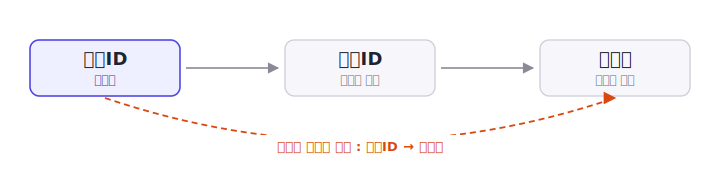

[4편](/blog/db-normalization-4-2nf/)에서는 복합키의 일부에만 의존하는 **부분 함수적 종속**을 제거하는 2NF를 다뤘습니다. 이번 편의 **제3정규형(3NF)** 은 한 걸음 더 나아가, 키가 아닌 속성을 거쳐 생기는 **이행적 함수적 종속**을 제거합니다. 실무에서 "정규화한다"고 할 때 흔히 목표로 삼는 단계가 바로 이 3NF입니다.

> **시리즈 구성**
> 1. [데이터 무결성과 키](/blog/db-normalization-1-integrity-and-keys/)
> 2. [이상현상과 함수적 종속성](/blog/db-normalization-2-anomalies/)
> 3. [제1정규형 (1NF)](/blog/db-normalization-3-1nf/)
> 4. [제2정규형 (2NF)](/blog/db-normalization-4-2nf/)
> 5. **제3정규형 (3NF)** (이번 글)
> 6. [보이스-코드 정규형 (BCNF)](/blog/db-normalization-6-bcnf/)
> 7. 자연키와 대리키 — 키 설계
> 8. 제4·제5정규형 개요와 그 너머
> 9. 정규화 절차와 역정규화

## 등장 배경

3NF는 2NF와 마찬가지로 Codd가 1971년 논문 「Further Normalization of the Data Base Relational Model」(IBM Research Report RJ909)에서 정의했습니다. Codd는 이 논문에서 1NF 위에 2NF를, 그 위에 다시 3NF를 쌓는 단계적 구조를 제시했습니다.

| 연도 | 정규형 | 도입 | 다루는 종속성 |
|------|--------|------|----------------|
| 1970 | 1NF | Codd | 원자값 (값의 형태) |
| 1971 | 2NF | Codd | 부분 함수적 종속 |
| 1971 | **3NF** | Codd | 이행적 함수적 종속 |

오랫동안 3NF는 실무 정규화의 사실상 목표로 여겨졌습니다. 대부분의 이상현상이 3NF에서 제거되기 때문입니다. 3NF의 한계를 보완한 BCNF가 1974년에 따로 제안된 것도, 거꾸로 보면 3NF가 그만큼 널리 자리 잡은 기준이었다는 뜻입니다. BCNF는 다음 편에서 다룹니다.

## 이행적 함수적 종속이란

3NF의 정의에 들어가기 전에, 핵심 용어인 이행적 함수적 종속을 먼저 짚습니다.

**이행적 함수적 종속(transitive functional dependency)** 은 비주요 속성이 키에 직접 종속되지 않고, **다른 비주요 속성을 거쳐** 종속되는 경우입니다. (비주요 속성은 [4편](/blog/db-normalization-4-2nf/)에서 본 것처럼 "어떤 후보키에도 포함되지 않는 속성"입니다.)

`키 → A → B` 꼴을 떠올리면 쉽습니다. 여기서 A가 키가 아닌 속성이라면, B는 키에 직접 매달리는 것이 아니라 A를 거쳐 결정됩니다. 이때 `키 → B`를 이행적 함수적 종속이라고 합니다.

예를 들어 직원 테이블에서 `직원ID → 부서ID`이고 `부서ID → 부서명`이라면, `직원ID → 부서ID → 부서명`이 됩니다. `부서ID`는 키가 아닌 속성이므로, `부서명`은 키(`직원ID`)에 이행적으로 종속됩니다.

## 3NF의 정의

Codd의 1971년 원문은 3NF를 다음과 같이 정의합니다.

> "A relation R is in third normal form if it is in second normal form and every non-prime attribute of R is non-transitively dependent on each candidate key of R."
>
> — E.F. Codd, 1971

풀어 쓰면, **2NF를 만족하면서, 모든 비주요 속성이 각 후보키에 이행적으로 종속되지 않아야 한다**는 조건입니다. 즉 2NF가 제거한 부분 함수적 종속에 더해, **이행적 함수적 종속까지 제거**하는 단계가 3NF입니다.

2NF와 3NF를 합치면 한 문장으로 요약됩니다. 비주요 속성은 **키 전체에(2NF), 그리고 오직 키에만(3NF) 직접 종속되어야 한다**는 것입니다. 키의 일부에만 매달리지도(부분 함수적 종속), 다른 속성을 거치지도(이행적 함수적 종속) 않아야 합니다.

## 3NF로 만드는 과정

테이블을 3NF로 정규화하는 절차는 다음과 같습니다.

1. 비주요 속성 중, 다른 비주요 속성을 거쳐 키에 종속되는 것(이행적 함수적 종속)을 찾는다. 즉 `키 → A → B`에서 A가 비주요 속성인 경우다.
2. 중간 결정자 A와 거기에 종속되는 속성 B를 별도 테이블로 분리한다. 이때 A가 새 테이블의 키가 된다.
3. 원래 테이블에는 A를 외래키로 남겨 둘을 연결한다.

[2편](/blog/db-normalization-2-anomalies/)에서 본 직원 테이블에 이 절차를 적용해 봅시다. 키는 단일키 `직원ID`입니다.

| 직원ID | 직원명 | 부서ID | 부서명 | 부서장 |
|--------|--------|--------|--------|--------|
| 1 | 김민준 | 10 | 영업부 | 박부장 |
| 2 | 이서연 | 10 | 영업부 | 박부장 |
| 3 | 박지호 | 20 | 개발부 | 정부장 |

- `직원ID → 부서ID` : 직원은 한 부서에 속한다
- `부서ID → 부서명, 부서장` : 부서ID가 부서명과 부서장을 결정한다
- 따라서 `직원ID → 부서ID → 부서명, 부서장` : `부서명`·`부서장`은 키에 **이행적으로** 종속

이 테이블은 키가 단일키라 부분 함수적 종속이 없으므로 2NF는 만족합니다. 그런데도 부서 정보(`부서명`, `부서장`)가 직원마다 중복됩니다. 위 표에서 `영업부 / 박부장`이 두 번 저장된 것이 그 예입니다. 영업부의 부서장이 바뀌면 영업부에 속한 모든 직원 행을 빠짐없이 고쳐야 하고, 하나라도 놓치면 같은 `부서ID`에 부서장이 둘로 갈리는 모순이 생깁니다([2편](/blog/db-normalization-2-anomalies/)에서 본 갱신 이상).

3NF로 만들려면 이행적 함수적 종속을 별도 테이블로 분리합니다. `부서ID`에 종속되는 속성들을 `부서ID`가 키인 테이블로 옮깁니다.

**직원** — `직원ID(PK)`, `직원명`, `부서ID(FK)`

| 직원ID | 직원명 | 부서ID |
|--------|--------|--------|
| 1 | 김민준 | 10 |
| 2 | 이서연 | 10 |
| 3 | 박지호 | 20 |

**부서** — `부서ID(PK)`, `부서명`, `부서장`

| 부서ID | 부서명 | 부서장 |
|--------|--------|--------|
| 10 | 영업부 | 박부장 |
| 20 | 개발부 | 정부장 |

이제 부서 정보는 부서 테이블에 한 행으로만 존재합니다. 부서장이 바뀌어도 한 곳만 고치면 되고, 직원 테이블의 `부서ID`는 외래키(FK)로 부서 테이블을 참조합니다([1편](/blog/db-normalization-1-integrity-and-keys/)에서 본 참조 무결성). 두 테이블은 `부서ID`로 다시 조인하면 원래 데이터를 손실 없이 복원할 수 있습니다(무손실 조인).

## 3NF가 아직 남기는 것

3NF는 대부분의 이상현상을 제거하지만, 모든 경우를 막지는 못합니다. 정의를 다시 보면 3NF는 **"비주요 속성"** 의 종속만 따집니다. 그래서 **주요 속성(후보키를 이루는 속성)이 얽힌 종속**에서는 빈틈이 생길 수 있습니다.

예를 들어 후보키가 여러 개이고 그 키들이 서로 속성을 공유하는 특수한 구조에서는, 3NF를 만족하면서도 중복이 남을 수 있습니다. 이 빈틈을 막는 것이 다음 편에서 다룰 **BCNF**입니다. BCNF는 "비주요 속성"이라는 단서를 떼고, **모든 결정자가 후보키여야 한다**는 더 엄격한 조건을 요구합니다.

## 정리

- **이행적 함수적 종속**은 비주요 속성이 키에 직접 종속되지 않고 다른 비주요 속성을 거쳐 종속되는 경우다 (`키 → A → B`)
- **3NF**는 2NF를 만족하면서 모든 비주요 속성이 후보키에 **이행적으로 종속되지 않아야** 한다
- 2NF와 3NF를 합치면, 비주요 속성은 "키 전체에, 그리고 오직 키에만 직접 종속되어야 한다"로 요약된다
- 이행적 함수적 종속은 해당 속성들을 별도 테이블로 분리해 제거하며, 분리는 무손실 조인이 가능하도록 한다
- 3NF는 비주요 속성만 다루므로, 주요 속성이 얽힌 종속은 **BCNF**에서 해결한다

다음 편에서는 **[보이스-코드 정규형(BCNF)](/blog/db-normalization-6-bcnf/)** 을 다루며, 3NF가 남긴 빈틈을 어떻게 메우는지 살펴보겠습니다.

## 참고 문헌

- [E.F. Codd, *Further Normalization of the Data Base Relational Model*](https://dblp.org/rec/persons/Codd71a.html), IBM Research Report RJ909, 1971. (2NF·3NF의 원전이며 3NF 정의의 출처. 정식 출판은 Prentice-Hall, 1972)
- [E.F. Codd, *Normalized Data Base Structure: A Brief Tutorial*](https://doi.org/10.1145/1734714.1734716), Proc. 1971 ACM SIGFIDET Workshop, 1971. (1NF~3NF를 다룬 같은 해의 튜토리얼)
