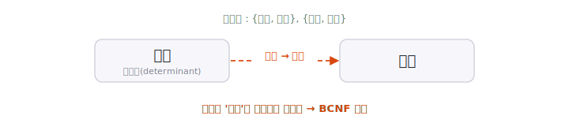

[5편](/blog/db-normalization-5-3nf/)에서 다룬 3NF는 대부분의 이상현상을 제거하지만, 모든 경우를 막지는 못합니다. 3NF가 "비주요 속성"의 종속만 따지기 때문에, **주요 속성이 얽힌 종속**에서 빈틈이 생길 수 있습니다. 이 빈틈을 메우는 것이 이번 편의 **보이스-코드 정규형(BCNF)** 입니다.

> **시리즈 구성**
> 1. [데이터 무결성과 키](/blog/db-normalization-1-integrity-and-keys/)
> 2. [이상현상과 함수적 종속성](/blog/db-normalization-2-anomalies/)
> 3. [제1정규형 (1NF)](/blog/db-normalization-3-1nf/)
> 4. [제2정규형 (2NF)](/blog/db-normalization-4-2nf/)
> 5. [제3정규형 (3NF)](/blog/db-normalization-5-3nf/)
> 6. **보이스-코드 정규형 (BCNF)** (이번 글)
> 7. 자연키와 대리키 — 키 설계
> 8. 제4·제5정규형 개요와 그 너머
> 9. 정규화 절차와 역정규화

## 등장 배경

BCNF는 Raymond F. Boyce와 E.F. Codd가 1974년에 제안한 정규형입니다. 출처는 Codd의 1974년 논문 「Recent Investigations in Relational Data Base Systems」(IBM Research Report RJ1385, IFIP Congress 1974 발표)입니다. 3NF가 자리 잡은 뒤, 3NF를 만족하면서도 남는 함수적 종속 기반의 이상현상을 막기 위해 3NF를 더 엄격하게 다듬은 것입니다. 그래서 BCNF는 비공식적으로 '3.5NF'라고 불리기도 합니다.

| 연도 | 정규형 | 도입 | 다루는 종속성 |
|------|--------|------|----------------|
| 1970 | 1NF | Codd | 원자값 (값의 형태) |
| 1971 | 2NF | Codd | 부분 함수적 종속 |
| 1971 | 3NF | Codd | 이행적 함수적 종속 |
| 1974 | **BCNF** | Boyce·Codd | 결정자가 후보키가 아닌 종속 |

> **레이먼드 보이스 이야기**
>
> BCNF의 'B'는 Raymond F. Boyce(1946–1974)입니다. 그는 Donald Chamberlin과 함께 오늘날 SQL의 원형인 SEQUEL(Structured English Query Language)을 만든 인물로도 알려져 있습니다. 안타깝게도 보이스는 BCNF가 제안된 1974년에 뇌동맥류로 세상을 떠났습니다. 27세였습니다.
>
> 한 가지 덧붙이면, BCNF와 같은 조건을 Ian Heath가 1971년에 먼저 기술했다는 점에서, C.J. Date는 이를 'Heath 정규형'으로 불러야 한다고 주장하기도 합니다. 또한 1974년 논문은 Codd 단독 저자이며, 보이스는 공동 연구자였습니다.

## 정의에 앞서 — 결정자와 자명한 종속

BCNF의 정의는 **결정자**를 중심으로 서술됩니다. 용어 두 개를 먼저 짚습니다(둘 다 [2편](/blog/db-normalization-2-anomalies/)에서 다뤘습니다).

- **결정자(determinant)**: 함수적 종속 `X → Y`에서 다른 속성의 값을 결정하는 쪽, 즉 화살표 왼쪽의 `X`입니다.
- **자명한 함수적 종속(trivial FD)**: `{학번, 이름} → 이름`처럼 종속자가 결정자에 이미 포함된 경우입니다. 이런 종속은 어느 테이블에서나 항상 성립하므로 정규형 판단에서 제외하고, **비자명한 함수적 종속**만 따집니다.

그리고 [1편](/blog/db-normalization-1-integrity-and-keys/)에서 본 **슈퍼키**는 행을 유일하게 식별할 수 있는 속성(또는 속성의 조합)이며, 후보키는 그중 최소 조합입니다.

## BCNF의 정의

**BCNF(Boyce-Codd Normal Form)의 정의는 다음과 같습니다. 모든 비자명한 함수적 종속 `X → Y`에서, 결정자 X가 슈퍼키여야 한다.** 즉 "어떤 속성을 결정하는 모든 결정자는 행을 유일하게 식별할 수 있어야 한다"는 조건입니다.

3NF와 비교하면 차이가 분명합니다. 3NF는 **비주요 속성**의 종속만 따졌습니다. 반면 BCNF는 "비주요 속성"이라는 단서를 떼고, **모든** 비자명한 함수적 종속의 결정자가 슈퍼키일 것을 요구합니다. 주요 속성이 결정자인 경우까지 포함하므로 3NF보다 엄격합니다.

## 3NF는 되는데 BCNF는 안 되는 경우

3NF를 만족하면서 BCNF를 위반하는 상황은, **후보키가 여러 개이고 그 키들이 속성을 공유하는** 특수한 구조에서 나타납니다. 예를 들어 보겠습니다.

한 학생이 한 과목을 들으면 담당 교수가 한 명 정해지고(`{학생, 과목} → 교수`), 또 한 교수는 정확히 한 과목만 담당한다(`교수 → 과목`)고 가정합니다.

| 학생 | 과목 | 교수 |
|------|------|------|
| S1 | 데이터베이스 | 박교수 |
| S2 | 데이터베이스 | 박교수 |
| S3 | 운영체제 | 정교수 |

- 후보키: `{학생, 과목}`, `{학생, 교수}` (둘 다 행을 유일하게 식별)
- 종속성: `교수 → 과목`

여기서 `교수`는 `과목`을 결정하는 결정자입니다. 그런데 `교수` 단독으로는 후보키가 아닙니다(학생까지 있어야 행이 식별됩니다). 이 테이블은 비주요 속성이 없으므로 3NF는 만족하지만, "결정자가 슈퍼키여야 한다"는 BCNF는 위반합니다.

그 결과 "박교수가 데이터베이스를 담당한다"는 사실이 박교수의 수강 학생 수만큼 중복됩니다. 위 표에서도 같은 사실이 두 행에 걸쳐 저장되어 있습니다.

## BCNF로 만드는 과정

테이블을 BCNF로 정규화하는 절차는 다음과 같습니다.

1. 모든 비자명한 함수적 종속을 나열하고, 각 결정자가 슈퍼키인지 확인한다.
2. 결정자가 슈퍼키가 아닌 함수적 종속 `X → Y`를 찾으면, `X`와 `Y`를 묶어 `X`가 키인 별도 테이블로 분리한다.
3. 원래 테이블에는 `X`를 남겨 두 테이블을 연결한다.

위 예에서 문제가 된 종속은 `교수 → 과목`이고, 결정자 `교수`가 슈퍼키가 아닙니다. 이를 기준으로 분리합니다.

**교수-과목** — `교수(PK)`, `과목`

| 교수 | 과목 |
|------|------|
| 박교수 | 데이터베이스 |
| 정교수 | 운영체제 |

**수강** — `{학생, 교수}(PK)`

| 학생 | 교수 |
|------|------|
| S1 | 박교수 |
| S2 | 박교수 |
| S3 | 정교수 |

이제 "박교수가 데이터베이스를 담당한다"는 사실은 교수-과목 테이블에 한 줄로만 저장됩니다. 두 테이블은 `교수`로 다시 조인해 원래 데이터를 복원할 수 있습니다.

## 3NF로 충분한 경우가 많다

BCNF는 3NF보다 엄격하지만, 위와 같이 후보키가 겹치는 특수한 구조에서만 3NF와 차이가 납니다. 후보키가 하나뿐인 대부분의 테이블에서는 3NF를 만족하면 BCNF도 자동으로 만족합니다. 그래서 실무에서는 3NF까지만 맞추고 멈추는 경우가 많습니다.

한 가지 더 알아둘 점이 있습니다. **BCNF로 분해하면 일부 함수적 종속이 두 테이블에 나뉘어, 한 테이블만으로는 그 규칙을 확인할 수 없게 되는 경우가 있습니다.** 이를 함수적 종속이 보존되지 않는다고 합니다. 3NF는 항상 함수적 종속을 보존하도록 분해할 수 있지만, BCNF는 그렇지 못한 경우가 있습니다. 이 때문에 "BCNF를 얻기 위해 종속 보존을 포기할 것인가"를 두고 3NF에 머무르는 선택을 하기도 합니다. 이 트레이드오프는 정규화 절차를 다루는 9편에서 다시 짚습니다.

## 정리

- **BCNF**는 모든 비자명한 함수적 종속에서 결정자가 슈퍼키여야 한다는 조건으로, 3NF를 더 엄격하게 다듬은 정규형이다
- 3NF는 비주요 속성의 종속만 따지지만, BCNF는 **모든** 결정자를 대상으로 하므로 주요 속성이 얽힌 종속까지 막는다
- 3NF는 만족하지만 BCNF는 위반하는 경우는 **후보키가 겹치는** 특수한 구조에서 나타난다
- 후보키가 하나뿐인 테이블은 3NF를 만족하면 보통 BCNF도 만족하므로, 실무에서는 3NF에 머무르는 경우가 많다
- BCNF 분해는 함수적 종속을 보존하지 못할 수 있어, 종속 보존과의 트레이드오프를 따져야 한다

여기까지가 함수적 종속을 기준으로 한 기본 정규형(1NF~BCNF)입니다. 이어지는 편에서는 잠시 정규형에서 벗어나 실무 키 설계(자연키와 대리키)를 다룬 뒤, 함수적 종속을 넘어선 제4·제5정규형으로 돌아옵니다.

## 참고 문헌

- [E.F. Codd, *Recent Investigations in Relational Data Base Systems*](https://dblp.org/rec/conf/ifip/Codd74.html), Proc. IFIP Congress 1974, pp. 1017–1021. (BCNF가 제안된 논문)
- [Boyce–Codd normal form — Wikipedia](https://en.wikipedia.org/wiki/Boyce%E2%80%93Codd_normal_form) — BCNF의 정의·명명과 Heath의 선행 연구.
- [Raymond F. Boyce — Wikipedia](https://en.wikipedia.org/wiki/Raymond_F._Boyce) — 생애, SEQUEL과 BCNF 기여.
