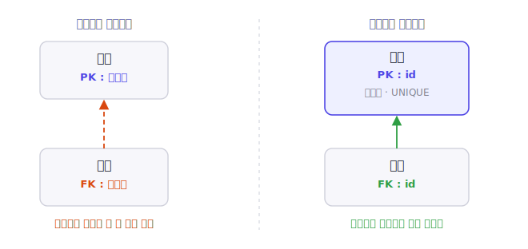

[6편](/blog/db-normalization-6-bcnf/)까지 1NF부터 BCNF까지, 함수적 종속을 기준으로 한 정규형을 살펴봤습니다. 정규형이 "테이블을 어떤 기준으로 나누는가"의 문제였다면, 이번 편은 조금 다른 질문을 다룹니다. 나눈 각 테이블에서 **행을 무엇으로 식별할 것인가**, 즉 기본키를 무엇으로 삼을지의 문제입니다. 여기서 갈리는 두 갈래가 **자연키**와 **대리키(surrogate key)** 입니다.

> **시리즈 구성**
> 1. [데이터 무결성과 키](/blog/db-normalization-1-integrity-and-keys/)
> 2. [이상현상과 함수적 종속성](/blog/db-normalization-2-anomalies/)
> 3. [제1정규형 (1NF)](/blog/db-normalization-3-1nf/)
> 4. [제2정규형 (2NF)](/blog/db-normalization-4-2nf/)
> 5. [제3정규형 (3NF)](/blog/db-normalization-5-3nf/)
> 6. [보이스-코드 정규형 (BCNF)](/blog/db-normalization-6-bcnf/)
> 7. **자연키와 대리키 — 키 설계** (이번 글)
> 8. 제4·제5정규형 개요와 그 너머
> 9. 정규화 절차와 역정규화

## 자연키와 대리키란

먼저 두 용어를 정의합니다.

- **자연키(natural key)**: 키의 값이 **이미 업무에서 의미를 갖는 실제 데이터**에서 나온 키입니다. 이메일, 사업자등록번호, 도서의 ISBN, 주민등록번호처럼 데이터베이스 바깥의 현실에 이미 존재하는 값입니다.
- **대리키(surrogate key)**: 업무 데이터에서 나오지 않고 **시스템이 만들어 낸, 그 자체로는 아무 업무 의미가 없는 식별자**입니다. 자동 증가 정수(auto-increment)나 UUID가 대표적입니다.

한 가지 짚을 점은, 자연키·대리키와 후보키·기본키는 **서로 다른 축**이라는 것입니다. 자연키냐 대리키냐는 키 값의 **출처**(업무 데이터냐, 시스템 생성이냐)를 가르는 구분이고, 후보키·기본키는 그 키가 테이블에서 맡는 **역할**([1편](/blog/db-normalization-1-integrity-and-keys/)에서 다뤘습니다)을 가르는 구분입니다. 자연키도 대리키도 각각 기본키가 될 수 있습니다. 이번 편의 질문은 "기본키 자리에 자연키를 둘 것인가, 대리키를 둘 것인가"입니다.

용어에 대한 주의도 하나 덧붙입니다. surrogate key의 한국어 번역은 통일돼 있지 않아 **대리키**, **인조키**, **인공키** 등이 혼용됩니다. 이 글에서는 시리즈 제목에 맞춰 대리키로 쓰되, 검색이나 원문 확인이 필요할 때를 위해 영어 용어 surrogate key를 함께 기억해 두면 좋습니다.

## 용어는 어디서 왔나

surrogate라는 용어는 1976년 P.A.V. Hall, J. Owlett, S.J.P. Todd의 논문 「Relations and Entities」에서 데이터베이스 문헌에 등장한 것으로 널리 인용됩니다. 이후 관계형 모델의 창시자 E.F. Codd가 1979년 논문 「Extending the Database Relational Model to Capture More Meaning」에서 이 개념을 자신의 확장 모델(RM/T) 안에 형식화했습니다. Codd는 이 논문에서 surrogate라는 용어를 **새로 만든 것이 아니라 앞선 연구에서 가져왔다**고 직접 밝히고 있습니다.

| 연도 | 문헌 | 기여 |
|------|------|------|
| 1976 | Hall·Owlett·Todd, 「Relations and Entities」 | surrogate 용어가 등장한 것으로 인용되는 문헌 |
| 1979 | Codd, 「Extending the Relational Model...」 | 관계형 모델(RM/T) 안에서 surrogate를 형식화 |

참고로 오늘날 데이터웨어하우스에서 말하는 "surrogate key"(차원 테이블의 의미 없는 정수 키)는 위 개념을 이어받되 더 좁고 실무적인 용법으로, Codd의 RM/T surrogate와 똑같지는 않습니다. 같은 단어가 분야마다 조금씩 다르게 쓰인다는 점은 알아둘 만합니다.

## Codd가 지적한 자연키의 문제

대리키를 왜 쓰는지는, Codd가 1979년 논문에서 **사용자가 정하는 키(자연키)를 영구적인 식별자로 쓸 때의 어려움**으로 정리한 세 가지를 보면 분명해집니다.

1. **값이 바뀐다.** 사용자가 정한 키 값은 사용자가 바꿀 수 있습니다. Codd는 회사 합병 같은 상황을 예로 들었습니다. 키 값이 바뀌면 그 키를 참조하던 모든 곳을 함께 바꿔야 합니다.
2. **같은 실체를 서로 다른 키로 가리킬 수 있다.** 한 테이블은 주민등록번호로, 다른 테이블은 사번으로 같은 사람을 식별할 수 있습니다. 서로 다른 도메인의 키가 같은 실체를 가리키는 셈입니다.
3. **키가 생기기 전이나 없어진 뒤에도 실체를 다뤄야 한다.** 아직 사번이 없는 입사 지원자나, 더 이상 사번이 유효하지 않은 퇴직자처럼, 업무 키가 없는 상태에서도 그 실체의 정보를 저장해야 할 수 있습니다.

Codd의 해법이 바로 **시스템이 부여하는 영구 식별자**, 즉 대리키였습니다. 그는 이 식별자에 대해 "데이터베이스 사용자는 시스템이 대리키를 생성하거나 삭제하게 할 수는 있지만, 그 값을 통제할 수 없고 그 값이 사용자에게 표시되지도 않는다"고 적었습니다. 값이 업무와 무관하게 시스템 안에서만 결정되므로, 위 세 가지 문제에서 자유로워집니다.

> 다만 Codd가 이상적으로 그린 대리키는 "값이 사용자에게 절대 보이지 않는" 것이었습니다. 우리가 실무에서 흔히 쓰는, URL이나 화면에 그대로 노출되는 자동 증가 정수 ID는 이 엄격한 정의와는 거리가 있습니다. 그래서 일부 문헌은 이런 노출된 ID를 엄밀한 의미의 surrogate와 구분하기도 합니다. 이 글에서는 실무 관행을 따라, 시스템이 생성한 의미 없는 식별자를 넓게 대리키로 부르겠습니다.

## 자연키의 장단점

자연키는 그 자체가 업무적 의미를 갖는다는 데서 장단점이 모두 나옵니다.

**장점**

- **값 자체가 의미를 갖는다.** 키만 봐도 어떤 데이터인지 알 수 있어, 다른 테이블을 조인하지 않고도 내용을 파악할 수 있는 경우가 있습니다.
- **현실의 유일성이 자동으로 강제된다.** 이메일이나 사업자등록번호를 키로 두면, 현실에서 유일해야 하는 값의 중복이 키 제약으로 곧바로 막힙니다.

**단점**

- **값이 바뀔 수 있다.** 위에서 본 Codd의 첫 번째 문제입니다. 자연키 값이 바뀌면, 그 값을 외래키로 참조하던 모든 행을 함께 고쳐야 합니다.
- **복합키가 자식 테이블로 전파된다.** 자연키가 여러 컬럼으로 이루어진 복합키라면, 그 키를 참조하는 모든 자식 테이블에 그 컬럼들이 외래키로 전부 따라 들어갑니다.
- **민감정보가 퍼질 수 있다.** 주민등록번호처럼 민감한 값을 키로 쓰면, 그 값이 외래키를 타고 여러 테이블로 퍼집니다. 게다가 주민등록번호는 법적으로 수집·이용이 제한되고, 한때 바꿀 수 없는 값으로 여겨졌으나 지금은 제한적으로 변경이 가능해졌습니다. "불변"이라는 전제 자체가 깨질 수 있는 것입니다.

## 대리키의 장단점

대리키는 업무 의미가 없다는 데서 장단점이 갈립니다.

**장점**

- **안정적이다.** 업무 사실이 바뀌어도 대리키 값은 그대로입니다. 그래서 키를 참조하는 곳을 고칠 일이 없고, 자연키에 해당하는 업무 데이터는 자유롭게 수정할 수 있습니다.
- **단일 컬럼으로 끝난다.** 자연키가 복합키여도, 기본키를 단일 컬럼 대리키로 두면 자식 테이블에는 그 한 컬럼만 외래키로 넘어갑니다. 복합키 전파가 사라집니다.
- **대체로 작고 단순하다.** 정수형 대리키는 길이가 긴 자연키보다 작은 경우가 많아, 외래키와 인덱스의 크기를 줄이는 데 유리할 수 있습니다.

**단점**

- **그 자체로는 의미가 없다.** 키만 봐서는 어떤 데이터인지 알 수 없어, 내용을 알려면 조인이 필요합니다.
- **자연키의 중복을 막아 주지 않는다.** 대리키를 기본키로 두면 행은 유일해지지만, 이메일 같은 업무 값이 중복 입력되는 것은 막지 못합니다. 따라서 자연키 컬럼에 **별도의 UNIQUE 제약**을 걸어 줘야 현실의 유일성이 지켜집니다.
- **순차 값은 정보를 흘릴 수 있다.** 자동 증가 정수를 외부에 그대로 노출하면, 값을 1씩 늘려 보며 다른 행에 접근을 시도하거나(흔히 IDOR로 불리는 접근 통제 문제), 번호 간격으로 데이터 규모를 추측당할 수 있습니다. 이를 줄이려고 추측하기 어려운 식별자(예: UUID)를 쓰기도 하지만, 식별자를 바꾸는 것만으로 접근 통제가 해결되지는 않습니다.

## 실무에서 자주 보이는 선택과 함정

**이메일을 기본키로?** 이메일은 바뀝니다. 이직, 도메인 변경, 보안상의 이유로 사용자가 주소를 바꾸면, 그 이메일을 참조하던 모든 행을 함께 고쳐야 합니다. 그래서 흔히 권장되는 방식은 **대리키를 기본키로 두고, 이메일 컬럼에는 UNIQUE 제약을 거는** 것입니다.

**주민등록번호를 기본키로?** 위에서 본 대로 민감정보이고 법적 제약이 있으며, 변경 가능성도 생겼습니다. 기본키로 삼기에는 위험이 큽니다.

**자주 쓰는 절충 패턴.** 정리하면, 많은 경우 다음 조합이 무난합니다.

- 기본키: 대리키(자동 증가 정수나 UUID) — 안정성과 단순함을 얻는다
- 자연키(이메일, 사업자등록번호 등): UNIQUE 제약으로 유일성을 지키고, 사용자는 이 값으로 조회한다

이렇게 하면 키의 안정성(대리키)과 현실의 유일성(자연키 UNIQUE)을 함께 가져갈 수 있습니다.

**대리키를 무엇으로 만들 것인가.** 대리키의 구체적인 구현으로는 자동 증가 정수와 UUID가 많이 쓰입니다. 자동 증가 정수는 작고 순서대로 쌓여 인덱스에 유리하지만, 분산 환경에서 번호를 겹치지 않게 발급하기 어렵고 외부 노출 시 앞서 본 문제가 있습니다. UUID는 분산 환경에서 독립적으로 생성하기 좋지만, 무작위 UUID는 인덱스에서 값이 흩어져 삽입 성능에 영향을 줄 수 있습니다. 이 때문에 생성 시각을 앞쪽에 담아 순서를 어느 정도 보존하는 시간 정렬 UUID(예: UUID 버전 7)도 표준화되어 쓰입니다. 어느 쪽이 유리한지는 데이터 규모와 환경에 따라 달라지므로, 정해진 답이 있다기보다 트레이드오프로 보는 편이 정확합니다.

## 그래서 무엇을 쓰나

자연키와 대리키 중 무엇이 항상 옳다고 말하기는 어렵습니다. 이 선택은 데이터의 성격과 시스템 환경에 따라 달라지고, 실무자들 사이에서도 견해가 갈리는 주제입니다.

대체로 다음과 같이 정리할 수 있습니다. 기본키로는 **대리키를 두고 자연키에는 UNIQUE 제약을 거는** 조합이 안정적이어서 널리 쓰입니다. 다만 자연키가 정말로 바뀌지 않고(예: 변하지 않는 표준 코드) 단순한 단일 컬럼이라면, 자연키를 그대로 기본키로 쓰는 것이 더 간결할 수 있습니다. 핵심은 "키는 가급적 바뀌지 않아야 한다"는 원칙이며, 그 원칙을 어느 쪽이 더 잘 지키는지를 데이터마다 따져 보는 것입니다.

## 정리

- **자연키**는 업무 데이터에서 온 키, **대리키**는 시스템이 만든 의미 없는 식별자다. 이는 키의 출처를 가르는 구분으로, 키의 역할을 가르는 후보키·기본키와는 다른 축이다
- surrogate 용어는 1976년 Hall·Owlett·Todd의 문헌에서 인용되며, Codd가 1979년 논문에서 관계형 모델 안에 형식화했다
- Codd는 자연키를 영구 식별자로 쓸 때의 문제로 **값이 바뀜 / 같은 실체를 다른 키로 가리킴 / 키가 없는 시점에도 실체를 다뤄야 함**을 들었고, 그 해법으로 대리키를 제시했다
- 자연키는 의미와 현실 유일성을 주지만 가변성·복합키 전파·민감정보 노출의 단점이 있고, 대리키는 안정성과 단순함을 주지만 의미가 없어 별도의 UNIQUE 제약이 필요하다
- 실무에서는 **대리키를 기본키로, 자연키를 UNIQUE 제약으로** 두는 절충이 널리 쓰이지만, 정답은 데이터 성격에 따라 달라진다

다음 편에서는 다시 정규형으로 돌아와, 함수적 종속을 넘어선 종속을 다루는 **[제4·제5정규형](/blog/db-normalization-8-higher-normal-forms/)** 을 개요 수준으로 살펴보겠습니다.

## 참고 문헌

- [E.F. Codd, *Extending the Database Relational Model to Capture More Meaning*](https://doi.org/10.1145/320107.320109), ACM Transactions on Database Systems 4(4), 1979, pp. 397–434. (대리키 개념을 관계형 모델 안에 형식화한 논문. [전문 PDF](http://www.esp.org/foundations/database-theory/holdings/codd-1979.pdf) 4절 "Designation of Entities")
- [P.A.V. Hall, J. Owlett, S.J.P. Todd, *Relations and Entities*](https://dblp.org/db/conf/ds/modelling76.html), in *Modelling in Data Base Management Systems* (ed. G.M. Nijssen), North-Holland, 1976. (surrogate 용어가 등장한 것으로 인용되는 문헌)
- [Surrogate key — Wikipedia](https://en.wikipedia.org/wiki/Surrogate_key) — 대리키의 정의·역사와 동의어.
- [Natural key — Wikipedia](https://en.wikipedia.org/wiki/Natural_key) — 자연키의 정의와 장단점.
