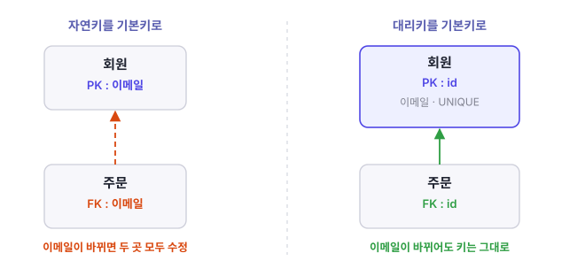
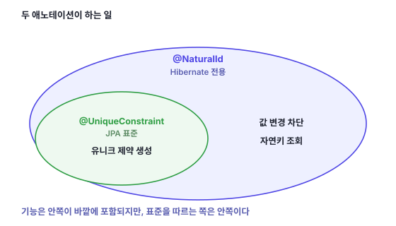

예전에 저보다 경험이 많은 분과 일한 적이 있습니다. 혼자 붙들고 있던 고민이 하나 있었는데, 마침 여쭤보면 답도 얻고 가까워지기도 하겠다 싶었습니다.

물어본 것은 이것이었습니다. JPA에서는 기본키를 대리키로 두는 것이 관행인데, 그러면 이 엔티티가 실제로 무엇으로 유일한지는 어디에 적히는가.

돌아온 답은 대리키라는 개념 자체가 없다는 것이었습니다. 그 자리에서 검색해 자료가 여럿 나오는 것을 확인하고도 받아들여지지 않았습니다. 개념에 대한 답 대신 제 전공과 출신 학교를 묻는 말이 이어졌습니다.

당시에는 상대의 연차 때문에 제가 잘못 알고 있나 싶어 혼자 삭였습니다. 다시는 그런 자리에서 아무 말도 못 하는 일이 없도록 기본부터 다시 공부했습니다. 누가 물어도 개념으로 답할 수 있도록요.

썩 좋은 기억은 아닙니다. 다만 그 일이 이 시리즈를 쓰는 계기이자 원동력이 됐습니다.

[6편](/blog/db-normalization-6-bcnf/)까지 1NF부터 BCNF까지, 함수적 종속을 기준으로 한 정규형을 살펴봤습니다. 정규형이 "테이블을 어떤 기준으로 나누는가"의 문제였다면, 이번 편은 조금 다른 질문을 다룹니다. 나눈 각 테이블에서 **행을 무엇으로 식별할 것인가**, 즉 기본키를 무엇으로 삼을지의 문제입니다. 여기서 갈리는 두 갈래가 **자연키**와 **대리키(surrogate key)** 입니다.

> **시리즈 구성**
> 1. [데이터 무결성과 키](/blog/db-normalization-1-integrity-and-keys/)
> 2. [이상현상과 함수적 종속성](/blog/db-normalization-2-anomalies/)
> 3. [제1정규형 (1NF)](/blog/db-normalization-3-1nf/)
> 4. [제2정규형 (2NF)](/blog/db-normalization-4-2nf/)
> 5. [제3정규형 (3NF)](/blog/db-normalization-5-3nf/)
> 6. [보이스-코드 정규형 (BCNF)](/blog/db-normalization-6-bcnf/)
> 7. **자연키와 대리키: 키 설계** (이번 글)
> 8. [제4, 제5정규형 개요와 그 너머](/blog/db-normalization-8-higher-normal-forms/)
> 9. 정규화 절차와 역정규화

## 자연키와 대리키란

- **자연키(natural key)**: 키의 값이 **이미 업무에서 의미를 갖는 실제 데이터**에서 나온 키입니다. 이메일, 사업자등록번호, 도서의 ISBN, 주민등록번호처럼 데이터베이스 바깥의 현실에 이미 존재하는 값입니다.
- **대리키(surrogate key)**: 업무 데이터에서 나오지 않고 **시스템이 만들어 낸, 그 자체로는 아무 업무 의미가 없는 식별자**입니다. 자동 증가 정수(auto-increment)나 UUID가 대표적입니다.

한 가지 짚을 점은, 자연키, 대리키와 후보키, 기본키는 **서로 다른 구분**이라는 것입니다. 자연키냐 대리키냐는 키 값이 어디서 왔는지를 가르는 구분입니다. 업무 데이터에서 왔는지, 시스템이 만들었는지입니다. 후보키와 기본키는 그 키가 테이블에서 맡는 **역할**을 가르는 구분입니다. 역할 쪽은 [1편](/blog/db-normalization-1-integrity-and-keys/)에서 다뤘습니다. 자연키도 대리키도 각각 기본키가 될 수 있습니다. 이번 편의 질문은 "기본키 자리에 자연키를 둘 것인가, 대리키를 둘 것인가"입니다.

용어에 대한 주의도 하나 덧붙입니다. surrogate key의 한국어 번역은 통일돼 있지 않아 **대리키**, **인조키**, **인공키** 등이 혼용됩니다. 이 글에서는 시리즈 제목에 맞춰 대리키로 쓰되, 검색이나 원문 확인이 필요할 때를 위해 영어 용어 surrogate key를 함께 기억해 두면 좋습니다.

## 용어는 어디서 왔을까?

surrogate라는 용어가 데이터베이스 문헌에 등장한 것은 1976년으로 널리 인용됩니다. P.A.V. Hall, J. Owlett, S.J.P. Todd의 논문 「Relations and Entities」입니다.

이후 관계형 모델의 창시자 E.F. Codd가 1979년 논문에서 이 개념을 자신의 확장 모델(RM/T) 안에 형식화했습니다. 논문 제목은 「Extending the Database Relational Model to Capture More Meaning」입니다. surrogate 개념 자체는 Codd가 새로 만든 것이 아니라, 앞선 1976년 연구에서 이어받은 것입니다.

| 연도 | 문헌 | 기여 |
|------|------|------|
| 1976 | Hall, Owlett, Todd, 「Relations and Entities」 | surrogate 용어가 등장한 것으로 인용되는 문헌 |
| 1979 | Codd, 「Extending the Relational Model...」 | 관계형 모델(RM/T) 안에서 surrogate를 형식화 |

오늘날 데이터웨어하우스에서 말하는 "surrogate key"는 차원 테이블의 의미 없는 정수 키를 가리킵니다. 위 개념을 이어받았지만 더 좁고 실무적인 용법이라, Codd의 RM/T surrogate와 똑같지는 않습니다. 같은 단어가 분야마다 조금씩 다르게 쓰입니다.

## Codd가 지적한 자연키의 문제

Codd 박사는 1979년 논문에서 **사용자가 정하는 키(자연키)를 영구적인 식별자로 쓸 때의 어려움**을 세 가지로 정리했습니다.

1. **값이 바뀐다**: 사용자가 정한 키 값은 사용자가 바꿀 수 있습니다. 회사 합병으로 코드 체계가 개편되는 상황이 그 예입니다. 키 값이 바뀌면 그 키를 참조하던 모든 곳을 함께 바꿔야 합니다.
2. **같은 실체를 서로 다른 키로 가리킬 수 있다**: 한 테이블은 주민등록번호로, 다른 테이블은 사번으로 같은 사람을 식별할 수 있습니다. 서로 다른 도메인의 키가 같은 실체를 가리키는 셈입니다.
3. **키가 생기기 전이나 없어진 뒤에도 실체를 다뤄야 한다**: 아직 사번이 없는 입사 지원자가 그렇습니다. 사번이 더 이상 유효하지 않은 퇴직자도 마찬가지입니다. 업무 키가 없는 상태에서도 그 실체의 정보를 저장해야 할 수 있습니다.

Codd의 해법이 바로 **시스템이 부여하는 영구 식별자**, 즉 대리키였습니다. 이 식별자는 사용자가 생성이나 삭제를 요청할 수는 있어도 값 자체는 통제할 수 없고, 사용자에게 보이지도 않습니다. 값이 업무와 무관하게 시스템 안에서만 결정되므로, 위 세 가지 문제에서 자유로워집니다.

> 다만 Codd가 이상적으로 그린 대리키는 "값이 사용자에게 절대 보이지 않는" 것이었습니다. URL이나 화면에 그대로 노출되는 자동 증가 정수 ID는 이 엄격한 정의와는 거리가 있습니다. 그래서 일부 문헌은 이런 노출된 ID를 엄밀한 의미의 surrogate와 구분하기도 합니다. 이 글에서는 시스템이 생성한 의미 없는 식별자를 넓게 대리키로 부르겠습니다.

## 자연키의 장단점

자연키는 그 자체가 업무적 의미를 갖는다는 데서 장단점이 모두 나옵니다.

**장점**

- **값 자체가 의미를 갖는다**: 키만 봐도 어떤 데이터인지 알 수 있어 다른 테이블을 조인하지 않고도 내용을 파악할 수 있는 경우가 있습니다.
- **현실의 유일성이 자동으로 강제된다**: 이메일이나 사업자등록번호를 키로 두면, 현실에서 유일해야 하는 값의 중복이 키 제약으로 곧바로 막힙니다.

**단점**

- **값이 바뀔 수 있다**: 위에서 본 Codd의 첫 번째 문제입니다. 자연키 값이 바뀌면, 그 값을 외래키로 참조하던 모든 행을 함께 고쳐야 합니다.
- **복합키가 자식 테이블로 전파된다**: 자연키가 여러 컬럼으로 이루어진 복합키라면 그 컬럼이 전부 자식 테이블로 따라 들어갑니다. 그 키를 참조하는 모든 테이블이 대상입니다.
- **민감정보가 퍼질 수 있다**: 주민등록번호처럼 민감한 값을 키로 쓰면, 그 값이 외래키를 타고 여러 테이블로 퍼집니다. 게다가 주민등록번호는 법적으로 수집, 이용이 제한되고, 한때 바꿀 수 없는 값으로 여겨졌으나 지금은 제한적으로 변경이 가능해졌습니다. "불변"이라는 전제 자체가 깨질 수 있는 것입니다.

## 대리키의 장단점

대리키는 업무 의미가 없다는 데서 장단점이 갈립니다.

**장점**

- **안정적이다**: 업무 사실이 바뀌어도 대리키 값은 그대로입니다. 그래서 키를 참조하는 곳을 고칠 일이 없고, 자연키에 해당하는 업무 데이터는 자유롭게 수정할 수 있습니다.
- **단일 컬럼으로 끝난다**: 자연키가 복합키여도, 기본키를 단일 컬럼 대리키로 두면 자식 테이블에는 그 한 컬럼만 외래키로 넘어갑니다. 복합키 전파가 사라집니다.
- **대체로 작고 단순하다**: 정수형 대리키는 길이가 긴 자연키보다 작은 경우가 많아 외래키와 인덱스의 크기를 줄이는 데 유리할 수 있습니다.

**단점**

- **그 자체로는 의미가 없다**: 키만 봐서는 어떤 데이터인지 알 수 없어 내용을 알려면 조인이 필요합니다.
- **자연키의 중복을 막아 주지 않는다**: 대리키를 기본키로 두면 행은 유일해지지만, 이메일 같은 업무 값이 중복 입력되는 것은 막지 못합니다. 따라서 자연키 컬럼에 **별도의 UNIQUE 제약**을 걸어 줘야 현실의 유일성이 지켜집니다.
- **순차 값은 정보를 흘릴 수 있다**: 자동 증가 정수를 외부에 그대로 노출하면 값을 1씩 늘려 보며 다른 행에 접근을 시도할 수 있습니다. 흔히 IDOR로 불리는 접근 통제 문제입니다. 번호 간격으로 데이터 규모를 추측당하기도 합니다. 이를 줄이려고 추측하기 어려운 식별자(예: UUID)를 쓰기도 하지만, 식별자를 바꾸는 것만으로 접근 통제가 해결되지는 않습니다.

## 자주 보이는 선택과 함정

**이메일을 기본키로?** 이메일은 바뀝니다. 이직, 도메인 변경, 보안상의 이유로 사용자가 주소를 바꾸면, 그 이메일을 참조하던 모든 행을 함께 고쳐야 합니다. 이메일을 기본키에서 빼고 **UNIQUE 제약으로 옮기면** 이 문제가 사라집니다. 참조하는 쪽은 대리키를 보고 있으니 이메일이 바뀌어도 그대로입니다.

**주민등록번호를 기본키로?** 위에서 본 대로 민감정보이고 법적 제약이 있으며, 변경 가능성도 생겼습니다. 기본키로 삼기에는 위험이 큽니다.

**두 가지를 함께 가져가는 조합**: 기본키와 유일성을 갈라 두는 방법입니다.

- 기본키: 대리키(자동 증가 정수나 UUID), 안정성과 단순함을 얻는다
- 자연키(이메일, 사업자등록번호 등): UNIQUE 제약으로 유일성을 지키고, 사용자는 이 값으로 조회한다

이렇게 하면 키의 안정성(대리키)과 현실의 유일성(자연키 UNIQUE)을 함께 가져갈 수 있습니다.



**대리키를 무엇으로 만들 것인가**: 대리키의 구체적인 구현으로는 자동 증가 정수와 UUID가 많이 쓰입니다. 자동 증가 정수는 작고 순서대로 쌓여 인덱스에 유리하지만, 분산 환경에서 번호를 겹치지 않게 발급하기 어렵고 외부 노출 시 앞서 본 문제가 있습니다. UUID는 분산 환경에서 독립적으로 생성하기 좋지만, 무작위 UUID는 인덱스에서 값이 흩어져 삽입 성능에 영향을 줄 수 있습니다. 이 때문에 생성 시각을 앞쪽에 담아 순서를 어느 정도 보존하는 시간 정렬 UUID(예: UUID 버전 7)도 표준화되어 쓰입니다. 어느 쪽이 유리한지는 데이터 규모와 환경에 따라 달라지므로, 정해진 답이 있다기보다 트레이드오프로 보는 편이 정확합니다.

## JPA에서 자연키는 어떻게 표현할까?

기본키를 대리키로 두면 엔티티 정의에서 자연키가 갈 곳을 잃습니다. `@Id`는 대리키가 차지하고, 이 엔티티가 현실에서 무엇으로 유일한지는 코드 어디에도 안 남습니다. 도입부에서 제가 붙들고 있던 고민이 이것이었습니다.

답은 두 층입니다.

**첫째, 유니크 제약을 스키마에 박습니다**. 이게 필수입니다. 제약이 없으면 같은 이메일을 가진 행이 둘 들어와도 데이터베이스가 막지 않습니다.

```java
@Entity
@Table(uniqueConstraints = @UniqueConstraint(columnNames = "email"))
public class Member {
    @Id @GeneratedValue
    private Long id;          // 대리키

    @Column(nullable = false)
    private String email;     // 자연키
}
```

**둘째, Hibernate를 쓴다면 `@NaturalId`를 붙일 수 있습니다**. 표시만 하는 애노테이션이 아닙니다. 유니크 제약을 만들고, 값이 바뀌는 것을 막고, 자연키로 조회하는 길을 엽니다.

```java
@Entity
public class Member {
    @Id @GeneratedValue
    private Long id;

    @NaturalId
    @Column(nullable = false)
    private String email;
}
```

`@NaturalId`는 `org.hibernate.annotations` 패키지에 있습니다. 이 패키지는 JPA가 정의한 매핑 애노테이션을 확장한 것이라고 Javadoc이 적습니다. 표준에 기대야 하는 코드라면 유니크 제약만으로 가는 편이 안전합니다.

Hibernate 7 입문서는 이 애노테이션이 붙은 컬럼에 유니크 제약을 자동으로 만든다고 적습니다. 확인해 봤습니다. Hibernate 7.0.0.Final과 H2 2.3.232에서 엔티티 셋을 만들어 생성된 스키마를 조회한 결과입니다.

| 엔티티 | 자연키 컬럼에 붙인 것 | 생성된 UNIQUE 제약 |
|---|---|---|
| 아무것도 안 붙임 | 없음 | 없음 |
| `@NaturalId` | `@NaturalId` | 있음 |
| 표준 JPA | `@UniqueConstraint` | 있음 |

같은 이메일로 두 번 `INSERT` 하면 `@NaturalId` 쪽과 `@UniqueConstraint` 쪽은 두 번째에서 막힙니다. 아무것도 안 붙인 쪽은 두 건이 다 들어갑니다.

값이 바뀌는 것을 막는다는 것도 확인됩니다. `@NaturalId`는 붙인 값을 바꿀 수 없는 것이 기본이라 영속 상태에서 자연키 값을 고치고 커밋하면 이렇게 거부됩니다.

```
An immutable natural identifier of entity demo.MemberWithNaturalId
was altered from `mut@test.com` to `changed@test.com`
```

바뀔 수 있는 값이면 `mutable = true`로 열어 줘야 합니다. 그 밖에 자연키로 조회하는 API가 따로 있고, 여러 필드에 붙여 복합 자연키로 둘 수도 있습니다.



기능만 보면 `@UniqueConstraint`가 하는 일이 `@NaturalId` 안에 들어갑니다. 다만 표준을 따르는 쪽은 반대이고, 두 애노테이션이 말하는 바도 다릅니다. 유니크 제약은 이 컬럼 값이 중복되면 안 된다는 뜻이고, `@NaturalId`는 이것이 이 엔티티의 자연키라는 뜻입니다. 유일한 컬럼이 여럿이어도 자연키는 그중 하나입니다.

**한 가지 전제가 있습니다**. 애노테이션이 제약을 만드는 것은 스키마를 애노테이션으로 생성할 때뿐입니다. DDL을 Liquibase나 Flyway로 따로 관리한다면 제약은 그쪽 스크립트에 적어야 합니다. 그런 환경에서 `@NaturalId`만 붙여 두면 코드에는 자연키라고 적혀 있는데 데이터베이스에는 제약이 없는 상태가 됩니다.

버전에 민감한 항목이 섞여 있습니다. 유니크 제약 자동 생성은 Hibernate 7 입문서 기준입니다. 조회 API도 예전의 `byNaturalId()` 계열이 지금 문서에서는 오래된 방식으로 표기됩니다. 쓰기 전에 자기 버전 문서를 확인하는 편이 좋습니다.

정리하면 이렇습니다. **유일성을 지키는 것은 유니크 제약이고, `@NaturalId`는 그 위에 의도를 적고 조회와 검사를 얹는 선택지입니다**. 둘 중 하나만 고른다면 제약이 먼저입니다.

## 자연키가 없으면 정규화를 못 할까?

계약을 담는 테이블을 두고 논의한 적이 있습니다. 계약이 갱신되면 그것을 어떻게 넣을지가 쟁점이었습니다.

저는 기존 행의 계약 기간만 새 날짜로 고치자고 했습니다. 갱신은 같은 계약의 기간이 바뀐 것뿐이라고 봤습니다. 팀은 갱신된 계약을 새 행으로 넣고 키도 새로 주자는 쪽으로 모였습니다. 갱신 전후를 별개 건으로 봐야 한다는 것이었습니다.

그 자리에서 저도 납득했습니다. 기존 행을 고치면 이전 기간의 계약 내용이 남지 않습니다.

문제는 그다음에 나온 말이었습니다. 계약마다 키를 새로 발급해야 하니 이 테이블은 정규화를 할 수 없다는 것이었습니다.

**키를 새로 발급하는 것과 정규화는 별개입니다**. 정규형은 기본키를 무엇으로 골랐느냐로 정의되지 않습니다. [2편](/blog/db-normalization-2-anomalies/)에서 다룬 함수적 종속과 [1편](/blog/db-normalization-1-integrity-and-keys/)에서 다룬 후보키로 정의됩니다. 대리키도 유일하니 후보키가 됩니다. 자연키가 따로 있으면 그것도 후보키입니다. 후보키는 여럿일 수 있습니다.

그러니 "안정적인 자연키를 못 찾겠다"와 "정규화를 못 한다"는 서로 다른 문제입니다. 앞의 것은 기본키를 무엇으로 삼을지의 문제이고, 뒤의 것은 속성 사이의 종속 구조 문제입니다.

**다만 반대쪽 오해도 있습니다**. 대리키를 붙였다고 원래 있던 종속이 사라지지는 않습니다.

```
id | 주문번호 | 상품코드 | 상품명
```

여기에 `상품코드 → 상품명`이라는 종속이 있으면 3NF 위반입니다. 앞에 `id`를 붙여도 그 종속은 그대로 있고, 상품명을 고칠 때 같은 상품을 참조하는 행을 전부 고쳐야 하는 이상현상도 그대로입니다. 대리키는 행을 식별해 줄 뿐, 속성 사이의 종속을 없애지 않습니다.

정리하면 대리키가 정규화를 가능하게 하는 것이 아닙니다. **정규화 판정이 애초에 기본키와 무관하게 이뤄집니다**. 판정은 함수적 종속을 보고 합니다.

그리고 대리키를 쓸수록 앞 절의 이야기가 더 중요해집니다. 그 행이 현실의 무엇에 대응하는지가 어딘가에는 적혀 있어야 합니다. 갱신될 때마다 새 행으로 쌓는 데이터라면 더 그렇습니다. 문서 번호든 번호와 회차의 조합이든, 그것이 이 행의 자연키이고 유니크 제약을 걸 자리입니다. 적어 두지 않으면 같은 건이 두 번 들어와도 막을 데가 없습니다.

## 그래서 무엇을 써야 할까?

자연키와 대리키 중 무엇이 항상 옳다고 말하기는 어렵습니다. 이 선택은 데이터의 성격과 시스템 환경에 따라 달라지고, 견해가 갈리는 주제이기도 합니다.

기본키로는 **대리키를 두고 자연키에는 UNIQUE 제약을 거는** 조합이 안정적입니다. 키가 바뀌지 않으니 참조하는 쪽을 고칠 일이 없고, 유일성은 제약이 지킵니다. 다만 자연키가 정말로 바뀌지 않고(예: 변하지 않는 표준 코드) 단순한 단일 컬럼이라면, 자연키를 그대로 기본키로 쓰는 것이 더 간결할 수 있습니다. 핵심은 "키는 가급적 바뀌지 않아야 한다"는 원칙이며, 그 원칙을 어느 쪽이 더 잘 지키는지를 데이터마다 따져 보는 것입니다.

## 정리

- **자연키**는 업무 데이터에서 온 키, **대리키**는 시스템이 만든 의미 없는 식별자다. 이는 키의 출처를 가르는 구분으로, 키의 역할을 가르는 후보키, 기본키와는 다르다
- surrogate 용어는 1976년 Hall, Owlett, Todd의 문헌에서 인용되며, Codd가 1979년 논문에서 관계형 모델 안에 형식화했다
- Codd는 자연키를 영구 식별자로 쓸 때의 문제로 **값이 바뀜 / 같은 실체를 다른 키로 가리킴 / 키가 없는 시점에도 실체를 다뤄야 함**을 들었고, 그 해법으로 대리키를 제시했다
- 자연키는 의미와 현실 유일성을 주지만 가변성, 복합키 전파, 민감정보 노출의 단점이 있다
- 대리키는 안정성과 단순함을 주지만 의미가 없어 별도의 UNIQUE 제약이 필요하다
- **대리키를 기본키로, 자연키를 UNIQUE 제약으로** 두면 키의 안정성과 현실의 유일성을 함께 가져갈 수 있다. 다만 정답은 데이터 성격에 따라 달라진다

대리키는 누가 지어낸 말이 아닙니다. 1976년 문헌에 등장하고 1979년 Codd의 논문에서 관계형 모델 안에 자리를 잡은 개념입니다. 위 참고 문헌에 서지정보를 적어 두었습니다.

정규화가 중요하다는 말은 어디서나 듣습니다. 그런데 정규화는 함수적 종속 위에 서 있고, 함수적 종속은 무엇이 무엇을 결정하는가의 문제, 곧 키의 문제입니다. 후보키를 고르지 못하면 그 테이블이 어느 정규형에 있는지도 판정할 수 없습니다. 정규화를 이야기하려면 키 개념이 먼저 서 있어야 한다고 생각합니다.

다음 편에서는 다시 정규형으로 돌아옵니다. 함수적 종속을 넘어선 종속을 다루는 **[제4, 제5정규형](/blog/db-normalization-8-higher-normal-forms/)** 을 개요 수준으로 살펴보겠습니다.

## 부록. 실험환경

본문의 유니크 제약과 불변성은 Hibernate ORM 7.0.0.Final, H2 2.3.232, JDK 21에서 확인했습니다.

엔티티 셋을 같은 영속성 단위에 두고 `hibernate.hbm2ddl.auto=create`로 스키마를 만든 뒤, `INFORMATION_SCHEMA`에서 유니크 제약을 조회했습니다.

```java
@Entity @Table(name = "member_plain")                       // 아무것도 안 붙임
class MemberPlain { @Id @GeneratedValue Long id; @Column(nullable=false) String email; }

@Entity @Table(name = "member_natural_id")                  // @NaturalId 만
class MemberWithNaturalId { @Id @GeneratedValue Long id; @NaturalId @Column(nullable=false) String email; }

@Entity @Table(name = "member_unique",                      // 표준 JPA 만
       uniqueConstraints = @UniqueConstraint(columnNames = "email"))
class MemberUniqueConstraint { @Id @GeneratedValue Long id; @Column(nullable=false) String email; }
```

```sql
SELECT tc.TABLE_NAME, ccu.COLUMN_NAME
FROM INFORMATION_SCHEMA.TABLE_CONSTRAINTS tc
JOIN INFORMATION_SCHEMA.CONSTRAINT_COLUMN_USAGE ccu
  ON tc.CONSTRAINT_NAME = ccu.CONSTRAINT_NAME
WHERE tc.TABLE_NAME LIKE 'MEMBER%' AND tc.CONSTRAINT_TYPE = 'UNIQUE';
-- MEMBER_NATURAL_ID / EMAIL
-- MEMBER_UNIQUE     / EMAIL
```

중복 차단은 같은 이메일로 두 번 `persist` 해서 확인했고, 불변성은 영속 상태에서 자연키 값을 바꾼 뒤 커밋해서 확인했습니다.

## 참고 문헌

- [E.F. Codd, *Extending the Database Relational Model to Capture More Meaning*](https://doi.org/10.1145/320107.320109), ACM Transactions on Database Systems 4(4), 1979, pp. 397–434. (대리키 개념을 관계형 모델 안에 형식화한 논문. [전문 PDF](http://www.esp.org/foundations/database-theory/holdings/codd-1979.pdf) 4절 "Designation of Entities")
- [P.A.V. Hall, J. Owlett, S.J.P. Todd, *Relations and Entities*](https://dblp.org/db/conf/ds/modelling76.html), in *Modelling in Data Base Management Systems* (ed. G.M. Nijssen), North-Holland, 1976. (surrogate 용어가 등장한 것으로 인용되는 문헌)
- [Surrogate key, Wikipedia](https://en.wikipedia.org/wiki/Surrogate_key): 대리키의 정의, 역사와 동의어.
- [Natural key, Wikipedia](https://en.wikipedia.org/wiki/Natural_key): 자연키의 정의와 장단점.
- [A Short Guide to Hibernate 7, Natural id attributes](https://docs.hibernate.org/orm/current/introduction/html_single/Hibernate_Introduction.html#natural-id-attributes): `@NaturalId` 가 붙은 필드가 매핑하는 컬럼에 Hibernate 가 UNIQUE 제약을 자동으로 만든다.
- [Hibernate ORM User Guide, Natural Ids](https://docs.hibernate.org/orm/current/userguide/html_single/Hibernate_User_Guide.html#naturalid): 자연키는 하나 이상의 영속 속성으로 정의한다. 기본은 불변이고 flush 시점에 값이 바뀌지 않았는지 검사한다.
- [org.hibernate.annotations 패키지 요약](https://docs.hibernate.org/orm/current/javadocs/org/hibernate/annotations/package-summary.html): JPA 가 정의한 O/R 매핑 애노테이션을 확장하는 매핑 애노테이션 모음이다.
