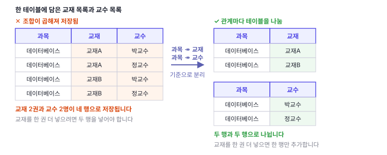
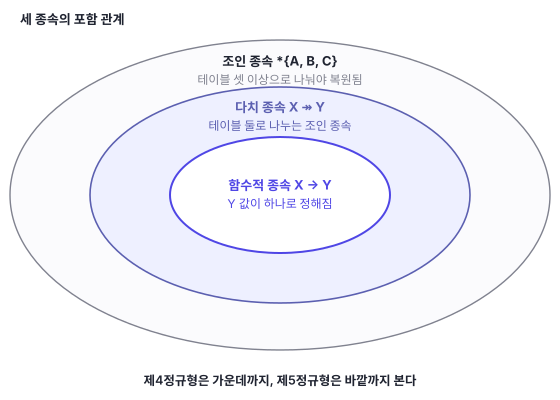

사실 저는 BCNF 이상의 정규형을 다뤄 본 경험이 적습니다. 공부할 때도 제4정규형부터는 그런 것이 있구나 하는 정도였고, 실제로 마주칠 일이 거의 없었습니다.

[7편](/blog/db-normalization-7-keys-natural-surrogate/)에서는 잠시 정규형에서 벗어나 키 설계를 다뤘습니다. 이번 편은 정규형으로 돌아옵니다.

한 과목에서 쓰는 교재와 그 과목을 담당하는 교수를 한 테이블에 담았습니다. 한 교재를 여러 과목에서 쓸 수 있고, 한 교수도 여러 과목을 담당할 수 있습니다. 교재를 무엇으로 정하든 담당 교수는 달라지지 않습니다.

| 과목 | 교재 | 교수 |
|------|------|------|
| 데이터베이스 | 교재A | 박교수 |
| 데이터베이스 | 교재A | 정교수 |
| 데이터베이스 | 교재B | 박교수 |
| 데이터베이스 | 교재B | 정교수 |

이 테이블에는 비자명한 함수적 종속이 하나도 없습니다. 과목을 알아도 교재가 정해지지 않고, 과목과 교재를 알아도 교수가 정해지지 않습니다. 결정자가 없으니 [6편](/blog/db-normalization-6-bcnf/)의 BCNF 조건을 따질 것도 없이 통과합니다.

그런데 교재를 한 권 더 넣으려면 두 행을 넣어야 합니다. 교수 두 명을 다 채워야 하기 때문입니다. 정교수가 담당에서 빠지면 두 행을 지워야 합니다. 교재 목록과 교수 목록이 서로 곱해진 채로 저장되어 있습니다.

> **시리즈 구성**
> 1. [데이터 무결성과 키](/blog/db-normalization-1-integrity-and-keys/)
> 2. [이상현상과 함수적 종속성](/blog/db-normalization-2-anomalies/)
> 3. [제1정규형 (1NF)](/blog/db-normalization-3-1nf/)
> 4. [제2정규형 (2NF)](/blog/db-normalization-4-2nf/)
> 5. [제3정규형 (3NF)](/blog/db-normalization-5-3nf/)
> 6. [보이스-코드 정규형 (BCNF)](/blog/db-normalization-6-bcnf/)
> 7. [자연키와 대리키: 키 설계](/blog/db-normalization-7-keys-natural-surrogate/)
> 8. **제4정규형과 제5정규형, 함수적 종속 너머의 중복** (이번 글)
> 9. 정규화 절차와 역정규화

## 함수적 종속으로는 설명되지 않는 중복

위 테이블을 다시 봅니다. 후보키는 세 컬럼 전체입니다. 어떤 두 컬럼도 나머지 한 컬럼을 정하지 못하기 때문입니다. 과목은 교재를 하나로 정하지 못하고, 교재도 과목을 하나로 정하지 못합니다.

비자명한 함수적 종속이 없으므로 1NF부터 BCNF까지 전부 만족합니다. [2편](/blog/db-normalization-2-anomalies/)에서 다룬 함수적 종속을 기준으로 삼는 한, 이 테이블에는 고칠 것이 없습니다.

그런데도 [2편](/blog/db-normalization-2-anomalies/)의 이상현상이 그대로 나타납니다.

- **삽입**: 교재C를 쓰기로 하면 두 행을 넣어야 합니다. 박교수 행과 정교수 행입니다. 한 행만 넣으면 "교재C는 박교수 수업에서만 쓴다"는 없던 사실이 생깁니다.
- **삭제**: 정교수가 담당에서 빠지면 두 행을 지워야 합니다. 한 행만 지우면 교재 한 권이 정교수 담당으로 남습니다.
- **갱신**: 교재A가 개정판으로 바뀌면 그 교재가 들어간 두 행을 함께 고쳐야 합니다. 한 행만 고치면 한 과목이 세 권을 쓰는 테이블이 됩니다.

세 항목의 모양이 같습니다. 사실 하나를 넣고 지우고 고치는 데 여러 행을 함께 건드려야 하고, 하나라도 빠뜨리면 테이블이 업무 규칙과 어긋납니다.

원인은 테이블에 담긴 사실이 두 종류라는 데 있습니다. 하나는 "이 과목은 이 교재들을 쓴다"이고, 다른 하나는 "이 과목은 이 교수들이 담당한다"입니다. 두 사실은 서로 무관합니다.

무관한 두 목록을 한 테이블에 담으면 모든 조합이 행으로 나옵니다. 교재 두 권과 교수 두 명이면 네 행, 세 권과 세 명이면 아홉 행입니다. 저장된 사실은 여섯 개인데 행은 아홉 개입니다.

함수적 종속은 "하나가 하나를 정한다"를 다룹니다. 여기서 문제가 되는 관계는 "하나가 값의 집합을 정한다"입니다. 이 관계를 부르는 이름이 다치 종속입니다.

## 다치 종속이란

**다치 종속(multivalued dependency)** 은 X의 값 하나가 Y 값의 집합을 정하는 관계입니다. 그 집합이 나머지 속성 값과 무관하게 늘 같으면 다치 종속이 성립합니다. `X ↠ Y`로 적고, 화살표는 함수적 종속과 구분하려고 머리가 둘인 것을 씁니다.

위 테이블에서는 `과목 ↠ 교재`가 성립합니다. 데이터베이스 과목의 교재 집합은 어느 교수 행을 골라 보든 `{교재A, 교재B}`로 같습니다. 같은 이유로 `과목 ↠ 교수`도 성립합니다.

다치 종속은 이렇게 짝으로 나타납니다. 릴레이션의 속성이 X, Y, 나머지 Z로 나뉠 때 `X ↠ Y`가 성립하면 `X ↠ Z`도 성립합니다.

모든 함수적 종속은 다치 종속입니다. `X → Y`가 성립하면 X 값 하나에 대응하는 Y 값의 집합은 원소가 하나뿐이고, 그 집합은 나머지 속성 값과 무관하게 같습니다. 다치 종속은 함수적 종속을 집합 쪽으로 넓힌 개념입니다.

한 가지 전제가 있습니다. 다치 종속은 조합이 빠짐없이 들어 있어야 성립합니다. 위 테이블에서 `데이터베이스, 교재B, 정교수` 행이 빠지면 교재 집합이 교수마다 달라지므로 `과목 ↠ 교재`는 성립하지 않습니다. 다치 종속은 데이터가 우연히 그렇게 생긴 것이 아니라 업무 규칙으로 그래야 하는 경우를 가리킵니다.

## 자명한 종속은 왜 정규형 조건에서 빠질까?

정규형 조건은 언제나 **비자명한** 종속만 따집니다. 뒤에 나올 제4정규형의 정의도 마찬가지라서, 무엇이 빠지는지 먼저 정해 둡니다.

**자명한 함수적 종속**은 `X → Y`에서 Y가 X에 이미 들어 있는 경우입니다. 위 테이블의 `{과목, 교재} → 과목`이 그렇습니다. **자명한 다치 종속**은 두 가지입니다. Y가 X에 들어 있거나, X와 Y를 합치면 릴레이션의 속성 전부가 되는 경우입니다.

빼는 이유는 세 가지입니다.

첫째, 그 테이블에 대해 알려 주는 것이 없습니다. `{과목, 교재} → 과목`은 학생 테이블에서도 주문 테이블에서도 같은 모양으로 성립합니다. 어느 테이블에서나 참인 종속은 그 테이블만의 성질이 아닙니다.

둘째, 중복을 만들지 않습니다. 정규형은 중복을 줄이려고 거는 조건입니다. Y가 X 안에 이미 들어 있으면 따로 저장되는 값이 없으니 겹쳐 저장될 것도 없습니다.

셋째, 빼지 않으면 조건이 성립하지 않습니다. BCNF는 비자명한 함수적 종속에서 결정자가 슈퍼키여야 한다는 조건입니다. 자명한 것까지 넣으면 `{과목, 교재} → 과목`이 걸립니다. `{과목, 교재}`는 슈퍼키가 아니므로 위반입니다. 후보키가 세 컬럼 전체인 테이블은 어느 것도 BCNF를 통과할 수 없게 됩니다. 게다가 분해로 없앨 수도 없습니다. Y가 X 안에 들어 있으니 떼어 낼 것이 없습니다.

다치 종속의 두 번째 자명 조건도 같은 자리에 있습니다. 과목과 교재 두 컬럼만 있는 테이블에서 `과목 ↠ 교재`는 언제나 성립합니다. 나머지 속성이 없어서 "나머지 속성 값과 무관하게 같은 집합"이라는 조건이 저절로 참이 됩니다. 이 조건은 분해 결과를 판정할 때 다시 씁니다.

## 제4정규형의 정의

**제4정규형(4NF)은 모든 비자명한 다치 종속 `X ↠ Y`에서 결정자 X가 슈퍼키여야 한다**는 조건입니다. Ronald Fagin이 1977년 논문 「Multivalued Dependencies and a New Normal Form for Relational Databases」에서 제안했습니다.

문장의 모양이 BCNF와 같습니다. BCNF는 함수적 종속의 결정자를 보고, 4NF는 다치 종속의 결정자를 봅니다. 모든 함수적 종속이 다치 종속이므로, 4NF를 만족하면 BCNF도 만족합니다. 4NF가 BCNF보다 엄격합니다.

| 정규형 | 보는 종속 | 조건 |
|--------|-----------|------|
| BCNF | 비자명한 함수적 종속 `X → Y` | X가 슈퍼키 |
| 4NF | 비자명한 다치 종속 `X ↠ Y` | X가 슈퍼키 |

앞의 테이블을 이 기준으로 판정합니다. `과목 ↠ 교재`는 비자명합니다. 교재는 과목에 포함되지 않고, 과목과 교재를 합쳐도 세 컬럼이 되지 않기 때문입니다. 그리고 `과목`은 슈퍼키가 아닙니다. 후보키가 세 컬럼 전체이기 때문입니다. 따라서 4NF 위반입니다.

## 제4정규형으로 만드는 과정

테이블을 4NF로 정규화하는 절차입니다. BCNF 때와 같은 모양입니다.

1. 비자명한 다치 종속을 나열하고, 각 결정자가 슈퍼키인지 확인한다.
2. 결정자가 슈퍼키가 아닌 다치 종속 `X ↠ Y`를 찾으면, `X`와 `Y`를 묶어 별도 테이블로 분리한다.
3. `X`와 나머지 속성을 묶어 또 하나의 테이블로 둔다.

위 예에서 결정자가 슈퍼키가 아닌 다치 종속은 `과목 ↠ 교재`와 `과목 ↠ 교수` 둘입니다. 짝으로 나타나므로 둘 다 위반이고, 한 번의 분해로 둘을 함께 처리합니다. `{과목, 교재}`를 한 테이블로 떼어 내면 남은 `{과목, 교수}`가 두 번째 테이블이 됩니다.

**과목-교재**: `{과목, 교재}(PK)`

| 과목 | 교재 |
|------|------|
| 데이터베이스 | 교재A |
| 데이터베이스 | 교재B |

**과목-교수**: `{과목, 교수}(PK)`

| 과목 | 교수 |
|------|------|
| 데이터베이스 | 박교수 |
| 데이터베이스 | 정교수 |

## 나눈 테이블에서는 다치 종속이 자명해진다

두 테이블이 4NF를 만족하는 이유는 `과목`이 슈퍼키가 되어서가 아닙니다. 과목-교재 테이블의 후보키는 여전히 `{과목, 교재}` 전체이고, `과목`은 그대로 슈퍼키가 아닙니다.

달라진 것은 종속 쪽입니다. 과목과 교재만 남기면 `과목 ↠ 교재`에서 X와 Y를 합친 것이 테이블의 속성 전부가 됩니다. 앞 절에서 본 두 번째 자명 조건입니다. 조건이 따지는 대상에서 빠지고, 비자명한 다치 종속은 하나도 남지 않습니다. 과목-교수 테이블도 같습니다.

이상현상도 함께 없어집니다.

- **삽입**: 교재C를 쓰기로 하면 과목-교재에 한 행을 넣습니다. 교수 목록은 다른 테이블에 있어서 영향을 받지 않습니다.
- **삭제**: 정교수가 담당에서 빠지면 과목-교수에서 한 행을 지웁니다. 교재 목록은 그대로 남습니다.
- **갱신**: 교재A가 개정판으로 바뀌면 과목-교재의 한 행만 고칩니다.

사실 하나가 한 행에만 적혀 있으니 함께 건드릴 다른 행이 없습니다. 빠뜨려서 테이블이 업무 규칙과 어긋날 자리도 없어집니다.

정보는 잃지 않습니다. 두 테이블을 `과목`으로 조인하면 원래 네 행이 그대로 나옵니다. 다치 종속 `X ↠ Y`가 성립하는 것과, XY와 XZ 두 테이블로 나눈 뒤 조인해 원래 릴레이션이 복원되는 것은 같은 조건입니다. Fagin의 1977년 논문이 이 동치를 보입니다.

교재 세 권과 교수 세 명이면 차이가 커집니다. 한 테이블에 담으면 아홉 행이지만, 나누면 세 행과 세 행입니다.

## 둘로 나누면 없던 행이 생기는 테이블

다치 종속으로 잡히는 중복은 테이블 둘로 나눠 정리했습니다. 둘로 나눠서는 복원되지 않는 테이블도 있습니다.

공급업체가 프로젝트 현장에 부품을 대는 테이블을 봅니다.

| 공급업체 | 부품 | 프로젝트 |
|----------|------|----------|
| A사 | 볼트 | 2현장 |
| A사 | 너트 | 1현장 |
| B사 | 볼트 | 1현장 |
| A사 | 볼트 | 1현장 |

여기에 업무 규칙이 하나 있습니다. **어떤 업체가 어떤 부품을 공급하고, 그 부품을 어떤 현장이 쓰고, 그 업체가 그 현장에 납품하고 있다면, 그 업체는 그 현장에 그 부품을 공급한다**는 규칙입니다.

마지막 행이 이 규칙 때문에 있는 행입니다. A사는 볼트를 공급하고(1행), 1현장은 볼트를 쓰고(3행), A사는 1현장에 납품합니다(2행). 세 조건이 모두 맞으므로 `A사, 볼트, 1현장`이 반드시 있어야 합니다.

이 테이블에는 비자명한 다치 종속이 없습니다. `공급업체 ↠ 부품`이 성립하려면 A사의 부품 집합 `{볼트, 너트}`가 A사의 현장마다 똑같이 나와야 하는데, `A사, 너트, 2현장`이 없습니다. 다른 조합도 마찬가지입니다. 그러므로 제4정규형을 만족합니다.

그런데도 이상현상이 나타납니다. 규칙이 요구하는 행을 사람이 직접 채워 넣어야 하기 때문입니다.

- **삽입**: `A사, 볼트, 2현장`과 `B사, 볼트, 1현장` 두 행만 있는 상태에서 A사가 1현장에 너트를 대기 시작했다고 합시다. `A사, 너트, 1현장` 한 행으로 끝나지 않습니다. A사가 볼트를 공급하고 1현장이 볼트를 쓰는데 A사가 1현장에 납품하게 되었으므로, 규칙에 따라 `A사, 볼트, 1현장`도 함께 넣어야 합니다. 지금 네 행은 그렇게 만들어진 모양입니다.
- **삭제**: 네 행에서 `A사, 볼트, 1현장`만 지우면 규칙과 어긋납니다. 남은 세 행이 여전히 A사의 볼트 공급, 1현장의 볼트 사용, A사의 1현장 납품을 말하고 있기 때문입니다. 지우려면 다른 행까지 함께 지워야 합니다.

한 행이 앞의 세 행에서 규칙으로 유도되므로, 같은 사실이 두 군데 적혀 있는 셈입니다.

## 셋으로 나눠야 원래 테이블이 복원된다

이 테이블을 두 컬럼씩 뽑아 세 테이블로 나눠 봅니다.

- **공급**(공급업체, 부품): `A사-볼트`, `A사-너트`, `B사-볼트`
- **사용**(부품, 프로젝트): `볼트-2현장`, `너트-1현장`, `볼트-1현장`
- **납품**(공급업체, 프로젝트): `A사-2현장`, `A사-1현장`, `B사-1현장`

셋을 모두 조인하면 원래 네 행이 나옵니다. 규칙이 만들던 마지막 행은 조인이 다시 만들어 줍니다. 앞 절의 이상현상도 함께 없어집니다. A사가 1현장에 너트를 대기 시작하면 공급에 `A사-너트`, 납품에 `A사-1현장`을 넣으면 되고, 규칙이 요구하는 조합은 저장되는 대신 조인 결과로 나옵니다.

둘만 조인하면 안 됩니다. 공급과 납품을 `공급업체`로 조인하면 A사의 부품 두 개와 A사의 현장 두 개가 곱해져 네 행이 나오고, 거기에 B사 한 행이 붙어 다섯 행이 됩니다. 원래 테이블에 없던 `A사, 너트, 2현장`이 섞여 들어옵니다.

## 조인 종속이란

방금 확인한 성질이 조인 종속입니다. **조인 종속(join dependency)** 은 릴레이션 R을 여러 테이블로 나눈 뒤 다시 조인하면 R이 그대로 복원된다는 제약입니다. `*{A, B, ..., Z}`로 적고, 각 항목은 나눈 테이블의 컬럼 목록입니다.

다치 종속은 조인 종속의 특수한 경우입니다. 나눈 테이블이 둘인 조인 종속이 다치 종속입니다. 앞에서 본 대로, `X ↠ Y`가 성립하는 것과 XY와 XZ 두 테이블로 나눈 분해가 복원되는 것은 같은 조건이었습니다. 나눈 테이블이 셋 이상이면 다치 종속으로는 잡히지 않습니다.

세 종속의 관계를 한자리에 놓으면 이렇습니다.

## 제5정규형의 정의

**제5정규형(5NF)은 모든 비자명한 조인 종속이 후보키로부터 유도되어야 한다**는 조건입니다. 조인 종속이 가리키는 각 테이블의 컬럼 목록이 모두 릴레이션의 슈퍼키일 때 그렇습니다. Fagin이 1979년 논문 「Normal Forms and Relational Database Operators」에서 제안했습니다. 컬럼 일부만 뽑는 연산과 조인만 쓸 때 더 나눌 것이 없는 상태라는 뜻에서 **프로젝션 조인 정규형(projection-join normal form, PJ/NF)** 이라고도 부릅니다.

위 테이블의 세 테이블짜리 조인 종속은 어느 컬럼 목록도 슈퍼키가 아니므로 5NF 위반입니다. 셋으로 나눈 뒤에는 각 테이블에 비자명한 조인 종속이 남지 않아 5NF를 만족합니다.

## 제5정규형 판정에는 업무 규칙이 필요하다

조인 종속은 테이블에 들어 있는 데이터만 봐서는 알 수 없습니다.

앞의 네 행만 놓고 보면 마지막 행이 왜 있는지 알 수 없습니다. 규칙 때문에 있어야 하는 행일 수도 있고, A사가 1현장에 볼트를 댄 일이 있어서 들어온 행일 수도 있습니다. 앞의 세 행이 있을 때 마지막 행이 없어도 되는 업무라면, 이 테이블에는 조인 종속이 없고 5NF 위반도 아닙니다.

구분이 안 되는데 나누면 데이터가 늘어납니다. 규칙이 없는 테이블을 셋으로 나누고 다시 조인하면, 조금 전에 본 `A사, 너트, 2현장`처럼 원래 없던 행이 생깁니다. 없던 사실이 만들어지는 것이므로 나누기 전보다 나쁩니다. 함수적 종속은 컬럼 사이의 관계라 스키마와 데이터를 보면 상당 부분 짐작할 수 있지만, 조인 종속은 그렇지 않습니다.

5NF 위반은 실체 셋을 한 테이블에 담았을 때 생깁니다. 공급업체, 부품, 프로젝트가 그런 경우입니다. 실체 둘만 잇는 테이블은 컬럼을 나눠 봐야 테이블이 둘이고, 테이블 둘로 나누는 조인 종속은 곧 다치 종속입니다. 그런 테이블은 제4정규형까지만 확인하면 됩니다.

## 도메인키 정규형(DKNF)과 제6정규형

4NF와 5NF 뒤로도 정규형은 더 있습니다. [6편](/blog/db-normalization-6-bcnf/)의 연표를 이어 그리면 이렇습니다.

| 연도 | 정규형 | 도입 | 다루는 것 |
|------|--------|------|-----------|
| 1970 | 1NF | Codd | 원자값 |
| 1971 | 2NF, 3NF | Codd | 부분 함수적 종속, 이행적 함수적 종속 |
| 1974 | BCNF | Boyce, Codd | 결정자가 후보키가 아닌 함수적 종속 |
| 1977 | **4NF** | Fagin | 다치 종속 |
| 1979 | **5NF (PJ/NF)** | Fagin | 조인 종속 |
| 1981 | **DKNF** | Fagin | 종속 대신 도메인과 키 |
| 2002 | **6NF** | Date, Darwen, Lorentzos | 비자명한 조인 종속 전부 |
| 2012 | **ETNF** | Darwen, Date, Fagin | 4NF와 5NF 사이 |

**도메인키 정규형(DKNF)** 은 Fagin이 1981년 논문 「A Normal Form for Relational Databases That Is Based on Domains and Keys」에서 제안했습니다. 앞의 정규형들이 종속성으로 정의된 것과 달리, 도메인 제약과 키 제약이라는 더 기본적인 개념으로 정의합니다. 릴레이션에 걸린 모든 제약이 도메인 제약과 키 제약에서 논리적으로 따라 나오면 DKNF입니다.

논문은 스키마가 DKNF이면 삽입 이상과 삭제 이상이 없고, 거꾸로 삽입 이상과 삭제 이상이 없으면 그 스키마가 DKNF임을 보이는 취지로 설명합니다. [2편](/blog/db-normalization-2-anomalies/)에서 다룬 이상현상을 정규형의 정의 자리에 올려놓은 셈입니다. 다만 어떤 스키마든 DKNF로 바꾸는 일반적인 절차는 알려져 있지 않습니다. 위키백과 항목은 있는 스키마를 옮기기보다 처음부터 DKNF로 설계하는 쪽이 쉽다고 적습니다.

**제6정규형(6NF)** 은 C.J. Date, Hugh Darwen, Nikos Lorentzos가 2002년 책 『Temporal Data and the Relational Model』에서 제시한 용어입니다. 비자명한 조인 종속을 하나도 갖지 않는 상태이고, 실제 모양은 키와 속성 하나로 이루어진 테이블에 가깝습니다. 속성마다 값이 바뀌는 시점이 다른 시간 데이터를 다루려고 도입됐습니다.

4NF와 5NF 사이에도 정규형이 하나 있습니다. Darwen, Date, Fagin이 2012년 논문에서 제안한 **필수 튜플 정규형(essential tuple normal form, ETNF)** 입니다. 5NF보다 약한 조건이지만 중복 행을 없애는 데는 5NF와 같은 효과를 낸다고 논문이 밝힙니다.

## 어느 정규형까지 맞출까?

제4정규형까지는 맞추고, 제5정규형은 업무 규칙을 확인한 뒤에 판단합니다.

[6편](/blog/db-normalization-6-bcnf/)에서는 BCNF까지 가지 않고 3NF에서 멈추는 선택을 봤습니다. 분해하면 함수적 종속을 한 테이블 안에서 검사할 수 없게 되는 경우가 있기 때문이었습니다. 제4정규형은 사정이 다릅니다.

위반한 테이블은 알아보기 쉽습니다. 서로 무관한 목록 둘을 한 테이블에 넣어 조합이 곱해진 형태입니다. 그대로 두는 비용도 큽니다. 행 수가 두 목록 길이의 곱이라 데이터가 늘수록 손해가 같이 늘고, 한 건을 넣고 지울 때마다 상대 목록 길이만큼 행을 건드려야 합니다. 분해로 잃는 것도 없습니다. 조인하면 원래 테이블이 복원됩니다. 관계마다 테이블을 따로 두면 위반한 테이블이 아예 만들어지지 않으므로, 제4정규형은 새로 외울 규칙이라기보다 한 테이블에 관계를 두 개 담지 말라는 조건에 가깝습니다.

제5정규형은 판정부터 다릅니다. 조인 종속이 있는지가 데이터에 드러나지 않아, 업무 규칙을 확인하기 전에는 위반인지 아닌지 알 수 없습니다. 규칙이 없는데 나누면 조인에서 없던 행이 생겨 나누기 전보다 나빠집니다. 컬럼 셋이 서로 짝지어 다니는 테이블을 만났을 때, 세 조건이 맞으면 나머지 한 조합이 반드시 있어야 하는 업무인지 먼저 확인하는 편이 낫습니다.

다음 편에서는 1편부터 여기까지의 절차를 한 줄기로 정리하고, 정규형을 일부러 어기는 역정규화를 다룹니다.

## 정리

- BCNF까지 만족하는 테이블에도 중복이 남을 수 있다. 비자명한 함수적 종속이 하나도 없는데 삽입, 삭제, 갱신 이상이 나타나는 테이블이 그렇다
- **다치 종속** `X ↠ Y`는 X 값 하나에 대응하는 Y 값의 집합이 나머지 속성 값과 무관하게 같을 때 성립한다. 모든 함수적 종속은 다치 종속이다
- 정규형 조건은 비자명한 종속만 따진다. 자명한 종속은 어느 테이블에서나 성립해 그 테이블을 설명하지 못하고, 중복을 만들지도 않으며, 넣으면 조건 자체가 성립하지 않는다
- **제4정규형(4NF)** 은 모든 비자명한 다치 종속에서 결정자가 슈퍼키여야 한다는 조건이다. 조건의 모양은 BCNF와 같고, 보는 종속만 다르다
- 관계마다 테이블을 나누면 비자명한 다치 종속이 남지 않는다. 결정자가 슈퍼키가 되어서가 아니라, X와 Y가 테이블의 속성 전부가 되어 종속이 자명해지기 때문이다
- **조인 종속**은 릴레이션을 여러 테이블로 나눈 뒤 조인하면 원래 릴레이션이 복원된다는 제약이다. 나눈 테이블이 둘인 경우가 다치 종속이다
- **제5정규형(5NF)** 은 모든 비자명한 조인 종속이 후보키에서 유도되어야 한다는 조건이다. 셋으로 나눠야 복원되는 테이블이 대상이다
- 5NF 판정은 데이터만으로는 못 하고 업무 규칙을 확인해야 한다. 규칙 없이 나누면 조인에서 없던 행이 생긴다
- 그 너머로 **DKNF**(1981)는 모든 제약이 도메인과 키에서 따라 나올 것을 요구하고, **6NF**(2002)는 비자명한 조인 종속을 남기지 않는 상태로 시간 데이터에 쓰인다

## 참고 문헌

- [R. Fagin, *Multivalued Dependencies and a New Normal Form for Relational Databases*](https://doi.org/10.1145/320557.320571), ACM Transactions on Database Systems 2(3), 1977, pp. 262–278. (4NF가 제안된 논문)
- [R. Fagin, *Normal Forms and Relational Database Operators*](https://doi.org/10.1145/582095.582120), Proc. ACM SIGMOD 1979, pp. 153–160. (5NF, 프로젝션 조인 정규형이 제안된 논문)
- [R. Fagin, *A Normal Form for Relational Databases That Is Based on Domains and Keys*](https://doi.org/10.1145/319587.319592), ACM Transactions on Database Systems 6(3), 1981, pp. 387–415. (DKNF가 제안된 논문)
- [H. Darwen, C.J. Date, R. Fagin, *A Normal Form for Preventing Redundant Tuples in Relational Databases*](https://doi.org/10.1145/2274576.2274589), Proc. 15th International Conference on Database Theory (ICDT), 2012. (ETNF가 제안된 논문, [전문 PDF](https://openproceedings.org/2012/conf/icdt/DarwenDF12.pdf))
- C.J. Date, H. Darwen, N.A. Lorentzos, *Temporal Data and the Relational Model*, Morgan Kaufmann, 2002. (6NF 용어가 제시된 책)
- [Fourth normal form, Wikipedia](https://en.wikipedia.org/wiki/Fourth_normal_form): 4NF의 정의와 다치 종속.
- [Multivalued dependency, Wikipedia](https://en.wikipedia.org/wiki/Multivalued_dependency): 다치 종속의 정의와 자명한 다치 종속.
- [Fifth normal form, Wikipedia](https://en.wikipedia.org/wiki/Fifth_normal_form): 5NF의 정의와 조인 종속.
- [Domain-key normal form, Wikipedia](https://en.wikipedia.org/wiki/Domain-key_normal_form): DKNF의 정의와 변환의 한계.
