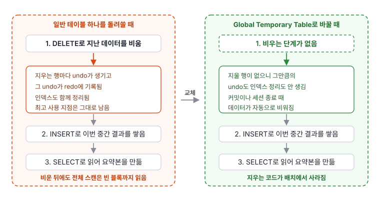
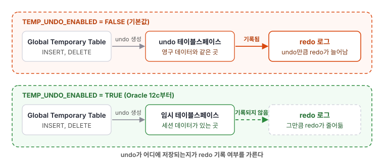

예전에 다니던 회사에서 교통 데이터를 집계하는 배치를 다룰 때, 중간 결과를 담는 테이블이 있었습니다. 여러 원천 데이터를 단계별로 가공해 쌓고, 마지막에 그것을 읽어 요약본을 만드는 구조였습니다. 그 중간 결과 테이블은 일반 테이블이었고, 여러 작업이 같은 테이블을 공유했습니다. 그래서 각 작업들은 스스로의 데이터를 넣기 전에 이전 데이터를 `DELETE`로 비웠습니다. 데이터가 늘면서 이 "비우고 채우는 동작"이 점점 부하가 걸렸습니다. 이 때문에 매일 실행되던 배치 프로세스의 결과가 느려져서 매일 아침 9시에 봐야 할 통계자료가 오후쯤이 되어서야 완료되었습니다. 이때 해결하기 위해 사용했던 Global Temporary Table을 소개합니다.

> 당시 업무는 Oracle Database 12c 환경이었습니다. 뒤에 나오는 측정값은 그 환경이 남아 있지 않아 Oracle AI Database 26ai Free에서 다시 만들어 잰 것입니다. 다른 환경에선 다른 결과가 나올 수 있습니다.

## 오래 걸리는 구간 중 DELETE가 가장 눈에 걸렸음

어디가 느린지부터 좁혔습니다. 배치는 단계마다 소요시간을 로그로 남기고 있었고, 그 로그에 오래 걸리는 구간이 여럿 있었습니다.

그중 이전 데이터를 비우는 `DELETE` 구간이 가장 눈에 걸렸습니다.

그 테이블은 집계 도중에 계산한 값을 잠깐 담아 두는 자리였습니다. 원천 데이터를 단계별로 가공해 쌓고, 마지막에 읽어 요약본을 만들면 역할이 끝나는 데이터입니다. 그런데 요약본을 만드는 동작이 아니라 그 자리를 비우는 동작이 시간을 쓰고 있었습니다.

그래서 그 `DELETE`가 왜 필요했는지를 먼저 봤습니다.

## 지난 실행이 남긴 데이터를 지우는 비용은 redo, 인덱스, 빈 블록 세 군데서 나옴

그 자리는 일반 테이블 하나였고, 여러 집계 작업이 그 하나를 돌려썼습니다. 두 작업이 동시에 돈 적은 없었지만, 앞선 실행이 넣은 데이터는 그대로 남아 있었습니다. 그래서 자기 데이터를 넣기 전에 비우는 단계가 매 실행 앞에 붙었습니다.

일반 테이블을 쓴 것은 여러 설계를 견주어 고른 결과가 아니었습니다. 앞서 이 배치를 만든 사람이 중간 결과를 담을 다른 방법을 몰랐습니다.

`DELETE`로 비우면 비용이 세 군데서 나옵니다.

첫째, 지우는 행마다 undo가 생기고 그 undo는 redo에 기록됩니다. 넣을 때 한 번, 지울 때 또 한 번 로그를 남기는 셈입니다.

둘째, 인덱스도 함께 정리됩니다. 지우는 행마다 인덱스 쪽 작업이 따라붙습니다.

셋째, `DELETE`는 테이블이 쓰던 공간의 최고 사용 지점(High Water Mark)을 낮추지 않습니다. 그래서 비운 뒤에도 전체 스캔은 빈 블록까지 읽습니다.

공간을 실제로 반환하고 스캔 범위를 되돌리는 것은 `TRUNCATE`입니다. 병렬 실행이 없었으므로 다른 실행의 데이터를 지울 걱정도 없어, 당시에도 후보로 검토했습니다. 다만 어떤 근거로 `TRUNCATE`를 접었는지는 몇 해 지난 일이라 기억나지 않습니다.

지금 두 방법을 놓고 보면 차이는 둘입니다. `TRUNCATE`는 되돌릴 수 없어, 비운 다음 단계에서 실패해도 이전 상태로 돌아갈 방법이 없습니다. 그리고 `TRUNCATE`로 바꾸어도 매 실행 앞에서 비우는 코드는 그대로 남습니다.

## Global Temporary Table은 데이터를 자동으로 비우고 세션마다 격리함

Global Temporary Table은 정의와 데이터의 수명을 분리한 테이블입니다. 정의는 일반 테이블처럼 영구히 남아 모든 세션이 같은 정의를 보지만, 데이터는 세션마다 격리되어 트랜잭션이나 세션이 끝나면 사라집니다. 데이터는 세션의 임시 테이블스페이스에 저장됩니다.

```sql
CREATE GLOBAL TEMPORARY TABLE agg_scratch (
  bucket   NUMBER,
  metric   NUMBER,
  value    NUMBER
) ON COMMIT DELETE ROWS;
```

비우는 단계가 없어지면 앞 절에서 본 비용 세 가지도 함께 없어집니다. 지울 행이 없으니 그만큼의 undo와 인덱스 정리가 생기지 않고, 매 실행은 빈 테이블에서 시작합니다.

비우는 시점은 정의할 때 고릅니다. `ON COMMIT DELETE ROWS`는 트랜잭션이 끝날 때 데이터를 비우고, `ON COMMIT PRESERVE ROWS`는 세션이 끝날 때까지 데이터를 유지합니다. 단계마다 커밋을 한다면 `PRESERVE ROWS`를 써야 중간 결과가 남습니다. 당시 어느 쪽을 골랐는지는 기억나지 않습니다.



세션 격리는 이 사례에서 쓰이지 않은 성질입니다. 배치가 병렬로 돈 적이 없어 서로의 중간 결과가 섞일 일도 없었습니다. 여러 실행이 동시에 돌아야 하는 곳이라면 실행별 키 컬럼을 세션 격리로 대신할 수 있지만, 이 사례에서 얻은 이득은 아닙니다.

바뀐 것은 집계 로직이 아니라 중간 결과를 담는 자리입니다. 일반 테이블에서 Global Temporary Table로 바꾸자 매 실행 앞에 붙어 있던 대량 `DELETE`가 필요 없어졌습니다.

## 당시엔 몰랐던 한계: Global Temporary Table을 써도 redo는 사라지지 않음

"Global Temporary Table은 redo를 만들지 않는다"는 설명을 자주 봅니다. 이 문장은 조건을 빼고 말하면 사실과 다릅니다.

Oracle 문서에 따르면, 기본 설정에서 Global Temporary Table의 undo 레코드는 undo 테이블스페이스에 저장되고 redo에 기록됩니다. 일반 테이블의 undo를 관리하는 방식과 같습니다. 즉 Global Temporary Table에 데이터를 넣고 지워도, 그 변경을 되돌리기 위한 undo가 생기고 그 undo가 redo를 만듭니다.

redo를 없애려면 temporary undo 기능을 켜야 합니다. 초기화 파라미터 `TEMP_UNDO_ENABLED`를 `TRUE`로 두면, Global Temporary Table의 undo가 undo 테이블스페이스 대신 임시 테이블스페이스에 저장되어 redo에 기록되지 않습니다. 이 기능은 Oracle 12c에서 추가됐습니다.



그래서 redo 감소는 Global Temporary Table을 쓰기만 하면 다 얻는 효과가 아니라, temporary undo를 함께 켜야 완성되는 조건부 효과입니다.

당시 temporary undo는 켜지 않았고, redo 양을 재 보지도 않았습니다. Global Temporary Table을 택한 이유도 redo가 아니라 비우는 단계를 없애는 데 있었습니다. 그래서 여기까지는 문헌으로 확인한 내용입니다. 다음 절에서 지금 띄울 수 있는 환경에 같은 상황을 만들어 재 봤습니다.

## 유사한 환경을 만들어 세 비용을 각각 재 봄

당시 쓰던 12c 환경은 남아 있지 않습니다. 그래서 지금 띄울 수 있는 환경에 같은 모양을 만들어 측정했습니다. 컨테이너로 띄운 Oracle AI Database 26ai Free(23.26.2.0.0)이고, 컬럼 세 개에 인덱스 하나를 둔 테이블에 20만 행을 넣었습니다. 아래 숫자는 12c 실측이 아니라 26ai Free에서의 재현입니다.

redo는 `v$mystat`의 `redo size`를 작업 전후로 빼서 얻었습니다. 같은 스크립트를 두 번 돌렸고 괄호 안이 2회차입니다.

### 지우는 쪽이 넣는 쪽보다 redo를 더 남겼고, 그 대부분은 인덱스 정리였음

| 작업 | 인덱스 있음 | 인덱스 없음 |
|---|---|---|
| 일반 테이블에 20만 행 INSERT | 33,511,148 (33,473,884) | 5,175,660 (5,109,396) |
| 그 20만 행을 DELETE | 50,398,400 (50,399,256) | 5,289,584 (5,310,616) |

비우는 동작이 채우는 동작보다 로그를 더 남겼습니다. 앞 절에서 `DELETE` 구간이 눈에 걸렸던 것과 방향이 맞습니다.

인덱스를 지우고 같은 측정을 하면 `DELETE`의 redo가 10분의 1로 떨어집니다. 지운 행마다 따라붙는 인덱스 정리가 이 조건에서는 `DELETE` redo의 대부분이었습니다. 다만 이 비율은 인덱스 개수와 컬럼 값 분포에 따라 달라집니다. 위 인덱스는 값이 1000종류인 컬럼 하나에 걸린 비고유 인덱스입니다.

### DELETE로 다 지운 뒤에도 전체 스캔은 블록 539개를 읽음

| 시점 | blocks | 빈 테이블 전체 스캔 consistent gets |
|---|---|---|
| INSERT 직후 | 536 | |
| DELETE 직후 | 536 | 539 |
| TRUNCATE 직후 | 0 | 1 |

20만 행을 모두 지운 뒤에도 블록 수는 536 그대로였고, 행이 하나도 없는 테이블을 전체 스캔하는 데 블록 539개를 읽었습니다. `TRUNCATE` 뒤에는 같은 스캔이 1로 떨어졌습니다. 최고 사용 지점을 낮추는 것과 낮추지 않는 것의 차이가 그대로 보입니다.

### Global Temporary Table만으로 redo가 절반, TEMP_UNDO_ENABLED까지 켜야 1퍼센트 아래로 내려감

| 대상 | INSERT redo | DELETE redo |
|---|---|---|
| 일반 테이블 | 33,511,148 | 50,398,400 |
| GTT, `TEMP_UNDO_ENABLED = FALSE` | 17,115,828 | 36,900,848 |
| GTT, `TEMP_UNDO_ENABLED = TRUE` | 266,804 | 2,536 |

두 가지가 보입니다.

첫째, Global Temporary Table로 바꾸기만 해도 INSERT의 redo가 절반쯤으로 줄었습니다. 그러나 절반은 남았습니다. "Global Temporary Table은 redo를 만들지 않는다"는 설명이 맞지 않는 지점이 이 숫자입니다.

둘째, `TEMP_UNDO_ENABLED`를 켜자 남은 절반이 사라졌습니다. INSERT는 앞 줄의 1.6퍼센트로, DELETE는 거의 0으로 떨어졌습니다. 남아 있던 절반이 undo에서 왔고, 그 undo가 임시 테이블스페이스로 옮겨 가면서 redo에 기록되지 않은 것입니다.

`TEMP_UNDO_ENABLED`는 세션이 임시 객체를 쓰기 시작하면 바꿀 수 없습니다. 그래서 `FALSE`와 `TRUE`를 각각 새 세션에서 쟀습니다.

## 중간 결과가 한 쿼리 안에서만 쓰이면 테이블 자체가 필요 없음

중간 결과를 별도 테이블 없이 쿼리 안의 WITH 절(공통 테이블 식, Common Table Expression)로 둘 수도 있습니다. 한 쿼리 안에서 중간 결과를 한 번 정의해 쓰고 끝난다면, 중간 결과 테이블을 따로 만들 필요 없이 WITH 절이 더 간결합니다.

다만 단계가 많거나 같은 중간 결과를 여러 단계에서 반복 참조하면 판단이 달라집니다. WITH 절의 결과를 옵티마이저가 한 번 계산해 재사용할지, 참조할 때마다 다시 계산할지는 쿼리와 버전에 따라 달라질 수 있습니다. 중간 결과를 여러 쿼리에 걸쳐 재사용하거나 그 내용을 직접 통제해야 한다면, Global Temporary Table로 한 번 만들어 두는 편이 예측 가능합니다.

## Global Temporary Table이 맞지 않는 경우

Global Temporary Table은 세션마다 자기만의 중간 결과가 필요하고 매 실행 비워야 하는 중간 결과 테이블에 맞습니다. 반대로 맞지 않는 경우도 분명합니다.

여러 세션이 함께 읽어야 하는 결과라면 Global Temporary Table을 쓸 자리가 아닙니다. 세션 격리가 오히려 방해가 되므로 일반 테이블에 두어야 합니다. 시스템이 중단돼도 남아야 하는 데이터도 마찬가지입니다. Global Temporary Table의 데이터는 정의상 복구 대상이 아니라, 시스템 장애 시 백업과 복구가 제공되지 않습니다.

옵티마이저 통계도 유의할 점입니다. 데이터가 세션마다 다르므로, 세션의 실제 데이터 양과 다른 통계로 실행계획이 잡히면 집계가 느려질 수 있습니다. 이 경우 세션 단위 통계나 힌트로 계획을 맞춰야 할 수 있습니다.

## 결론

문제는 특정 문법이나 기능이 아니라 중간 결과를 담는 자리를 고른 방식이었습니다. 일반 테이블 하나를 매 실행 비워 쓰는 자리로 삼은 것이 대량 `DELETE`를 불렀습니다. Global Temporary Table은 데이터를 세션별로 격리하고 커밋이나 세션 종료 시 자동으로 비우므로, 비우는 단계 자체가 필요 없어집니다.

바꾼 뒤 배치는 아침에 봐야 할 시간 안에 끝났습니다. 다만 전후 소요시간을 수치로 남겨 두지 않았으므로 얼마나 줄었는지는 말할 수 없습니다.

redo 감소는 함께 언급되곤 하지만 절반만 자동으로 따라옵니다. 26ai Free에서 재 보니 Global Temporary Table로 바꾸는 것만으로 INSERT의 redo가 절반쯤으로 줄었고, 나머지 절반은 `TEMP_UNDO_ENABLED`를 켰을 때 사라졌습니다. "redo를 만들지 않는다"도, "redo와 무관하다"도 아닙니다.

이 글의 측정은 26ai Free에 같은 모양을 만들어 잰 값이고, 20만 행이라는 한 조건에서 나온 숫자입니다. 실제 적용 전에는 같은 데이터와 실행계획으로 전후를 측정해 확인하시기 바랍니다.

## 부록. 측정에 쓴 스크립트

컨테이너는 `docker run -d --name gtt-lab -p 15210:1521 -e ORACLE_PASSWORD=oracle gvenzl/oracle-free:23-slim`로 띄웠습니다. `redo size`를 읽는 함수는 PL/SQL 안에서 롤 권한이 적용되지 않으므로, `SYS`로 `v_$mystat`과 `v_$statname`에 직접 `SELECT` 권한을 준 뒤 만들어야 합니다.

```sql
CREATE TABLE agg_plain (bucket NUMBER, metric NUMBER, val NUMBER);
CREATE INDEX agg_plain_ix ON agg_plain (bucket);

CREATE GLOBAL TEMPORARY TABLE agg_gtt (bucket NUMBER, metric NUMBER, val NUMBER)
  ON COMMIT PRESERVE ROWS;
CREATE INDEX agg_gtt_ix ON agg_gtt (bucket);

CREATE OR REPLACE FUNCTION my_redo RETURN NUMBER IS
  v NUMBER;
BEGIN
  SELECT s.value INTO v
    FROM v$mystat s JOIN v$statname n ON n.statistic# = s.statistic#
   WHERE n.name = 'redo size';
  RETURN v;
END;
/
```

측정은 작업 전후의 `redo size`를 빼는 방식입니다. 대상 테이블만 바꾸면 위 표의 값을 그대로 얻을 수 있습니다.

```sql
DECLARE r0 NUMBER;
BEGIN
  r0 := my_redo;
  INSERT INTO agg_plain
  SELECT MOD(LEVEL, 1000), LEVEL, LEVEL * 1.5 FROM dual CONNECT BY LEVEL <= 200000;
  COMMIT;
  DBMS_OUTPUT.PUT_LINE('INSERT redo = ' || (my_redo - r0));
END;
/
```

최고 사용 지점은 `DBMS_STATS.GATHER_TABLE_STATS` 뒤에 `user_tables.blocks`로 보고, 빈 테이블을 전체 스캔할 때 읽는 블록 수는 `consistent gets` 통계를 같은 방식으로 빼서 봤습니다.

## 참고 문헌

- [Oracle Database Concepts 12c R2, Overview of Tables](https://docs.oracle.com/en/database/oracle/oracle-database/12.2/cncpt/tables-and-table-clusters.html): 임시 테이블의 정의는 영구히 남고 데이터는 트랜잭션이나 세션 동안만 존재한다.
- [Oracle Database Administrator's Guide 12c R2, Managing Tables](https://docs.oracle.com/en/database/oracle/oracle-database/12.2/admin/managing-tables.html): 임시 테이블 데이터는 정의상 임시라 시스템 장애 시 백업과 복구가 제공되지 않는다.
- [Oracle Database Administrator's Guide 12c R2, Managing Undo](https://docs.oracle.com/en/database/oracle/oracle-database/12.2/admin/managing-undo.html): 기본 설정에서 임시 테이블의 undo는 undo 테이블스페이스에 저장되고 redo에 기록된다. `TEMP_UNDO_ENABLED`를 켜면 임시 테이블스페이스에 저장되어 redo에 기록되지 않는다.
- [Oracle Database SQL Language Reference 12c R2, TRUNCATE TABLE](https://docs.oracle.com/en/database/oracle/oracle-database/12.2/sqlrf/TRUNCATE-TABLE.html): `TRUNCATE TABLE`은 롤백할 수 없다.

