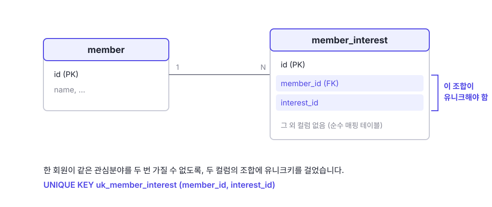

예전에 업무상 특정 API를 작성할 때, 1:N 관계의 테이블을 통째로 바꾸는 코드에서 `Duplicate entry` 오류가 난 적이 있습니다. 기존 목록을 지우고 새 목록을 넣는 코드인데 중복이라니 앞뒤가 맞지 않았습니다. 원인을 따라가 보니, 컬렉션을 비우고 다시 채우는 교체 패턴과 테이블의 유니크키는 같이 쓰면 안 되는 조합이었습니다. 그 사이에 Hibernate가 SQL을 내보내는 순서가 있습니다.

> 업무 내용을 그대로 적을 수 없어서 각색하였습니다. 도메인과 테이블 이름은 실제와 다르지만 에러와 원인, 해결 과정은 겪은 그대로입니다. 환경은 Spring Boot 2.7, Hibernate 5.6 기준이고, 이 글이 다루는 flush 순서는 Hibernate 공식 문서에 명시된 동작입니다.

## 유니크해야 해서 유니크키를 넣었는데 왜 중복이 나지?

구조부터 보면 단순합니다. 회원(member)과 관심분야를 잇는 매핑 테이블(member_interest)이 있고, 회원 하나가 관심분야 하나당 행 하나를 가집니다.



여기서 한 회원이 같은 관심분야를 두 번 가질 이유는 없습니다. `(member_id=14564, interest_id=10)` 같은 행이 두 개면 그 자체로 잘못된 데이터입니다. 그래서 이 조합이 유일하도록 유니크키를 걸어 뒀습니다. 유니크키(unique key, UK)는 지정한 컬럼 조합의 값이 같은 행이 테이블에 둘 이상 존재할 수 없게 막는 DB 제약으로, 애플리케이션 코드에 버그가 있어도 DB가 마지막에 중복을 거부해 주는 안전장치입니다.

그런데 목록을 교체해 저장하는 API에서, 바로 그 안전장치가 위반됐다는 에러가 나기 시작했습니다. `'14564-10'`은 위반된 값의 조합(member_id 14564, interest_id 10)이고, `uk_member_interest`가 방금 걸어 둔 그 유니크키입니다.

```text
ERROR o.h.e.jdbc.spi.SqlExceptionHelper -
Duplicate entry '14564-10' for key 'uk_member_interest'
```

중복을 막으려고 넣은 제약이 중복을 만들 리 없는 코드에서 터진 셈입니다.

문제의 코드는 목록 교체의 흔한 패턴이었습니다. 컬렉션을 비우고 받은 값으로 다시 채웁니다.

```kotlin
@OneToMany(
    fetch = FetchType.LAZY,
    mappedBy = "member",
    cascade = [CascadeType.ALL],
    orphanRemoval = true
)
val interests: MutableList<MemberInterest> = mutableListOf()

fun replaceInterests(newIds: List<Int>) {
    interests.clear()
    newIds.distinct().forEach { interests.add(MemberInterest(this, it)) }
}
```

`orphanRemoval = true`는 자식 엔티티가 부모의 컬렉션에서 떨어져 나가면 그 행을 삭제하라는 매핑 설정입니다. 그래서 의도는 명확합니다. `clear()`로 기존 행이 전부 삭제되고, `add()`로 새 행이 삽입됩니다.

실패 조건이 특이했습니다. 목록이 완전히 바뀔 때는 통과하고, **기존 목록과 새 목록에 같은 값이 하나라도 유지될 때만** 실패했습니다. `(14564, 10)`이 지울 목록과 넣을 목록 양쪽에 있는 경우입니다. 테스트가 이 버그를 놓친 이유도 여기 있습니다. 목록을 매번 전혀 다른 값으로 바꾸는 테스트만 있으면 전부 통과합니다.

## Hibernate는 PK로만 엔티티를 식별하기 때문에

"같은 값이면 그대로 두면 되지 않나"가 자연스러운 기대인데, Hibernate는 그렇게 하지 않습니다. 엔티티를 기본키(PK)로만 식별하기 때문입니다.

- `clear()`로 떨어진 기존 자식: PK가 있는 엔티티. 삭제 대상
- `add()`로 들어온 새 자식: PK가 null인 엔티티. 삽입 대상

두 엔티티의 `(member_id, interest_id)` 값이 같다는 것은 유니크키를 아는 DB의 사정이고, Hibernate는 비즈니스 값을 추적하지 않습니다. PK가 다르면(또는 아직 없으면) 서로 무관한 엔티티입니다. 그래서 같은 값이 유지되는 경우에도 "기존 행 삭제 + 새 행 삽입" 두 작업이 예약됩니다.

여기까지는 문제가 아닙니다. 삭제가 먼저 실행되면 삽입은 성공합니다. 문제는 실행 순서입니다.

## SQL은 코드 순서가 아니라 ActionQueue 순서로 실행됨

flush는 영속성 컨텍스트에 쌓인 변경을 SQL로 만들어 DB에 내보내는 동작입니다. 이때 Hibernate는 예약된 작업들을 ActionQueue라는 내부 큐에 모았다가 고정된 순서로 실행합니다. 공식 문서가 명시한 순서는 다음과 같습니다.

1. `OrphanRemovalAction`: 고아 삭제
2. `EntityInsertAction` 또는 `EntityIdentityInsertAction`: 엔티티 삽입
3. `EntityUpdateAction`: 엔티티 갱신
4. `QueuedOperationCollectionAction`: 컬렉션 예약 작업
5. `CollectionRemoveAction`: 컬렉션 삭제
6. `CollectionUpdateAction`: 컬렉션 갱신
7. `CollectionRecreateAction`: 컬렉션 재생성
8. `EntityDeleteAction`: 엔티티 삭제

삽입이 2순위, 엔티티 삭제가 8순위로 맨 마지막입니다. 공식 문서는 이 순서가 코드 작성 순서와 무관하다는 것을 예제로 못박습니다. 엔티티를 먼저 `remove()`하고 새 엔티티를 `persist()`해도, 실행은 INSERT가 먼저이고 DELETE가 나중입니다.

그래서 문제의 코드는 이렇게 실행됩니다.

```text
① INSERT (member_id=14564, interest_id=10)   ← 새 엔티티
     DB에는 기존 (14564, 10) 행이 아직 살아 있음
     유니크키 위반 → Duplicate entry          ← 여기서 예외
② DELETE는 실행되지 못함
```

지우고 넣는 코드가 실제로는 넣으려다 기존 행에 막혀 죽습니다. 최종 상태만 보면 `(14564, 10)`은 한 행만 남는 것이 맞습니다. 그러나 DB는 구문(statement) 하나가 끝날 때마다 제약을 검사하므로, INSERT가 실행되는 순간의 겹침을 허용하지 않습니다.

## clear()의 삭제는 마지막 순서로 밀림

목록에서 1순위인 `OrphanRemovalAction`이 눈에 걸립니다. 이 사고의 삭제도 orphanRemoval에서 나온 것인데, 왜 1순위로 실행되지 않았을까요.

Hibernate 5.6 소스를 보면 경로가 갈립니다. 컬렉션에서 떨어져 나간 고아들은 `Cascade.deleteOrphans()`가 일반 삭제 이벤트로 처리해서, 8순위 `EntityDeleteAction`으로 예약됩니다. 1순위 `OrphanRemovalAction`은 단일 연관을 교체할 때 외래키 위반을 피하려고 삭제를 앞당기는 예외 경로(`SessionImpl.removeOrphanBeforeUpdates()`)에서만 만들어지고, 소스 주석에 "작업 순서 문제(HHH-6484)를 위한 임시 hack"이라고 적혀 있습니다.

정리하면 `orphanRemoval = true`는 "떨어진 자식을 삭제하라"는 정책일 뿐, 언제 삭제할지까지 정하지 않습니다. `clear()`로 비운 컬렉션의 삭제는 맨 마지막 순서입니다.

## 이 순서는 FK를 지키기 위한 설계임

삽입을 앞에, 삭제를 뒤에 두는 순서는 버그가 아니라 외래키(FK) 안전을 위한 설계입니다. 새 부모와 자식을 만들고 옛것을 지우는 일반적인 시나리오에서는 이 순서가 맞습니다.

```text
INSERT 새 부모   (자식이 참조할 행을 먼저 확보)
INSERT 새 자식   (방금 만든 부모를 FK로 참조)
DELETE 옛 자식   (FK로 묶인 자식부터 정리)
DELETE 옛 부모
```

대부분의 경우 삽입되는 행과 삭제되는 행은 PK가 달라 충돌할 일이 없습니다. 이 사고가 예외였던 이유는 같은 테이블에서 삽입될 행과 삭제될 행이 PK가 아닌 유니크키 값을 공유했기 때문입니다. 같은 순서 문제가 2007년에 이슈로 등록됐지만(HHH-2801 "wrong insert/delete order when updating record-set") Rejected로 닫혔습니다. Hibernate 입장에서 이 순서는 의도된 동작입니다.

## 통째로 바꾸는 교체와 유니크키는 양립하기 어려움

개별 조각은 각각 정상입니다. 목록을 통째로 받아 통째로 바꾸는 API도 정당하고, `clear()` 후 `add()`는 그 구현의 흔한 패턴이며, 유니크키도 중복을 막는 합리적인 방어입니다. 문제는 조합입니다.

- **통째 교체**: 받은 목록이 곧 최종 상태다. 기존 행을 전부 버리고 새 행을 만든다. 같은 값이라도 새 행이다
- **유니크키**: 같은 값의 행은 하나만 존재해야 한다. 한순간의 겹침도 안 된다

통째 교체는 "이건 새 행"이라 말하고, 유니크키는 "그건 이미 있는 행"이라 말합니다. Hibernate는 PK만 추적하므로 자동으로 교체 편에 섭니다. 이 대립은 실행 순서를 바꿔도 사라지지 않고, 같은 값이 유지되는 순간마다 다시 나타납니다. 둘 중 하나를 양보해야 합니다.

### 식별 관계로 모델링했다면 어땠을까?

식별용으로만 둔 id 컬럼(대리키)을 없애고 `(member_id, interest_id)`를 그대로 복합 PK로 쓰는 모델링(식별 관계)이었다면, 이 조합의 유일성은 PK가 보장하므로 유니크키를 따로 걸 일이 없습니다. 순수 매핑 테이블에서는 이쪽이 정석 모델링이기도 합니다.

그래도 clear() 후 add()는 실패했을 것으로 보입니다. 이번에는 DB가 아니라 Hibernate 단계입니다. 기존 엔티티가 삭제 대기 상태로 영속성 컨텍스트에 남아 있는데 같은 값의 새 엔티티를 추가하면, 같은 PK를 가진 다른 인스턴스가 세션에 들어오는 상황이라 Hibernate가 식별자 충돌로 거부하는 것이 전형적인 동작입니다. 복합키 버전으로 직접 재현해 본 것은 아니라서 단정은 피하겠습니다. 분명한 것은, 식별 관계는 유니크키의 자리를 PK로 옮길 뿐이고 "유지할 행을 지웠다 다시 만든다"는 원인은 그대로 남는다는 점입니다.

## 유니크키를 지키려면 차집합으로 교체해야 함

유니크키를 유지하면서 교체하려면, 전체를 지우고 다시 넣는 대신 빠진 것만 지우고 새로 생긴 것만 넣어야 합니다. 유지되는 행은 건드리지 않으므로 같은 값의 재삽입이 없고, 충돌도 없습니다.

```kotlin
fun replaceInterests(newIds: List<Int>) {
    val target = newIds.toSet()
    val current = interests.map { it.interestId }.toSet()

    interests.removeIf { it.interestId !in target }   // 빠진 것만 삭제
    target.filter { it !in current }
          .forEach { interests.add(MemberInterest(this, it)) }  // 새로운 것만 삽입
}
```

다른 선택지와의 비교는 이렇습니다.

| 방법 | 유니크키 | 비고 |
| --- | --- | --- |
| 차집합 교체 (위 코드) | 유지 | 유니크키를 지키는 기본 해법 |
| 유니크키 제거 | 포기 | 쓰기 경로가 하나뿐이고 앱에서 중복을 막는 경우의 절충 |
| `clear()` 후 강제 `flush()` | 유지 | 트랜잭션 중간에 flush가 끼어들어 비권장 |
| 네이티브 DELETE 후 INSERT | 유지 | 영속성 컨텍스트와의 불일치를 직접 관리해야 함 |

이 사고에서는 유니크키를 제거하는 쪽을 택했습니다. 문제의 테이블이 두 컬럼이 전부인 순수 매핑 테이블이라 차집합으로 유지해도 갱신할 내용이 없고, 쓰기 진입점이 교체 메서드 하나뿐이라 `distinct()`로 중복이 이미 막혀 있었기 때문입니다. 갱신할 속성이 있는 엔티티라면 차집합 교체가 맞습니다.

## 정리

- 목록 교체 API가 같은 값이 유지될 때만 `Duplicate entry`로 실패한다면, Hibernate의 flush 순서를 의심한다
- Hibernate는 엔티티를 PK로만 식별한다. 값이 같아도 `clear()` + `add()`는 "기존 행 삭제 + 새 행 삽입"이 된다
- SQL은 코드 순서가 아니라 ActionQueue의 고정 순서로 실행된다. 삽입이 2순위, 엔티티 삭제가 8순위다
- `clear()`로 인한 고아 삭제는 1순위 `OrphanRemovalAction`이 아니라 8순위 `EntityDeleteAction`으로 간다
- 이 순서는 FK를 지키기 위한 설계이고, 같은 테이블 안에서 삭제될 행과 삽입될 행이 유니크키 값을 주고받는 통째 교체만 예외적으로 걸린다
- 유니크키를 지키려면 차집합으로 교체한다. 순수 매핑 테이블이고 쓰기 경로가 통제되면 유니크키 제거도 절충안이 된다

## 참고 문헌

- [Hibernate ORM 5.6 User Guide, Flushing](https://docs.jboss.org/hibernate/orm/5.6/userguide/html_single/Hibernate_User_Guide.html#flushing): 6.5 Flush operation order. ActionQueue의 8단계 실행 순서 목록과, remove를 먼저 호출해도 DELETE가 INSERT 뒤에 실행된다는 공식 예제.
- [A beginner's guide to Hibernate flush operation order](https://vladmihalcea.com/hibernate-facts-knowing-flush-operations-order-matters/): 같은 유니크키 값을 가진 엔티티를 삭제 후 재생성할 때 제약 위반이 나는 재현 예제. 삭제 후 재삽입 대신 기존 엔티티를 갱신하라는 권장.
- [How does orphanRemoval work with JPA and Hibernate](https://vladmihalcea.com/orphanremoval-jpa-hibernate/): orphanRemoval의 동작 정의.
- [HHH-2801](https://hibernate.atlassian.net/browse/HHH-2801): "wrong insert/delete order when updating record-set". 2007년 등록, Rejected로 종료. 이 순서가 의도된 동작이라는 근거.
- [Hibernate 5.6 소스, Cascade.java](https://github.com/hibernate/hibernate-orm/blob/5.6/hibernate-core/src/main/java/org/hibernate/engine/internal/Cascade.java): `deleteOrphans()`가 컬렉션의 고아를 일반 삭제 이벤트로 처리하는 부분.
- [Hibernate 5.6 소스, SessionImpl.java](https://github.com/hibernate/hibernate-orm/blob/5.6/hibernate-core/src/main/java/org/hibernate/internal/SessionImpl.java): `removeOrphanBeforeUpdates()`와 HHH-6484 임시 조치라는 주석.
