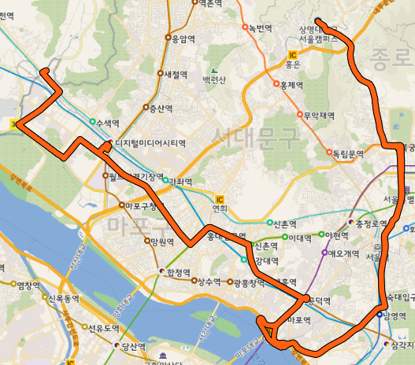
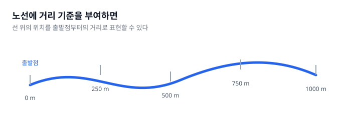
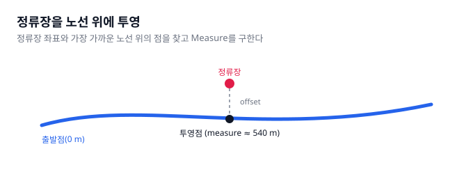
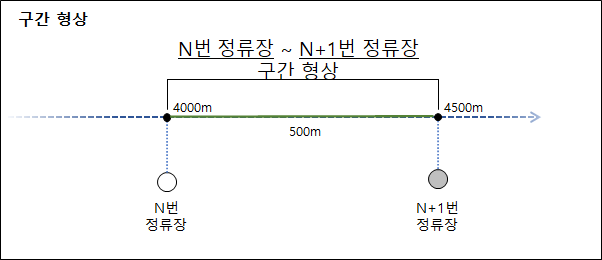
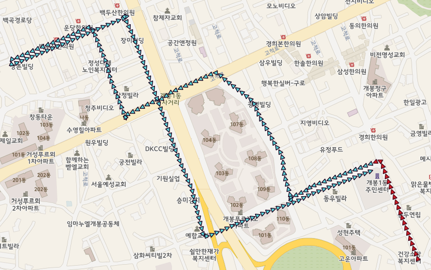

예전에 버스 노선 데이터를 정류장 사이의 구간으로 나누는 작업을 한 적이 있습니다. 가지고 있던 데이터는 노선을 구성하는 링크와 노드, 정류장의 좌표와 방문 순서였습니다. 정류장 사이의 속도나 혼잡도를 계산하려면 두 정류장 사이에서 버스가 실제로 이동하는 노선 형상이 필요했습니다.

두 정류장의 좌표를 직접 연결하면 도로의 굴곡과 회차 경로가 사라집니다. 노선 전체를 하나의 선으로 만든 뒤 정류장을 그 선 위의 위치로 바꾸고, 인접한 두 위치 사이를 추출해야 했습니다. 이 과정을 Linear Referencing으로 구현했습니다.

## 정류장 좌표를 연결한 선은 버스 경로가 아님

정류장 데이터는 점 좌표입니다. 정류장 A와 다음 정류장 B를 직선으로 연결할 수는 있지만, 그 선은 버스가 이동한 경로와 다릅니다. 도로가 굽어 있거나 교차로에서 회전하면 실제 구간은 두 점을 잇는 직선보다 길고 모양도 달라집니다.

노선을 구성하는 링크와 노드에는 버스가 지나가는 경로가 들어 있었습니다. 필요한 결과는 정류장 좌표로 새 선을 만드는 것이 아니라, 기존 노선 형상에서 두 정류장 사이에 해당하는 부분을 찾는 것이었습니다.

처리할 데이터는 서로 다른 형태였습니다.

| 데이터 | 표현 | 필요한 변환 |
|---|---|---|
| 버스 노선 | 순서가 있는 여러 노드 | 하나의 선으로 연결 |
| 정류장 | X, Y 좌표 | 노선 위의 위치로 변환 |
| 정류장 구간 | 출발 정류장과 도착 정류장 | 노선의 일부로 추출 |

## 노선의 노드를 순서대로 이어 전체 경로를 만듦

노선의 링크 순서와 각 링크를 구성하는 노드 순서에 따라 좌표를 정렬했습니다. 정렬한 좌표를 차례대로 연결하면 노선 전체를 나타내는 LineString을 만들 수 있습니다. 같은 좌표가 연속해서 들어 있으면 형상이 유효하지 않을 수 있으므로 중복 정점도 제거했습니다.

노드의 순서는 노선의 방향을 결정합니다. 이후에 사용할 거리값은 이 선의 시작점에서 끝점으로 진행하면서 증가합니다. 좌표를 잘 연결해도 순서가 바뀌면 출발점과 정류장의 위치 관계도 함께 달라집니다.

아래 화면은 노드와 링크를 연결해 만든 전체 노선 형상을 QGIS에서 확인한 결과입니다.

## 노선 위의 위치를 Measure로 표현함

Linear Referencing System(LRS)은 선 위의 위치를 하나의 Measure 값으로 나타냅니다. Oracle Spatial 문서에서는 2차원 좌표 대신 하나의 Measure로 선 위의 위치나 구간을 참조할 수 있다고 설명합니다.

이 작업에서는 노선의 시작점을 0으로 두고, 노선 형상을 따라 이동한 거리를 Measure로 사용했습니다. 시작점에서 540m 떨어진 위치라면 해당 지점의 Measure는 540입니다. 직선거리가 아니라 노선의 굴곡을 따라간 거리입니다.

Measure가 항상 물리적인 거리여야 하는 것은 아닙니다. LRS에서는 시간이나 별도의 기준값도 Measure로 사용할 수 있습니다. 다만 이 작업에서는 정류장 사이의 노선 구간을 거리로 잘라야 했기 때문에 노선을 따라간 거리를 사용했습니다.

노선을 LRS 형상으로 바꾸면 좌표와 Measure 사이를 오갈 수 있습니다. Measure를 알면 선 위의 좌표를 찾을 수 있고, 선 위의 좌표를 알면 Measure를 구할 수 있습니다.

## 정류장 좌표를 노선 위에 투영함

정류장 좌표는 노선 형상 위에 정확히 놓여 있지 않을 수 있습니다. 정류장 위치가 도로의 한쪽에 표시되거나, 두 데이터가 서로 다른 기준으로 만들어졌기 때문입니다. 정류장 좌표를 그대로 구간의 시작점과 끝점으로 사용할 수 없었습니다.

투영은 정류장 좌표와 가장 가까운 노선 위의 점을 찾는 과정입니다. 투영된 점에는 노선 시작점부터의 Measure가 들어 있습니다. 정류장의 X, Y 좌표가 노선 위의 거리값 하나로 바뀝니다.

정류장과 투영점 사이의 직선거리는 Offset입니다. Offset이 크면 정류장 좌표가 노선에서 멀리 떨어져 있거나 잘못된 곳에 투영됐을 가능성을 확인할 수 있습니다. 특정 거리만으로 오류를 확정하지 않고, 정류장 순서와 앞뒤 Measure도 함께 확인했습니다.

## 두 Measure 사이에서 구간 형상을 추출함

노선의 각 정류장을 Measure로 바꾸면 구간 생성은 범위를 정하는 문제가 됩니다. 현재 정류장의 Measure를 시작값으로 두고, 다음 정류장의 Measure를 끝값으로 둡니다. 노선 전체에서 두 값 사이에 해당하는 부분을 추출하면 정류장 사이의 구간 형상이 됩니다.

예를 들어 현재 정류장의 Measure가 4,000이고 다음 정류장의 Measure가 4,500이라면, 전체 노선에서 4,000부터 4,500까지의 형상을 가져옵니다. 결과에는 두 정류장 사이의 굴곡과 교차로 회전이 그대로 남습니다.

전체 과정은 세 단계로 정리할 수 있습니다.

1. 노선의 노드를 순서대로 연결하고 Measure를 부여합니다.
2. 정류장 좌표를 노선에 투영해 각 정류장의 Measure를 구합니다.
3. 정류장 순서에 따라 인접한 두 Measure 사이의 형상을 추출합니다.

공간 함수는 이 세 단계를 구현합니다. 어떤 함수를 사용하더라도 입력 데이터가 노선 형상, 정류장 좌표, 정류장 순서로 나뉘고 이를 Measure 범위로 바꾸는 구조는 같습니다.

## 가장 가까운 점이 올바른 차선은 아닐 수 있음

투영은 정류장과 가장 가까운 노선 위의 점을 찾습니다. 그 점이 버스의 진행 방향에 맞는지는 판단하지 않습니다. 왕복 경로가 가까이 지나거나 노선이 회차하는 곳에서는 정류장이 반대 방향의 경로에 투영될 수 있습니다.

정류장이 반대편 경로에 투영되면 Measure도 실제 위치와 크게 달라집니다. 두 정류장 사이를 추출했을 때 회차 지점까지 포함하는 긴 구간이 만들어질 수 있습니다.

아래 화면에서 파란색 형상은 잘못된 투영점으로 만든 구간이고, 빨간색 형상은 의도한 구간입니다.

원천 데이터의 정류장 사이 거리를 이용해 투영 범위를 제한할 수 있지만, 그 거리도 실제 노선 형상과 다를 수 있습니다. 특정 정류장 사이의 거리가 지나치게 작거나, 여러 구간의 오차가 누적되면 다음 정류장의 예상 범위도 달라집니다.

## 투영 범위를 좁혀 잘못된 매칭을 줄임

정류장 순서와 앞에서 구한 Measure를 이용해 다음 정류장의 투영 범위를 제한했습니다. 전체 노선에서 가장 가까운 점을 찾지 않고, 이전 정류장 이후의 예상 범위만 잘라낸 뒤 그 안에서 정류장을 투영했습니다.

처리 순서는 다음과 같습니다.

1. 이전 정류장의 Measure와 원천의 구간거리를 이용해 다음 정류장이 있을 범위를 정합니다.
2. 전체 노선 형상에서 해당 Measure 범위만 추출합니다.
3. 추출한 범위 안에서 정류장 좌표를 다시 투영합니다.
4. 투영점이 범위의 경계에 있거나 Offset이 크면 범위를 넓혀 다시 투영합니다.
5. 직전, 현재, 직후 정류장의 Measure 순서가 노선 진행 순서와 맞는지 확인합니다.

앞뒤 정류장의 Measure를 비교하면 현재 정류장이 멀리 떨어진 반대 방향 경로에 투영된 후보를 찾을 수 있습니다. 잘못된 후보가 포함된 부분을 투영 대상에서 제외하고 다시 투영하면 가까운 반대편 경로 대신 진행 방향에 맞는 위치를 선택할 수 있습니다.

Measure 순서로 오투영 후보를 찾는 방식은 모든 LRS 데이터에 적용되는 일반 규칙은 아닙니다. 노선 형상의 방향, 정류장 순서와 구간거리 정보가 있다는 전제에서 사용한 보정입니다. 노선이 여러 번 교차하거나 같은 정류장을 반복해서 방문한다면 추가 조건이 필요합니다. 첫 정류장과 마지막 정류장처럼 앞뒤 정류장이 모두 존재하지 않는 경우도 따로 처리해야 합니다.

## 정류장 사이 구간은 거리 범위로 만들 수 있음

정류장 사이의 실제 노선 구간은 두 점을 새로 연결해서 만들지 않았습니다. 노선 전체를 하나의 선으로 구성하고, 정류장 좌표를 선 위의 Measure로 바꾼 뒤 두 Measure 사이를 추출했습니다.

이 구조에서는 복잡한 2차원 형상에서 두 정류장 사이의 경로를 직접 찾지 않습니다. 정류장 위치를 선 위의 값으로 바꾸고, 시작값과 끝값으로 범위를 정합니다. LRS가 공간상의 구간 생성 문제를 하나의 선 위에서 범위를 찾는 문제로 바꿔줍니다.

결과의 정확도는 LRS 함수만으로 보장되지 않습니다. 노드 순서가 올바른지, 정류장 좌표가 노선과 얼마나 떨어져 있는지, 투영된 Measure가 정류장 순서와 맞는지 함께 확인해야 합니다. 이 조건을 확인한 뒤 인접한 두 Measure 사이를 추출하면 실제 노선을 따르는 정류장 구간을 만들 수 있습니다.

## 참고 문헌

- [Oracle Spatial, Linear Referencing System Concepts](https://docs.oracle.com/cd/E11882_01/appdev.112/e11830/sdo_lrs_concepts.htm): LRS의 Measure, Projection과 구간 추출 개념.
