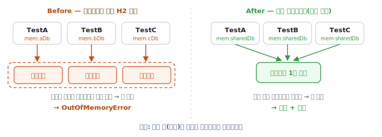

리포지토리 테스트가 수백 개인 프로젝트에서, 어느 날부터 CI의 `./gradlew test`가 `OutOfMemoryError`로 실패하기 시작했습니다. 실패하는 테스트는 실행할 때마다 달라져, 특정 테스트의 버그처럼 보이지도 않았습니다. 원인을 따라가 보면 `@DataJpaTest`와 H2 인메모리 DB, 그리고 **Spring 테스트의 컨텍스트 캐시 키**가 맞물려 있었습니다. 이 글은 그 과정을 공식 문서와 소스 코드를 근거로 정리합니다.

> 환경은 Spring Boot 2.7 / Spring Framework 5.3 기준입니다. 컨텍스트 캐시 메커니즘 자체는 이후 버전에서도 같습니다.

## 원인 — 테스트마다 다른 H2 DB 이름

먼저 OOM이 난 스택을 봤습니다. 터지는 위치가 테스트의 쿼리나 데이터가 아니라, **새 Spring 컨텍스트를 빌드하며 classpath를 스캔하는 도중**이었습니다.

```text
java.lang.OutOfMemoryError
  at DefaultCacheAwareContextLoaderDelegate ...
  at ClassPathScanningCandidateComponentProvider ...
```

스택에 찍힌 두 클래스가 핵심 단서입니다.

- `DefaultCacheAwareContextLoaderDelegate` — Spring 테스트가 **캐시를 거쳐 ApplicationContext를 로드**하는 부분입니다.
- `ClassPathScanningCandidateComponentProvider` — 컨텍스트를 만들 때 **지정한 패키지의 classpath를 훑어 빈으로 등록할 후보 클래스를 찾아내는** 스캐너입니다. 공식 Javadoc은 이 클래스를 "기준 패키지로부터 후보 컴포넌트를 제공하며, 인덱스가 있으면 인덱스를 쓰고 없으면 classpath를 스캔한다"고 설명합니다. `@ComponentScan`이 "어디를 스캔할지"를 정하면, 실제 스캔을 수행하는 일꾼이 이 클래스입니다.

정리하면 OOM은 테스트의 쿼리·검증 코드가 아니라 **새 컨텍스트를 만들며 classpath를 스캔하던 도중**에 났습니다. 곧 테스트가 컨텍스트를 너무 많이 만들고 있다는 신호였고, 테스트 설정에서 원인이 드러났습니다. 리포지토리 테스트들이 각각 다음과 같은 형태였습니다.

```kotlin
@DataJpaTest
@TestPropertySource(properties = [
    "spring.datasource.url=jdbc:h2:mem:orderTestDb;...",   // 테스트마다 고유한 이름
    "spring.jpa.hibernate.ddl-auto=create-drop",
])
class OrderRepositoryTest
```

테스트마다 `jdbc:h2:mem:` 뒤의 DB 이름을 다르게 줬습니다. 의도는 "테스트 간 DB를 격리하자"였습니다. 그런데 이 인라인 property가 **Spring 컨텍스트 캐시의 키를 테스트마다 다르게 만들어**, 컨텍스트가 전혀 재사용되지 않았습니다.

## Spring 컨텍스트 캐시 키란

Spring 테스트는 무거운 `ApplicationContext`를 테스트마다 새로 만들지 않으려고 캐시에 담아 재사용합니다. 이때 키는 단순한 문자열이 아니라 **`MergedContextConfiguration` 객체**입니다. 테스트 클래스의 모든 컨텍스트 설정을 병합한 것으로, 두 테스트의 이 객체가 `equals()`로 같으면 컨텍스트를 공유하고, 하나라도 다르면 별도 컨텍스트를 만듭니다.

키에 포함되는 주요 구성요소는 다음과 같습니다.

| 구성요소 | 출처 |
|---|---|
| 설정 클래스/XML, ContextLoader | `@ContextConfiguration`, `@SpringBootConfiguration` |
| 활성 프로파일 | `@ActiveProfiles` |
| `@TestPropertySource` 파일 경로 | `locations` |
| **`@TestPropertySource` 인라인 property** | `properties` ← 이번 원인 |
| ContextCustomizer 집합 | `@MockBean`, `@DynamicPropertySource` 등 |

인라인 property가 **한 글자만 달라도 다른 키 = 다른 컨텍스트**입니다. 이는 추측이 아니라 소스에 그대로 드러나 있습니다. `MergedContextConfiguration`의 `equals()`와 `hashCode()`가 인라인 property 배열을 직접 비교하고 해시합니다.

```java
// MergedContextConfiguration.equals()
if (!Arrays.equals(this.propertySourceProperties, otherConfig.propertySourceProperties)) {
    return false;   // 인라인 property가 다르면 다른 키
}

// MergedContextConfiguration.hashCode()
result = 31 * result + Arrays.hashCode(this.propertySourceProperties);
```

`@TestPropertySource(properties = ["spring.datasource.url=...고유..."])`의 배열이 여기 들어가므로, 테스트마다 H2 이름이 다르면 키가 전부 달라집니다.

## 왜 OOM이 나는가

원인을 잡은 뒤, 정말 그래서 OOM이 나는지 재현하며 GC 로그를 찍어 확인했습니다. 컨텍스트 캐시 구현은 `org.springframework.test.context.cache.ContextCache`이고, 세 가지 성질이 겹쳐 OOM을 만듭니다.

- **재사용 0%**: 키가 테스트마다 다르므로 조회는 매번 캐시 미스가 되고, 그때마다 새 컨텍스트를 빌드합니다.
- **강한 참조로 동시 상주**: 캐시는 기본 `maxSize=32`까지 컨텍스트를 강한 참조로 보관합니다. JPA 컨텍스트 하나에는 전체 엔티티 메타모델, H2, 커넥션 풀이 들어 있어 무겁습니다. 이런 컨텍스트가 32개까지 동시에 살아 있게 됩니다.
- **단일 fork CI**: 한 JVM에서 수백 개의 테스트가 도는 동안 컨텍스트가 한도까지 누적됩니다.

이 양상은 GC 로그에 그대로 드러났습니다. 아래는 실제 로그에서 핵심 GC 라인만 발췌한 것입니다. 초반에는 Young GC가 힙을 회수하지만 회수 후 사용량이 계속 올라가고, 후반에는 Full GC를 돌려도 사용량이 거의 그대로입니다.

```text
[초반] 153M->38M(3072M)  …  421M->206M(3072M)   ← 회수 후가 계속 상승
[후반] Pause Full 3068M->3068M(3072M)            ← 풀 GC가 돌아도 안 내려감
```

> **Young GC와 Full GC**
>
> JVM 힙은 객체를 Young(젊은) 영역과 Old(늙은) 영역으로 나눠 관리합니다. **Young GC**는 Young 영역만 청소해 빠르고 자주 일어나고, **Full GC**는 Old를 포함한 힙 전체를 청소해 느립니다. 위 로그의 `Pause Young`이 Young GC, `Pause Full`이 Full GC입니다.

Full GC를 돌려도 사용량이 내려가지 않는다는 것은, 힙에 있는 객체가 전부 살아 있어 회수할 수 없다는 뜻입니다. 메모리 누수가 아니라 **강한 참조로 잡힌 컨텍스트들이 힙을 가득 채운** 상태입니다. 그 상태에서 다음 컨텍스트를 빌드하며 classpath를 스캔하는 순간 `OutOfMemoryError`가 납니다.

## 왜 느리기도 했나 — 속도

테스트마다 고유한 H2 이름은 단순한 캐시 미스가 아니라, **그때마다 컨텍스트·스키마를 통째로 새로 만든다**는 뜻입니다. 테스트 클래스 하나가 추가될 때마다 다음이 반복됩니다.

- classpath 스캔과 빈 생성
- 전체 엔티티에 대한 Hibernate 메타모델 빌드
- 빈 H2에 전체 테이블을 만드는 스키마 DDL

수백 번 반복되던 이 작업이, 컨텍스트를 공유하면 몇 번으로 줄어듭니다. 그래서 캐시 키를 통일하면 OOM이 사라질 뿐 아니라 테스트가 크게 빨라집니다.

## H2 인메모리의 추가 함정

여기서 한 가지 더 주의할 점이 있습니다. **H2 인메모리 DB는 같은 JVM 안에서 이름으로 식별**됩니다. `jdbc:h2:mem:sharedDb`는 이름이 같으면 물리적으로 같은 DB입니다.

그래서 서로 다른 컨텍스트가 같은 DB 이름을 공유하면, 각자 `create-drop`으로 스키마를 만들고 지우다가 한 컨텍스트가 종료될 때 다른 컨텍스트의 테이블까지 drop해 충돌할 수 있습니다. 정리하면 규칙은 이렇습니다.

- **같은 컨텍스트를 공유하는 테스트** → 같은 DB 이름 (캐시 재사용)
- **컨텍스트 설정이 다른 테스트** → 다른 DB 이름 (스키마 충돌 방지)

즉 "단일 컨텍스트 = 단일 DB 이름"입니다.

## 해결 — 캐시 키를 같게 만든다

핵심은 간단합니다. `@DataJpaTest`는 메서드마다 트랜잭션을 롤백하므로 **테스트별 고유 DB가 애초에 필요하지 않습니다.** 격리는 롤백이 이미 보장합니다. 따라서 고유 H2 이름을 없애고 설정을 하나로 고정하면 됩니다.

이를 위해 공통 설정을 묶은 **합성(메타) 애너테이션**을 만듭니다. Spring TestContext는 `@DataJpaTest`나 `@TestPropertySource`가 메타 애너테이션으로 올라가 있어도 병합해서 인식합니다.

```kotlin
@Target(AnnotationTarget.CLASS)
@Retention(AnnotationRetention.RUNTIME)
@DataJpaTest
@TestPropertySource(properties = [
    "spring.datasource.url=jdbc:h2:mem:sharedRepoDb;DB_CLOSE_DELAY=-1",  // 고정된 단일 이름
    "spring.jpa.hibernate.ddl-auto=create-drop",
])
annotation class RepositoryJpaTest
```

이제 각 테스트는 고유 설정 대신 이 애너테이션 하나만 붙입니다.

```kotlin
@RepositoryJpaTest
class OrderRepositoryTest

@RepositoryJpaTest
class MemberRepositoryTest
```

두 테스트의 property 블록이 **글자 단위로 동일**하므로 `MergedContextConfiguration`이 같아지고, 컨텍스트 하나를 공유합니다. 수백 개로 쪼개졌던 컨텍스트가 설정 그룹 수만큼으로 줄어듭니다.



한 가지 주의할 점은, **컨텍스트 설정을 바꾸는 요소가 있으면 그룹을 나눠야** 한다는 것입니다. 예를 들어 `@EnableJpaAuditing` 적용 여부, `@MockBean`, `@ActiveProfiles`, `@Import` 등은 키를 바꾸므로, 그런 테스트는 같은 그룹에 넣을 수 없습니다. 설정 그룹별로 애너테이션을 따로 두고, 각 그룹에 다른 H2 이름을 주면 됩니다.

### 즉시 완화책

근본 수정 전에 CI를 빠르게 안정화해야 한다면, 동시 상주 컨텍스트 수를 제한하는 방법이 있습니다.

```text
-Dspring.test.context.cache.maxSize=8
```

기본 32를 줄이면 한 번에 살아 있는 컨텍스트가 적어져 힙 압력이 내려갑니다. 동작은 그대로지만, 그만큼 컨텍스트 재생성이 늘어 약간 느려집니다. 근본 원인(키가 쪼개진 것)을 고치는 것은 아니므로 임시방편입니다.

## 정리

원인을 한 줄로 이으면 이렇습니다.

> 테스트마다 다른 H2 url → 캐시 키 분열 → 컨텍스트 재사용 0% → 무거운 컨텍스트 누적 → 힙 고갈 → (다음 컨텍스트의) classpath 스캔 중 OOM

- CI 테스트 OOM이 **컨텍스트 빌드 단계(classpath 스캔)** 에서 났다면, 테스트 로직이 아니라 **컨텍스트가 너무 많이 만들어지는 것**을 의심한다
- Spring 테스트의 컨텍스트 캐시 키는 `MergedContextConfiguration`이고, 여기에 **`@TestPropertySource` 인라인 property가 포함**된다
- `@DataJpaTest`마다 다른 H2 DB 이름을 주면 키가 전부 달라져 **컨텍스트 재사용이 0%가 되고**, 무거운 컨텍스트가 캐시에 쌓여 OOM과 속도 저하를 함께 부른다
- `@DataJpaTest`는 롤백으로 격리되므로 고유 DB가 불필요하다. **공통 메타 애너테이션으로 설정을 고정**해 키를 통일하면 컨텍스트를 공유한다
- H2 인메모리는 이름으로 식별되므로 **"단일 컨텍스트 = 단일 DB 이름"** 규칙을 지킨다

## 참고 문헌

- [Spring Framework Reference — Context Caching](https://docs.spring.io/spring-framework/docs/5.3.x/reference/html/testing.html#testcontext-ctx-management-caching) — 캐시 키 구성 파라미터 목록(`propertySourceProperties` 포함).
- [Spring Framework Reference — @TestPropertySource](https://docs.spring.io/spring-framework/docs/5.3.x/reference/html/testing.html#testcontext-ctx-management-property-sources) — 인라인 property 주입.
- [Javadoc — `MergedContextConfiguration`](https://docs.spring.io/spring-framework/docs/5.3.31/javadoc-api/org/springframework/test/context/MergedContextConfiguration.html) — 캐시 키 객체. `equals()`/`hashCode()`가 `propertySourceProperties`를 비교.
- [Javadoc — `ContextCache`](https://docs.spring.io/spring-framework/docs/5.3.31/javadoc-api/org/springframework/test/context/cache/ContextCache.html) — 기본 `maxSize` 32, LRU 제거.
- [Javadoc — `ClassPathScanningCandidateComponentProvider`](https://docs.spring.io/spring-framework/docs/5.3.31/javadoc-api/org/springframework/context/annotation/ClassPathScanningCandidateComponentProvider.html) — "기준 패키지로부터 후보 컴포넌트를 제공하며, 인덱스가 없으면 classpath를 스캔한다." OOM 스택에 나타난 스캐너.
- [Spring Framework Reference — Classpath Scanning and Managed Components](https://docs.spring.io/spring-framework/docs/5.3.x/reference/html/core.html#beans-classpath-scanning) — `@ComponentScan`이 classpath를 스캔해 빈 정의를 자동 등록하는 방식.
